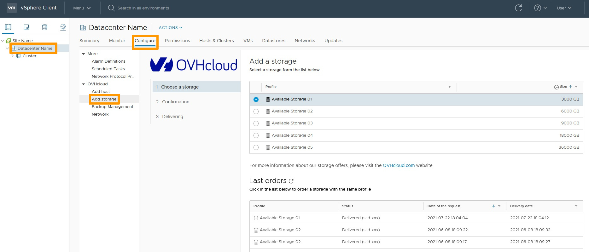
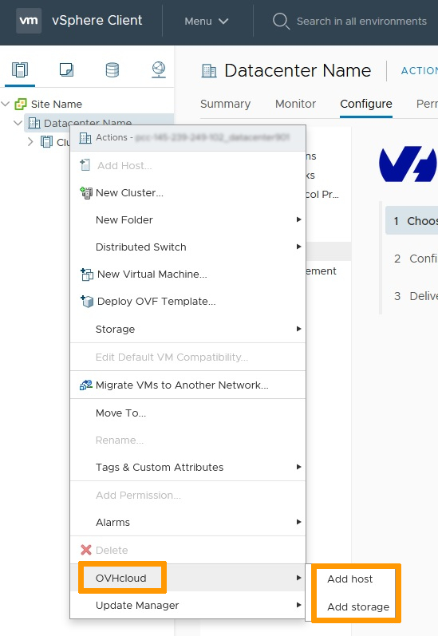

## Ziel

Mit dem Private Cloud Plugin von OVHcloud können Sie in wenigen Minuten dedizierte Ressourcen zu Ihrer Infrastruktur hinzufügen.

**Diese Anleitung erklärt, wie Sie dieses Plugin verwenden.**

## Voraussetzungen

- Sie verfügen über eine [Hosted Private Cloud](https://www.ovhcloud.com/de/enterprise/products/hosted-private-cloud/) Infrastruktur.
- Sie haben Zugriff auf das vSphere-Verwaltungsinterface.

## In der praktischen Anwendung

Zwei dedizierte Ressourcen sind nach stündlicher Abrechnung verfügbar:

- Host-Server
- Datastores

Begeben Sie sich im vSphere-Web-Client in den Bereich „Host and Cluster“ und öffnen Sie die linke Ordnerstruktur. Sie können nun auf die Menüs des Plugins zugreifen. Gehen Sie hierzu in den Tab `Configure`{.action} des Datacenters oder Clusters.

Das Menü `Add Host`{.action} wird zum Hinzufügen von Host-Servern verwendet. Hier können Sie die technischen Details der Server einsehen und neue Server bestellen.

{.thumbnail}

Um neue Datastores zu bestellen, gehen Sie in das Menü `Add Storage`{.action}.

{.thumbnail}

Alternativ können Sie auch auf diese Menüs zugreifen, indem Sie mit der rechten Maustaste auf das Datacenter oder den Cluster klicken und anschließend `OVHcloud`{.action} auswählen (auch „OVH Hosted Private Cloud“).

{.thumbnail}

## Weiterführende Informationen

Für den Austausch mit unserer User Community gehen Sie auf <https://community.ovh.com/en/>.
