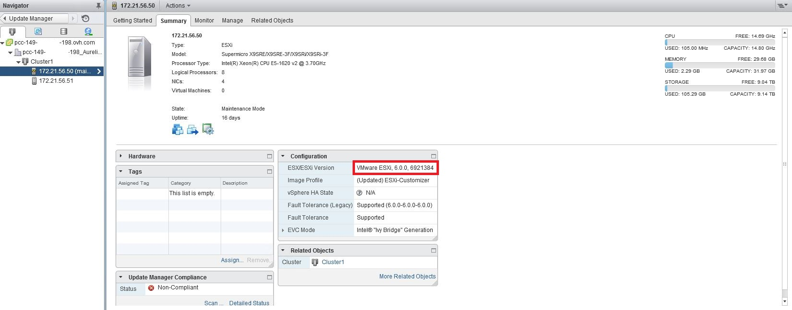

**Dernière mise à jour le 26/03/2018**

## Objectif

Vous pouvez retrouver les informations générales concernant Spectre et Meltdown sur notre [guide détaillé](/pages/bare_metal_cloud/dedicated_servers/meltdown_spectre_fixes){.external} et notre [guide par OS](/pages/bare_metal_cloud/dedicated_servers/meltdown_spectre_fixes_os){.external}.

**Ce guide vous explique comment corriger les vulnérabilités Spectre et Meltdown**.

## Prérequis

- Posséder un utilisateur pouvant se connecter à vSphere.

## En pratique

Pour rappel :

|Variante|Vulnérable ?|Fixé par le patch ?|
|---|---|---|
|Variant 1: bounds check bypass (CVE-2017-5753) - Spectre|YES|YES|
|Variant 2: branch target injection (CVE-2017-5715) - Spectre|YES|YES|
|Variant 3: rogue data cache load (CVE-2017-5754) - Meltdown|NO||

> [!primary]
>
> Meltdown (CVE-2017-5754) n'affecte pas ESXI parce qu'ESXI n'exécute pas de code utilisateur non vérifié.
> 

Concernant l'offre **Private Cloud**, une maintenance est prévue pour corriger automatiquement cette faille sur les hôtes vulnérables. Vous pouvez retrouver les informations de la planification sur la [tâche associée](http://travaux.ovh.com/?do=details&id=29250){.external}.

### Vérifier la version d'un hôte

Pour vérifier la version de votre hôte, vous pouvez vous connecter à l'[interface vSphere](/pages/hosted_private_cloud/hosted_private_cloud_powered_by_vmware/vsphere_interface_connexion){.external} et accéder au résumé de l'hôte, partie `Configuration`{.action} :

Les versions corrigées sont les suivantes :

- **ESXi 6.5 :** 7388607 ;
- **ESXi 6.0 :** 6921384 ;
- **ESXi 5.5 :** 6480324.

Si vous possédez une version inférieure à ces *builds*, vous devez mettre à jour votre hôte. Pour rappel, une mise à jour automatique est prévue par OVH. Vous pouvez toutefois effectuer celle-ci manuellement.

### Mettre à jour l'hôte avec le patch associé à la faille

La mise à jour d'un hôte s'effectue en plaçant celui-ci en maintenance (un redémarrage sera effectué lors de la procédure) et en utilisant le [plugin Update Manager](/pages/hosted_private_cloud/hosted_private_cloud_powered_by_vmware/vmware_update_manager){.external}.

Les patchs sont les suivants :

- **ESXi 6.0** – [ESXi600-201711101-SG](https://kb.vmware.com/s/article/2151132){.external}
- **ESXi 5.5** – [ESXi550-201709101-SG](https://kb.vmware.com/s/article/2150876){.external}

> [!warning]
>
> Ce patch en version **5.5** ne concerne que **CVE-2017-5715**, pas CVE-2017-5753.
> 

Dans la liste des patchs, vous pourrez utiliser le filtre pour ne récupérer que le patch souhaité et ainsi ne sélectionner que celui-ci.

En fin de mise à jour, l'hôte ne sera plus vulnérable et pourra être de nouveau utilisé.

## Aller plus loin

Échangez avec notre communauté d'utilisateurs sur <https://community.ovh.com>.