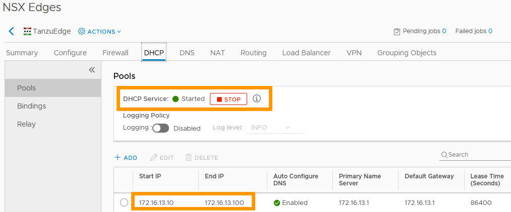
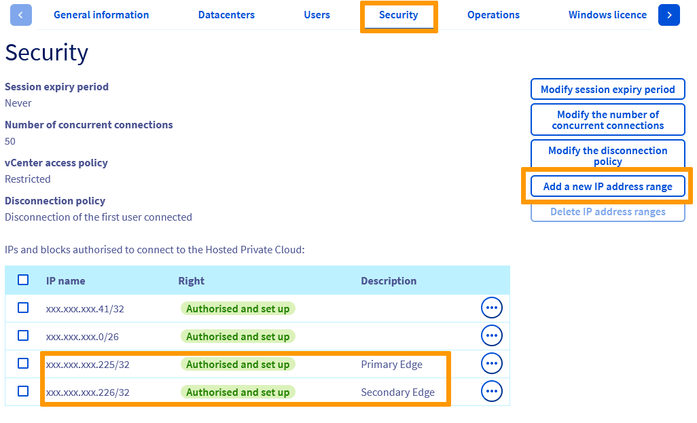
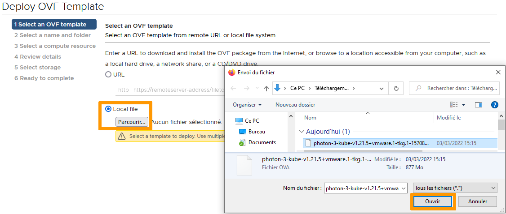
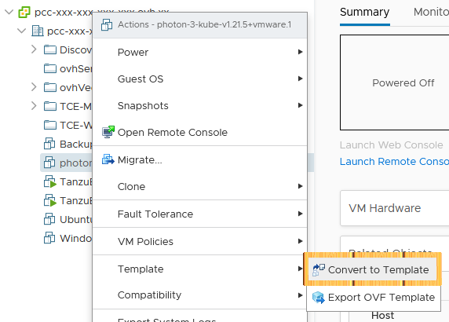
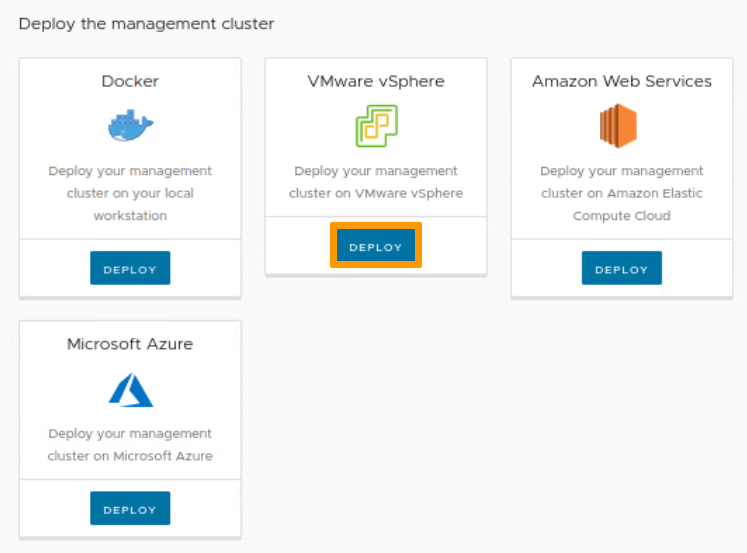
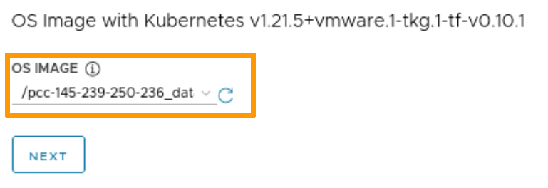
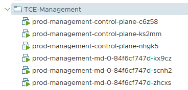
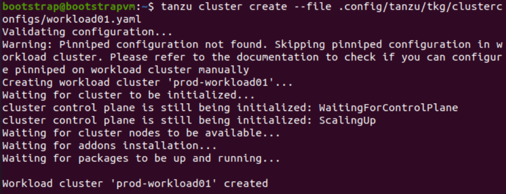

## Objective

VMware Tanzu Community Edition (TCE) is a full-featured, easy-to-manage Kubernetes platform.
You can deploy the product on an OVHcloud infrastructure to leverage its functionality and scalability.

> [!warning]
>
> Tanzu Community Edition is coming to an end of life at the end of 2022 and will no longer be available. VMware has decided to offer free download of VMware Tanzu Kubernetes Grid. You can use our [introduction to Tanzu Kubernetes Grid](/pages/hosted_private_cloud/hosted_private_cloud_powered_by_vmware/tanzu_tkgm_01presentation) guide to deploy it.
>

**This guide offers a step by step example of TCE installation**

## Requirements

- Being an administrative contact of your [Hosted Private Cloud infrastructure](https://www.ovhcloud.com/pt/enterprise/products/hosted-private-cloud/) to receive login credentials
- A user account with access to the [OVHcloud Control Panel](https://www.ovh.com/auth/?action=gotomanager&from=https://www.ovh.pt/&ovhSubsidiary=pt)
- A user account with access to vSphere
- A deployed [NSX Edge Services Gateway](/pages/hosted_private_cloud/hosted_private_cloud_powered_by_vmware/nsx_deploying_edge_gateway)
- [DHCP](/pages/hosted_private_cloud/hosted_private_cloud_powered_by_vmware/nsx_configurer_le_dhcp_sur_une_edge_gateway) services activated on the NSX Gateway

## Instructions

### Network

As stated in the Requirements (with links to full docs), an NSX Edge Services Gateway is used in our study case for Firewall and DHCP purposes.<br>
Other Network components can be used as alternative, such as pfSense.<br>

To set up your Network, you will need to define a public IP for external access and an internal network with DHCP service activated for your TCE infrastructure.<br>
Your Datacenter comes with a set of public IPs usable for your different needs. They are visible in the Datacenter `Configure`{.action} tab, in the `Network`{.action} section. You will also see the mask and gateway settings on the page.<br>
Check out our [Adding an IP block](/pages/hosted_private_cloud/hosted_private_cloud_powered_by_vmware/ajout_de_bloc_ip) documentation if you are out of usable public IPs.

{.thumbnail}

> [!warning]
>
> Public IPs marked as "Reserved" are used for Datacenter functions and cannot be used for other services.
>

For our study case, the NSX Edge Services Gateway is set up with two interfaces as follows:

- an external interface (Uplink) with a primary and secondary public IPs (xxx.xxx.xxx.225 and xxx.xxx.xxx.226)
- an internal interface (Internal) with private IP 172.16.13.1 on VLAN13<br>
{.thumbnail}
- DHCP service distributing VLAN13 address scope 172.16.13.10 through 172.16.13.100<br>
{.thumbnail}
- a SNAT rule to translate adress range 172.16.13.1/24 into secondary public IP xxx.xxx.xxx.226 for external access <br>
{.thumbnail}

In the [OVHcloud Control Panel](https://www.ovh.com/auth/?action=gotomanager&from=https://www.ovh.pt/&ovhSubsidiary=pt), go to the `Security`{.action} tab of your Hosted Private Cloud and add the public IPs to the allowed adresses to connect.<br>
The addresses should appear as "Authorised and set up".

{.thumbnail}

### Node Template

The TCE clusters require a template to build the nodes. Those can be dowloaded from the [VMware Customer Connect](https://customerconnect.vmware.com/downloads/get-download?downloadGroup=TCE-0100) website. If you do not own an account, you can create one for free.

Select the latest version of the OVA you need to use and download it locally.

{.thumbnail}

In vSphere, right-click a host or a cluster and select `Deploy OVF Template`{.action}.

{.thumbnail}

Browse for the OVA file you downloaded and deploy it.

{.thumbnail}

Once done, right-click the VM and, in the `Template`{.action} section, select `Convert to Template`{.action}.

{.thumbnail}

### Bootstrap VM

Once the Network and template are ready, a Bootstrap VM is needed.<br>
It will hold the necessary software components (Docker and Kubectl) and pilot the installation of TCE.<br>
We'll use an Ubuntu VM but any OS allowing the install of the necessary items would work.<br>
VM prerequisites for TCE is 2 CPUs and 6 GB Ram.<br>
You can deploy a VM [from an ISO](/pages/hosted_private_cloud/hosted_private_cloud_powered_by_vmware/deploiement_d_une_machine_virtuelle) or [from an OVF template](/pages/hosted_private_cloud/hosted_private_cloud_powered_by_vmware/ovf_template).<br>

Make sure the VM is set on the VLAN that will be used for the TCE clusters (VLAN13 in our case).<br>

{.thumbnail}

In a terminal window, start with update commands:

```bash
sudo apt update
```

and

```bash
sudo apt-get install build-essential
```

#### Install [NTP](https://vitux.com/how-to-install-ntp-server-and-client-on-ubuntu/)

```bash
sudo apt-get install ntp
```

#### Install [Homebrew](https://www.how2shout.com/linux/how-to-install-brew-ubuntu-20-04-lts-linux/)

Start with git:

```bash
sudo apt install git -y
```

Run the Homebrew install script:

```bash
/bin/bash -c "$(curl -fsSL https://raw.githubusercontent.com/Homebrew/install/HEAD/install.sh)"
```

Add Homebrew to your path:

```bash
eval "$(/home/linuxbrew/.linuxbrew/bin/brew shellenv)"
```

Install gcc:

```bash
brew install gcc
```

#### Install [Docker Engine](https://docs.docker.com/engine/install/)

Start with getting the necessary packages:

```bash
sudo apt-get install \
ca-certificates \
curl \
gnupg \
lsb-release
```

Add Docker’s official GPG key:

```bash
curl -fsSL https://download.docker.com/linux/ubuntu/gpg | sudo gpg --dearmor -o /usr/share/keyrings/docker-archive-keyring.gpg
```

set up the stable repository:

```bash
echo \ 
"deb [arch=$(dpkg --print-architecture) signed-by=/usr/share/keyrings/docker-archive-keyring.gpg] https://download.docker.com/linux/ubuntu \ 
$(lsb_release -cs) stable" | sudo tee /etc/apt/sources.list.d/docker.list > /dev/null
```

Set up the engine:

```bash
sudo apt-get install docker-ce docker-ce-cli containerd.io
```

Post install, add the current user to the docker group to allow it to run it without rights elevation:

```bash
sudo usermod -aG docker $USER
```

#### Install [Kubectl](https://kubernetes.io/docs/tasks/tools/install-kubectl-linux/)

Download the lastest package:

```bash
curl -LO "https://dl.k8s.io/release/$(curl -L -s https://dl.k8s.io/release/stable.txt)/bin/linux/amd64/kubectl"
```

Run the installer:

```bash
sudo install -o root -g root -m 0755 kubectl /usr/local/bin/kubectl
```

#### SSH Key Pair

Run the creation command:

```bash
ssh-keygen -t rsa -b 4096 -C "youremail@yourdomain.com"
```

Press Enter to save the key in default path (/root/.ssh/id_rsa).<br>
Enter and confirm a password for the key.<br>
Add the private key to the SSH agent running on your machine, and enter the password you created in the previous step.

```bash
ssh-add ~/.ssh/id_rsa
```

Keep the .ssh/id_rsa.pub file handy as it holds the public key you will need to input later for TCE configuration.

### Tanzu Management Cluster

The VM is now ready for TCE deployment.

#### [Tanzu CLI](https://tanzucommunityedition.io/docs/latest/cli-installation/)

In a terminal window, run the CLI install commmand:

```bash
brew install vmware-tanzu/tanzu/tanzu-community-edition
```
Note the output install folder and run the post install script: 

```bash
{HOMEBREW-INSTALL-LOCATION}/configure-tce.sh 
/home/linuxbrew/.linuxbrew/Cellar/tanzu-community-edition/v0.10.0/libexec/configure-tce.sh
```

{.thumbnail}

#### [Deployment](https://tanzucommunityedition.io/docs/latest/vsphere-install-mgmt/)

Launch the installer with this command:

```bash
tanzu management-cluster create --ui
```

In the opening browser window, select the vSphere option.

{.thumbnail}

Enter the Hosted Private cloud FQDN and fill in administrative credentials before clicking `Connect`{.action}.

{.thumbnail}

Click `Continue`{.action} to verify the SSL thumbprint.

{.thumbnail}

Select your datacenter and fill in the SSH public key created earlier (.ssh/id_rsa.pub).<br>
Click `Next`{.action}.

{.thumbnail}

Choose a type of cluster (Development or Production) and a node size.

{.thumbnail}

Fill in the name of your custer, choose a control plane endpoint provider and IP (same subnet but outside of DHCP scope).<br>
Click `Next`{.action}.

{.thumbnail}

NSX Advanced Load Balancer and Metadata sections are optional and we will not edit them.<br>
Click `Next`{.action} on both of them.

{.thumbnail}

Choose your resource locations.<br>
Click `Next`{.action}.

{.thumbnail}

Enter the Kubernetes Network settings.<br>
Click `Next`{.action}.

{.thumbnail}

Disable Identity Management.<br>
Click `Next`{.action}.

{.thumbnail}

Select the node template to be used.<br>
Click `Next`{.action}.

{.thumbnail}

Click `Review Configuration`{.action}.

{.thumbnail}

When ready, click `Deploy Management Cluster`{.action}.

{.thumbnail}

Upon completion, verify you get a creation message and the nodes are visible in vSphere.

{.thumbnail}

{.thumbnail}

Get the cluster admin credentials for future interactions:

```bash
tanzu cluster kubeconfig get "clustername" --admin
```

### Tanzu Workload Cluster

To deploy a workload cluster, we'll duplicate and modify the configuration file for the management cluster.<br>
Start a terminal window in the bootstrap VM and go to the config file folder.

```bash
cd .config/tanzu/tkg/clusterconfigs
```

Use ls to find the yaml configuration file name and copy it into a new one.<br>

```bash
cp existing.yaml new.yaml
```

{.thumbnail}

Use a text editor to modify the key fields:

- CLUSTER_NAME : choose a name for your new cluster
- VSPHERE_CONTROL_PLANE_ENDPOINT : choose an unused IP in the same subnet but not in the DHCP scope
- VSPHERE_FOLDER : this is not mandatory but you can define a different folder for ease of management

Save and close the file.

Back in the terminal, run the deploy command calling your new yaml file.

```bash
tanzu cluster create --file .config/tanzu/tkg/clusterconfigs/new.yaml
```

Upon completion, verify you get a creation message and the nodes are visible in vSphere.

{.thumbnail}

{.thumbnail}

Get the cluster admin credentials for future interactions:

```bash
tanzu cluster kubeconfig get "clustername" --admin
```

TCE is now ready for application install.

## Go further

If you need training or technical assistance to implement our solutions, contact your sales representative or click on [this link](https://www.ovhcloud.com/pt/professional-services/) to get a quote and ask our Professional Services experts for a custom analysis of your project.

Join our community of users on <https://community.ovh.com/en/>.
