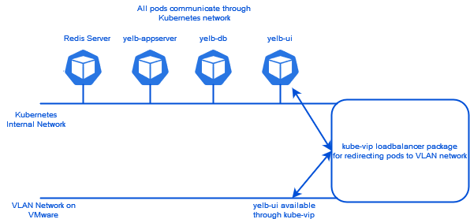

**Dernière mise à jour le 15/11/2022**

## Objectif

**Ce guide vous présente Tanzu Kubernetes Grid et vous indique les possibilités d'intégration dans votre solution Hosted Private Cloud powered by VMware.**

> [!warning]
> OVHcloud vous met à disposition des services dont la configuration, la gestion et la responsabilité vous incombent. Il vous appartient donc de ce fait d’en assurer le bon fonctionnement.
>
> Ce guide a pour but de vous accompagner au mieux sur des tâches courantes. Néanmoins, nous vous recommandons de faire appel à un [prestataire spécialisé](https://partner.ovhcloud.com/fr/) si vous éprouvez des difficultés ou des doutes concernant l’administration, l’utilisation ou la mise en place d’un service sur un serveur.
>

## Prérequis

- Être contact administrateur de l'infrastructure [Hosted Private Cloud](https://www.ovhcloud.com/fr-ca/enterprise/products/hosted-private-cloud/), afin de recevoir les identifiants de connexion.
- Avoir un identifiant actif dans l'[espace client OVHcloud](https://ca.ovh.com/auth/?action=gotomanager&from=https://www.ovh.com/ca/fr/&ovhSubsidiary=qc)
- Avoir un identifiant actif dans vSphere.

## Présentation pas à pas de la solution Tanzu Kubernetes Grid

**VMware Tanzu Kubernetes Grid** est une plate-forme Kubernetes fournie par **VMware** et maintenue dans le cadre du support **Hosted Private Cloud powered by VMware**.

Vous pouvez déployer ce produit sur votre infrastructure OVHcloud pour profiter de ses fonctionnalités et de son évolutivité.

Tanzu Kubernetes Grid permet de déployer et d'administrer un ou plusieurs clusters Kubernetes au sein de votre infrastructure VMware. L'outil d'administration de ces clusters s'appuie lui-même sur Kubernetes.

### Installation initiale de Tanzu Kubernetes Grid

Consultez la documentation « [Installer Tanzu Kubernetes Grid](/pages/hosted_private_cloud/hosted_private_cloud_powered_by_vmware/tanzu_tkgm_02installation) » pour effectuer l'installation.

Le fonctionnement de **Tanzu Kubernetes Grid** sur le cluster VMware nécessite six nouvelles machines virtuelles pour faire fonctionner le cluster d'administration. Une autre machine virtuelle est nécessaire pour l'administration, cette machine virtuelle est fournie par OVHcloud et se nomme **Bootstrap**. 

{.thumbnail}

> [!warning]
>
> Le cluster d'administration doit être utilisé exclusivement pour l'administration de **Tanzu Kubernetes Grid**.
>

### Déploiement d'un cluster de *Workload* et installation d'une application

Pour pouvoir déployer une application, il est nécessaire de créer des clusters de *WorkLoad* dédiés aux applications.

Tous les clusters de *WorkLoad* sont indépendants les uns des autres, ce qui permet d'avoir des versions différentes de Kubernetes sur chacun de ces clusters de *Workload*.

Lors de l'installation de **Tanzu Kubernetes Grid**, nous avons choisi **kube-vip** pour les interconnexions entre un cluster de *Workload* et le réseau du cluster VMware. Il est aussi possible d'utiliser **Nsx Advanced Load Balancer**.

Consultez le guide « [Administrer Tanzu Kubernete Grid](/pages/hosted_private_cloud/hosted_private_cloud_powered_by_vmware/tanzu_tkgm_02installation) » pour déployer un cluster de *Workload* et une application. 

Pour chaque nouveau cluster *WorkLoad* installé en mode production, six nouvelles machines virtuelles sont rajoutées sur votre infrastructure VMware.

{.thumbnail}

Une application peut être constituée de plusieurs **pods** qui communiquent entre eux au travers du réseau interne du cluster de *workload*. Certains ports sont ouverts sur le réseau du cluster **VMware** grâce au module **kube-vip**.

{.thumbnail}

### Gestion des volumes persistants

Par défaut, lors de l'arrêt ou d'un crash d'un **pod**, les données contenues dans ce **pod** sont perdues. Pour pouvoir stocker des données de manière permanente, il est nécessaire de créer des volumes persistants et de les associer aux applications.

Les volumes persistants sont stockés par défaut sur le stockage VMware (vSAN ou NFS) qui a servi pour le déploiement du cluster de *WorkLoad*, en utilisant les API VMware (vSphere Cloud Native Storage).

Il est possible de créer des **Custom Storage Class** pour définir un autre emplacement.

Utilisez le guide « [Gestion des volumes permanents dans Tanzu Kubernetes Grid](/pages/hosted_private_cloud/hosted_private_cloud_powered_by_vmware/tanzu_tkgm_04persistent-volumes) » pour ajouter une application qui utilise un volume permanent externe.

### Sauvegarde de vos applications 

Diverses solutions de sauvegarde compatibles avec **Tanzu Kubernetes Grid** existent, dont **Kasten** de **Veeam**.

## Aller plus loin

[Installation d'un cluster Tanzu Kubernetes GRID](/pages/hosted_private_cloud/hosted_private_cloud_powered_by_vmware/tanzu_tkgm_02installation)

[Administrer un cluster Tanzu Kubernetes GRID](/pages/hosted_private_cloud/hosted_private_cloud_powered_by_vmware/tanzu_tkgm_03manage)

[Gestion des volumes sur un cluster Tanzu Kubernetes GRID](/pages/hosted_private_cloud/hosted_private_cloud_powered_by_vmware/tanzu_tkgm_04persistent-volumes)

[Présentation de VMware Tanzu Kubernetes Grid](https://tanzu.vmware.com/kubernetes-grid)

[Documentation de VMware Tanzu Kubenetes Grid](https://docs.vmware.com/en/VMware-Tanzu-Kubernetes-Grid/index.html)

[Installation manuelle de l'outil CLI pour le déploiement de Tanzu Kubernetes GRID](https://docs.vmware.com/en/VMware-Tanzu-Kubernetes-Grid/1.5/vmware-tanzu-kubernetes-grid-15/GUID-install-cli.html)

Si vous avez besoin d'une formation ou d'une assistance technique pour la mise en oeuvre de nos solutions, contactez votre commercial ou cliquez sur [ce lien](https://www.ovhcloud.com/fr-ca/professional-services/) pour obtenir un devis et demander une analyse personnalisée de votre projet à nos experts de l’équipe Professional Services.

Échangez avec notre communauté d'utilisateurs sur <https://community.ovh.com>.
