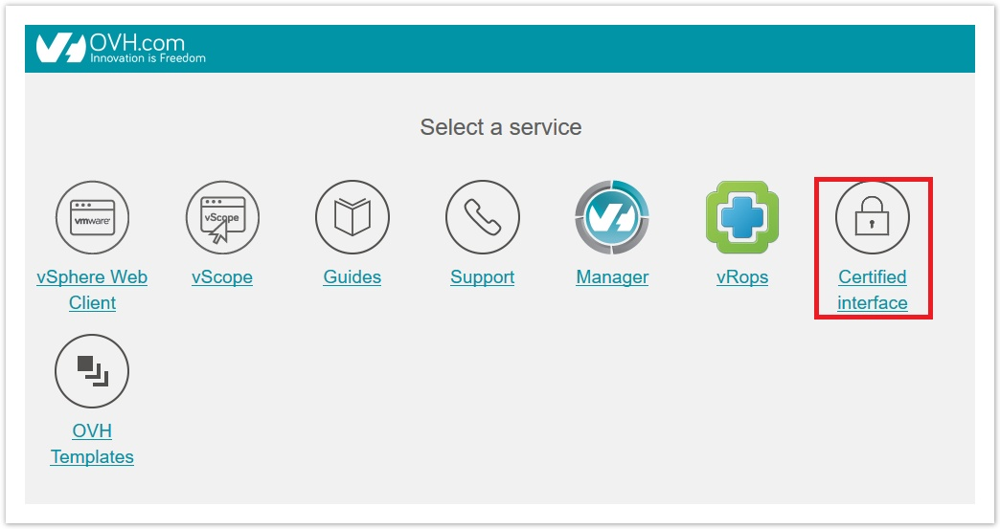

## Ziel

Die Einrichtung der Zwei-Faktor-Authentifizierung schützt den Zugang zu Ihrer Private Cloud, indem beispielsweise mit Passwortdiebstahl verbundene Risiken reduziert werden.

**Diese Anleitung erklärt, wie Sie die Zwei-Faktor-Authentifizierung einrichten, um Ihre Private Cloud Infrastruktur zu schützen.**
 
## Voraussetzungen

- Sie verfügen über eine [Hosted Private Cloud](https://www.ovhcloud.com/de/enterprise/products/hosted-private-cloud/) Infrastruktur mit [Advanced Security](https://www.ovhcloud.com/de/enterprise/products/hosted-private-cloud/safety-compliance/sddc/) Option (in PCI-DSS und HDS Angeboten enthalten).
- Sie verfügen über ein Smartphone mit installierter Authentifizierungsanwendung (Beispiele: Google Authenticator, Authy, OTP Auth, ...).

## In der praktischen Anwendung

### Zwei-Faktor-Authentifizierung aktivieren

Um die Zwei-Faktor-Authentifizierung auf Ihrer Infrastruktur zu aktivieren, loggen Sie sich zunächst im zertifizierten Interface Ihrer Private Cloud ein.

Hierzu haben Sie zwei Möglichkeiten:
	
- über das Gateway Ihrer Private Cloud (https://pcc-xxx-xxx-xxx-xxx.ovh.com): 

{.thumbnail}

- direkt über die URL https://pcc-xxx-xxx-xxx-xxx.ovh.com/secure/ (achten Sie darauf, „ / “ am Ende der Adresse hinzuzufügen)

Wenn Sie im Verwaltungsinterface eingeloggt sind, klicken Sie auf `Change password`{.action}.

{.thumbnail}

Führen Sie im Interface folgende Schritte aus:
	
- Wählen Sie `Password and 2FA Shared Secret`{.action} aus.
- Geben Sie ein neues Passwort ein. 
- Scannen Sie den QR-Code mit der Smartphone-Authentifizierungsapp Ihrer Wahl.
- Bestätigen Sie den erhaltenen Code.

{.thumbnail}

Ein neuer Task wird erstellt und Ihnen wird ein Token zugesandt.

Gehen Sie nun in den Bereich `Operation validation`{.action}, laden Sie die per SMS erhaltene Operation und bestätigen Sie den Vorgang mit dem Token, den Sie in derselben SMS erhalten haben.

> [!primary]
>
> Bei einem verlorenen Passwort muss zuerst der „Password lost“-Prozess gestartet werden, während dessen Ihnen die Einrichtung einer Zwei-Faktor-Authentifizierung vorgeschlagen wird.
>

### Einloggen

Verbinden Sie sich über den üblichen Link mit Ihrem *Web*-Client. Sie gelangen zur folgenden Seite:

{.thumbnail}

Geben Sie nun den über die Smartphone-Anwendung generierten Token ein, bevor Sie Ihr Passwort eingeben.

> [!warning]
>
> Die Zwei-Faktor-Authentifizierung wird bei der Änderung eines Benutzerpassworts aktiviert. Das heißt, wenn ein Benutzer sein Passwort ändert, wird die Zwei-Faktor-Authentifizierung für alle Benutzer aktiviert. 
>
> Diese müssen folglich ihr Passwort erneuern und anschließend die Zwei-Faktor-Authentifizierung für ihre Benutzer einrichten, damit sie sich weiterhin einloggen können.
>
> Für Kunden mit einer Infrastruktur der Version 6.0 wird der Zugang zum vSphere Client (nur für Windows verfügbar) nicht mehr möglich sein. Sie können nun ausschließlich über den vSphere Web Client auf ihre Infrastruktur zugreifen.
>

### Neuen Benutzer erstellen

Bei der Erstellung eines neuen Benutzers können Sie auswählen, ob Sie diesem die Rolle des *token validator* zuweisen möchten oder nicht.

In beiden Fällen muss das Passwort entsprechend der oben beschriebenen Vorgehensweise über das zertifizierte Interface geändert werden, um die 2FA einzurichten.

Der einzige Unterschied besteht in der Autonomie des Benutzers, Token zu validieren.

### Anwendungen autorisieren

Es ist möglich, mehrere Drittanwendungen zu verwenden, die Zugriff auf vCenter benötigen.

Diese Anwendungen müssen zuerst über die vCenter-Zugangseinstellungen, die Sie über Ihr [Kundencenter](/pages/hosted_private_cloud/hosted_private_cloud_powered_by_vmware/manager_ovh_private_cloud#sicherheit) festlegen, autorisiert werden.

Daraufhin können die Anwendungen auf unsere Infrastrukturen zugreifen; das heißt allerdings nicht, dass sie zwangsweise auch die Zwei-Faktor-Authentifizierung verarbeiten.

Tun sie das nicht, muss zunächst eine spezielle *Whitelist* für den *Bypass* der Zwei-Faktor-Authentifizierung erstellt werden.

Diese *Whitelist* ergänzt die Hauptliste, die den Zugang zu vCenter bestimmt.

Um die öffentlichen IP-Adressen Ihrer Anwendungen zu dieser zweiten *Whitelist* hinzuzufügen, können Sie die folgenden API-Aufrufe verwenden: 

- Nach IP-Adressen suchen, die autorisiert sind, die Zwei-Faktor-Authentifizierung zu umgehen:

>[!api]
>
> @api {v1} /dedicatedCloud GET /dedicatedCloud/{serviceName}/twoFAWhitelist
>

- Eine IP-Adresse zur *Bypass*-Whitelist der Zwei-Faktor-Authentifizierung hinzufügen:

>[!api]
>
> @api {v1} /dedicatedCloud POST /dedicatedCloud/{serviceName}/twoFAWhitelist
>

- Informationen einer autorisierten IP-Adresse anzeigen (hierzu wird eine mit dem vorstehenden Aufruf erhaltene ID benötigt):

>[!api]
>
> @api {v1} /dedicatedCloud GET /dedicatedCloud/{serviceName}/twoFAWhitelist/{id}
>

- Eine IP-Adresse von der Autorisierungsliste entfernen:

>[!api]
>
> @api {v1} /dedicatedCloud DELETE /dedicatedCloud/{serviceName}/twoFAWhitelist/{id}
>

- Die Informationen einer autorisierten IP-Adresse bearbeiten:

>[!api]
>
> @api {v1} /dedicatedCloud POST /dedicatedCloud/{serviceName}/twoFAWhitelist/{id}/changeProperties
>

## Weiterführende Informationen

Für den Austausch mit unserer User Community gehen Sie auf <https://community.ovh.com/en/>.
