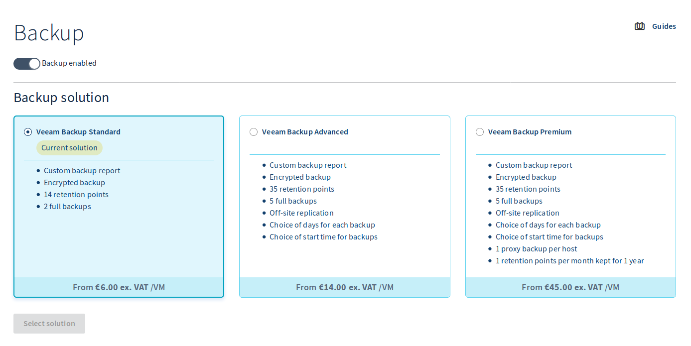
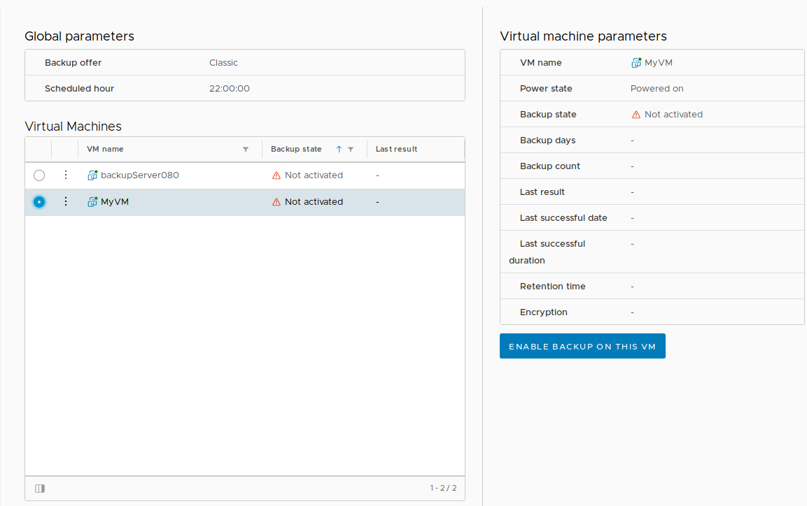
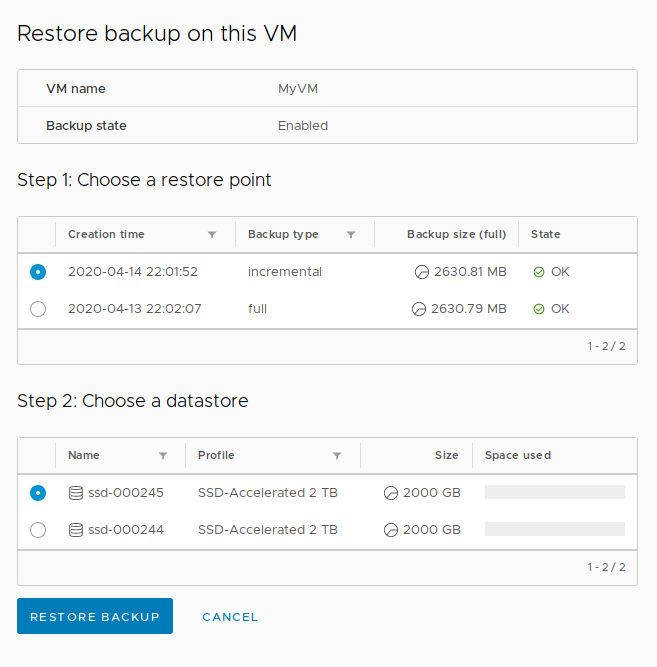
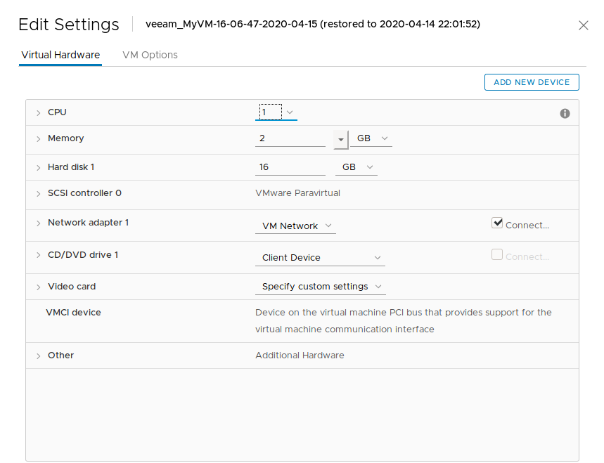

**Last updated 7th December 2021**

## Objective

Protecting and backing up your VMs is an essential part of ensuring long-term stability for your infrastructure. This is why we offer a managed backup solution based on Veeam Backup & Replication technology. You can use it to restore your data simply, by enabling automatic backup for your VMs.

Backups are performed using a virtual machine (VM) within your [Hosted Private Cloud](https://www.ovhcloud.com/en-ca/enterprise/products/hosted-private-cloud/veeam-backup-managed/) infrastructure. The backup data is outsourced to an independent storage space at OVHcloud. Backups are performed during night-time, with a retention time depending on the solution level you choose.

**This guide explains how to deploy and use the Veeam Managed Backup option.**

## Requirements

- a [Hosted Private Cloud infrastructure](https://www.ovhcloud.com/en-ca/enterprise/products/hosted-private-cloud/)
- access to the [OVHcloud Control Panel](https://ca.ovh.com/auth/?action=gotomanager&from=https://www.ovh.com/ca/en/&ovhSubsidiary=ca)
- a user account with access to vSphere and the permission ["Add resources"](/pages/hosted_private_cloud/hosted_private_cloud_powered_by_vmware/change_users_rights) for the pertinent data centre
- [vSphere High Availability (HA)](/pages/hosted_private_cloud/hosted_private_cloud_powered_by_vmware/vmware_ha_high_availability) enabled
- [Distributed Resource Scheduler (DRS)](/pages/hosted_private_cloud/hosted_private_cloud_powered_by_vmware/vmware_drs_distributed_ressource_scheduler_new) enabled
- Windows SPLA Licensing enabled

## Instructions

### Activating the backup option

The first step is to order the service from the [OVHcloud Control Panel](https://ca.ovh.com/auth/?action=gotomanager&from=https://www.ovh.com/ca/en/&ovhSubsidiary=ca). To do this, go to the `Hosted Private Cloud`{.action} section of the `Hosted Private Cloud`{.action} tab. Click on the relevant vSphere infrastructure, then select the data centre. Click on the `Backup`{.action} tab.

{.thumbnail}

Choose the appropriate plan and continue by clicking `Choose solution`{.action}.

Validate the contracts by clicking `Enable backup`{.action}.

Once the service is ready, a confirmation email will be sent and the active backup solution will be indicated in the Control Panel.

{.thumbnail}

The service can be used directly from vSphere.

On your vSphere infrastructure, you will see a virtual machine corresponding to the backup server as shown in the screenshot below.

{.thumbnail}

### Enabling backups for virtual machines

After the service is activated, you will need to complete the backup requests for each virtual machine identified as critical from the vSphere client.

Select the VMware data centre, then the `Configure`{.action} tab and click `Backup Management`{.action} from the OVHcloud section of the menu.

{.thumbnail}

Select the VM for which you want to enable backups from the list. On the right panel, click `Enable backup on this VM`{.action} to start the activation request.

{.thumbnail}

In the confirmation window, click `OK`{.action}.

{.thumbnail}

Veeam is informed of this new request and creates the virtual machine backup job. Every night, starting at 10 p.m. (default), a backup task will be scheduled according to the backup scheme defined by the chosen solution.

Every day, an email containing the status of all the performed actions is sent to the OVHcloud account's email address.

> [!warning]
>
> Removing a VM from your inventory or disk **does not disable** the backup job for that machine, regardless of the information in the report.
>

### Restoring a backup

Select the VMware data centre, then the `Configure`{.action} tab and choose `Backup Management`{.action} from the OVHcloud section of the menu.

From the list, select the VM for which you want to restore a backup (its `Backup state` must be **Enabled**).

{.thumbnail}

On the right-hand panel, click `Restore Backup`{.action} to open the restore request.

{.thumbnail}

A new window opens to create the restore job. Check the VM name, select the backup date to restore, and choose the datastore (storage space used as the restore target). Click `Restore Backup`{.action} to start the process.

{.thumbnail}

A window then confirms that the Veeam server is notified of this new request and that the virtual machine restore job has been created.

{.thumbnail}

The VM is restored next to the source machine.

{.thumbnail}

> [!warning]
>
> Note that the restored machine is connected to the network. If you start the VM without turning off the source VM, there may be an IP address conflict.
>

{.thumbnail}

To edit these settings, select the data centre in your inventory, click the tab `Configure`{.action}, then choose `OVH Backup Management`{.action}. On this page, you have access to the list of your backup jobs, with the number of backups and the last status of the job.

### Disabling backups for a VM

Select the VMware data centre, then the `Configure`{.action} tab and choose `Backup Management`{.action} from the OVHcloud section of the menu.

Select the VM for which you want disable backups from the list.

{.thumbnail}

On the right-hand panel, click `Disable Backup on this VM`{.action}.

{.thumbnail}

Then confirm the deactivation by clicking `OK`{.action}.

{.thumbnail}

> [!warning]
>
> Backups can be reactivated at any time from the moment the VM is present in the infrastructure.
> 
> Please note that the backups remain available for recovery only until the retention period expires.
>

> [!primary]
>
> Follow the same instructions to disable the backup of a deleted VM.
> It is also possible to disable the backup temporarily and reactivate it afterwards.
>

## Go further

Join our community of users on <https://community.ovh.com/en/>.
