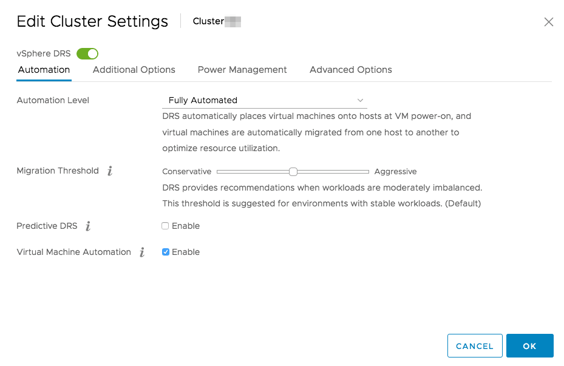
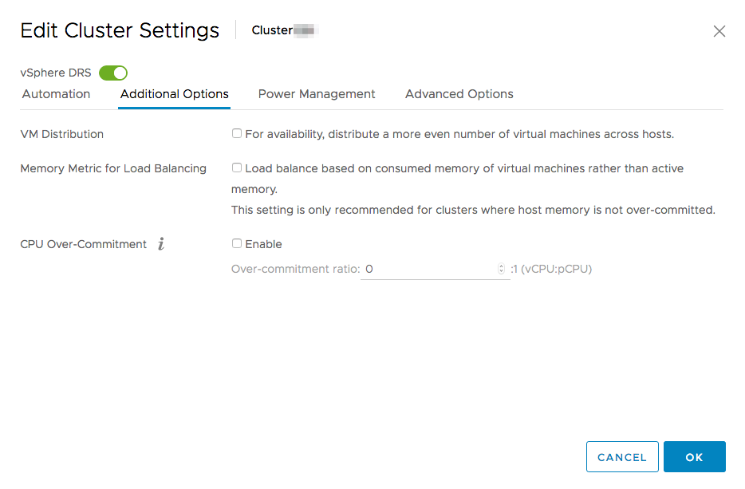

## Obiettivo

La funzione **DRS** (Distributed Ressource Scheduler) è disponibile in un cluster **VMware** e permette di bilanciare il carico degli host tramite la migrazione automatica delle macchine virtuali. Questa funzione ripartirà le VM sui diversi host del cluster in base al loro utilizzo e alle loro risorse.

**Questa guida ti mostra come configurare questa funzione**

## Prerequisiti

- Disporre di un servizio [Private Cloud](https://www.ovhcloud.com/it/enterprise/products/hosted-private-cloud/){.external} attivo
- Avere accesso all’interfaccia vSphere

## Procedura

La funzione del **DRS** consiste nel ripartire al meglio le risorse. Pertanto, può migrare (o consigliarti di migrare) le VM verso un Host o un Pool (più appropriato) del tuo cluster.

{.thumbnail}

### Attivazione

La funzione DRS è attiva di default nel cluster di base messo a disposizione da OVHcloud al momento della consegna di un Private Cloud.

Nel caso in cui venga creato un nuovo cluster, è possibile attivare la funzione DRS al momento della creazione del cluster o in un secondo momento. 

Se la funzione DRS non è già attiva nel tuo cluster, selezionalo e poi clicca sulla scheda `Configura`{.action}.

Clicca sul menu `Servizi`{.action} e poi sul sottomenu `vSphere DRS`{.action}.

Clicca su `Modifica`{.action} e attiva il cursore `vSphere DRS` per attivare la funzionalità DRS.

{.thumbnail}

### Impostazioni 

Nella stessa finestra di configurazione, visualizzi 4 categorie di opzioni.

#### Automazione

Sono disponibili tre diversi livelli di automazione:

- In modalità “Manuale”, DRS non migrerà le VM. Sarà necessario gestire la migrazione e la ripartizione delle tue VM in maniera automatica.

- In modalità “Parzialmente automatizzata”, il DRS ti consiglierà di migrare le tue VM, ma lo farà solo se ne autorizzi la procedura.

- In modalità “Completamente automatizzata”, DRS migrerà automaticamente le VM, senza la tua autorizzazione, in base al carico presente sugli host.

Inoltre è possibile definire una soglia di migrazione più o meno aggressiva sulle modalità automatizzate.

L’opzione “Predictive DRS”, disponibile a partire dalla versione 6.5 di VMware, consente di effettuare migrazioni in base alle metriche predittive restituite da vRops,
Quest’ultima è indispensabile per il funzionamento dell’opzione DRS.

Infine l’opzione “Automazione della macchina virtuale” consente di impostare parametri DRS specifici per alcune VM nel sottomenu `Sostituzione delle VM` dalla scheda `Configura` (alcune VM possono avere una modalità di migrazione parzialmente automatica mentre il cluster sarà in modalità completamente automatica).

{.thumbnail}

#### Opzioni aggiuntive

Nelle impostazioni DRS è possibile configurare 3 opzioni aggiuntive:

- Distribuzione delle VM: Per la disponibilità, distribuisci un numero ancora più omogeneo di macchine virtuali sugli host. 

- Misure di memoria per il bilanciamento del carico: Il bilanciamento del carico si basa sulla memoria consumata delle macchine virtuali piuttosto che sulla memoria attiva.
Questo parametro è consigliato solo per i cluster in cui la memoria dell'host non è sovraccarica. 

- Sovraccarico della CPU: Limita il sovraccarico della CPU per tutti gli host del cluster. Questo parametro creerà una CPU virtuale al limite principale del rapporto fisico della CPU (vCPU:pCPU), implementato su ogni host ESXi.   

{.thumbnail}

#### Gestione della fonte di alimentazione

**Questa opzione deve sempre essere disattivata.**

La sua funzione principale è quella di spegnere gli host che il DRS considera non necessari per il funzionamento della tua infrastruttura, poiché soddisfa il livello di failover richiesto da HA. 
In OVHcloud, il nostro monitoring rileverà questa operazione come una anomalia e creerà un intervento nel datacenter.

#### Opzioni avanzate

Nel tuo cluster DRS possono essere utilizzate diverse impostazioni di configurazione avanzate.

Ecco alcuni esempi:

|Nome dell'opzione avanzata|Descrizione|Valore predefinito|Valore più aggressivo|
|:---|:---|:---|:---|
|UseDownTime|Se nell'analisi dei costi occorre tener conto dell'impatto sul carico di lavoro delle eventuali situazioni di stallo della memoria durante la migrazione|1|0 (non si tiene conto degli effetti)|
|IgnoreDownTimeLessThan|Soglia (in secondi) per ignorare, nell’analisi dei costi, i tempi di interruzione cumulativi della migrazione (può essere aumentata se il carico di lavoro delle macchine virtuali non è sensibile alle interruzioni di memoria durante la migrazione).|1|Un gran numero (non si tiene conto dei tempi di inattività)|
|MinImbalance|Si utilizza per calcolare lo squilibrio di destinazione|50|0|
|MinGoodness|Miglioramento minimo dello squilibrio del cluster richiesto per ciascuna migrazione|Adaptive|0 (Sono prese in considerazione tutte le migrazioni)|
|MaxMovesPerHost|Numero massimo di movimenti per host consigliato per ogni invocazione|Adaptive|0 (nessun limite)|

{.thumbnail}

### Le regole DRS

Per la gestione delle regole VM/host clicca sulla scheda `Configura`.

{.thumbnail}

- Mantenere insieme le macchine virtuali: Le macchine virtuali si trovano sullo stesso host.
- Separare le macchine virtuali: Separazione delle VM su host separati all'interno dello stesso cluster.
- Macchine virtuali degli host: Le macchine virtuali che appartengono al gruppo specificato devono essere eseguite nel gruppo di host indicato. È necessario creare gruppi di VM e di host nella scheda `Gruppi di VM/Host`.

La quarta regola, “Da macchine virtuali a macchine virtuali” è spiegata nella nostra guida sulla funzione [funzione HA](/pages/hosted_private_cloud/hosted_private_cloud_powered_by_vmware/vmware_ha_high_availability).

{.thumbnail}

## Per saperne di più

Contatta la nostra Community di utenti all’indirizzo <https://community.ovh.com/en/>.
