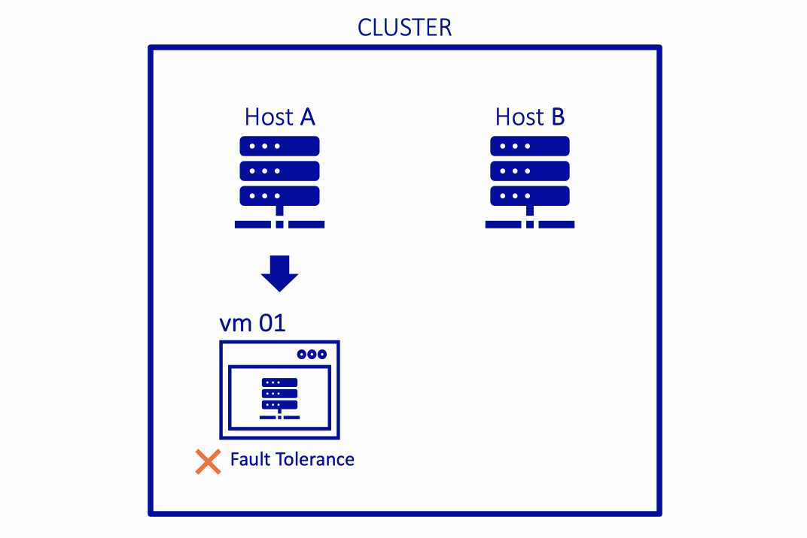
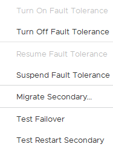

**Ultimo aggiornamento: 22/07/2020**

## Obiettivo

La funzionalità **Fault Tolerance** (FT) di VMware vSphere permette di clonare una macchina virtuale su due host distinti per proteggere la VM da malfunzionamenti hardware.

{.thumbnail}

**Questa guida ti mostra come utilizzare il servizio sulla tua macchina virtuale.**

## Prerequisiti

- Attivare vSphere HA
- Avere a disposizione una quantità riservata di risorse pari al 100% della memoria
- Aver installato i VMware Tools
- Processori della stessa generazione
- Disporre di un massimo di 4 vCPU

## Procedura 

Per attivare l’opzione **Fault Tolerance**, clicca con il tasto destro sulla macchina virtuale e seleziona `Fault Tolerance` > `Turn On Fault Tolerance`.

{.thumbnail}

Si apre una nuova finestra di configurazione in cui è possibile selezionare i parametri della macchina virtuale secondaria.

- Datastore

{.thumbnail}

- Host 

{.thumbnail}

Viene mostrato un riepilogo con le scelte effettuate. Conferma per attivare il FT sulla macchina virtuale.

{.thumbnail}

A questo punto la VM è protetta da **Fault Tolerance**\: l’icona visualizzata è differente e accanto al nome appare lo stato “primary”.

{.thumbnail}

In base alle necessità, sono disponibili diverse operazioni:

{.thumbnail}

## Azioni non supportate e incompatibilità

Su una macchina virtuale con **Fault Tolerance** attivo non è possibile effettuare determinate operazioni né utilizzare alcune periferiche.

La lista delle azioni non supportate da questo servizio è disponibile in [questa pagina](https://docs.vmware.com/en/VMware-vSphere/6.7/com.vmware.vsphere.avail.doc/GUID-F5264795-11DA-4242-B774-8C3450997033.html){.external-link}. Per visualizzare invece funzionalità e dispositivi non compatibili, clicca [qui](https://docs.vmware.com/en/VMware-vSphere/6.7/com.vmware.vsphere.avail.doc/GUID-C1749AD4-70E2-406C-864C-719F54BF1BC1.html){.external-link}.

## Per saperne di più

Contatta la nostra Community di utenti all’indirizzo <https://community.ovh.com/en/>.
