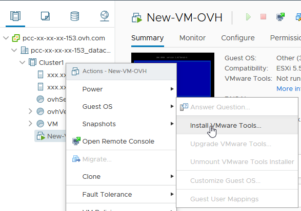

> [!primary]
> Diese Übersetzung wurde durch unseren Partner SYSTRAN automatisch erstellt. In manchen Fällen können ungenaue Formulierungen verwendet worden sein, z.B. bei der Beschriftung von Schaltflächen oder technischen Details. Bitte ziehen Sie im Zweifelsfall die englische oder französische Fassung der Anleitung zu Rate. Möchten Sie mithelfen, diese Übersetzung zu verbessern? Dann nutzen Sie dazu bitte den Button "Beitragen" auf dieser Seite.
>


## Ziel

VMware Tools verbessern die Performance einer virtuellen Maschine und ermöglichen die Verwendung vieler einfacher Funktionen in VMware Produkten.

**In dieser Anleitung werden die verschiedenen Schritte beschrieben, die zur Installation unternommen werden müssen.**

## Voraussetzungen

- Sie haben eine aktive Benutzerkennung (erstellt im [OVHcloud Kundencenter](https://www.ovh.com/auth/?action=gotomanager&from=https://www.ovh.de/&ovhSubsidiary=de)

## In der praktischen Anwendung

Die Vorgehensweise zur Installation von VMware Tools variiert je nach Betriebssystem der virtuellen Maschine. Für Informationen zur genauen Vorgehensweise entsprechend dem Betriebssystem lesen Sie die [VMware-Dokumentation zu VMware Tools](https://kb.vmware.com/s/article/1014294){.external-link}.

### Linux

#### Neueste Versionen

Bei den meisten Linux-Distributionen ist die Installation der VMware Tools über die Linux-Paketverwaltungssysteme unter dem Namen [*Open VM Tools*](https://kb.vmware.com/s/article/2073803){.external-link} möglich.

So können die VMware Tools genauso auf dem aktuellen Stand gehalten werden wie die anderen Betriebssystemkomponenten der virtuellen Maschine. 

Wenn dies bei Ihrer Distribution möglich ist, finden Sie *Open VM Tools* unter folgendem Paketnamen: „open-vm-tools“.

Diese Vorgehensweise gilt mindestens für die folgenden GNU/Linux-Versionen:

- Fedora 19 und neuer
- Debian 7.x und neuer
- openSUSE 11.x und neuer
- Ubuntu 12.04 LTS und neuer
- Red Hat Enterprise Linux 7.0 und neuer
- CentOS 7.0 und neuer
- Oracle Linux 7.0 und neuer
- SUSE Linux Enterprise 11 SP4 und neuer


#### Alte Versionen

Um die Festplatte der VMware-Tools über den vSphere-Web-Client zu mounten, klicken Sie mit der rechten Maustaste auf die VM, dann auf `Guest OS`{.action} und schließlich auf `Install VMware Tools`{.action}. 

{.thumbnail}

Mounten Sie anschließend das durch den Befehl aktivierte Volume:

```sh
>     # mount /dev/cdrom /mnt
```

Dekomprimieren Sie das Archiv der VMwareTools, hier in /tmp.

```sh
> cd /tmp 
> tar xvf /mnt/VMwareTools*.tar.gz
> cd vmware-tools-distrib
> ./vmware-install.pl default
```

> [!primary]
>
> Wenn Sie mit den voreingestellten Antworten fortfahren möchten und während der Installation nicht unterbrochen werden möchten, fügen Sie „default“ zur Installationszeile an.
> 

Wenn die Installation abgeschlossen ist, wird die Festplatte der Tools automatisch aus dem System ausgehängt.

### Windows

Sobald das Volume über die Option „Install/Upgrade VMware Tools“ gemountet wurde, finden Sie die Festplatte im „Arbeitsplatz“ Ihrer VM. Doppelklicken Sie auf darauf, um die Installation der Tools zu starten.

{.thumbnail}

Der Installationsassistent wird dann zur Annahme der Lizenzen und des auszuwählenden Installationstyps auffordern (wir empfehlen die vollständige Installation).

Sobald die Installation abgeschlossen ist, schlägt er Ihnen vor, die Maschine neu zu starten, um die Änderungen zu übernehmen. Das „CD-ROM“ wird nach Abschluss der Installation automatisch ausgeschaltet.

## Weiterführende Informationen

Für den Austausch mit unserer User Community gehen Sie auf <https://community.ovh.com/en/>.
