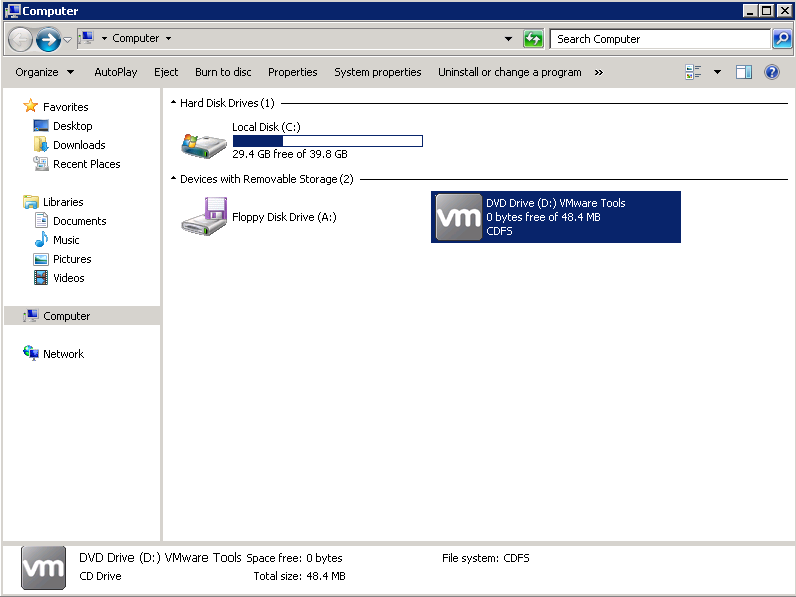

## Sumário

As VMware Tools melhoram os desempenhos de uma máquina virtual e permitem utilizar um grande número das suas funcionalidades de utilização simples nos produtos VMware.

**Este manual explica-lhe as diferentes etapas que deve seguir para proceder à sua instalação.**

## Requisitos

- Ter um identificador de utilizador ativo (criado na [Área de Cliente OVHcloud](https://www.ovh.com/auth/?action=gotomanager&from=https://www.ovh.pt/&ovhSubsidiary=pt))

## Instruções

O processo de instalação das VMware Tools varia em função do sistema operativo da máquina virtual. Para obter informações sobre o procedimento específico de cada SO, consulte a [documentação VMware sobre as VMware Tools](https://kb.vmware.com/s/article/1014294){.external-link}.

## Linux

### Versões recentes

A maioria das distribuições Linux recentes oferecem a instalação das VMware Tools através dos sistemas de gestão de pacotes, com o nome [*Open VM Tools*](https://kb.vmware.com/s/article/2073803){.external-link}.

Isto permite manter as VMware Tools atualizadas da mesma forma que os outros componentes do sistema operativo da máquina virtual. 

Se a distribuição que utilizar inclui esta ferramenta, poderá encontrar as *Open VM Tools* com o seguinte nome de pacote: *open-vm-tools*

Este método de instalação é válido para as seguintes versões de GNU/Linux:

- Fedora 19 e superior
- Debian 7.x e superior
- openSUSE 11.x e superior
- Ubuntu 12.04 LTS e superior
- Red Hat Enterprise Linux 7.0 e superior
- CentOS 7.0 e superior
- Oracle Linux 7.0 e superior
- SUSE Linux Enterprise 11 SP4 e superior

### Versões anteriores

Em primeiro lugar, deve montar os discos das VMware Tools a partir do web client vSphere. Para isso, faça clique direito na VM e selecione “Guest OS” validando a opção “Install VMware Tools”:

{.thumbnail}

A seguir, deve montar o volume ativo com o seguinte comando:

```sh
>     # mount /dev/cdrom /mnt
```

Descomprima o arquivo das VMwareTools. Neste exemplo, em /tmp.

```sh
> cd /tmp 
> tar xvf /mnt/VMwareTools*.tar.gz
> cd vmware-tools-distrib
> ./vmware-install.pl default
```

> [!primary]
>
> Pequena dica: se quiser responder por predefinição às respostas propostas e não ser avisado, adicione "default" como argumento na linha de instalação
> 

Uma vez completada a instalação, o disco será automaticamente eliminado do sistema.

## Windows

Depois de montar o volume através da opção “Install/Upgrade VMware Tools”, pode aceder ao disco a partir da equipa de trabalho da sua máquina virtual. Clique duas vezes no mesmo para lançar a instalação das Tools:

{.thumbnail}

O assistente de instalação solicitará que aceite as licenças e que escolha o tipo de instalação (recomendamos a instalação completa).

Uma vez finalizada a instalação, reinicie a máquina para que as alterações sejam aplicadas. O leitor de CD será automaticamente desmontado uma vez concluída a instalação.

## Quer saber mais?

Fale com a nossa comunidade de utilizadores em <https://community.ovh.com/en/>.
