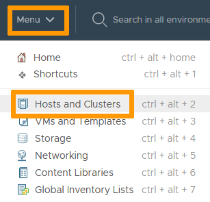

> [!primary]
> Questa traduzione è stata generata automaticamente dal nostro partner SYSTRAN. I contenuti potrebbero presentare imprecisioni, ad esempio la nomenclatura dei pulsanti o alcuni dettagli tecnici. In caso di dubbi consigliamo di fare riferimento alla versione inglese o francese della guida. Per aiutarci a migliorare questa traduzione, utilizza il pulsante "Contribuisci" di questa pagina.
>

**Ultimo aggiornamento: 09/12/2021**

## Obiettivo

Il gestore degli aggiornamenti di VMware permette di mantenere aggiornati i tuoi host installando i *Bug fissi* e i Patchs di sicurezza, senza l'intervento dei nostri team.     

> [!primary]
> Gli aggiornamenti del vCenter o i grandi aggiornamenti richiedono la nostra partecipazione.

**Questa guida ti mostra come funziona questo tool**

## Prerequisiti

- Essere contatto amministratore di [Hosted Private Cloud Infrastructure](https://www.ovhcloud.com/it/enterprise/products/hosted-private-cloud/) per ricevere le credenziali di accesso.
- Avere un utente attivo con diritti specifici per NSX (creato nello [Spazio Cliente OVHcloud](https://www.ovh.com/auth/?action=gotomanager&from=https://www.ovh.it/&ovhSubsidiary=it))

## Procedura

### Maintenance Mode

Prima di lavorare su un host, è necessario attivarlo in modalità manutenzione.    
patcher comporta spesso il riavvio dell'host e questo limiterà l'impatto sulle tue VM di produzione. 

Nel menu dell'interfaccia vSphere accedi alla dashboard `Hosts and Clusters`{.action}.

{.thumbnail}

A sinistra, clicca con il tasto destro sul tuo host. Nella sezione `Maintenance Mode`{.action}, seleziona `Enter Maintenance Mode`{.action}.

{.thumbnail}

Assicurati che la casella sia selezionata nello step successivo e clicca su `OK`{.action}.

{.thumbnail}

Presupponendo che DRS sia attivo, le tue VM di produzione saranno migrate verso un altro host.

> [!primary]
> Se hai personalizzato il tuo ambiente, potresti aver bisogno di effettuare manualmente le migrazioni delle VM.
>

Può apparire la seguente avvertenza:     

{.thumbnail}

L'host è in modalità manutenzione.

{.thumbnail}

### Update Manager

Seleziona il tuo host e accedi alla sezione `Update`{.action}.
Potete vedere i diversi status di base e la conformità dell'host.     

Dovrai applicare una "linea di base" per verificare la conformità.

{.thumbnail}

Nella sezione `Attached Baselines`, clicca su `Attach`{.action} e `Attach Baseline or Baseline Group`{.action}.

{.thumbnail}

Esistono linee di base predefinite per i diversi livelli di correzione raccomandati.

> [!primary]
> Nel nostro esempio, utilizziamo le correzioni critiche ma potete utilizzare le due linee esistenti o crearne altre a vostra discrezione per rispondere alle diverse esigenze del vostro ambiente.
>

Seleziona la linea di base richiesta e clicca su `Attach`{.action}.

{.thumbnail}

Il riassunto di conformità viene aggiornato.     

{.thumbnail}

Ritorna alla sezione `Attached Baselines`, seleziona tutte le linee di base assegnate e clicca su `Stage`{.action}.

{.thumbnail}

Seleziona l'host e clicca di nuovo su `Stage`{.action}.

{.thumbnail}

Il processo di trasferimento si avvia e durerà in base al numero e alla dimensione delle patch.

{.thumbnail}

Sempre nella sezione `Attached Baselines`, seleziona tutte le linee di database assegnate e clicca su `Remediate`{.action}.

{.thumbnail}

Seleziona l'host e clicca di nuovo su `Remediate`{.action}.

{.thumbnail}

Il processo di aggiornamento è avviato e durerà in base al numero e alla dimensione delle patch applicate. 
Se necessario, l'host verrà riavviato automaticamente.

{.thumbnail}

Al termine del processo, la verifica della conformità sarà rilanciata (o potrà essere forzata cliccando sul link) e dovrebbe comparire una roccia verde.

{.thumbnail}

Il tuo host è aggiornato.    

Non dimenticare di toglierlo dalla modalità di manutenzione e tornerà in produzione.

## Per saperne di più

Contatta la nostra Community di utenti all’indirizzo <https://community.ovh.com/en/>.
