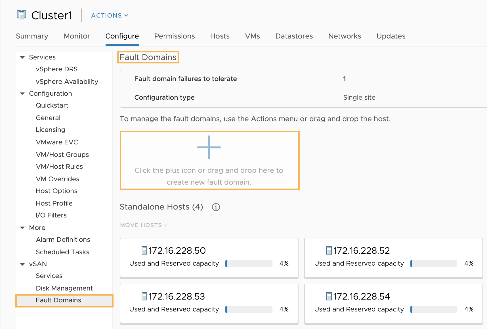

> [!primary]
> Esta tradução foi automaticamente gerada pelo nosso parceiro SYSTRAN. Em certos casos, poderão ocorrer formulações imprecisas, como por exemplo nomes de botões ou detalhes técnicos. Recomendamos que consulte a versão inglesa ou francesa do manual, caso tenha alguma dúvida. Se nos quiser ajudar a melhorar esta tradução, clique em "Contribuir" nesta página.
>

## Objetivo

Este guia tem como objetivo explicar o funcionamento e a implementação de domínios de avarias vSAN.

## Requisitos

- Ter contacto com o administrador da infraestrutura [Hosted Private Cloud](https://www.ovhcloud.com/pt/enterprise/products/hosted-private-cloud/), a fim de receber os identificadores de ligação.
- Ter um identificador de utilizador ativo com os direitos específicos para o NSX [criado na Área de Cliente OVHcloud](https://www.ovh.com/auth/?action=gotomanager&from=https://www.ovh.pt/&ovhSubsidiary=pt)
- Ter implementado um [datastore vSan](/pages/hosted_private_cloud/hosted_private_cloud_powered_by_vmware/vmware_vsan)

## Instruções

### Funcionamento

Um domínio de avarias (fault domain) refere-se a um conjunto de servidores, periféricos de armazenamento ou componentes de rede agrupados no seio de uma localização física do datacenter e que podem ser afetados coletivamente em caso de avaria.

No vSAN, é possível agrupar os servidores dentro de domínios de avarias vSAN tendo em conta a sua localização física.
O interesse é, portanto, dispor de vários domínios de avarias a fim de beneficiar da resiliência trazida pelo vSAN, replicando assim os objetos das VM através destes grupos de servidores. Encontre mais detalhes sobre [esta documentação](https://core.vmware.com/resource/vmware-vsan-design-guide#sec8-sub3).

Os servidores da OVHcloud disponibilizados estão repartidos por diferentes racks. Assim, é possível criar domínios de falha vSAN em função destes racks.

Por exemplo, a estratégia por defeito do vSAN (nível de tolerância FTT=1 com RAID1 (Mirorring)) requer um mínimo de 3 domínios de avarias (para 2 réplicas + 1 objeto witness).

### Execução

É aconselhável aplicar este procedimento quando vários servidores se encontram no mesmo rack. Privilegie igualmente um número idêntico de servidores por domínio de falha vSAN.
Desta forma, os dados serão mais bem repartidos e beneficiarão de uma melhor proteção em caso de mau funcionamento de um domínio avariado.

Cada servidor OVHcloud dispõe da informação do rack em que está alojado.

No menu `Hosts and Clusters`{.action}, clique no servidor em causa e, a seguir, no separador `Summary`{.action}. A informação encontra - se ao nível de Custom Atributes: atributo **Rack**.

{.thumbnail}

Ainda no menu `Hosts and Clusters`{.action}, selecione o cluster em causa e clique no separador `Configure`{.action} e escolha o menu `vSAN`{.action} e depois `Fault Domains`{.action}.

Basta, então, arrastar o servidor para a caixa **+** dos "Fault Domains".

{.thumbnail}

Indique o domínio de avaria (pode utilizar, por exemplo, o nome do rack) no campo "Fault domain name" e confirme ao clicar em `CREATE`{.action}.

Poderá seguir o progresso da tarefa de criação do domínio avariado na janela `Recent Tasks`{.action}.

{.thumbnail}

Repita a operação em tantos domínios de avarias quantos os de racks diferentes.

{.thumbnail}

Adicione um servidor num domínio de avaria existente deslocando-o para cima e confirme clicando em `MOVE`{.action}.

As informações de espaço em disco utilizado, disponível e total são apresentadas ao sobrevoar o domínio de falha.

O cluster vSAN dispõe agora da resiliência de dados através dos domínios de avarias.

## Saiba mais

Fale com a nossa comunidade de utilizadores em <https://community.ovh.com/en/>.
