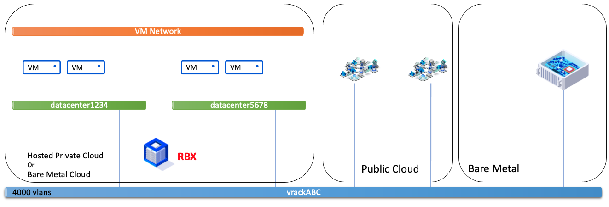
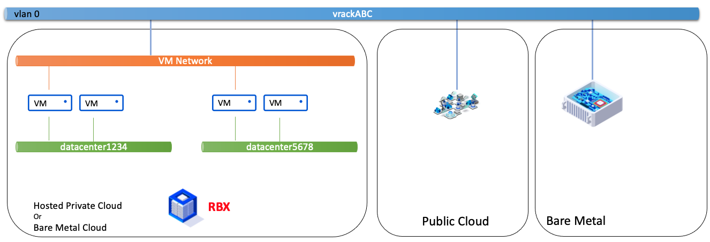
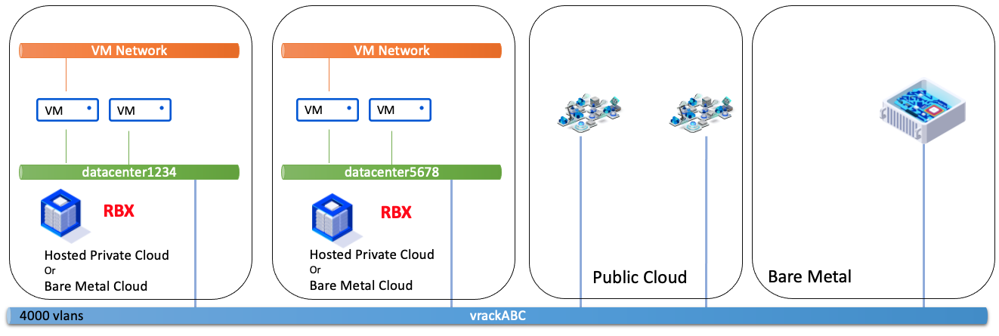
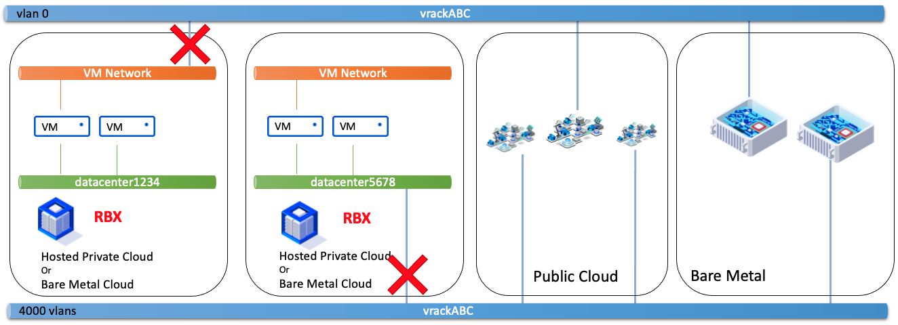

> [!primary]
> Esta tradução foi automaticamente gerada pelo nosso parceiro SYSTRAN. Em certos casos, poderão ocorrer formulações imprecisas, como por exemplo nomes de botões ou detalhes técnicos. Recomendamos que consulte a versão inglesa ou francesa do manual, caso tenha alguma dúvida. Se nos quiser ajudar a melhorar esta tradução, clique em "Contribuir" nesta página.
>

## Objetivo

O produto [vRack](https://www.ovh.pt/solucoes/vrack/){.external} permite interligar vários produtos da OVHcloud e fazê-los comunicar entre si através de 1 ou várias vlan. Algumas configurações não são compatíveis com a solução Hosted Private Cloud.

**Este manual explica a compatibilidade do Hosted Private Cloud com o produto vRack.**

## Requisitos

- Ter contacto com o administrador da infraestrutura [Hosted Private Cloud](https://www.ovhcloud.com/pt/enterprise/products/hosted-private-cloud/), para receber dados de acesso.
- Ter um identificador de utilizador ativo [criado na Área de Cliente OVHcloud](https://www.ovh.com/auth/?action=gotomanager&from=https://www.ovh.pt/&ovhSubsidiary=pt).

## Contexto

No produto Hosted Private Cloud, existem 2 tipos de vRack:

- "VM Network", que é um vRack numa vlan única, a vlan nativa da vlan pública do Hosted Private Cloud. Esta vlan é utilizada no Hosted Private Cloud para rotear os IP públicos. Encontramo-lo no inventário do vSphere enquanto PortGroup, na categoria "Rede", denominada "VM Network". Este vRack está associado ao switch virtual inteiramente gerido pela OVHcloud.

- "Datacenter vRack", ou "vRack vDC", ou "dvs-vrack", é o vRack que permite ter 4000 vlans. Este vRack está associado ao switch virtual gerido pelo cliente, com as suas próprias placas de rede dedicadas.

É importante notar que algumas gamas comerciais, como as gamas à base de Hosts AMD, não têm um switch virtual gerido pelo cliente. Assim, apenas o vRack do tipo "VM Network" está disponível.

Eis o contexto:

{.thumbnail}

## Instruções

### O que podemos fazer

**Associar 2 vRack VM Network entre si, em zonas geográficas diferentes, em diferentes Hosted Private Cloud.**

{.thumbnail}

**Associar 1 vRack VM Network e 1 vRack vDC, em zonas geográficas diferentes, em diferentes Hosted Private Cloud.**

{.thumbnail}

> [!primary]
>
> Para que as VMs do vRack VM Network e as VMs do vRack vDC comuniquem entre si, as VMs do vRack vDC devem estar no vlan nativo.
> 

**Associar 1 vRack vDC e 1 vRack vDC, em zonas geográficas diferentes, em diferentes Hosted Private Cloud.**

{.thumbnail}

**Associar 1 vRack vDC e 1 vRack vDC, no mesmo Hosted Private Cloud.**

{.thumbnail}

**Todos os vDC de um mesmo Hosted Private Cloud partilham o mesmo vRack VM Network.**

{.thumbnail}

**Associar 1 vRack vDC e 1 vRack vDC, numa mesma zona geográfica, em diferentes Hosted Private Cloud.**

{.thumbnail}

### O que não se pode fazer

**Associar 1 vRack VM Network e 1 vRack VM Network, numa mesma zona geográfica, em diferentes Hosted Private Cloud.**

{.thumbnail}

**Associar 1 vRack VM Network e 1 vRack vDC, numa mesma zona geográfica, em diferentes Hosted Private Cloud.**

{.thumbnail}

**Associar 1 vRack VM Network e 1 vRack vDC, numa mesma zona geográfica, no mesmo Hosted Private Cloud.**

{.thumbnail}

## Quer saber mais?

Fale com a nossa comunidade de utilizadores em <https://community.ovh.com/en/>.
