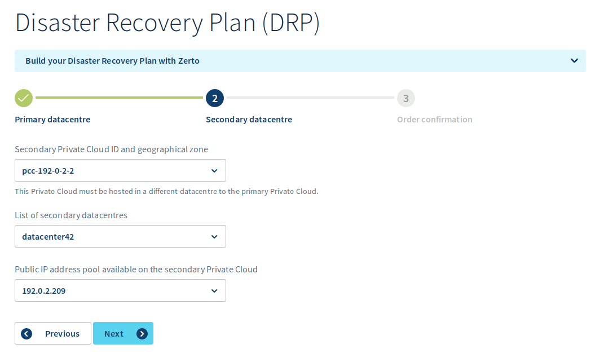
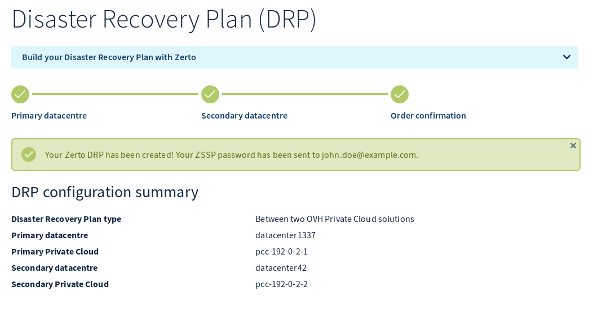
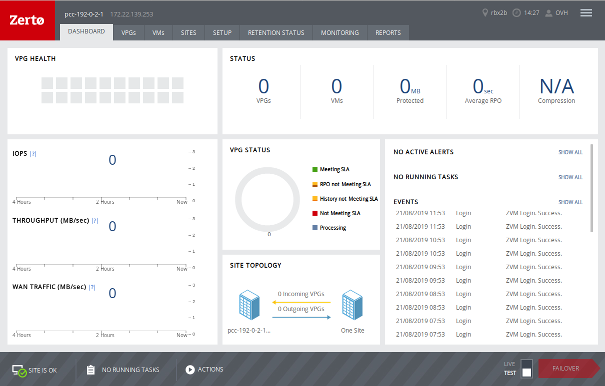
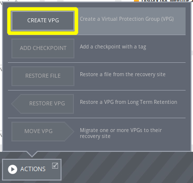
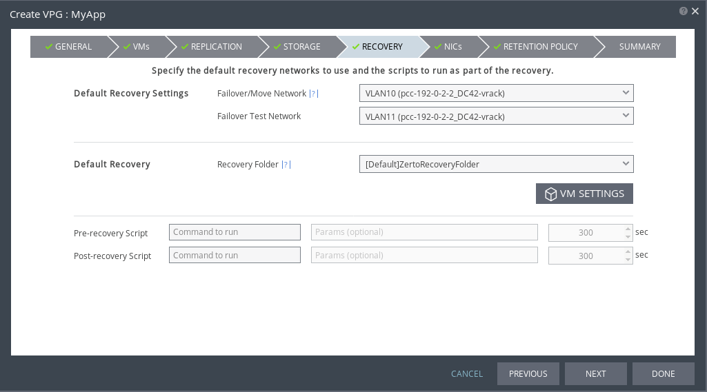
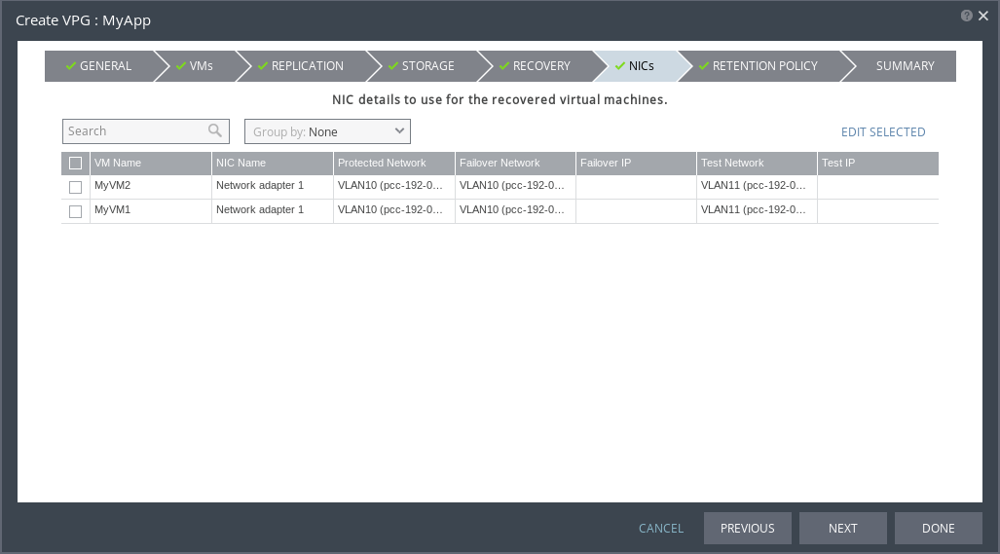
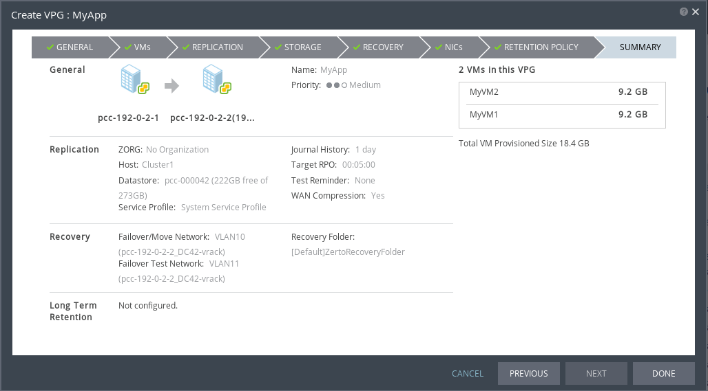
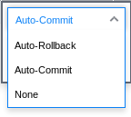
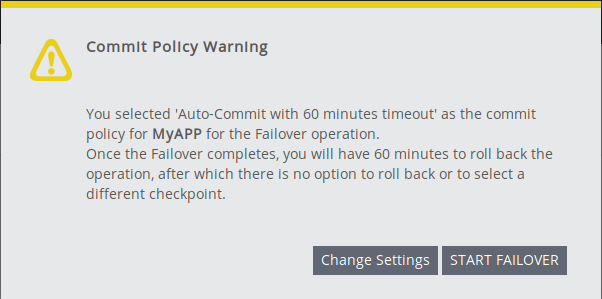
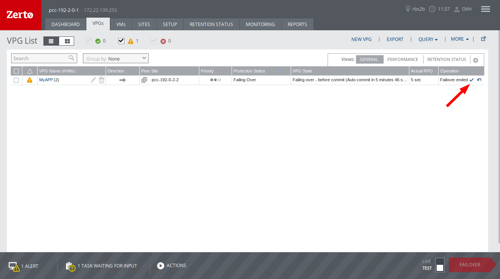

## Objectif

Ce guide a pour objectif d’expliquer les concepts et les détails de la mise en oeuvre de Zerto Virtual Replication entre deux datacenters OVHcloud.

Pour les autres cas de figure., consultez notre guide sur comment [utiliser Zerto entre OVHcloud et une plateforme tierce](/pages/hosted_private_cloud/hosted_private_cloud_powered_by_vmware/zerto-virtual-replication-customer-to-ovhcloud).

**Découvrez comment mettre en oeuvre Zerto Virtual Replication pour votre Plan de Reprise d'Activité (PRA) entre deux offres Hosted Private Cloud.**

## Prérequis

* Posséder deux offres [Private Cloud](https://www.ovh.com/fr/private-cloud/){.external} sur deux locations différentes.
* Avoir sur chacune d'entre elles une adresse IP publique libre.

### Concepts Zerto Virtual Replication

Zerto Virtual Replication est une solution technique permettant de mettre en place une réplication des données entre infrastructures de virtualisation ou cloud. Pour cela elle s'appuie sur les hyperviseurs de la plateforme en déployant des machines virtuelles (VM) appelées Virtual Replication Appliance (VRA) qui se chargent de dupliquer les écritures vers les unités de stockage et les transmettent vers le site distant pour être écrites.

#### Virtual Replication Appliance (VRA)

Les VRA sont ainsi déployés sur chaque hyperviseur et vont consommer des ressources pour effectuer la réplication :

* vCPU : 1
* RAM : 2 GB
* Stockage : 36 GB

À noter que pour le stockage, OVHcloud ajoute gratuitement un datastore dédié pour l'ensemble des VRA.

#### Sites

La réplication des données se fait entre deux (2) sites appairés, ainsi les VRA de chaque côté peuvent établir leur flux de réplication.

Par défaut les flux de réplication Zerto ne sont pas chiffrés et la sécurité étant une priorité pour OVHcloud, nous mettons en place entre les deux sites un tunnel chiffré (via IPSec) au moyen d'une applicance réseau appelée L2VPN.

#### Groupe de réplication (VPG)

L'activation et le pilotage de la réplication des VM se fait au travers d'un Groupe de réplication (VPG).
Il permet de regrouper logiquement un groupe de VM correspondant à un besoin métier ou opérationnel (ex: une application avec sa base de données) afin de configurer l'objectif de perte de données maximale admissible (**RPO**), l'ordre de démarrage (la base avant l'application), les configurations réseau pour les exercices ou en cas réel. 

À noter qu'il est aussi possible de définir un niveau de priorité entre les VPG afin de prioriser le transfert de données en cas de problème de bande passante réseau.

## En pratique

### Activer le service

#### Depuis l'espace client OVHcloud

Dans votre espace client OVHcloud, rendez-vous dans la partie `Hosted Private Cloud` -> `Private Cloud` -> sélectionnez votre plateforme Private-Cloud primaire -> sélectionnez 
le datacenter voulu -> cliquez sur l'onglet `Disaster Recovery Plan (DRP)`{.action}.

{.thumbnail}

Sélectionnez **Between two OVH Private Cloud solutions** puis cliquez sur `Activate Zerto DRP`{.action},

{.thumbnail}

La sélection du **Private Cloud** Primaire ainsi que le **datacenter** se font automatiquement en se basant sur l'infrastructure par laquelle vous avez accédé.

Sélectionnz dans le menu déroulant une adresse IP publique **libre** issue du bloc d'IP publiques attaché au **Private Cloud**. Elle sera utilisée pour la mise en place du lien sécurisé entre les infrastructures.

Cliquer sur `Next`{.action},

{.thumbnail}

La sélection du site secondaire est à faire parmi vos **Private Cloud** présents dans le menu déroulant. 

À noter que seuls ceux éligibles sont présents et pour cela ils doivent répondre aux critères suivants :

* Être physiquement dans une autre Localisation
* Ne pas déjà avoir de réplication Zerto en place

Sélectionnez ensuite le **datacenter** du **Private Cloud** de destination dans le menu déroulant.

Sélectionnez dans le menu déroulant une adresse IP publique **libre** issue du bloc d'IP publiques attaché au **Private Cloud**. Elle sera utilisée pour la mise en place du lien sécurisé entre les infrastructures.

Cliquer sur `Next`{.action},

{.thumbnail}

Une fois la demande d'activation prise en compte, comme indiqué celle-ci peut prendre jusqu'à une heure, sous réserve que les informations fournies soient correctes (notamment si l'adresse IP n'est déjà utilisée par l'une de vos machines virtuelles, si c'est le cas l'activation échouera).

{.thumbnail}

Une fois l'activation effectuée, vous recevrez par e-mail une configuration de l'installation ainsi que les liens d'accès à l'interface Zerto de chacune des infrastructures.

> [!primary]
> Bonjour,
> 
> Vous venez d'activer la solution de PRA Zerto entre 2 de vos Private Cloud.
> 
> Vous pouvez vous connecter au site principal à l'adresse suivante :
> 
>   * URL        : https://zerto.pcc-192-0-2-1.ovh.com/
> 
> Vous pouvez vous connecter au site secondaire à l'adresse suivante :
> 
>   * URL        : https://zerto.pcc-192-0-2-2.ovh.com/
> 
> Vous pourrez vous authentifier avec vos comptes administrateurs de la même façon que pour vSphere.
> 

#### Depuis l'API OVHcloud

### Interface Zerto Replication

L'interface est accessible depuis les deux (2) infrastructures via l'adresse :

* URL : https://zerto.pcc-x-x-x-x.ovh.com/ (à modifier selon vos plateformes)

> [!warning]
>
> Comme indiqué dans le corps de l'e-amil, les identifiants pour se connecter sont les même que ceux utilisés pour se connecter à l'interface vSphere.
>

Une fois identifié, vous arrivez sur un écran affichant le tableau de bord :

{.thumbnail}

Vous retrouverez sur cet écran :

* Un visuel rapide de l'état de santé des VPG
* Le statut global de Zerto Réplication avec quatre indicateurs
* Un tableau des performances de Zerto Réplication
* Un visuel sur les statuts de l'ensemble des VPG
* La liste des dernières alertes, actions et évènements Zerto Réplication

### Configurer un groupe de réplication (VPG)

Depuis le menu `Actions`{.action}, sélectionnez `Create VPG`{.action}

{.thumbnail}

{.thumbnail}

Sur le premier écran :

* Saisissez un nom pour le VPG, idéalement celui-ci doit être parlant dans un contexte opérationnel.
* Sauf besoin particulier, la priorité définie a **Medium** peut-être laissée telle-quelle.

Continuez en cliquant sur `NEXT`{.action}

{.thumbnail}

L'étape suivante consiste à sélectionner les VM qui vont faire partie du VPG.

> [!warning]
>
> Une VM ne peut pas être dans plusieurs VPG.
> 

* Filtrez les VM par nom via le champ **Search**
* Cochez les cases à gauche des VM correspondantes

{.thumbnail}

* Cliquez sur la flèche pointant vers la droite pour passer celle-ci dans le VPG

Poursuivez en cliquant sur `NEXT`{.action}

{.thumbnail}

On passe ensuite à l'étape de sélection du site distant :

* **Recovery Site** : sélectionnez le site distant (celui qui n'est pas local) au niveau de la liste 
* **ZORG** : sélectionnez **No Organization** dans la liste. Toute autre valeur affichera une erreur au moment de passer à l'étape suivante.

Puis on passe à l'étape des définitions des ressources distantes :

* **Hosts** : Sélectionnez la ressource de calcul, qui peut-être un **host seul** (indiqué par son adresse IP et précédé du nom du cluster entre crochets le cas échéant), un **Ressource Pool** (commençant par RP suivi du nom du cluster puis du nom du Ressource Pool) ou un **Cluster** (via son nom). Seul un **Ressource Pool** ou un **Cluster** doit être sélectionné (ici Cluster1).
* **Datastore** : Sélectionnez la ressource de stockage, qui peut-être un **Datastore seul** (indiqué par son nom et précédé du nom du **Storage Cluster** entre crochets le cas échéant) ou un **Storage Cluster** (via son nom).

Laissez les autres valeurs telles quelles sauf besoins avancés.

Poursuivez en cliquant sur `NEXT`{.action}

{.thumbnail}

À l'étape suivante, on peut éventuellement affiner la configuration pour le stockage.

Laissez les autres valeurs telles quelles sauf besoins avancés.

Poursuivez en cliquant sur `NEXT`{.action}

{.thumbnail}

Ensuite vient une partie importante, la première étape de la configuration réseau

* **Failover/Move Network** : choisissez le portgroup par défaut pour la bascule.
* **Failover Test Network** : choisissez le portgroup pour les tests de bascule.
* **Recovery Folder** : choisissez le dossier (ou alors / pour la racine) dans lequel les VM basculés sur le site seront ajoutées.

> [!primary]
> Les options de **Pre-recovery Script** et **Post-recovery Script** ne sont pas utilisables.
> 

Continuez en cliquant sur `NEXT`{.action}

{.thumbnail}

Il s'agit de la deuxième étape de la configuration réseau :

* Pour chaque VM, vous allez pouvoir choisir le portgroup pour les tests ou bascules.
* Il est aussi possible de changer la configuration IP des VM pour chacune des situations.

{.thumbnail}

> [!warning]
>
> Le changement d'IP n'est possible que pour les VM avec un OS supporté et pour lesquelles les **VMware Tools** sont en fonctionnement
> 

Continuez en cliquant sur `NEXT`{.action}

{.thumbnail}

Passez cette étape en cliquant sur `NEXT`{.action}

{.thumbnail}

Sur le dernier écran, on retrouve un récapitulatif de l'ensemble des éléments configurés.

Après vérification, validez la création en cliquant sur `DONE`{.action}

{.thumbnail}

Vous retrouverez le VPG nouvellement créé dans la liste, ainsi que le statut de celui-ci (il commence par **Initializing**).

### Lancer un exercice de reprise d'activité 

Après avoir configuré la réplication et laissé celle-ci s'effectuer plusieurs jours, vous allez peut-être vouloir tester si votre PRA fonctionne avec notamment les actions gérées par Zerto Réplication.

> [!warning]
>
> Le test de failover sur Zerto Replication se fait **sans** coupure sur le site principal, il faut donc avoir fait attention à bien avoir configuré les réseaux de test pour éviter notamment tout conflit d'adressage IP et pour ne pas impacter votre production avec cet exercice.
>
> L'ensemble des ressources qui seront démarrées sur le site secondaire par le test ne doivent pas être modifiées ni supprimées manuellement. L'ensemble du test sera démantelé par Zerto Replication à la fin du test.
>
> À noter que la réplication continue de s'effectuer entre les deux sites lors d'un test.
>

{.thumbnail}

Pour cela, connectez-vous à l'interface Zerto Replication et cliquez sur `FAILOVER`{.action} (le sélecteur à gauche étant par défaut sur **TEST**).

Si le texte du bouton est en gris, c'est qu'il n'y a pas de VPG éligible pour le test (l'initialisation n'est peut-être pas terminée).

{.thumbnail}

Immédiatement, un écran apparait avec les VGP disponibles, le sens de réplication, le site de destination et si le niveau de protection est correct (**Meeting SLA**).

Vous avez alors plusieurs choix :

1. Cochez la case pour sélectionner le VPG et donc l'ensemble des VMs de celui-ci pour le test.
2. Cliquez sur l'icône à droite du nom du VPG pour faire apparaitre la liste des VM du VPG. Vous avez alors la possibilité de choisir quelles VM du VPG vont faire partie du test.

Validez et passez à l'étape suivante en cliquant sur `NEXT`{.action}.

{.thumbnail}

Nous sommes partis sur le choix 1,  à savoir un test sur un VPG.

À cette étape on retrouve un résumé des actions lié au VPG :

* Sens de réplication
* Site distant
* Si une séquence de démarrage des VM a été définie
* Si des scripts Pre ou Post bascule sont présents (fonctionnalité non disponible)

Continuez en cliquant `NEXT`{.action}

{.thumbnail}

Dernier écran de récapitulatif sur une vue des différents sites avec le nombre de VPG pour le test.

Confirmez le lancement du test avec `START FAILOVER TEST`{.action}

Le test de bascule se lance immédiatement avec les actions sur le vCenter du site distant.

Il ne vous reste plus qu'à contrôler si tout fonctionne correctement sur le site distant.

{.thumbnail}

Quand vous avec fini de contrôler les machines qui auront été basculées, cliquez sur le petit carré rouge à droite du **Testing Failover**

{.thumbnail}

La nouvelle fenêtre vous indique si le test est un succès et vous pouvez rajouter un commentaire.

Confirmez la fin du test avec `STOP`{.action}.

Le démantèlement du test se lance immédiatement avec les actions sur le vCenter du site distant.

### Lancer une reprise d'activité

En cas d'incident majeur sur le site principal ou dans le cadre d'un exercice en condition réelle, le lancement de la bascule s'effectue logiquement depuis le site secondaire (de reprise).

> [!warning]
>
> Le failover en mode **LIVE** sur Zerto Replication se fait en considérant le site principal comme indisponible, il faut donc faire attention à la configuration réseau afin d'éviter notamment tout conflit d'adressage IP.
>
> L'ensemble des ressources qui seront démarrées sur le site secondaire vont devenir actives au niveau du traitement de données.
>
> À noter que la réplication entre les deux sites est modifiée ou coupée (voir plus loin).
>

{.thumbnail}

Pour cela connectez-vous à l'interface Zerto Replication, basculez le sélecteur en bas à droite de l'interface sur **LIVE** (la couleur du bandeau va changer pour signaler que vous allez faire des actions impactantes) et cliquez sur `FAILOVER`{.action}.

{.thumbnail}

Immédiatement, un écran apparait avec les VGP disponibles, le sens de réplication, le site de destination et si le niveau de protection est correct (**Meeting SLA**).

Vous aurez plusieurs choix :

1. Cocher la case pour sélectionner le VPG et donc l'ensemble des VMs de celui-ci pour la bascule.
2. Cliquer sur l'icône à droite du nom du VPG pour faire apparaitre la liste des VM du VPG. Vous avez alors la possibilité de choisir quelles VM du VPG vont faire partie de la bascule.

Validez et passez à l'étape suivante en cliquant sur `NEXT`{.action}.

{.thumbnail}

Le choix 1, le test sur un VPG, est sélectionné à des fins d'exemple.

À cette étape on retrouve un résumé des actions lié au VPG :

* Sens de réplication
* Site distant
* Le **Checkpoint** : il s'agit de la date à laquelle seront restaurées les données. L'écart entre le point choisi et la date courante déterminera le **RPO**
* La **Commit Policy** : voir après.
* **VM Shutdown** : détermine le comportement à adopter sur le site primaire, pas de coupure des VM, extinction, extinction forcée.
* **Reverse Protection** : indique si la réplication du VPG doit être configurée en sens inverse à l'issue du failover pour pouvoir éventuellement procéder plus tard au failback.
* Si une séquence de démarrage des VM a été définie
* Si des scripts Pre ou Post bascule sont présents (fonctionnalité non disponible)

{.thumbnail}

Au niveau de la **Commit Policy**, vous avez trois (3) options :

* Auto-Rollback : sans action de votre part, le retour en arrière est déclenché au bout du temps prévu.
* Auto-Commit : sans action de votre part, la validation des données sur la plateforme secondaire est déclenchée au bout du temps prévu (il n'est plus possible de revenir simplement sur la plateforme principale).
* None : les actions de **Rollback** ou de **Commit** doivent être validées par votre part.

{.thumbnail}

Au niveau des options **Auto** la temporisation par défaut est de soixante (60) minutes.

Continuez en cliquant sur `NEXT`{.action}

{.thumbnail}

Le dernier écran est un récapitulatif avec une vue des différents sites et le nombre de VPG pour la bascule.

> [!warning]
>
> Il est fortement recommandé de bien lire le résumé ainsi que les avertissements.
>

Lancez la bascule en cliquant sur `START FAILOVER`{.action}.

{.thumbnail}

Si vous avez choisi une **Commit Policy** de type **Auto**, un message d'avertissement vous rappelle l'impact de celui-ci.

Confirmez le lancement en cliquant sur `START FAILOVER`{.action}.

La bascule se lance immédiatement avec les actions sur le vCenter du site distant.

Il ne vous reste plus qu'à contrôler si tout fonctionne correctement sur le site distant.

{.thumbnail}

Après avoir lancé la bascule, vous pouvez voir une alerte au niveau de l'interface Zerto Replication.
Celle-ci est liée à la **Commit Policy** et sera présente tant que le commit n'est pas confirmé ou annulé.

Lle cas échéant, les actions sont à faire via les icônes à droite du VPG.

{.thumbnail}

Au moment de la validation du commit, vous pouvez automatiquement configurer le VPG en sens inverse (appeler **Reverse Protection**).

Validez en cliquant sur `COMMIT`{.action}

{.thumbnail}

Au niveau du VPG, vous pouvez noter que la direction (via la flèche) de réplication a été changée.

### Préparer et effectuer un retour en arrière

Suivant comment a éfé fait le **Failover**, l'éventuel retour sur le site principal (cela n'est pas une obligation) peut nécessiter plusieurs actions.

Si vous avez basculé avec du **Reverse Protection**, le retour arrière consiste à faire un **Failover Live** (se reporter à la partie idoine pour les actions à faire).

Si vous avez basculé **sans** du **Reverse Protection**, le retour arrière consiste à créer un VPG **puis** faire un **Failover Live** (se reporter aux sections précédentes pour les actions à faire).

## Aller plus loin

Échangez avec notre communauté d’utilisateurs sur <https://community.ovh.com/>.
