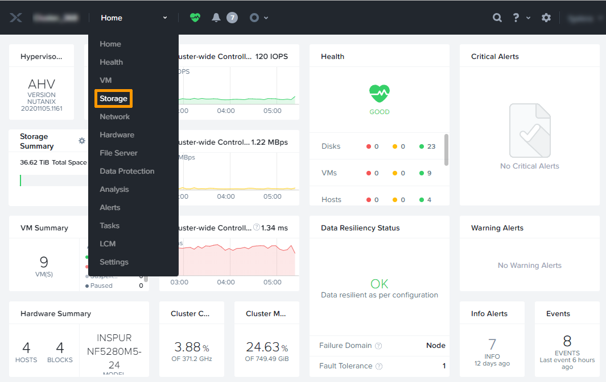
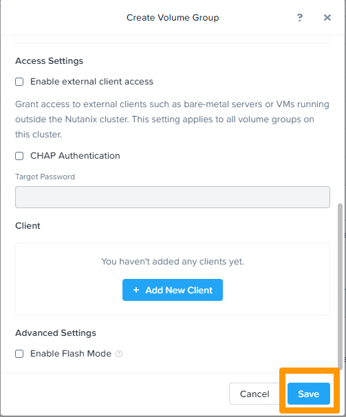
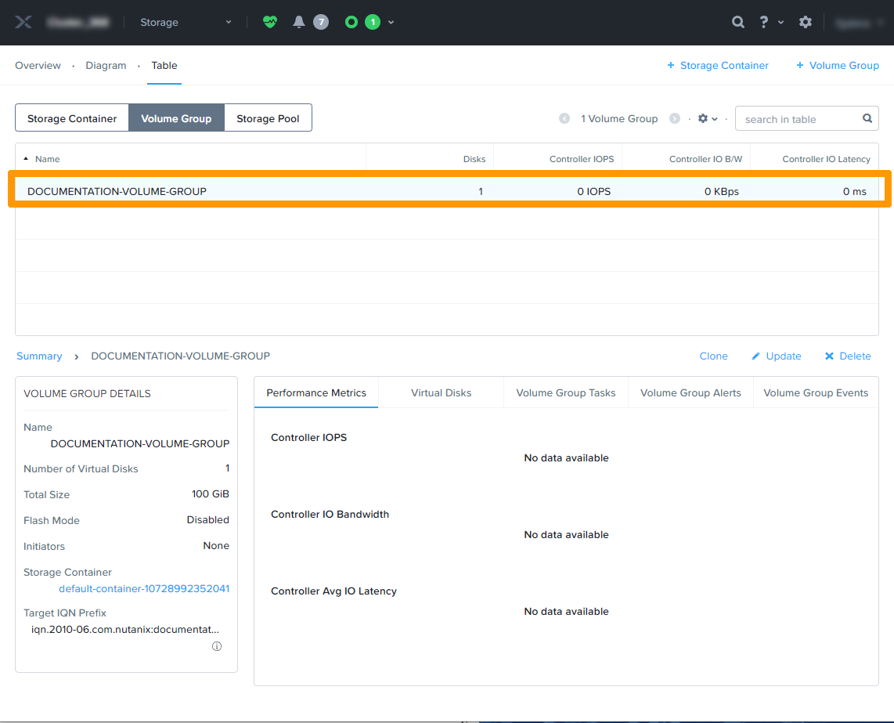

**Dernière mise à jour le 03/03/2022**

## Objectif

Ce guide vous présente le stockage ainsi que la création d'un **storage container** et d'un **volume group**.

> [!warning]
> OVHcloud vous met à disposition des services dont la configuration, la gestion et la responsabilité vous incombent. Il vous appartient donc de ce fait d’en assurer le bon fonctionnement.
>
> Ce guide a pour but de vous accompagner au mieux sur des tâches courantes. Néanmoins, nous vous recommandons de faire appel à l'équipe [Professional Services OVHcloud](https://www.ovhcloud.com/fr/professional-services/) ou à un [prestataire spécialisé](https://partner.ovhcloud.com/fr/directory/) si vous éprouvez des difficultés ou des doutes concernant l’administration, l’utilisation ou la mise en place d’un service sur un serveur.
>
> Certaines options comme l'utilisation de la compression ou de la déduplication nécessitent des licences particulières fournies par Nutanix au travers d'OVHcloud, nous vous invitons à vous renseigner auprès du service commercial OVHcloud pour plus d'informations.

## Prérequis

- Disposer d'un cluster Nutanix dans votre compte OVHcloud
- Être connecté à votre [espace client OVHcloud](https://www.ovh.com/auth/?action=gotomanager&from=https://www.ovh.com/fr/&ovhSubsidiary=fr)
- Être connecté sur le cluster via Prism Element

## Présentation du fonctionnement du stockage dans un cluster Nutanix

Lors de la création d'un Cluster Nutanix, le système connecte tous les disques des nœuds dans un **Storage Pool**. Il est déconseillé d'avoir plusieurs Storage Pools.

Par défaut, le **facteur de réplication** est sur 2 et il peut être modifié à 3 si l'on a au minimum 5 nœuds.

Les données ne sont pas stockées directement dans le Storage Pool, elles le sont dans des **Storage Containers** où il est possible d'activer des options de compression, déduplication, etc pour optimiser l'utilisation du stockage. 

Il existe aussi des **Volume Groups** qui donnent la possibilité d'avoir un accès en ISCSI ou directement en simulation SCSI pour :

* un ordinateur tiers hors du cluster ou une VM du cluster;
* plusieurs ordinateurs tiers ou plusieurs VMs du cluster pour des applications nécessitant un stockage partagé, comme par exemple des bases de données Microsoft SQL en mode Cluster.

## En pratique

### Modifier le **facteur de réplication** 

Cliquez sur l'engrenage en haut à droite de l'interface Prism Element.

{.thumbnail}

Faites défiler les réglages (*Settings*) à l'aide de l'ascenseur et cliquez sur `Redundancy state`{.action}.

Si vous disposez de 5 nœuds, vous pouvez modifier le paramètre **Desired redundancy factor**, en le passant de 2 à 3.

{.thumbnail}

Il est nécessaire d'attendre un certain temps pour que les données se trouvent sur 3 nœuds.

### Créer un **Storage Container**

Nous allons créer un **Storage Container**, avec 300 Go (minimum) réservés pour ce stockage. Les autres paramètres sont ceux par défaut.

Dans le menu, sélectionnez `Storage`{.action}.

{.thumbnail}

Positionnez-vous sur `Storage Container`{.action} et cliquez, à droite, sur  `+ Storage Container`{.action}.

{.thumbnail}

Donnez un nom au storage container dans la zone de saisie **NAME**. 
Cliquez ensuite sur `Advanced Settings`{.action} pour afficher les paramètres avancés.

{.thumbnail}

Dans le champ **RESERVED CAPACITY**, saisissez la taille de votre container. D'autres options sont également disponibles.

{.thumbnail}

Cliquez enfin sur `Save`{.action} pour finaliser la création du **Storage Container**.

{.thumbnail}

Le nouveau **Storage Container** est ensuite visible dans le tableau de bord.

{.thumbnail}

Pour plus de détails sur la création d'un **Storage Container**, reportez-vous à la section « [Aller plus loin](#gofurther) » de ce guide.

### Créer un **Volume Group**

Positionnez-vous sur `Volume Group`{.action} et cliquez, à droite, sur `+ Volume Group`{.action}.

{.thumbnail}

Cliquez sur **Add New Disk**.

{.thumbnail}

Saisissez la taille dans le champ **Size** et cliquez sur `Add`{.action}.

{.thumbnail}

Le disque apparait dans le **Volume Group**. Vous pouvez ainsi ajouter plusieurs autres disques.

{.thumbnail}

Une fois votre ou vos disque(s) créé(s), parcourez les options disponibles et validez enfin la création du **Volume Group** en cliquant sur `Save`{.action}.

{.thumbnail}

Le **Volume Group** apparait alors dans la liste.

{.thumbnail}

## Aller plus loin 

[Présentation d'un cluster Nutanix](/pages/hosted_private_cloud/nutanix_on_ovhcloud/03-nutanix-hci)

[Documentation Nutanix sur le stockage](https://portal.nutanix.com/page/documents/details?targetId=Web-Console-Guide-Prism-v5_20:wc-storage-management-wc-c.html)

[Les licences Nutanix](https://www.nutanix.com/products/software-options)

Si vous avez besoin d'une formation ou d'une assistance technique pour la mise en oeuvre de nos solutions, contactez votre commercial ou cliquez sur [ce lien](https://www.ovhcloud.com/fr/professional-services/) pour obtenir un devis et demander une analyse personnalisée de votre projet à nos experts de l’équipe Professional Services.

Échangez avec notre communauté d'utilisateurs sur <https://community.ovh.com/>.
