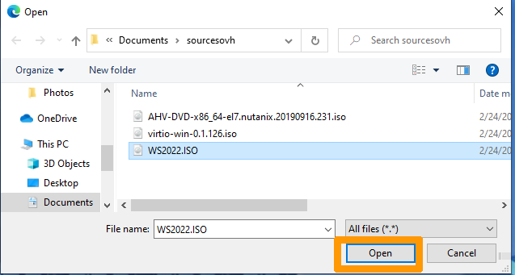
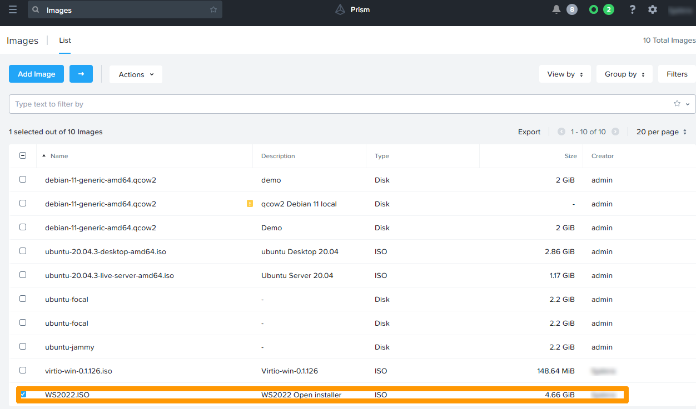

## Objective

You can add ISO images to the Nutanix system for later use when installing an operating system.

**This guide details how to import ISO images from Prism Central.**

> [!warning]
> OVHcloud provides services for which you are responsible, with regard to their configuration and management. It is therefore your responsibility to ensure that they work properly.
>
> This guide is designed to assist you as much as possible with common tasks. Nevertheless, we recommend contacting a specialist provider if you experience any difficulties or doubts when it comes to managing, using or setting up a service on a server.
>
> Some softwares require a licence such as Microsoft products, so make sure that all installed systems and software have these licences.

## Requirements

- a Nutanix cluster in your OVHcloud account
- access to the [OVHcloud Control Panel](https://www.ovh.com/auth/?action=gotomanager&from=https://www.ovh.es/&ovhSubsidiary=es)
- You must be connected to Prism Central on the cluster

## Overview of the image system in Nutanix

Images are imported files of various formats, such as ISO images, but it is also possible to import most images of existing virtual machines (vhdx, qcow2, etc.).

Images are imported from Prism Central or Prism Element. This documentation describes how to import an image from Prism Central.

You can import images from a local file or a URL link.

For more information on creating images, see the [Go further](#gofurther) section of this guide.

## Instructions

From Prism Central, open the main menu via the top left button. 

Unfold `Compute & Storage`{.action} and click `Images`{.action}.

.

Click `Add Image`{.action}.

Click the `Add File`{.action} button.

Select the image file and click `Open`{.action}.

Type the file name, add a description, and then click `Next`{.action}.

Leave the default options and click `Save`{.action}.

The imported image appears in the images dashboard in Prism Central.

## Go further 

[Presentation of a Nutanix cluster](/pages/hosted_private_cloud/nutanix_on_ovhcloud/03-nutanix-hci)

[Nutanix documentation for importing images from Prism Central](https://portal.nutanix.com/page/documents/details?targetId=Prism-Central-Guide-Prism-v5_20:mul-image-import-pc-t.html)

[Nutanix documentation for importing images from Prism Element](https://portal.nutanix.com/page/documents/details?targetId=Web-Console-Guide-Prism-v5_20:wc-image-configure-acropolis-wc-t.html)

[Nutanix licences](https://www.nutanix.com/products/software-options)

If you need training or technical assistance to implement our solutions, contact your sales representative or click on [this link](https://www.ovhcloud.com/es-es/professional-services/) to get a quote and ask our Professional Services experts for assisting you on your specific use case of your project.

Join our community of users on <https://community.ovh.com/en/>.
