## Objectif

Nutanix Flow est disponible sur toutes les offres **Nutanix on OVHcloud**. Cette option permet de sécuriser le réseau dans un ou plusieurs clusters gérés par **Prism Central**

**Apprenez à utiliser Nutanix Flow pour la sécurisation du réseau au sein d'un cluster Nutanix.**

> [!warning]
> OVHcloud vous met à disposition des services dont la configuration, la gestion et la responsabilité vous incombent. Il vous appartient donc de ce fait d’en assurer le bon fonctionnement.
>
> Ce guide a pour but de vous accompagner au mieux sur des tâches courantes. Néanmoins, nous vous recommandons de faire appel à l'équipe [Professional Services OVHcloud](https://www.ovhcloud.com/fr/professional-services/) ou à un [prestataire spécialisé](https://partner.ovhcloud.com/fr/directory/) si vous éprouvez des difficultés ou des doutes concernant l’administration, l’utilisation ou la mise en place d’un service sur un serveur.
>

## En pratique

Connectez-vous à **Prism Central**.

Pour vous connecter à un cluster Nutanix, au besoin, reportez-vous à la section « [Aller plus loin](#gofurther) » de ce guide. 

### Activation de **Nutanix Flow**

Cliquez sur l'engrenage en haut à droite pour modifier les paramètres.

{.thumbnail}

Cliquez sur `Microsegmentation`{.action} depuis la barre de défilement à gauche.

{.thumbnail}

Cochez la case **Enable Microsegmentation** et cliquez sur `Save`{.action}.

{.thumbnail}

La microsegmentation est activée. Il sera toujours possible de la désactiver.

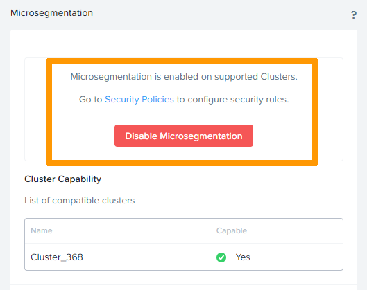{.thumbnail}

### Configuration des catégories 

Une catégorie est un objet qui peut contenir une ou plusieurs valeurs

Lors de l'installation d'un cluster, certaines catégories existent déjà et elles sont modifiables, d'autres catégories peuvent être ajoutées.

Les entités comme les machines virtuelles, les sous-réseaux ou les images, peuvent faire partie des catégories utilisées pour un outil comme **Flow** par exemple.

#### Création d'une catégorie

Depuis le menu principal, cliquez sur `Categories`{.action} dans le sous-menu `Administration`.

{.thumbnail}

Cliquez sur `New Category`{.action}.

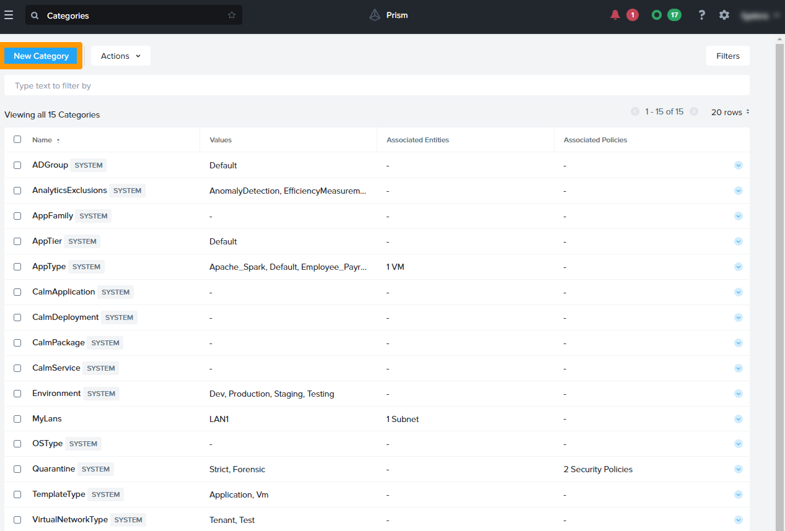{.thumbnail}

Saisissez le nom de la catégorie dans **Name** puis cliquez sur `New value`{.action}.

{.thumbnail}

Saisissez un nom dans **Value** et cliquez sur le bouton de validation bleu à droite. 

{.thumbnail}

Cliquez sur `Save`{.action}.

{.thumbnail}

La nouvelle catégorie apparait dans la liste des catégories.

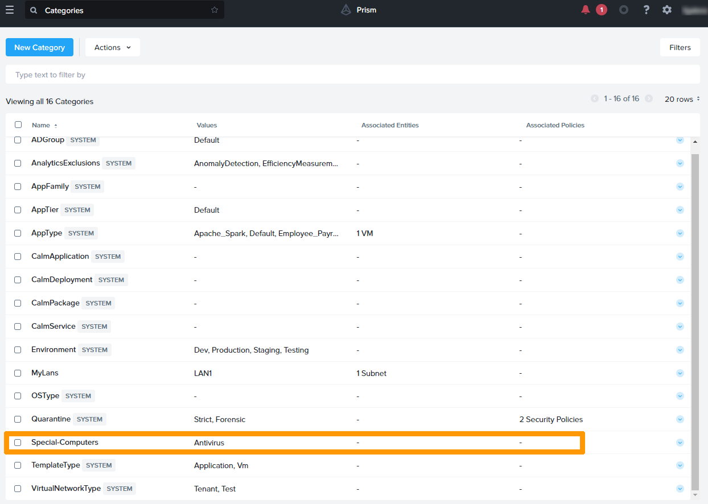{.thumbnail}

#### Modification d'une catégorie

Sélectionnez la catégorie `Special-Computers`{.action}

{.thumbnail}

Cliquez sur `Update`{.action} dans le menu `Actions`{.action}

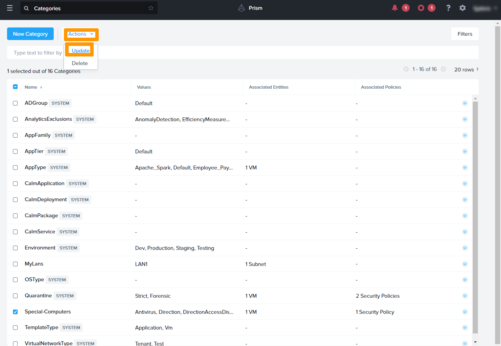{.thumbnail}

Cliquez sur `New value`{.action}

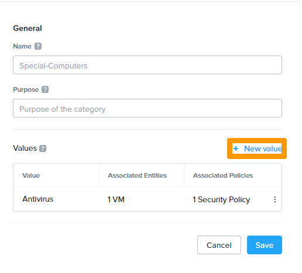{.thumbnail}

Saisissez une valeur dans la colonne **Value** puis cliquez sur l'icône de validation.

{.thumbnail}

Cliquez sur `New value`{.action}.

{.thumbnail}

Saisissez une autre valeur dans la colonne **Value** puis cliquez sur l'icône de validation.

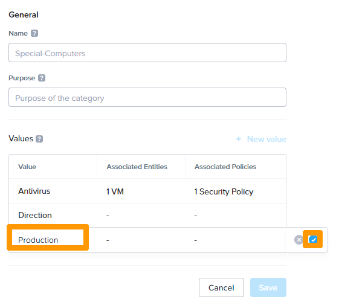{.thumbnail}

Cliquez sur `Save`{.action} pour valider la modification de la catégorie.

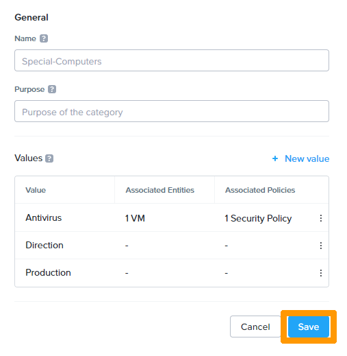{.thumbnail}

La catégorie est visible dans le tableau de bord des catégories avec ces deux nouvelles valeurs.

{.thumbnail}

#### Affectation d'une catégorie à une machine virtuelle

Depuis le menu principal, cliquez sur `VMs`{.action} sous `Compute & Storage.`

{.thumbnail}

Sélectionnez la machine virtuelle en cochant à gauche de celle-ci.

{.thumbnail}

Cliquez sur `Actions`{.action} puis sur `Manage Categories`{.action}. 

{.thumbnail}

Saisissez `nomdelacatégorie:valeur` et cliquez sur le signe `+`{.action}.

{.thumbnail}

Cliquez sur `Save`{.action} pour enregistrer la machine virtuelle dans une catégorie.

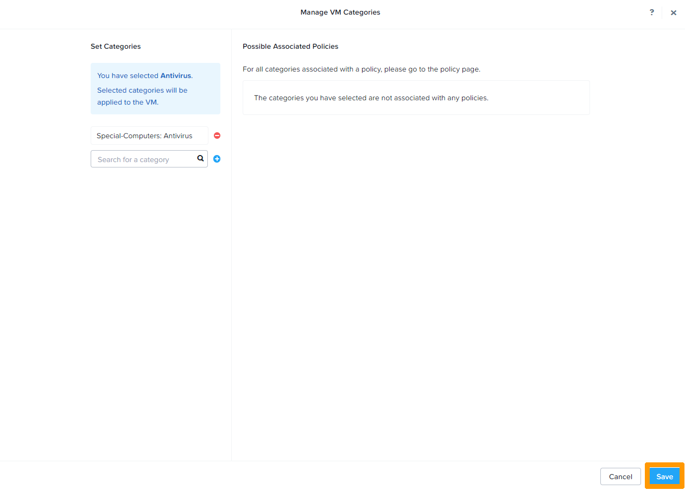{.thumbnail} 

#### Affectation d'une catégorie à plusieurs machines virtuelles

Sélectionnez trois machines virtuelles en utilisant les `cases à cocher`{.action} à leurs gauches.

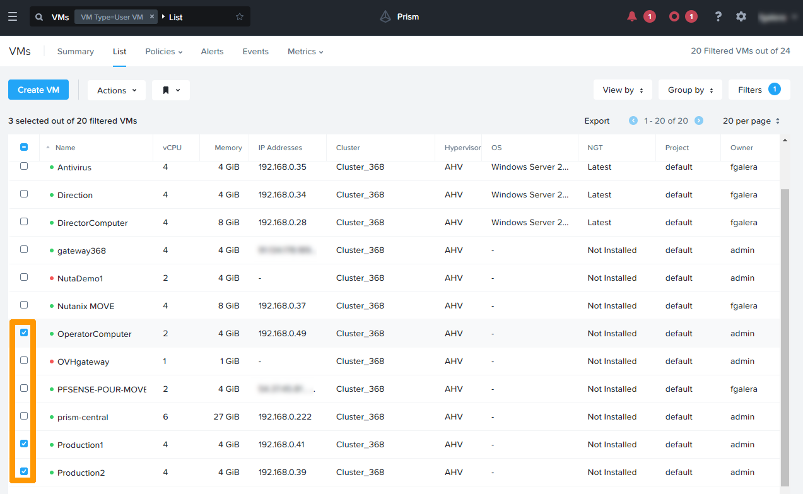{.thumbnail}

Cliquez sur le menu `Actions`{.action} et sélectionnez `Manage Categories`{.action}.

{.thumbnail}

Saisissez `nomdelacatégorie:valeur` et cliquez sur `+`{.action}.

{.thumbnail}

Cliquez sur `Save`{.action}.

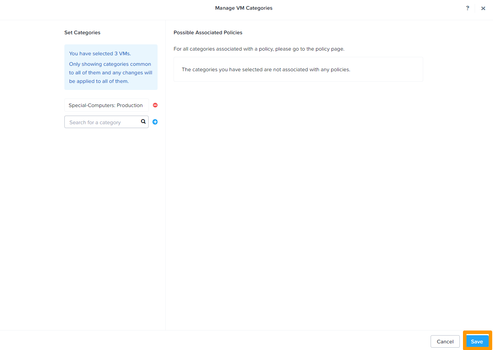{.thumbnail}

#### Affectation d'une catégorie à des sous-réseaux

Depuis le menu principal, cliquez sur `Subnets`{.action} sous `Network & Security`.

{.thumbnail}

Sélectionnez les sous-réseaux en cochant à leur gauche. 

{.thumbnail}

Cliquez sur le menu `Actions`{.action} et sélectionnez `Manage Categories`{.action}.

{.thumbnail}

Saisissez `nomdelacatégorie:valeur` et cliquez sur `+`{.action}.

{.thumbnail}

Cliquez sur `Save`{.action}.

{.thumbnail}

### Gestion de la quarantaine réseau.

La quarantaine réseau permet d'isoler une machine virtuelle de l'ensemble du réseau ou de lui permettre un accès restreint à certains outils de réparations se trouvant sur le réseau.

#### Mise en quarantaine d'une VM

Depuis le menu principal et cliquez sur `VMs`{.action} sous `Compute & Storage.`

{.thumbnail}

Sélectionnez la machine virtuelle en cochant à gauche de celle-ci. 

{.thumbnail}

Cliquez sur `Actions`{.action} et choisissez `Quarantine VMs`{.action} dans le menu.

{.thumbnail}

Sélectionnez `Forensic`{.action} dans `quarantine Method` puis cliquez sur `Quarantine`{.action}.

{.thumbnail}

La machine virtuelle est à présent en quarantaine.

#### Personnalisation de la quarantaine réseau.

Pour l'instant aucun blocage n'affecte la machine virtuelle en quarantaine. Suivez ces instructions pour configurer la quarantaine.

Depuis le menu principal, cliquez sur `Security Policies`{.action} dans le sous-menu `Network & Security`.

{.thumbnail}

Cliquez sur le numéro à coté de `Quarantined` pour afficher les machines virtuelles en quarantaine.

{.thumbnail}

La liste des machines virtuelles en quarantaine apparait dans la colonne **Name**. Cliquez sur `Close`{.action} pour revenir au menu précédent.

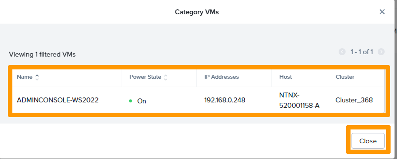{.thumbnail}

Cliquez sur `Quarantine`{.action} en dessous de la colonne **Name** pour modifier la règle.

{.thumbnail}

Le statut de la règle est en mode `Monitoring` comme indiqué en haut à gauche. 

Le trafic n'est pas bloqué mais surveillé. Les connexions entre les machines virtuelles mises en quarantaine et le reste du réseau sont représentés par des traits de couleurs orange reliés à des rectangles représentant l'adresse IP de la source ou de la destination.

Cliquez sur `Enforce`{.action} en haut à droite pour passer du mode **Monitoring** au mode **Enforcing** avec blocage du trafic.

{.thumbnail}

Saisissez `ENFORCE`{.action} et cliquez sur `Confirm`{.action}.

{.thumbnail}

Le statut de la règle est maintenant sur `Enforced`.

Le trafic est bloqué. Nous voyons les tentatives d'accès aux machines virtuelles en quarantaines via des lignes en pointillés rouges vers les blocs contenant l'adresse IP de la machine virtuelle.

Cliquez sur `Update`{.action} en haut à droite pour modifier la règle, afin d'autoriser certains flux réseaux.

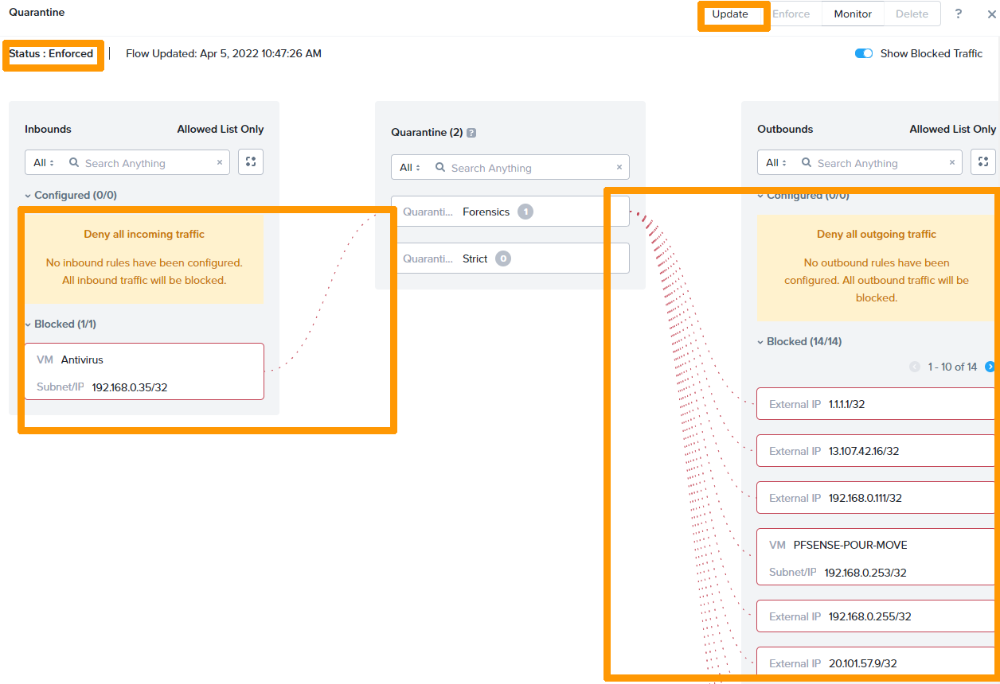{.thumbnail}

Cliquez sur `Next`{.action}.

{.thumbnail}

Positionnez la souris sur une tentative de connexion entrante et cliquez sur `Allow Traffic`{.action}

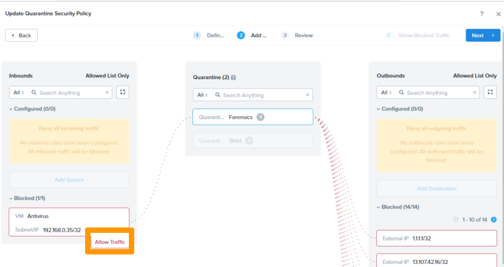{.thumbnail}

Cochez la case à gauche de la **Source** pour sélectionner le trafic découvert entrant, puis cliquez sur `Allow 1 Discovered Traffic`{.action} pour n'autoriser que le trafic découvert comme par exemple ci-dessous le protocole ICMP.

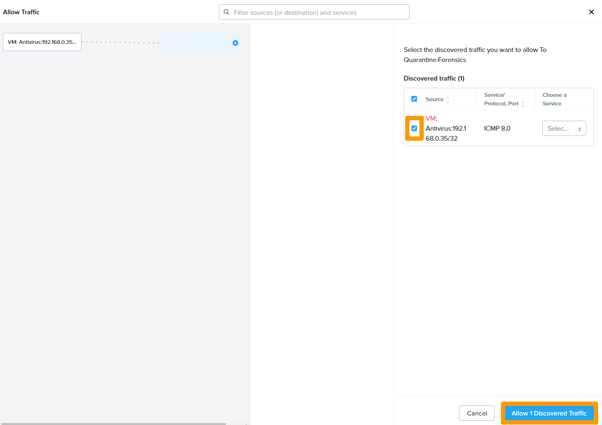{.thumbnail}

Positionez la souris sur une tentative de connexion sortante et cliquez sur `Allow Traffic`{.action}.

{.thumbnail}

Cochez la case à gauche de la **Source** pour sélectionner le trafic découvert sortant puis cliquez sur `Allow 1 Discovered Traffic`{.action} pour n'autoriser que le trafic découvert.

{.thumbnail}

Le trafic autorisé est maintenant visible par des lignes grises alors que le trafic bloqué est en rouge.

Pour créer une règle manuellement sans passer par la découverte du réseau, cliquez à gauche sur `Add Source`{.action} pour autoriser une connexion entrante vers la quarantaine.

{.thumbnail}

Saisissez le nom de la catégorie ainsi que sa valeur dans `Add source by: Category` puis cliquez sur `Add`{.action}.

{.thumbnail}

La source apparait dans `Configured`.

Cliquez sur `+`{.action} à gauche de **Quarantine: Forensics**.

{.thumbnail}

Autorisez tous le trafic et cliquez sur `Save`{.action}.

{.thumbnail}

Cliquez à droite sur `Add Destination`{.action} pour autoriser une règle sortante depuis la quarantaine.

{.thumbnail}

Saisissez le nom de la catégorie ainsi que sa valeur dans `Add source by: Category`, puis cliquez sur `Add`{.action}.

{.thumbnail}

Cliquez sur `+`{.action} à droite de **Quarantine: Forensics**.

{.thumbnail}

Autorisez tout le trafic et cliquez sur `Save`{.action}.

{.thumbnail}

Cliquez sur `Next`{.action}.

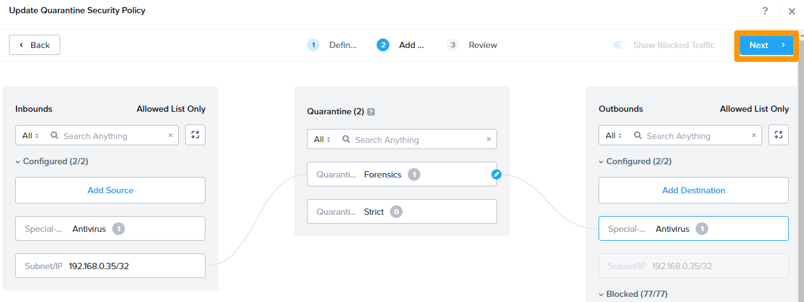{.thumbnail}

Cliquez sur `Save and Enforce`{.action} pour appliquer les changements sur la règle de quarantaine.

{.thumbnail}

Cliquez sur `Quarantine`{.action} pour voir le détail de la règle de quarantaine.

{.thumbnail}

Le statut de la règle est sur `Enforced`, le mode **Forensic** a été personnalisé.

Une machine virtuelle placée en mode **Strict** sera totalement isolée du réseau alors qu'en mode **Forensic** elle aura accès aux zones définies dans la règle de quarantaine.

{.thumbnail}

### Création d'une règle d'isolation

Une règle d'isolation permet le blocage des communications réseaux entre deux types de catégories (machines virtuelles ou sous-réseaux).

Pour plus d'informations sur la gestion des catégories, reportez-vous à la section « [Configuration des catégories](#gocategoriesemanage) » de ce guide. 

Depuis le menu principal, cliquez sur `Securities Policies`{.action} dans le sous-menu `Network & Security`.

{.thumbnail}

Cliquez sur `Create Security Policy`{.action}.

{.thumbnail}

Sélectionnez `Isolate Environments (Isolation Policy)`{.action} puis cliquez sur `Create`{.action}.

{.thumbnail}

Saisissez le nom de la règle dans `Name`{.action} puis ajoutez un commentaire dans `Purpose`{.action}, choisissez une catégorie dans `Isolate this category`{.action}, suivi d'une autre catégorie dans `From this category`{.action}.

Sélectionnez `Enforce` dans **Select a Policy mode**, puis cliquez sur `Save and Enforce`{.action}. 

{.thumbnail}

La règle est active dans la liste des règles de sécurité.

Cliquez sur `Le nom de la règle`{.action} en dessous de la colonne **Name** pour voir le détail.

{.thumbnail}

Le statut de la règle indique `Enforced` et on peut voir qu'aucune tentative de connexion entre les deux zones n'est détectée, comme le signale ce message: **No Traffic between them has been discovered**.

{.thumbnail}

Si une tentative de connexion réseau est détectée entre ces deux zones, le message change et devient **Traffic between them has been discovered**.x

{.thumbnail}

### Mise en place d'une règle d'application.

Une règle d'application limite l'accès vers certains ports, protocoles ou services des membres d'une catégorie depuis une autre catégorie.

Cette règle n'est utilisable qu'avec une catégorie nommée **Applications** que l'on peut modifier mais pas supprimer.

Pour plus d'informations sur la gestion des catégories, reportez-vous à la section « [Configuration des catégories](#gocategoriesemanage) » de ce guide.

Depuis le menu principal, cliquez sur `Security Policies`{.action} dans le sous-menu `Network & Security`.

{.thumbnail}

Cliquez sur `Create Security Policy`{.action}.

{.thumbnail}

Sélectionnez `Secure Application (App Policy)`{.action} et cliquez sur `Create`{.action}.

{.thumbnail}

Saisissez les champs **Name** pour le nom de de la règle, **Purpose** pour un commentaire, **Secure this App** en choisissant une catégorie existante d'applications et cliquez sur `Next`{.action}.

{.thumbnail}

Cliquez sur `Add Source`{.action} à gauche.

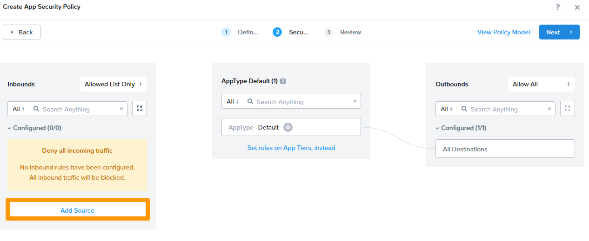{.thumbnail}

Choisissez la `catégorie` concernant le VLAN et cliquez sur `Add`{.action}.

{.thumbnail}

Cliquez sur `+`{.action} pour relier l'application à la source.

{.thumbnail}

Sélectionnez `Select a Service`{.action} , choisir la catégorie dans **Protocol/Service**, recherchez le nom du service dans **Port/Service Details** et cliquez sur `Save`{.action}.

{.thumbnail}

Cliquez sur `Next`{.action}.

{.thumbnail}

Sélectionnez `Enforce`{.action} et cliquez sur `Save and Enforce`{.action} pour activer cette règle.

{.thumbnail}

La règle créée se trouve dans la liste des règles.

{.thumbnail}

## Aller plus loin 

[Hyper-convergence Nutanix](/pages/hosted_private_cloud/nutanix_on_ovhcloud/03-nutanix-hci)

[Présentation de Nutanix FLOW](https://portal.nutanix.com/page/documents/solutions/details?targetId=TN-2094-Flow:TN-2094-Flow)

[Règles de sécurité de Nutanix FLOW](https://portal.nutanix.com/page/documents/details?)

[Catégories dans Nutanix](https://portal.nutanix.com/page/documents/details?targetId=Prism-Central-Guide-Prism-vpc_2022_1:ssp-ssp-categories-manage-pc-c.html)

Si vous avez besoin d'une formation ou d'une assistance technique pour la mise en oeuvre de nos solutions, contactez votre commercial ou cliquez sur [ce lien](https://www.ovhcloud.com/fr/professional-services/) pour obtenir un devis et demander une analyse personnalisée de votre projet à nos experts de l’équipe Professional Services.

Échangez avec notre communauté d'utilisateurs sur <https://community.ovh.com/>.
