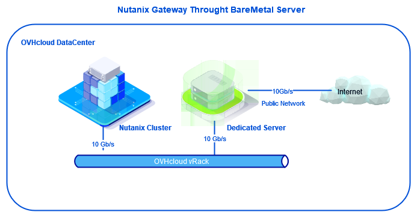
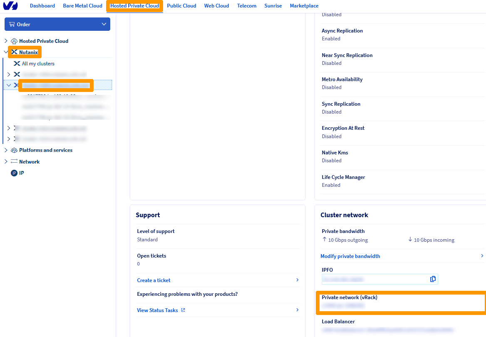
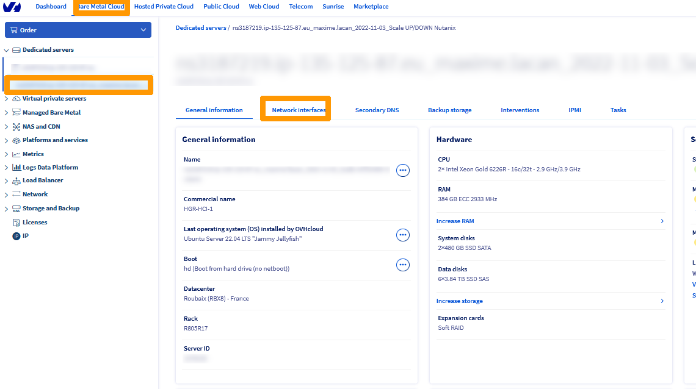
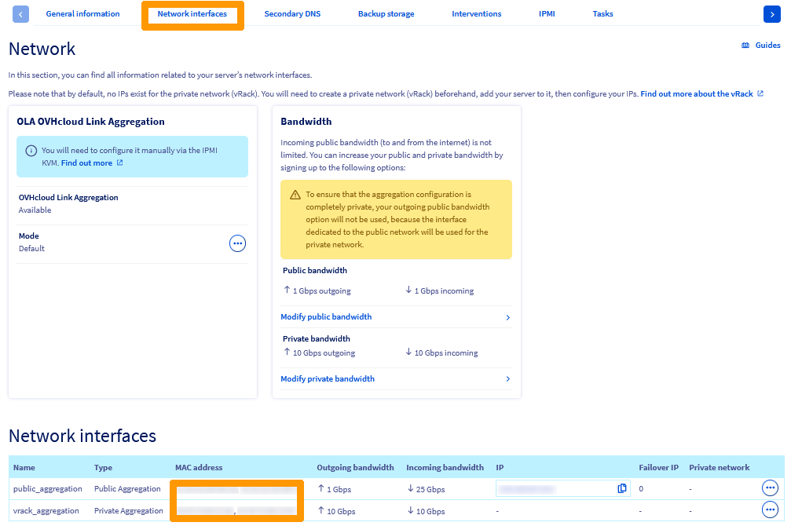
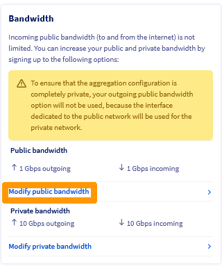
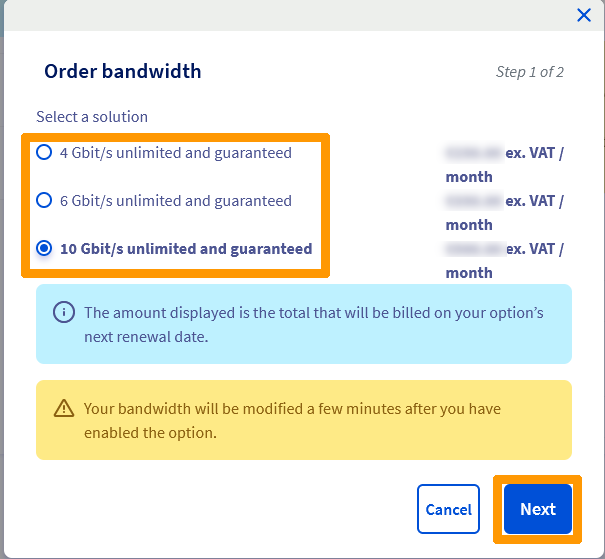
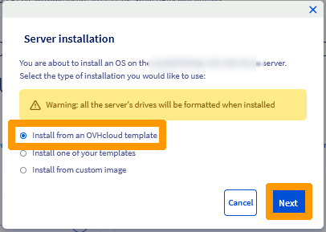
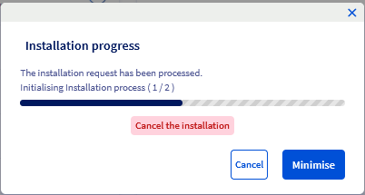
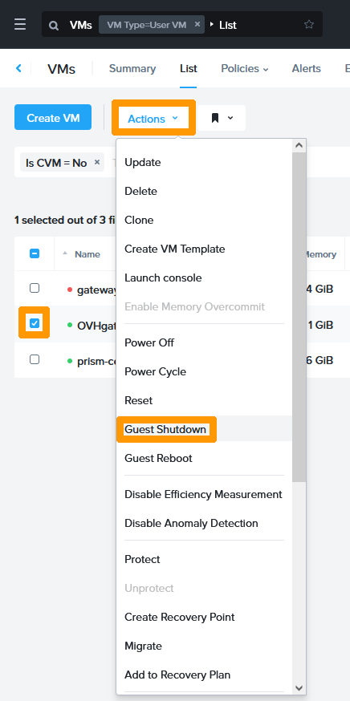

  
## Objective

An **OVHgateway** virtual machine is installed when deploying a **Nutanix on OVHcloud** cluster. This virtual machine serves as the outgoing Internet gateway for the cluster. The maximum throughput is 1 GB/s.

If you need more bandwidth, you can replace this gateway with a [dedicated server](https://www.ovhcloud.com/es/bare-metal/) and choose a solution that allows you to connect between 1 GB/s and 10 GB/s on the public network.<br>
Contact OVHcloud Sales to help you choose the right server. 

**This guide explains how to replace the default gateway with an OVHcloud dedicated server to increase bandwidth.**

> [!warning]
> OVHcloud provides services for which you are responsible, with regard to their configuration and management. It is therefore your responsibility to ensure that they work properly.
>
> This guide is designed to assist you as much as possible with common tasks. Nevertheless, we recommend contacting a specialist provider if you experience any difficulties or doubts when it comes to managing, using or setting up a service on a server.
>

## Requirements

- A Nutanix cluster in your OVHcloud account.
- Access to the [OVHcloud Control Panel](https://ca.ovh.com/auth/?action=gotomanager&from=https://www.ovh.com/world/&ovhSubsidiary=ws).
- You must be connected to the cluster via **Prism Central**. 
- You have a [dedicated server](https://www.ovhcloud.com/es/bare-metal/) in your OVHcloud account with several network cards, some on the public network, others on the private network. This server must be in the same data centre as the Nutanix cluster.

## Instructions

We will deploy a dedicated server on Linux that uses 4 network cards (2 on the public network, 2 on the private network) to replace the OVHgateway virtual machine.

To replace the OVHgateway VM, we will use these settings:

- DHCP public LAN that provides a public address on a single network adapter
- Private LAN on a team of two adapters and private addresses configured on a VLAN
- VLAN 1: OVHgateway private IP address and mask (in our example: 172.16.3.254/22)

{.thumbnail}

### Retrieving information needed to deploy your server

In your [OVHcloud Control Panel](https://ca.ovh.com/auth/?action=gotomanager&from=https://www.ovh.com/world/&ovhSubsidiary=ws), click `Hosted Private Cloud`{.action} in the tab bar. Select your Nutanix cluster on the left-hand side, and note the name of the vRack associated with your Nutanix cluster in `Private network (vRack)`.

{.thumbnail}

Go to the `Bare Metal Cloud`{.action} tab in your Control Panel. Select your dedicated server in the menu bar on the left-hand side and click on `Network interfaces`{.action}.

{.thumbnail}

Go to the bottom right in **Network interfaces** and note the MAC addresses associated with the public and private networks (two MAC addresses per network).

{.thumbnail}

In the **Bandwidth** box, click `Modify public bandwidth`{.action} to change the bandwidth of your public network.

> [!warning]
> Depending on the speed you want, the price of your server subscription will increase. This change must be validated by placing a new order in the OVHcloud Control Panel.
>

{.thumbnail}

Select the desired bandwidth and click `Next`{.action}.

{.thumbnail}

Click `Pay`{.action}.

{.thumbnail}

Click `View Purchase Order`{.action} to view the purchase order.

{.thumbnail}

Once the order has been confirmed, your bandwidth will be changed.

{.thumbnail}

### Connect to the vRack of the dedicated server

Stay on the configuration, click the `...`{.action} button at the bottom of the page. private network adapter configuration, then click `Attach a vRack Private Network`{.action}.

{.thumbnail}

In the **Select your private network** window, select the vRack that corresponds to your Nutanix server and click `Attach`{.action}.

{.thumbnail}

The vRack will then be displayed in the **Private network** column.

{.thumbnail}

### Operating system installation

We will now install a Linux Ubuntu 22 operating system from the OVH Control Panel.

Go to the menu of your dedicated server, click on the `General information`{.action} tab, then on the `...`{.action} to the right of the field 'Last operating system (OS) installed by OVHcloud'. Click `Install`{.action}

{.thumbnail}

Leave the selection on `Install from an OVHcloud template`{.action} and click `Next`{.action}.

{.thumbnail}

Click the OS selection drop-down menu.

{.thumbnail}

Select `Ubuntu Server 22.04 LTS`{.action} and click `Next`{.action}.

{.thumbnail}

Click `Confirm`{.action}.

{.thumbnail}

The operating system installation will begin. The progress window will disappear when the installation is complete.

{.thumbnail}

A notification email will then be sent to the email address listed in the OVHcloud account. This email contains the administrator user account (the account is called ubuntu) and a link to get the password.

### Shutting down the OVHgateway virtual machine on Prism Central

We will stop the **OVHgateway** virtual machine before configuring the dedicated server.

In **Prism Central**, go to virtual machine management. Select the virtual machine `OVHgateway`, go to the `Actions`{.action} menu and choose `Guest Shutdown`{.action}.

{.thumbnail}

The virtual machine is then turned off.

{.thumbnail}

### Network configuration as Linux gateway

When deploying a Linux server from the OVHcloud Control Panel, only one network adapter is configured with the public address assigned to your server. This address will be used to log in via SSH.

Log in to your dedicated server via SSH with this command:

```bash
ssh ubuntu@dedicated-server-public-ip-address
```

Enter this command to display cards that are not connected.

```bash
ip a | grep -C1 DOWN
```

Three network adapters are displayed with the status **DOWN**. Go back to the list of MAC addresses and retrieve the names of the two private adapters, as in the example below:

> [!warning]
> Do not rely on the order of the cards to find the names of the private network cards, but rather on the MAC addresses referenced in the OVHcloud Control Panel.
>

```bash
3: "publiccardname2": <BROADCAST,MULTICAST> mtu 1500 qdisc noop state DOWN group default qlen 1000
    link/ether "mac-address-public-card2" brd ff:ff:ff:ff:ff:ff
4: "privatecardname1": <BROADCAST,MULTICAST> mtu 1500 qdisc noop state DOWN group default qlen 1000
    link/ether "mac-address-private-card1" brd ff:ff:ff:ff:ff:ff
5: "privatecardname2": <BROADCAST,MULTICAST> mtu 1500 qdisc noop state DOWN group default qlen 1000
    link/ether "mac-address-private-card1" brd ff:ff:ff:ff:ff:ff
```

Launch this command:

```bash
ip a | grep -C1 UP
```

You will see two network adapters with status **UP**, the loopback adapter and a physical adapter whose MAC address must match one of the public addresses noted in the OVHcloud Control Panel. Get the name of this network adapter:

```bash
1: "lo": <LOOPBACK,UP,LOWER_UP> mtu 65536 qdisc noqueue state UNKNOWN group default qlen 1000
    link/loopback 00:00:00:00:00:00 brd 00:00:00:00:00:00
--
       valid_lft forever preferred_lft forever
2: "publiccardname1": <BROADCAST,MULTICAST,UP,LOWER_UP> mtu 1500 qdisc mq state UP group default qlen 1000
    link/ether "mac-address-public-card1" brd ff:ff:ff:ff:ff:ff
```

After you run these commands, you should have noted this information:

- `"publiccardname1"`: the name of the first public network adapter. 
- `"mac-address-public-card1"`: the MAC address of the first public network adapter.

- `"privatecardname1"`: the name of the first private network adapter.
- `"mac-address-private-card1"`: the MAC address of the first private network adapter.

- `"privatecardname2"`: the name of the second private network adapter.
- `"mac-address-private-card2"`: the MAC address of the second private network adapter.

Run this command to edit the file `/etc/nftables.conf`

```bash
sudo nano /etc/nftables.conf
```

Edit the contents of the file by replacing `publiccardname1` with what you have written down.

```conf
flush ruleset

define DEV_VLAN1 = bond0.1
define DEV_VLAN2 = bond0.2
define DEV_WORLD = "publiccardname1"
define NET_VLAN1 = 172.16.0.0/22

table ip global {
    chain inbound_world {
        # accepting ping (icmp-echo-request) for diagnostic purposes.
        # However, it also lets probes discover this host is alive.
        # This sample accepts them within a certain rate limit:
        #
        # icmp type echo-request limit rate 5/second accept

        # allow SSH connections from anywhere
        ip saddr 0.0.0.0/0 tcp dport 22 accept
    }

    chain inbound_private_vlan1 {
        # accepting ping (icmp-echo-request) for diagnostic purposes.
        icmp type echo-request limit rate 5/second accept

        # allow SSH from the VLAN1 network
        ip protocol . th dport vmap { tcp . 22 : accept}
    }

    
    chain inbound {
        type filter hook input priority 0; policy drop;

        # Allow traffic from established and related packets, drop invalid
        ct state vmap { established : accept, related : accept, invalid : drop }

        # allow loopback traffic, anything else jump to chain for further evaluation
        iifname vmap { lo : accept, $DEV_WORLD : jump inbound_world, $DEV_VLAN1 : jump inbound_private_vlan1 }

        # the rest is dropped by the above policy
    }

    chain forward {
        type filter hook forward priority 0; policy drop;

        # Allow traffic from established and related packets, drop invalid
        ct state vmap { established : accept, related : accept, invalid : drop }

        # connections from the internal net to the internet: vlan2 to vlan1 and vlan2 to vlan1 not allowed
        meta iifname . meta oifname { $DEV_VLAN1 . $DEV_WORLD, $DEV_WORLD . $DEV_VLAN1 } accept

        # the rest is dropped by the above policy
    }

    chain postrouting {
        type nat hook postrouting priority 100; policy accept;

        # masquerade private IP addresses
        ip saddr $NET_VLAN1 meta oifname $DEV_WORLD counter masquerade
    }
}
```

Run this command to edit the file `/etc/netplan/50-cloud-init.yaml`

```bash
sudo nano /etc/netplan/50-cloud-init.yaml
```

```yaml
# This file is generated from information provided by the datasource.  Changes
# to it will not persist across an instance reboot.  To disable cloud-init's
# network configuration capabilities, write a file
# /etc/cloud/cloud.cfg.d/99-disable-network-config.cfg with the following:
# network: {config: disabled}
network:
    version: 2
    ethernets:
        "publiccardname1":
            accept-ra: false
            addresses:
            - 2001:41d0:20b:4500::/56
            dhcp4: true
            gateway6: fe80::1
            match:
                macaddress: "mac-address-public-card1"
            nameservers:
                addresses:
                - 2001:41d0:3:163::1
            set-name: "publiccardname1"
        #vRack interface
        "privatecardname1":
            match:
                macaddress: "mac-address-private-card1"
            optional: true
        "privatecardname2":
            match:
                macaddress: "mac-address-private-card2"
            optional: true
    bonds:
        bond0:
            dhcp4: no
            addresses: [192.168.254.2/24]
            interfaces: ["privatecardname1", "privatecardname2"]
            parameters:
                mode: 802.3ad
                transmit-hash-policy: layer3+4
                mii-monitor-interval: 100
    vlans:
        bond0.1:
            dhcp4: no
            dhcp6: no
            id: 1
            addresses: [172.16.3.254/22]
            link: bond0
```

Edit the contents of the `/etc/netplan/50-cloud-init.yaml` file by replacing the names below:

- `"publiccardname1"` by the name of your public network adapter.
- `"mac-address-public-card1"` by the MAC address of your public network card.
- `"privatecardname1"` by the name of your first private network adapter.
- `"mac-address-private-card1"` by the MAC address of your first private network card.
- `"privatecardname2"` with the name of your second private network adapter.
- `"mac-address-private-card2"` by the MAC address of your second private network card.

Run these commands:

```bash
apt update && apt upgrade -y

# Disable cloud-init networking
touch /etc/cloud/cloud.cfg.d/99-disable-network-config.cfg
echo "network: {config: disabled}">> /etc/cloud/cloud.cfg.d/99-disable-network-config.cfg

# Enable forwarding
sed -i s/#net.ipv4.ip_forward/net.ipv4.ip_forward/g /etc/sysctl.conf
sysctl net.ipv4.ip_forward

# Ufw disabling
sudo systemctl disable ufw
sudo systemctl stop ufw

# Appling network configuration
sudo netplan apply

# Nftables enabling
sudo systemctl enable nftables
sudo systemctl start nftables

# system reboot
sudo reboot
```

The gateway is available for the Nutanix Cluster in VLAN 1.

### Test bandwidth

You can control your server's bandwidth with a tool called Iperf that you can find on [Iperf's official website](https://iperf.fr/){.external}.

To perform a full test, create a virtual machine on Linux, install iperf3 software and run this command:

```bash
perf3 -c proof.ovh.net -p 5202 --logfile resultlog.log
```

> [!warning]
> Port 5202 may sometimes be unavailable. In case of difficulties, try a port between 5201 and 5210. 
>

The test takes 10 seconds, and you will get your cluster’s bandwidth via your dedicated server.

```console
[  6] 1796.00-1797.00 sec  1.08 GBytes  9.28 Gbits/sec    0   3.02 MBytes
[  6] 1797.00-1798.00 sec  1.08 GBytes  9.28 Gbits/sec    0   3.02 MBytes
[  6] 1798.00-1799.00 sec  1.08 GBytes  9.28 Gbits/sec    0   3.02 MBytes
[  6] 1799.00-1800.00 sec  1.08 GBytes  9.28 Gbits/sec    0   3.02 MBytes
```

## Go further <a name="gofurther"></a>
  
If you need training or technical assistance to implement our solutions, contact your sales representative or click on [this link](https://www.ovhcloud.com/es/professional-services/) to get a quote and ask our Professional Services experts for assisting you on your specific use case of your project.

Join our community of users on <https://community.ovh.com/en/>.
