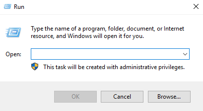

## Objective

**This tutorial describes how to activate Windows licences provided by OVHcloud on a Nutanix by OVHcloud solution.**

> [!warning]
> This tutorial will show you how to use one or more OVHcloud solutions with external tools, and will describe the actions to be carried out in a specific context. You may need to adapt the instructions according to your situation.
>
> If you encounter any difficulties performing these actions, please contact a [specialist service provider](https://partner.ovhcloud.com/es-es/directory/) and/or discuss the issue with our community. You can find more information in the [Go further](#gofurther) section of this tutorial.
>

## Requirements

- A Nutanix cluster in your OVHcloud account
- Access to the [OVHcloud Control Panel](https://www.ovh.com/auth/?action=gotomanager&from=https://www.ovh.es/&ovhSubsidiary=es)
- You must be connected to the cluster via Prism Central
- A Windows licence provided by OVHcloud
- A virtual machine running Windows Server. You can use this guide to install a virtual machine on Windows: [Virtual Machine Management](/pages/hosted_private_cloud/nutanix_on_ovhcloud/06-virtual-machine-management)
- The virtual machine connects to the Internet through the rtVrack (e.g. via the default gateway)

## Instructions

### Uninstall the default product key

When your operating system is in trial mode, a default product key is installed. To modify it, open the `Run`{.action} dialogue box by pressing the Windows key on your keyboard + `R`{.action}.

{.thumbnail}

{.thumbnail}

In this box, enter the following command:

```bash
cscript.exe c:\windows\system32\slmgr.vbs -upk
```

### Install the new product key

You can now install the new product key. To do so, go back to the `Run`{.action} box, and enter the following command:

```bash
cscript.exe c:\windows\system32\slmgr.vbs -ipk PRODUCT KEY
```

Below is a list of the product keys available for each operating system:

|Operating system|Product key|
|---|---|
|Windows Server 2008 Standard|TM24T-X9RMF-VWXK6-X8JC9-BFGM2|
|Windows Server 2008 Enterprise|YQGMW-MPWTJ-34KDK-48M3W-X4Q6V|
|Windows Server 2008 Datacenter|7M67G-PC374-GR742-YH8V4-TCBY3|
|Windows Server 2008 R2 Standard|YC6KT-GKW9T-YTKYR-T4X34-R7VHC|
|Windows Server 2008 R2 Enterprise|489J6-VHDMP-X63PK-3K798-CPX3Y|
|Windows Server 2008 R2 Datacenter|74YFP-3QFB3-KQT8W-PMXWJ-7M648|
|Windows Server 2012 Standard|XC9B7-NBPP2-83J2H-RHMBY-92BT4|
|Windows Server 2012 Datacenter|48HP8-DN98B-MYWDG-T2DCC-8W83P|
|Windows Server 2012 R2 Standard|D2N9P-3P6X9-2R39C-7RTCD-MDVJX|
|Windows Server 2012 R2 Datacenter|W3GGN-FT8W3-Y4M27-J84CP-Q3VJ9|
|Windows 8.1 Professional|GCRJD-8NW9H-F2CDX-CCM8D-9D6T9|
|Windows Server 2016 Datacenter|CB7KF-BWN84-R7R2Y-793K2-8XDDG|
|Windows Server 2016 Standard|WC2BQ-8NRM3-FDDYY-2BFGV-KHKQY|
|Windows Server 2016 Essentials|JCKRF-N37P4-C2D82-9YXRT-4M63B|
|Windows Server 2019 Standard|N69G4-B89J2-4G8F4-WWYCC-J464C|
|Windows Server 2019 Datacenter|WMDGN-G9PQG-XVVXX-R3X43-63DFG|
|Windows Server 2022 Standard|VDYBN-27WPP-V4HQT-9VMD4-VMK7H|
|Windows Server 2022 Datacenter|WX4NM-KYWYW-QJJR4-XV3QB-6VM33|

Source: [Microsoft - Key Management Services (KMS) client activation and product keys](https://docs.microsoft.com/en-gb/windows-server/get-started/kmsclientkeys){.external}

> [!primary]
>
> Core versions use the same product keys as non-core versions.
>

### Associate your product key

To associate your key with our automated activation system, enter the command below in the `Run`{.action} dialogue box:

```bash
cscript.exe c:\windows\system32\slmgr.vbs -skms kms.ovh.net
```

### Activate the system

Lastly, to activate your Windows operating system, simply enter the command below:

```bash
cscript.exe c:\windows\system32\slmgr.vbs -ato
```

## Go further

If you need training or technical assistance to implement our solutions, contact your sales representative or click on [this link](https://www.ovhcloud.com/es-es/professional-services/) to get a quote and ask our Professional Services experts for assisting you on your specific use case of your project.

Join our community of users on <https://community.ovh.com/en/>.
