**Dernière mise à jour le 16/01/2023**

## Objectif

**Découvrez comment mettre en place NCM Self-Service (Calm) sur votre Prism Central**

> [!warning]
> OVHcloud vous met à disposition des services dont la configuration, la gestion et la responsabilité vous incombent. Il vous appartient donc de ce fait d’en assurer le bon fonctionnement.
>
> Ce guide a pour but de vous accompagner au mieux sur des tâches courantes. Néanmoins, nous vous recommandons de faire appel à l'équipe [Professional Services OVHcloud](https://www.ovhcloud.com/fr/professional-services/) ou à un [prestataire spécialisé](https://partner.ovhcloud.com/fr/directory/) si vous éprouvez des difficultés ou des doutes concernant l’administration, l’utilisation ou la mise en place d’un service sur un serveur.

## Prérequis

- Disposer d'un cluster Nutanix dans votre compte OVHcloud.
- Être connecté à votre [espace client OVHcloud](https://www.ovh.com/auth/?action=gotomanager&from=https://www.ovh.com/fr/&ovhSubsidiary=fr).
- Être connecté sur le cluster via Prism Central.
- Avoir des licences en BYOL pour Self Service (CALM). Ces licences ne sont pas disponibles avec les Pack Standard et Advanced proposés par OVHcloud.
- Posséder un VLAN supplémentaire dans votre cluster qui distribue des adresses IP en IPAM et possède un accès à Internet. 

## Présentation

NCM Self Service (CALM) est une solution d'orchestration hétérogène qui permet l'automatisation et la gestion de déploiements, il fonctionne sur Prism Central et autorise l'administration de divers environnements (cluster Nutanix, serveur bare metal, etc...).

## En pratique

Nous allons activer CALM, créer deux applications pour notre cluster Nutanix et les publier sur les portails d'applications qui sont :

- Un serveur WEB Nginx sous Linux Ubuntu.
- Un serveur WEB IIS sous Windows server.

### Activation de CALM

Avant de déployer CALM, vérifiez l'adresse IP pour le **ISCSI Data Services IP**.

Depuis le tableau de bord Prism Central, cliquez sur votre `Cluster`{.action} dans la rubrique **Cluster Quick Access**.

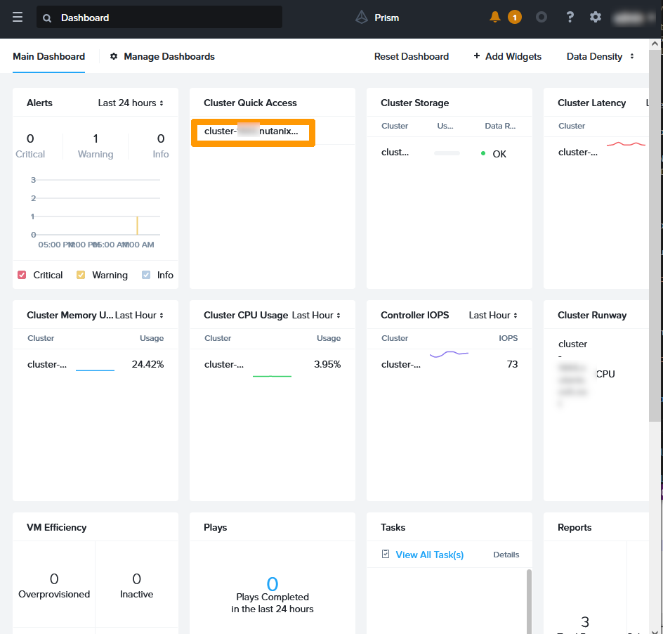{.thumbnail}

Dans Prism Element, cliquez en haut à gauche sur les `paramètres de votre cluster`{.action}.

{.thumbnail}

Vérifiez l'adresse IP dans **ISCSI Data Services IP**.

{.thumbnail}

Revenez sur Prism Central, allez dans le menu principal à gauche et cliquez sur `Calm`{.action} dans la rubrique **Services**

{.thumbnail}

Cliquez sur `Enable App. Orchestration(Calm)`{.action}.

{.thumbnail}

Cochez la case `Enable App Management`{.action} et cliquez sur `Save`{.action}.

{.thumbnail}

L'activation de CALM est en cours.

{.thumbnail}

> [!primary]
> Un message d'erreur apparait pendant le déploiement de CALM. N'en tenez pas compte, quittez la fenêtre et patientez jusqu'a que l'installation soit terminée.


### Création d'un projet

Il est nécessaire de créer un projet pour déployer des applications.

Via le menu de Prism Central, cliquez sur `Calm`{.action} dans la rubrique Services.

{.thumbnail}

Cliquez sur l'icône `Projects`{.action} dans la barre de menu verticale.

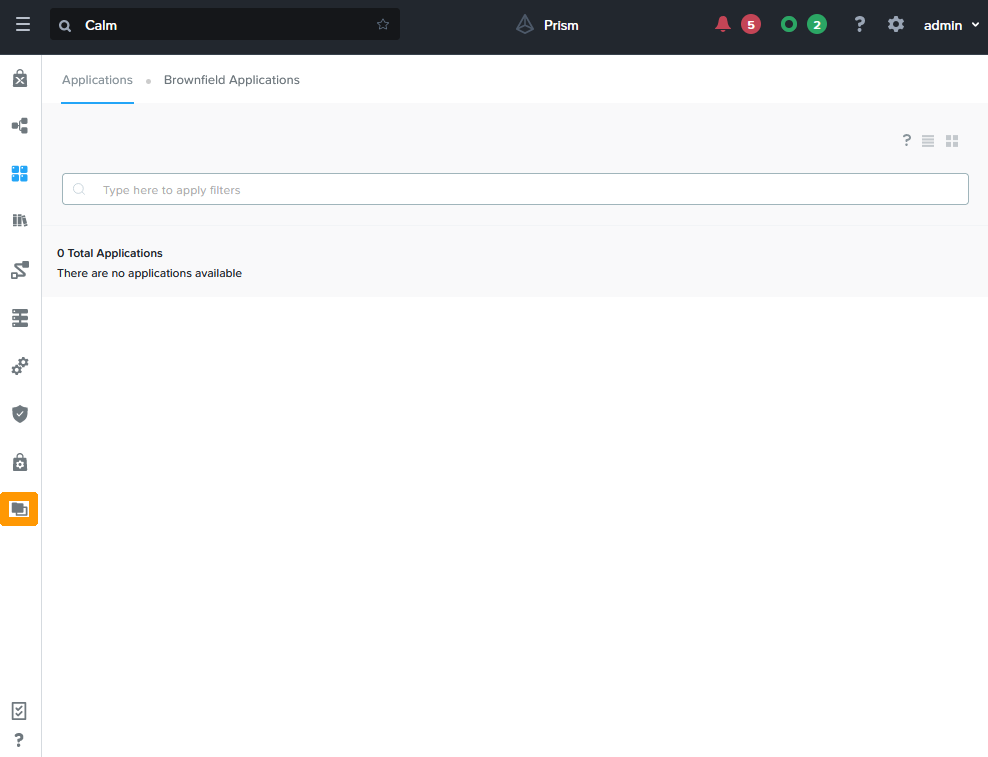{.thumbnail}

Cliquez sur le bouton `+ Create Project`{.action}.

{.thumbnail}

Saisissez le `nom du projet`{.action} dans **Project Name** et cliquez sur `Create`{.action}

{.thumbnail}

Cliquez sur `+ Add infrastructure`{.action}.

{.thumbnail}

Cliquez sur `Add infrastructure`{.action}.

{.thumbnail}

Sélectionnez `NTNX_LOCAL_AZ`{.action} dans accounts.

{.thumbnail}

Cliquez sur `Configure Resources`{.action}.

{.thumbnail}

Sélectionnez votre `Cluster`{.action} dans **Select clusters to be added to this project** et cliquez sur `+ Select VLANs`{.action}.

{.thumbnail}

Cochez le VLAN `production`{.action} et cliquez sur `Confirm and Select Default`{.action}.

{.thumbnail}

Cliquez sur `Confirm`{.action}.

{.thumbnail}

Cliquez sur `Save`{.action}.

{.thumbnail}

Dans la barre d'onglets, rendez-vous sur `Environments`{.action} et cliquez sur `Create Environment`{.action}.

{.thumbnail}

Saisissez un `Nom`{.action} dans **Name** et cliquez sur `Next`{.action}.

{.thumbnail}

Cliquez sur `Select Infrastucture`{.action}.

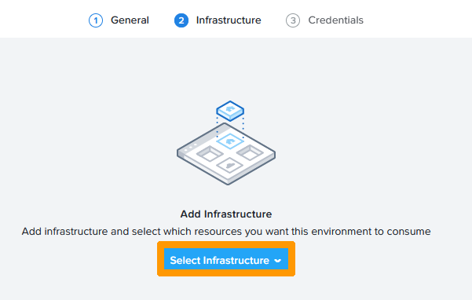{.thumbnail}

Cliquez sur `NTNX_LOCAL_AZ`{.action}.

{.thumbnail}

Cliquez sur `Required for lauching blueprints from marketplace`{.action} à droite de **VM Configuration**

{.thumbnail}

Renseignez ces informations :

- **Cluster** : `sélection de votre cluster`
- **vCPUs** : `4`
- **Core per vCPU** : `1`
- **Memory (GiB)** : `4`
- **Image** : `WS2022EN-SYSPREPED`

> [!primary]
> L'image est générée à partir d'une VM WINDOWS Server 2022 sur laquelle on a appliqué un sysprep pour remettre la configuration par défaut. Lors d'une utilisation avec CALM, il est possible d'automatiser l'installation d'un OS Windows à partir de ce type d'image et de lui appliquer des paramètres stockés dans un fichier XML.

Faites ensuite défiler la fenêtre vers le bas.

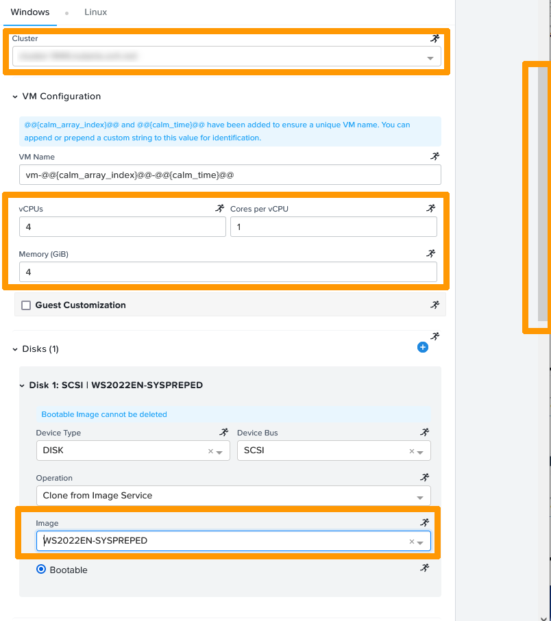{.thumbnail}

Cliquez sur le bouton `+`{.action} à droite de **NETWORK ADAPTERS (NICs)**.

{.thumbnail}

Choisissez la carte réseau dans le VLAN `production`{.action}, cochez la case `Check log-in upon create`{.action} et faites défiler la fenêtre vers le haut.

{.thumbnail}

Allez sur l'onglet `Linux`{.action}, saisissez ces informations :

- **Cluster** : `sélection de votre cluster`
- **vCPUs** : `4`
- **Core per vCPU** : `1`
- **Memory (GiB)** : `4`
- **Image** : `jammy-server-cloudimg-amd64.img`

> [!primary]
> L'image est préconfigurée pour l'utilisation de cloud-init d'UBUNTU, elle est téléchargeable sur Internet à cette adresse [Ubuntu Cloud Images](https://cloud-images.ubuntu.com/). CALM permet l'automatisation et la personnalisation d'une installation Linux au travers de ce type d'images et de fichiers de configuration YAML.
>

Faites ensuite défiler la fenêtre vers le bas.

{.thumbnail}

Cliquez sur le bouton `+`{.action} à droite de **NETWORK ADAPTERS (NICs)**.

{.thumbnail}

Choisissez la carte réseau dans le VLAN `production`{.action}, cochez la case `Check log-in upon create`{.action} et cliquez sur `Next`{.action}.

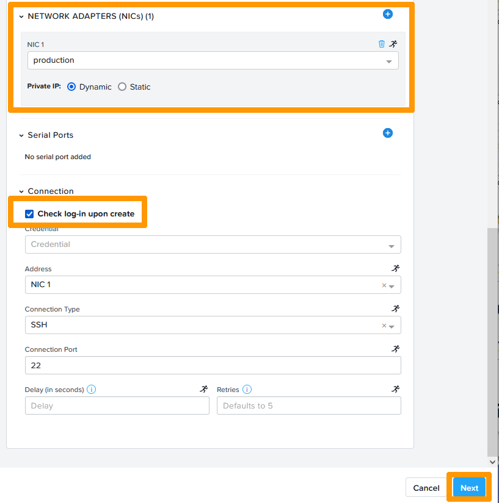{.thumbnail}

Cliquez sur `+ Add Credential`{.action}.

{.thumbnail}

Cliquez sur `+ Add Credential`{.action}.

{.thumbnail}

Saisissez ces informations :

- **Name** : `WindowsAccount`
- **Username** : `administrator`
- **Password** : `mot de passe du compte administrator`

Cliquez ensuite sur `+ Add Credential`{.action}.

{.thumbnail}

Saisissez ces informations :

- **Name** : `LinuxAccount`
- **Username** : `administrator`
- **Password** : `mot de passe du compte administrator`

Cliquez ensuite sur `Save Environment`{.action}.

{.thumbnail}

Cliquez sur `Marketplace Usage`{.action}.

{.thumbnail}

Cliquez sur `Update`{.action}.

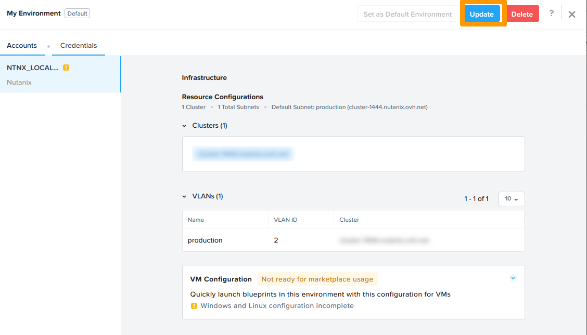{.thumbnail}

Cliquez sur `Next`{.action}.

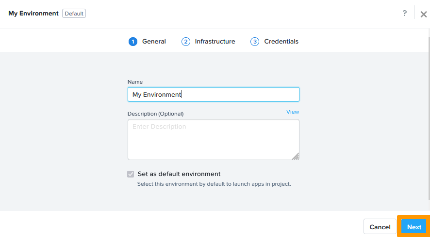{.thumbnail}

Cliquez sur `Not ready for marketplace usage`{.action} à droite de VM Configuration.

{.thumbnail}

Faites défiler la fenêtre vers le bas.

{.thumbnail}

Choisissez `WindowsAccount`{.action} dans **Credential** et faites défiler la fenêtre vers le haut.

{.thumbnail}

Cliquez sur l'onglet `Linux`{.action} dans **Credential** et faites défiler la fenêtre vers le bas.

{.thumbnail}

Choisissez `LinuxAccount`{.action} dans **Credential** et cliquez sur `Next`{.action}.

{.thumbnail}

Cliquez sur `Save Environment`{.action}.

{.thumbnail}

Votre environnement est prêt pour la création et la diffusion d'applications.

{.thumbnail}

### Création d'applications

Nous allons créer deux applications, tester leur bon fonctionnement et les publier dans le marketplace du cluster.

#### Création de l'application WEB IIS sous Windows

Dans la barre verticale, choisissez `Blueprints`{.action}, faites défiler le menu `Create Blueprint`{.action} et cliquez sur `Multi VM/Pod Blueprint`{.action}.

{.thumbnail}

Choisissez le `nom`{.action} de votre plan dans **Name** et cliquez sur `Proceed`{.action}.

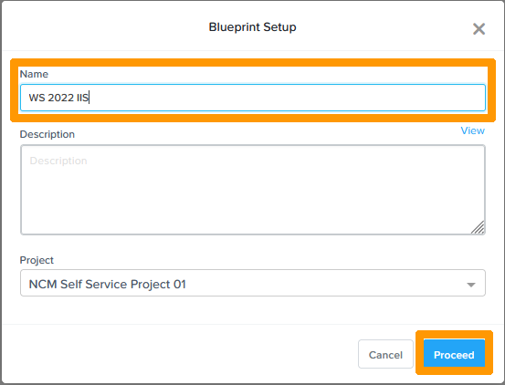{.thumbnail}

Saisissez le `nom`{.action} dans **Application Profile Name** et cliquez sur `Credentials`{.action} en haut.

{.thumbnail}

Nous allons créer le compte Windows. Il sera utilisé à l'intérieur de sysprep en tant que variable, dans la configuration des tâches d'installation du plan et pour le test de connexion distant.

Cliquez sur bouton `+`{.action} à côté de Credentials.

{.thumbnail}

Saisissez ces informations :

- **Name** : `WindowsAccount`
- **Username** : `administrator`
- **Password** : `Mot de passe du compte administrator`

Cliquez ensuite sur `Done`{.action}.

{.thumbnail}

Cliquez sur `Back`{.action}.

{.thumbnail}

Cliquez sur le bouton `+`{.action} dans la fenêtre de gauche à côté de **Service**.

{.thumbnail}

Saisissez ces informations :

- **Name** : `VM IIS`
- **Operation System** : `Windows`

Cliquez ensuite sur `Clone from environment`{.action}.

{.thumbnail}

Faites défiler la fenêtre de droite vers le bas, cochez `Guest Customization`{.action}, cliquez sur `Sysprep`{.action} puis copiez le contenu du fichier sysprep ci-dessous dans **Script** :

> [!primary]
> Ce fichier est généré à partir des outils Windows ADK téléchargeables via ce [lien](https://learn.microsoft.com/en-us/windows-hardware/get-started/adk-install#download-the-adk-for-windows-11) et a été ensuite adapté en rajoutant des variables venant de Nutanix CALM, comme `@@{WindowsAccount.secret}@@` qui représente le mot de passe du compte WindowsAccount.
> 

```xml
<?xml version="1.0" encoding="utf-8"?>
<unattend xmlns="urn:schemas-microsoft-com:unattend">
    <settings pass="windowsPE">
        <component name="Microsoft-Windows-International-Core-WinPE" processorArchitecture="amd64" publicKeyToken="31bf3856ad364e35" language="neutral" versionScope="nonSxS" xmlns:wcm="http://schemas.microsoft.com/WMIConfig/2002/State" xmlns:xsi="http://www.w3.org/2001/XMLSchema-instance">
            <SetupUILanguage>
                <UILanguage>en-US</UILanguage>
                <WillShowUI>Never</WillShowUI>
            </SetupUILanguage>
            <InputLocale>0409:00000409</InputLocale>
            <SystemLocale>en-US</SystemLocale>
            <UILanguage>en-US</UILanguage>
            <UserLocale>en-US</UserLocale>
        </component>
        <component name="Microsoft-Windows-Setup" processorArchitecture="amd64" publicKeyToken="31bf3856ad364e35" language="neutral" versionScope="nonSxS" xmlns:wcm="http://schemas.microsoft.com/WMIConfig/2002/State" xmlns:xsi="http://www.w3.org/2001/XMLSchema-instance">
            <UserData>
                <AcceptEula>true</AcceptEula>
                <FullName>Nutanix Doc</FullName>
                <Organization>Nutanix Doc</Organization>
            </UserData>
            <EnableFirewall>true</EnableFirewall>
            <EnableNetwork>true</EnableNetwork>
        </component>
    </settings>
    <settings pass="specialize">
        <component name="Microsoft-Windows-Shell-Setup" processorArchitecture="amd64" publicKeyToken="31bf3856ad364e35" language="neutral" versionScope="nonSxS" xmlns:wcm="http://schemas.microsoft.com/WMIConfig/2002/State" xmlns:xsi="http://www.w3.org/2001/XMLSchema-instance">
            <TimeZone>Central Standard Time</TimeZone>
            <AutoLogon>
                <Password>
                    <Value>@@{WindowsAccount.secret}@@</Value>
                    <PlainText>true</PlainText>
                </Password>
                <Enabled>true</Enabled>
                <Username>administrator</Username>
                <LogonCount>1</LogonCount>
            </AutoLogon>
        </component>
    </settings>
    <settings pass="oobeSystem">
        <component name="Microsoft-Windows-Shell-Setup" processorArchitecture="amd64" publicKeyToken="31bf3856ad364e35" language="neutral" versionScope="nonSxS" xmlns:wcm="http://schemas.microsoft.com/WMIConfig/2002/State" xmlns:xsi="http://www.w3.org/2001/XMLSchema-instance">
            <UserAccounts>
                <AdministratorPassword>
                    <Value>@@{WindowsAccount.secret}@@</Value>
                    <PlainText>true</PlainText>
                </AdministratorPassword>
            </UserAccounts>
            <OOBE>
                <HideEULAPage>true</HideEULAPage>
                <HideOEMRegistrationScreen>true</HideOEMRegistrationScreen>
                <HideOnlineAccountScreens>true</HideOnlineAccountScreens>
                <HideWirelessSetupInOOBE>true</HideWirelessSetupInOOBE>
                <ProtectYourPC>1</ProtectYourPC>
                <HideLocalAccountScreen>true</HideLocalAccountScreen>
            </OOBE>
            <FirstLogonCommands>
                <SynchronousCommand wcm:action="add">
                    <CommandLine>powershell Set-NetConnectionProfile -NetworkCategory Private</CommandLine>
                    <Order>1</Order>
                </SynchronousCommand>
                <SynchronousCommand wcm:action="add">
                    <CommandLine>powershell Set-WSManQuickConfig -Force</CommandLine>
                    <Order>2</Order>
                </SynchronousCommand>
            </FirstLogonCommands>
        </component>
        <component name="Microsoft-Windows-International-Core" processorArchitecture="wow64" publicKeyToken="31bf3856ad364e35" language="neutral" versionScope="nonSxS" xmlns:wcm="http://schemas.microsoft.com/WMIConfig/2002/State" xmlns:xsi="http://www.w3.org/2001/XMLSchema-instance">
            <UILanguage>en-US</UILanguage>
            <UserLocale>en-US</UserLocale>
            <SystemLocale>en-US</SystemLocale>
            <InputLocale>0409:00000409</InputLocale>
        </component>
    </settings>
    <cpi:offlineImage cpi:source="wim:c:/w2022/sources/install.wim#Windows Server 2022 SERVERSTANDARD" xmlns:cpi="urn:schemas-microsoft-com:cpi" />
</unattend>
```

{.thumbnail}

Continuez de faire défiler la fenêtre et vérifiez que **Check log-in upon create** est coché puis choisissez `WindowsAccount`{.action} dans **Credential**.

{.thumbnail}

Nous allons maintenant créer des tâches en Powershell qui s'exécuteront après l'installation et la personnalisation de Windows. Chacune de ces tâches s'exécute l'une après l'autre.

Dans la fenêtre de gauche, positionnez-vous sur `Install`{.action} en dessous de la catégorie **Package** et cliquez sur `+ Task`{.action}.

{.thumbnail}

Renseignez ces informations :

- **Task Name** : `IIS Installation`
- **Type** : `Execute`
- **Script Type** : `Powershell`
- **Credential** : `WindowsAccount`

Copiez ce contenu dans **Script** :

```powershell
Install-WindowsFeature -name Web-Server -IncludeManagementTools

if ($?) {
exit 0
}

```

Cliquez ensuite sur `+ Task`{.action}.

{.thumbnail}

Complétez ces informations :

- **Task Name** : `Customize IIS`
- **Type** : `Execute`
- **Script Type** : `Powershell`
- **Credential** : `WindowsAccount`

Copiez ce contenu dans **Script** :

```powershell
echo "<!DOCTYPE html>" | out-file "C:\inetpub\wwwroot\default.htm"
Add-Content -Path C:\inetpub\wwwroot\default.htm -Value "<html>"
Add-Content -Path C:\inetpub\wwwroot\default.htm -Value "<head>"
Add-Content -Path C:\inetpub\wwwroot\default.htm -Value "<title>IIS on Windows AHV VM</title>"
Add-Content -Path C:\inetpub\wwwroot\default.htm -Value "</head>"
Add-Content -Path C:\inetpub\wwwroot\default.htm -Value "<body>"
Add-Content -Path C:\inetpub\wwwroot\default.htm -Value ""
Add-Content -Path C:\inetpub\wwwroot\default.htm -Value "<h1>IIS on Windows AHV VM</h1>"
Add-Content -Path C:\inetpub\wwwroot\default.htm -Value "<p>Deployed with CALM</p>"
Add-Content -Path C:\inetpub\wwwroot\default.htm -Value ""
Add-Content -Path C:\inetpub\wwwroot\default.htm -Value "</body>"
Add-Content -Path C:\inetpub\wwwroot\default.htm -Value "</html>"
```

Cliquez ensuite sur `+ Task`{.action}.

{.thumbnail}

Saisissez ces informations :

- **Task Name** : `reboot VM`
- **Type** : `Execute`
- **Script Type** : `Powershell`
- **Credential** : `WindowsAccount`

Copiez ce contenu dans **Script** :

```powershell
restart-computer -force
```

Cliquez ensuite sur `Save`{.action} en haut de la fenêtre.

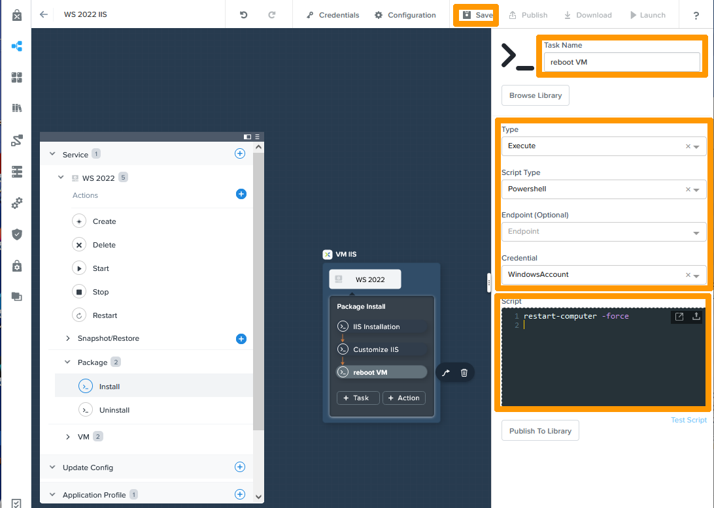{.thumbnail}

L'application est créée, cliquez sur `Launch`{.action} pour tester votre application.

{.thumbnail}

Saisissez un `Nom`{.action} dans **Application Name** et cliquez sur `Deploy`{.action}.

{.thumbnail}

Une nouvelle fenêtre apparait, cliquez sur `Audit`{.action} pour voir les étapes du déploiement de votre application. Lorsque le déploiement est terminé, vous pouvez voir en haut de la fenêtre l'indication **RUNNING** qui vous indique que l'application est déployée et active.

{.thumbnail}

Dans notre cas, le serveur IIS est actif et affiche un message sur l'adresse IP de la machine virtuelle en HTTP.

{.thumbnail}

#### Création de l'application WEB Nginx sous Linux Ubuntu

Nous allons créer une autre application sous Linux Ubuntu avec Nginx installé en tant que serveur WEB.

Rendez-vous sur l'icône `Blueprints`{.action} dans la barre de menu verticale de CALM, cliquez sur `Multi VM/Pod Blueprint`{.action} depuis le menu **Create Blueprint**.

{.thumbnail}

Saisissez le `Nom`{.action} dans **Name** et cliquez sur `Proceed`{.action}.

{.thumbnail}

Cliquez sur `Credentials`{.action}.

{.thumbnail}

Cliquez sur `Credentials +`{.action}.

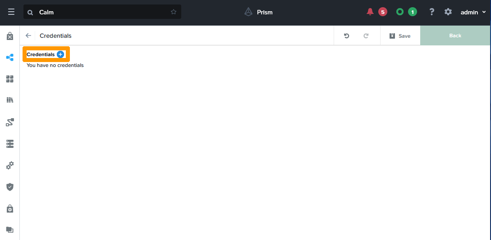{.thumbnail}

Saisissez ces informations concernant le compte d'administration Linux :

- **Name** : `LinuxAccount`
- **Username** : `administrator`
- **Password** : `Mot de passe du compte administrator`

Cliquez ensuite sur `Done`{.action}.

{.thumbnail}

Cliquez sur `Credentials +`{.action}.

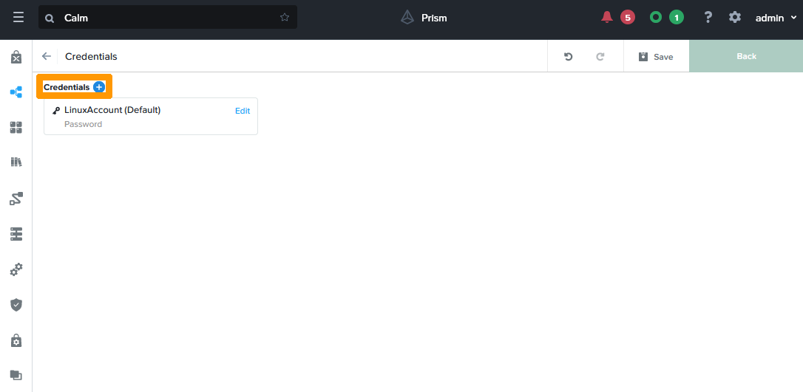{.thumbnail}

Saisissez ces informations concernant le compte d'administration de Prism Central :

- **Name** : `PC_ADMIN`
- **Username** : `admin`
- **Password** : `Mot de passe de Prism Central`

> [!primary]
> Ce mot de passe sert si vous utilisez des EScript (Scripts en python) dans vos tâches de déploiements, il sera utilisé lors de l'utilisation de l'API Prism Central. Dans cet exemple vous trouverez un EScript qui redimensionnera le stockage de la machine virtuelle Ubuntu NGINX.
>

Cliquez ensuite sur `Done`{.action}.

{.thumbnail}

Cliquez sur `Back`{.action}.

{.thumbnail}

Saisissez `Linux Application`{.action} dans **Application Profile Name** et cliquez sur `+`{.action} dans la fenêtre de gauche à droite de **Service**.

{.thumbnail}

Saisissez ces informations :

- **Service Name** : `Ubuntu`
- **VM Name** : `Ubuntu NGINX`

Cliquez ensuite sur `Clone from environment`{.action} et faites défiler la fenêtre de droite vers le bas.

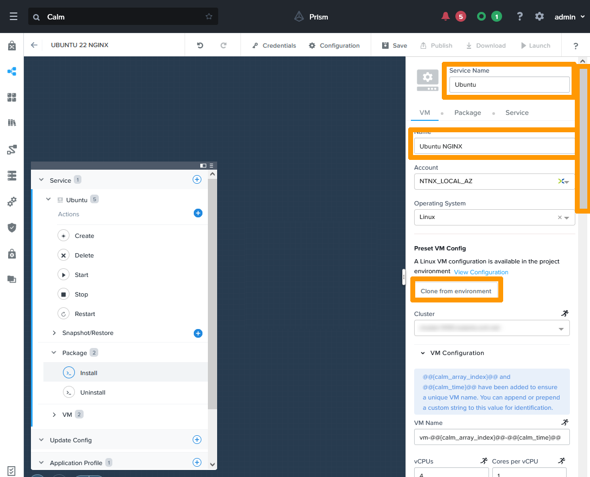{.thumbnail}

Cochez `Guest Customization`{.action}, copiez le contenu ci-dessous dans **script**.

```config
#cloud-config
users:
- name: @@{LinuxAccount.username}@@
  groups: sudo
  sudo: ALL=(ALL) NOPASSWD:ALL
  shell: /bin/bash
  lock-passwd: false
chpasswd:
 list: |
   @@{LinuxAccount.username}@@:@@{LinuxAccount.secret}@@
 expire: False
ssh_pwauth: true
```

> [!primary]
> Il s'agit du fichier d'initialisation de Linux avec des images cloud-init. Il utilise les informations du compte LinuxAccount qui vient de CALM au travers de macro-instructions qui ont cette forme @@{LinuxAccount.username}@@ pour le compte utilisateur et @@{LinuxAccount.secret}@@ pour le mot de passe.
>

Faites défiler la fenêtre de droite vers le bas.

{.thumbnail}

Choisissez `LinuxAccount`{.action} dans **Check log-in upon create**.

{.thumbnail}

Dans la fenêtre de gauche, rendez-vous sur `Install`{.action} en dessous de **Package** et cliquez sur `+ Task`{.action}.

{.thumbnail}

Saisissez les informations de la tâche de redimensionnement du disque de votre machine virtuelle.

- **Task Name** : `Disk resize`
- **Type** : `Execute`
- **Script Type** : `EScript`

Copiez ensuite le contenu de ce script :

> [!primary]
> Ce script utilise les mots de passe qui viennent de CALM au travers de variables qui ont cette forme @@{PC_ADMIN.username}@@ pour le compte utilisateur et @@{PC_ADMIN.secret}@@ pour le mot de passe.
>

```python
vmUuid = '@@{id}@@'
diskSize = 50 # GB
pcAddress = '127.0.0.1'
pcUsername = '@@{PC_ADMIN.username}@@'
pcPassword = '@@{PC_ADMIN.secret}@@'

# ============== DO NO CHANGE AFTER THIS ===============

usrPass = '{}:{}'.format(pcUsername,pcPassword)
b64Pass = base64.b64encode(usrPass)

# Get VM
api_url = 'https://{}:9440/api/nutanix/v3/vms/{}'.format(pcAddress,vmUuid)
headers = {'Content-Type': 'application/json', 'Accept': 'application/json', 'Authorization': 'Basic {}'.format(b64Pass)}

r = urlreq(api_url, verb='GET', headers=headers, verify=False)
if r.ok:
    resp = json.loads(r.content)

else:
    print("Post request failed", r.content)
    exit(1)

# Power off VM and extend disk
del resp['status']

disk_size_mib = diskSize * 1024
disk_size_bytes = disk_size_mib * 1024**2

resp['spec']['resources']['disk_list'][0]['disk_size_mib'] = disk_size_mib
resp['spec']['resources']['disk_list'][0]['disk_size_bytes'] = disk_size_bytes
resp['spec']['resources']['power_state'] = 'OFF'

payload = resp

r = urlreq(api_url, verb='PUT', params=json.dumps(payload), headers=headers, verify=False)
if r.ok:
    resp = json.loads(r.content)
    taskUuid = resp['status']['execution_context']['task_uuid']

else:
    print("Post request failed", r.content)
    exit(1)


# Monitor task
state = ""
while state != "SUCCEEDED":
    api_url = 'https://{}:9440/api/nutanix/v3/tasks/{}'.format(pcAddress,taskUuid)

    sleep(2)
    r = urlreq(api_url, verb='GET', headers=headers, verify=False)
    if r.ok:
        resp = json.loads(r.content)
        state = resp['status']
        if state == "FAILED":
            print("Task failed", resp['progress_message'])
            exit(1)

    else:
        print("Post request failed", r.content)
        exit(1)

# Wait for VM to power off
api_url = 'https://{}:9440/api/nutanix/v3/vms/{}'.format(pcAddress,vmUuid)
r = urlreq(api_url, verb='GET', headers=headers, verify=False)
if r.ok:
    resp = json.loads(r.content)
    power_state = resp['status']['resources']['power_state']

else:
    print("Post request failed", r.content)
    exit(1)

state = ""
while state != "OFF":
    api_url = 'https://{}:9440/api/nutanix/v3/vms/{}'.format(pcAddress,vmUuid)

    sleep(2)
    r = urlreq(api_url, verb='GET', headers=headers, verify=False)
    if r.ok:
        resp = json.loads(r.content)
        state = resp['status']['resources']['power_state']
        if state == "FAILED":
            print("Task failed", resp['progress_message'])
            exit(1)

    else:
        print("Post request failed", r.content)
        exit(1)

# Power on VM
del resp['status']

resp['spec']['resources']['power_state'] = 'ON'

api_url = 'https://{}:9440/api/nutanix/v3/vms/{}'.format(pcAddress,vmUuid)
payload = resp

r = urlreq(api_url, verb='PUT', params=json.dumps(payload), headers=headers, verify=False)
if r.ok:
    resp = json.loads(r.content)
    taskUuid = resp['status']['execution_context']['task_uuid']

else:
    print("Post request failed", r.content)
    exit(1)

# Monitor task
state = ""
while state != "SUCCEEDED":
    api_url = 'https://{}:9440/api/nutanix/v3/tasks/{}'.format(pcAddress,taskUuid)

    sleep(2)
    r = urlreq(api_url, verb='GET', headers=headers, verify=False)
    if r.ok:
        resp = json.loads(r.content)
        state = resp['status']
        if state == "FAILED":
            print("Task failed", resp['progress_message'])
            exit(1)

    else:
        print("Post request failed", r.content)
        exit(1)

print("OS disk extended to {} GB".format(diskSize))

# Wait until VM boots
sleep(60) 
```

Cliquez ensuite sur `+ Task`{.action}.

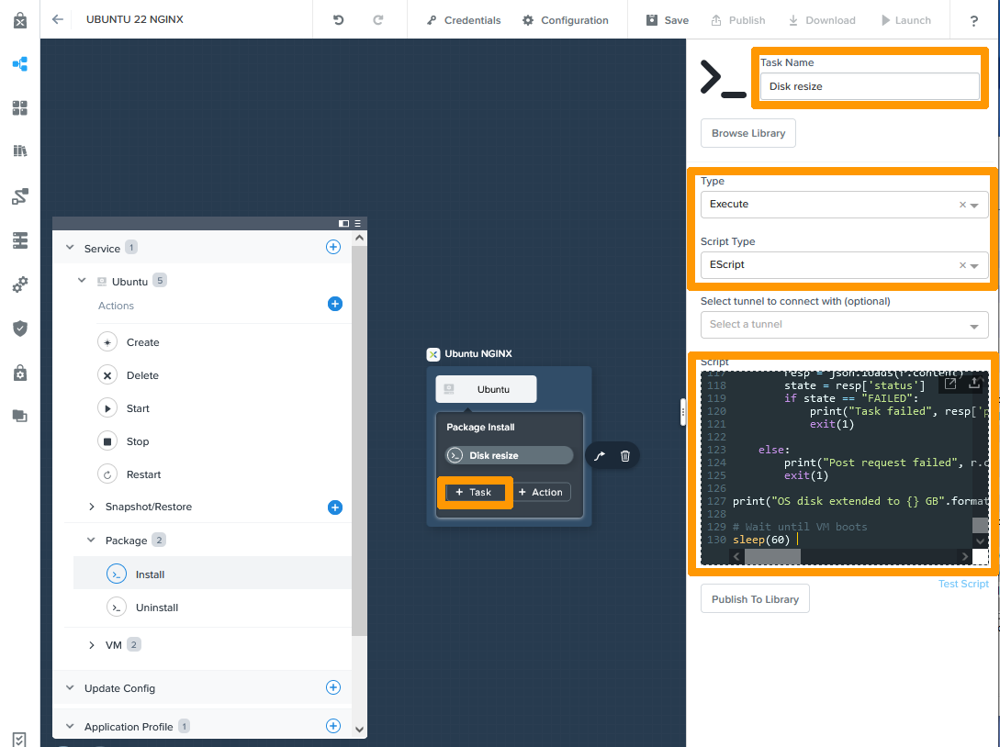{.thumbnail}

Renseignez ces informations sur la tâche de vérification des services sur Linux :

- **Task Name** : `Service restart`
- **Type** : `Execute`
- **Script Type** : `Shell`
- **Credential** : `LinuxAccount`

Copiez ensuite le contenu ci-dessous dans **Script** :

```bash
sudo sed 's/#$nrconf{restart} = '"'"'i'"'"';/$nrconf{restart} = '"'"'a'"'"';/g' /etc/needrestart/needrestart.conf
```

Cliquez sur `+ Task`{.action} pour ajouter une nouvelle tâche à la suite.

{.thumbnail}

Renseignez ces informations sur la tâche de mise à jour UBUNTU:

- **Task Name** : `Service restart`
- **Type** : `Execute`
- **Script Type** : `Shell`
- **Credential** : `LinuxAccount`

Copiez ensuite le contenu ci-dessous dans **Script** :

```bash
sudo apt update
sudo DEBIAN_FRONTEND=noninteractive apt upgrade -y
```

Cliquez à nouveau sur `+ Task`{.action} pour ajouter une nouvelle tâche à la suite.

{.thumbnail}

Renseignez ces informations sur la tâche d'installation de Nginx et Curl :

- **Task Name** : `Service restart`
- **Type** : `Execute`
- **Script Type** : `Shell`
- **Credential** : `LinuxAccount`

Copiez ensuite le contenu ci-dessous dans **Script** :

```bash
sudo DEBIAN_FRONTEND=noninteractive apt install nginx curl -y
```

Cliquez à nouveau sur `+ Task`{.action} pour ajouter une nouvelle tâche à la suite.

{.thumbnail}

Saisissez ces informations concernant la dernière tâche de personnalisation de NGINX':

- **Task Name** : `Service restart`
- **Type** : `Execute`
- **Script Type** : `Shell`
- **Credential** : `LinuxAccount`

Copiez ensuite le contenu ci-dessous dans **Script** :

```bash
sudo ls -l /var/www/html/
sudo rm -rf /var/www/html/index.nginx-debian.html
sudo touch /var/www/html/index.nginx-debian.html
sudo chown $USER:$USER /var/www/html/index.nginx-debian.html
sudo ls -l /var/www/html/
sudo echo '<!DOCTYPE html>' > /var/www/html/index.nginx-debian.html
sudo echo '<html>' >> /var/www/html/index.nginx-debian.html
sudo echo '<head>' >> /var/www/html/index.nginx-debian.html
sudo echo '<title>NGINX on Linux AHV VM</title>' >> /var/www/html/index.nginx-debian.html
sudo echo '</head>' >> /var/www/html/index.nginx-debian.html
sudo echo '<body>' >> /var/www/html/index.nginx-debian.html
sudo echo '' >> /var/www/html/index.nginx-debian.html
sudo echo '<h1>Nginx on Linux AHV VM</h1>' >> /var/www/html/index.nginx-debian.html
sudo echo '<p>Deployed with CALM</p>' >> /var/www/html/index.nginx-debian.html
sudo echo '' >> /var/www/html/index.nginx-debian.html
sudo echo '</body>' >> /var/www/html/index.nginx-debian.html
sudo echo '</html>' >> /var/www/html/index.nginx-debian.html
sudo cat /var/www/html/index.nginx-debian.html
```

Enfin, cliquez sur + `Save`{.action} pour finaliser la création de votre plan.

{.thumbnail}

Cliquez sur `Launch`{.action} pour tester votre plan.

{.thumbnail}

Saisissez le `nom`{.action} de votre déploiement de test dans **Application Name** et cliquez sur `Deploy`{.action}.

{.thumbnail}

Le déploiement se lance.

{.thumbnail}

Cliquez sur `Audit`{.action} pour voir l'avancement du déploiement.

{.thumbnail}

Une fois le déploiement terminé, vous pouvez accéder en HTTP à l'adresse IP de votre VM NGINX pour visualiser le message de bienvenue.

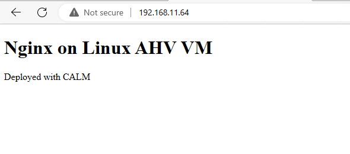{.thumbnail}

#### Publication des applications 

Allez sur l'icône `Blueprints`{.action} dans la barre verticale de CALM à gauche et cliquez sur le plan `WS 2022 IIS`{.action}.

{.thumbnail}

Cliquez sur `Publish`{.action}.

{.thumbnail}

Appliquez ces valeurs :

- **Name** : `WS 2022 IIS`
- **Publish with secrets** : `activé`
- **Initial Version** : `1.0.0`

Cliquez ensuite à gauche sur `Change`{.action}.

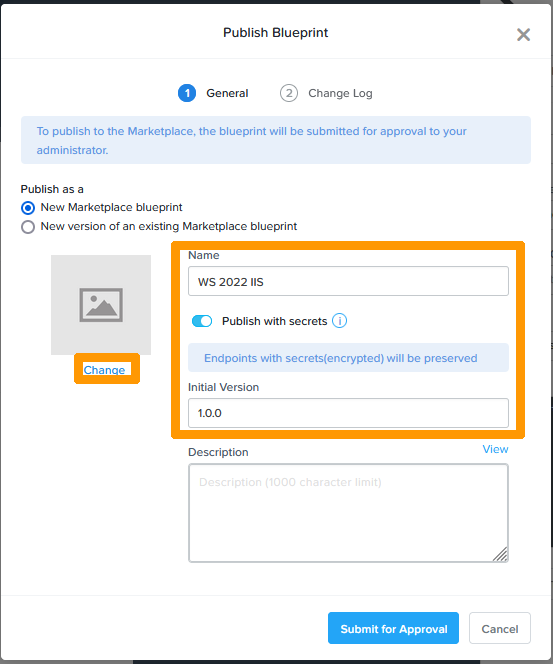{.thumbnail}

Cliquez sur `Upload from computer`{.action}.

{.thumbnail}

Choisissez l'`image`{.action} sur votre ordinateur et cliquez sur `Ouvrir`{.action}.

{.thumbnail}

Nommez votre icône `IIS`{.action} et cliquez sur le `bouton bleu de validation`{.action}.

{.thumbnail}

Cliquez sur `Select & continue`{.action}.

{.thumbnail}

Cliquez sur `Submit for approval`{.action}.

{.thumbnail}

L'application Windows est dans le marketplace en attente d'approbation.

Cliquez sur le plan `UBUNTU 22 NGINX`{.action}.

{.thumbnail}

Cliquez sur `Publish`{.action}.

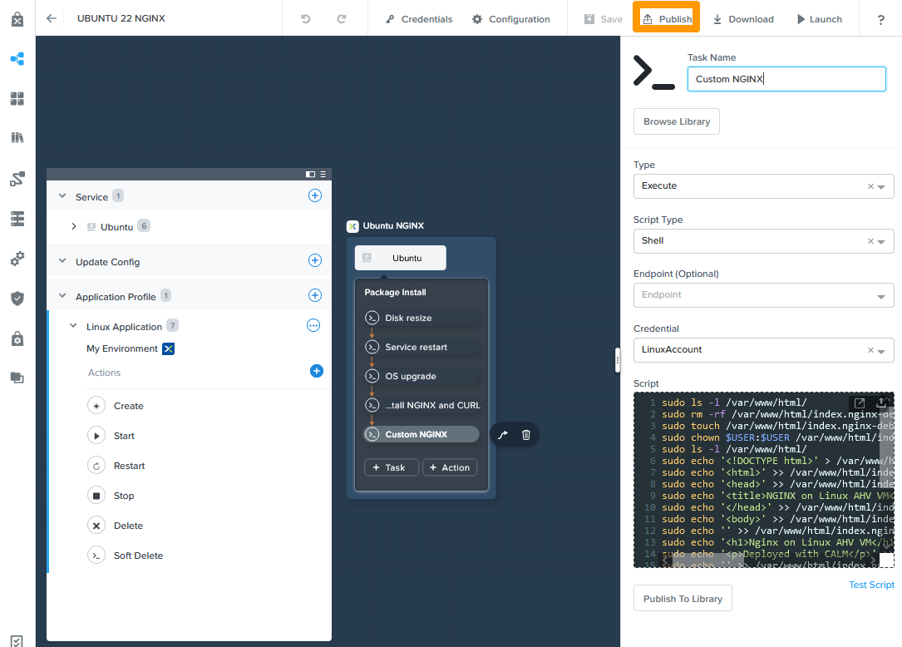{.thumbnail}

Appliquez ces valeurs :

- **Name** : `UBUNTU 22 NGINX`
- **Publish with secrets** : `activé`
- **Initial Version** : `1.0.0`

Cliquez ensuite à gauche sur `Change`{.action}.

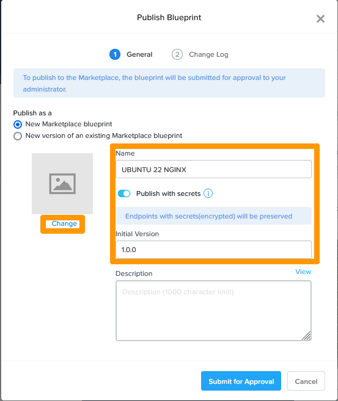{.thumbnail}

Cliquez sur `Upload from computer`{.action}.

{.thumbnail}

Choisissez l'`image`{.action} sur votre ordinateur et cliquez sur `Ouvrir`{.action}.

{.thumbnail}

Nommez votre icône `NGINX`{.action} et cliquez sur le `bouton bleu de validation`{.action}.

{.thumbnail}

Sélectionnez votre icône et cliquez sur `Select & continue`{.action}.

{.thumbnail}

Cliquez sur `Submit for approval`{.action}.

{.thumbnail}

L'application Linux se trouve dans la marketplace en attente d'approbation.

#### Ajout des applications publiées sur le portail de CALM

Cliquez sur l'icône du `Marketplace Manager`{.action}, allez sur l'onglet `Approval Pending`{.action}, cochez l'application `UBUNTU 22 NGINX`{.action} et cliquez sur l'icône de validation à droite.

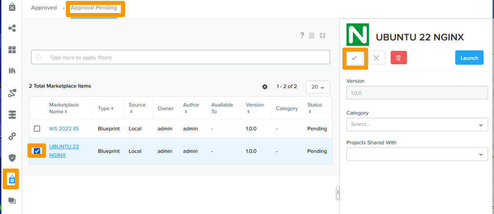{.thumbnail}

Cochez l'application `WS 2022 IIS`{.action} et cliquez sur l'icône de validation à droite.

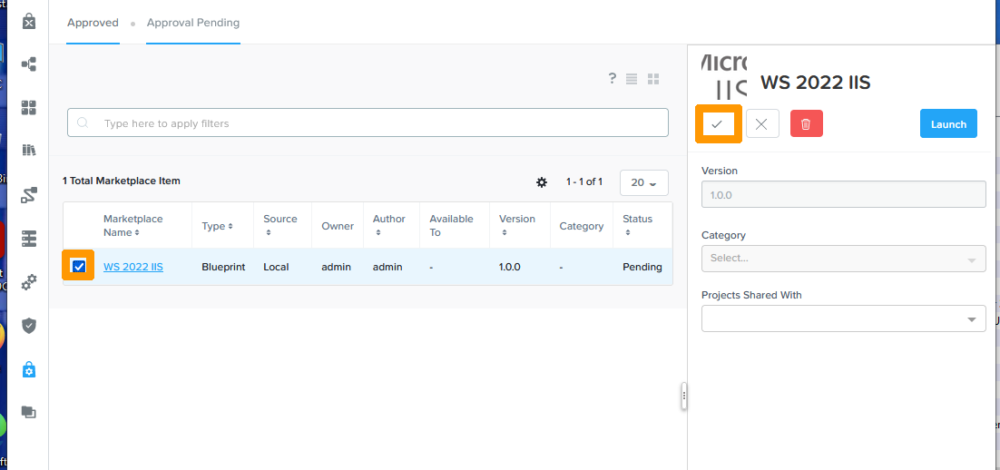{.thumbnail}

Allez sur l'onglet `Approved`{.action}, cliquez sur la colonne `Source`{.action} pour afficher les applications locales en premier, cochez `WS 2022 IIS`{.action}. Sélectionnez en bas à droite `NCM Self Service Project 01`{.action} et cliquez sur `Apply`{.action}.

{.thumbnail}

Cliquez sur `Publish`{.action}.

{.thumbnail}

L'application Windows est publiée.

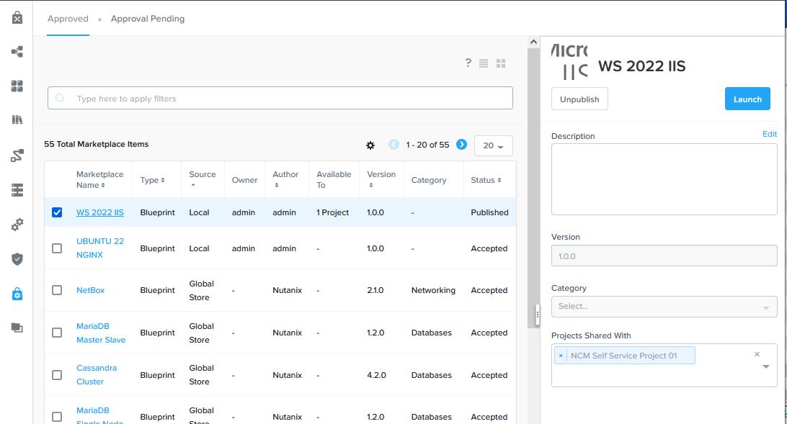{.thumbnail}

Cochez `Ubuntu 22 NGINX`{.action}, Sélectionnez à droite `NCM Self Service Project 01`{.action} et cliquez sur `Apply`{.action}.

{.thumbnail}

Cliquez sur `Publish`{.action}.

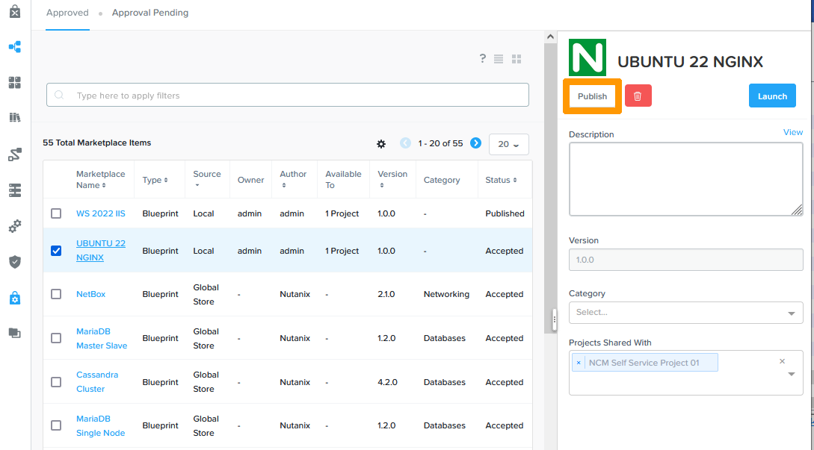{.thumbnail}

L'application Ubuntu est publiée.

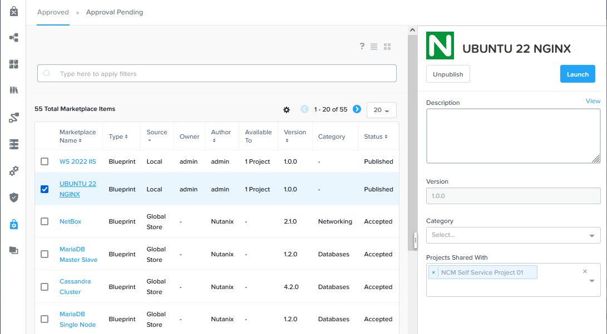{.thumbnail}

Cliquez sur l'icône `Marketplace`{.action} en haut de la barre de menu verticale à gauche et cliquez sur `Get`{.action} en dessous de l'application UBUNTU 22 NGINX.

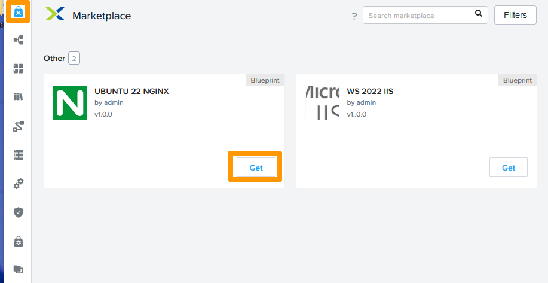{.thumbnail}

Cliquez sur `Launch`{.action}.

{.thumbnail}

Saisissez un `Nom`{.action} dans **Application Name** et cliquez sur `Deploy`{.action} pour déployer une application.

{.thumbnail}

#### Suppression d'une application déployée

La suppression d'une application déployée est aussi simple que son déploiement.

Cliquez sur l'icône des `Blueprints`{.action} à gauche et cochez une application déployée.

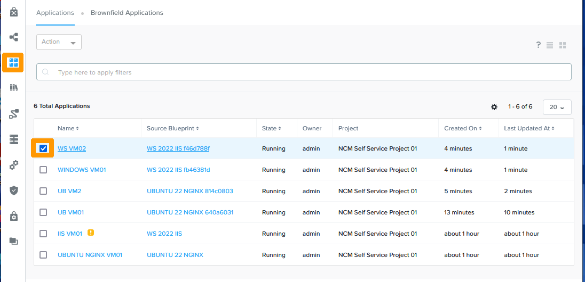{.thumbnail}

Via le menu **Action** cliquez sur `Delete`{.action}.

{.thumbnail}

Cliquez sur `Confirm`{.action}.

{.thumbnail}

Il est possible de suivre la suppression comme pour un déploiement.

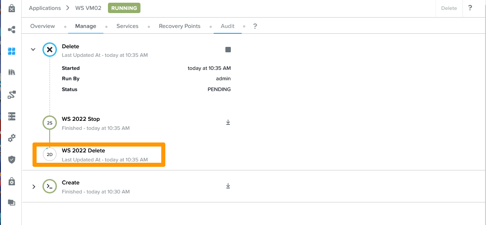{.thumbnail}

L'application est maintenant supprimée.

{.thumbnail}

## Aller plus loin <a name="gofurther"></a>

Si vous avez besoin d'une formation ou d'une assistance technique pour la mise en oeuvre de nos solutions, contactez votre commercial ou cliquez sur [ce lien](https://www.ovhcloud.com/fr/professional-services/) pour obtenir un devis et demander une analyse personnalisée de votre projet à nos experts de l’équipe Professional Services.

Échangez avec notre communauté d'utilisateurs sur <https://community.ovh.com/>.

[Nutanix NCM Self Service (CALM)](https://portal.nutanix.com/page/documents/details?targetId=Nutanix-Calm-Admin-Operations-Guide-v3_6_0:Nutanix-Calm-Admin-Operations-Guide-v3_6_0).
