## Objectif

**Find out how to set up NCM Self-Service (Calm) on your Prism Central.**

> [!warning]
> This tutorial will show you how to use one or more OVHcloud solutions with external tools, and will describe the actions to be carried out in a specific context. You may need to adapt the instructions according to your situation.
>
> If you encounter any difficulties performing these actions, please contact a [specialist service provider](https://partner.ovhcloud.com/it/directory/) and/or discuss the issue with our community. You can find more information in the [Go further](#gofurther) section of this tutorial.
>

## Requirements

- A Nutanix cluster in your OVHcloud account
- Access to the [OVHcloud Control Panel](https://www.ovh.com/auth/?action=gotomanager&from=https://www.ovh.it/&ovhSubsidiary=it)
- You must be connected to the cluster via Prism Central
- Have BYOL for Self Service (CALM) licences (These licences are not available with the standard and advanced pack offered by OVHcloud).
- An additional VLAN in your cluster that distributes IPAM IP addresses and has internet access

## Overview

NCM Self Service (CALM) is a heterogeneous orchestration solution that allows the automation and management of deployments, it runs on Prism Central and grants the administration of various environments (Nutanix Cluster, bare metal server, etc...).

## Instructions

We will enable CALM, create two applications for our Nutanix cluster and publish them on the application portals which are:

- An Nginx Web server with Linux Ubuntu.
- An IIS Web server on Windows server.

### Activating CALM

Before deploying CALM, check the IP address for the **ISCSI Data Services IP**.

From the Prism Central dashboard, click on your `Cluster`{.action} in the **Cluster Quick Access** section.

{.thumbnail}

In the Prism Element, click on the `cluster settings`{.action} in the top left-hand corner.

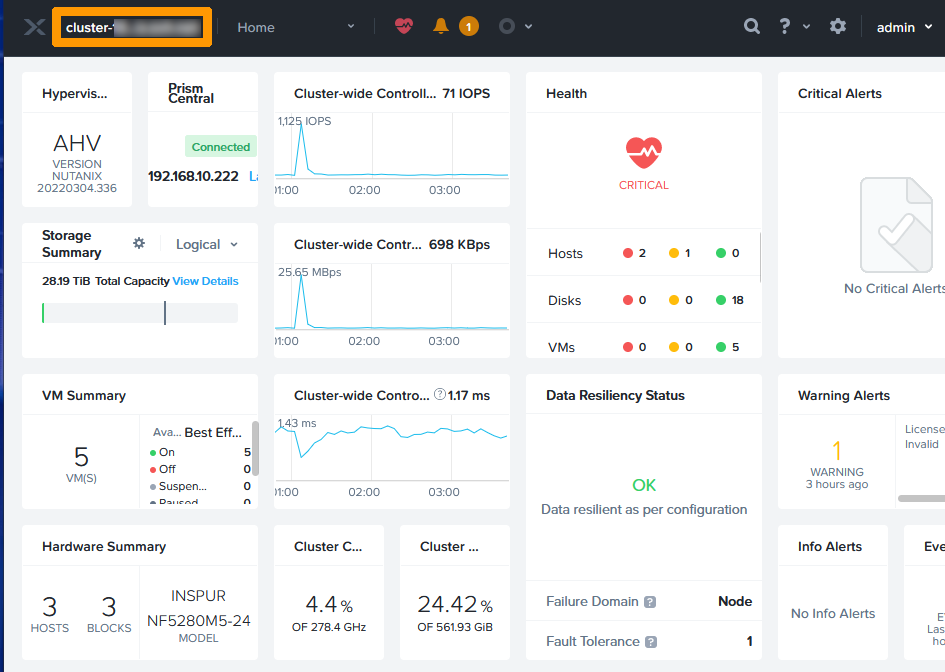{.thumbnail}

Check the IP address in **ISCSI Data Services IP**.

{.thumbnail}

Go back to Prism Central, go to the main menu on the left and click on `Calm`{.action} in the **Services** section

{.thumbnail}

Click `Enable App. Orchestration(Calm)`{.action}.

{.thumbnail}

Select the `Enable App Management`{.action} check box and click `Save`{.action}.

{.thumbnail}

CALM is being activated.

{.thumbnail}

> [!primary]
> An error message appears during CALM deployment, ignore it, exit the window and wait until the installation is complete.


### Creating a project

You need to create a project to deploy applications.

From the Prism Central menu, click on `Calm`{.action} in the Services section.

{.thumbnail}

Click the `Projects`{.action} icon in the vertical menu bar.

{.thumbnail}

Click the `+ Create Project`{.action} button.

{.thumbnail}

Type the `project name`{.action} in **Project Name** field and click `Create`{.action}

{.thumbnail}

click `+ Add infrastructure`{.action}.

{.thumbnail}

Click `Add infrastructure`{.action}.

{.thumbnail}

Select `NTNX_LOCAL_AZ`{.action} from accounts.

{.thumbnail}

Click `Configure Resources`{.action}.

{.thumbnail}

Select your `Cluster`{.action} from **Select clusters to be added to this project** and click `+ Select VLANs`{.action}.

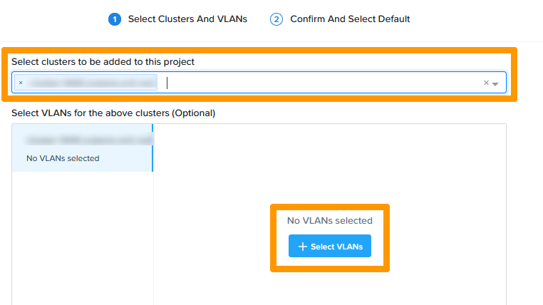{.thumbnail}

Check the `production`{.action} VLAN box and click `Confirm and Select Default`{.action}.

{.thumbnail}

Click `Confirm`{.action}.

{.thumbnail}

Click `Save`{.action}.

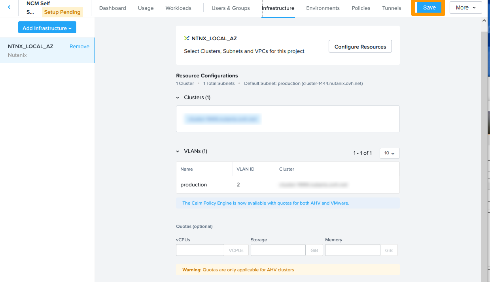{.thumbnail}

In the tab bar go to `Environments`{.action} and click `Create Environment`{.action}.

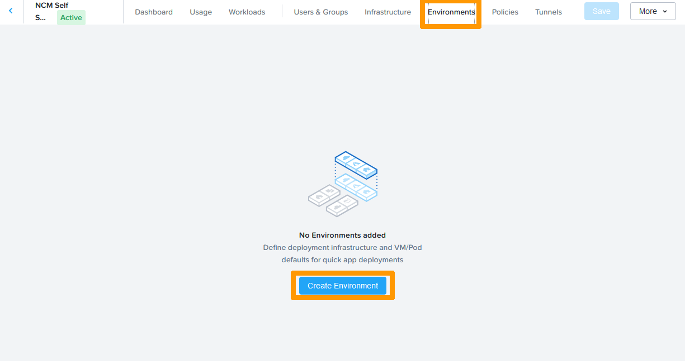{.thumbnail}

Type a `Name`{.action} in the **Name** field and click `Next`{.action}.

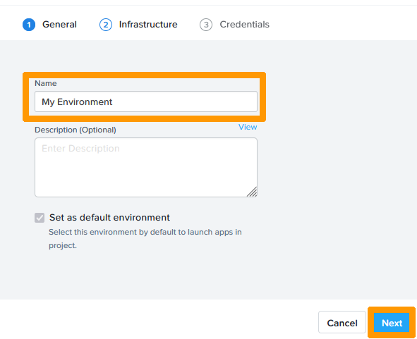{.thumbnail}

Click `Select Infrastructure`{.action}.

{.thumbnail}

Click `NTNX_LOCAL_AZ`{.action}.

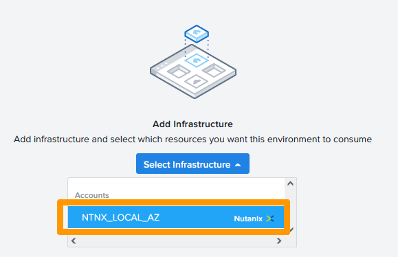{.thumbnail}

Click `Required for lauching blueprints from marketplace`{.action} to the right of **VM Configuration**

{.thumbnail}

Enter this information:

- **Cluster**: `choose your cluster`
- **vCPUs**: `4`
- **Core per vCPU**: `1`
- **Memory (GiB)**: `4`
- **Image** : `WS2022EN-SYSPREPED`

> [!primary]
> The image is generated from a VM WINDOWS Server 2022 on which a sysprep was applied to reset the default configuration. When used with CALM, it is possible to automate the installation of a Windows OS from this type of image and apply settings stored in an XML file to it.

Then, scroll down the window.

{.thumbnail}

Click the `+`{.action} button to the right of **NETWORK ADAPTERS (NICs)**.

{.thumbnail}

Choose the network adapter in the `production`{.action} VLAN, check the `Check log-in upon create`{.action} box and scroll up in the window.

{.thumbnail}

Go to the `Linux`{.action} tab, enter this information:

- **Cluster**: `choose your cluster`
- **vCPUs**: `4`
- **Core per vCPU**: `1`
- **Memory (GiB)**: `4`
- **Image**: `jammy-server-cloudimg-amd64.img`

> [!primary]
> The image is pre-configured for UBUNTU Cloud-init use and can be downloaded from the Internet at [Ubuntu Cloud Images](https://cloud-images.ubuntu.com/). CALM allows the automation and customisation of a Linux installation through these types of images and YAML configuration files.
>

Then scroll down the window.

{.thumbnail}

Click the `+`{.action} button to the right of **NETWORK ADAPTERS (NICs)**.

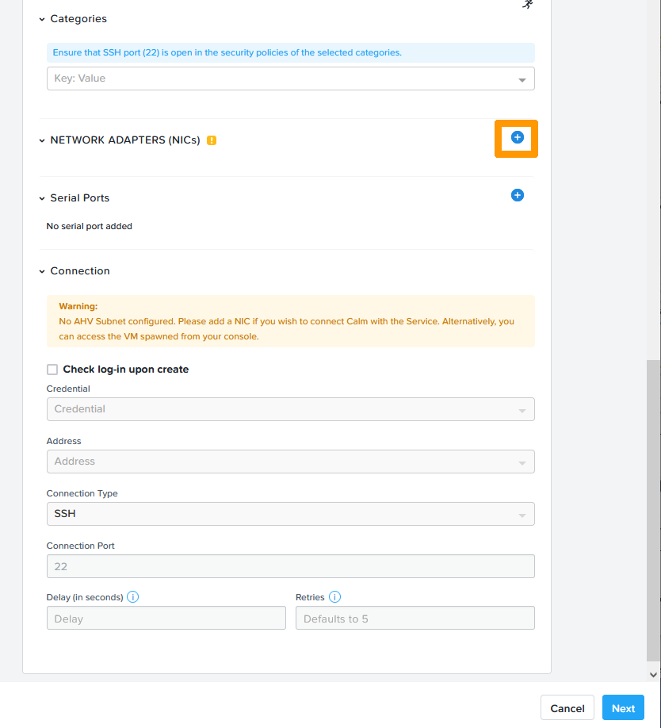{.thumbnail}

Choose the network adapter in the `production`{.action} VLAN, check the `Check log-in upon create`{.action} box and click `Next`{.action}.

{.thumbnail}

Click `+ Add Credential`{.action}.

{.thumbnail}

Click `+ Add Credential`{.action}.

{.thumbnail}

Enter this information:

- **Name**: `WindowsAccount`
- **Username**: `administrator`
- **Password**: `administrator account password`

Then, click `+ Add Credential`{.action}.

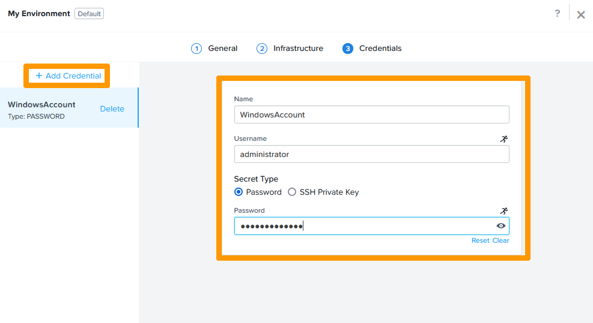{.thumbnail}

Enter this information:

- **Name**: `LinuxAccount`
- **Username**: `administrator`
- **Password**: `administrator account password`

Then, click `Save Environment`{.action}.

{.thumbnail}

Click `Marketplace Usage`{.action}.

{.thumbnail}

Click `Update`{.action}.

{.thumbnail}

Click `Next`{.action}.

{.thumbnail}

Click `Not ready for marketplace usage`{.action} to the right of VM Configuration.

{.thumbnail}

Scroll down the window.

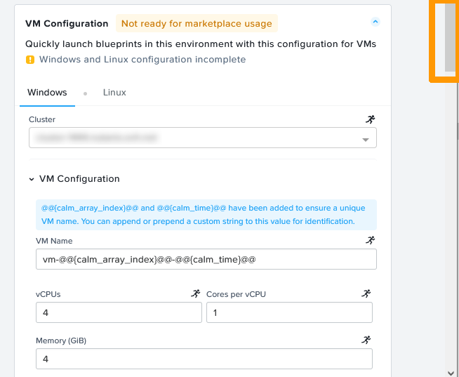{.thumbnail}

Choose `WindowsAccount`{.action} from **Credential** and scroll up the window.

{.thumbnail}

Click the `Linux`{.action} tab in **Credential** and scroll down the window.

{.thumbnail}

Choose `LinuxAccount`{.action} from **Credential** and click `Next`{.action}.

{.thumbnail}

Click `Save Environment`{.action}.

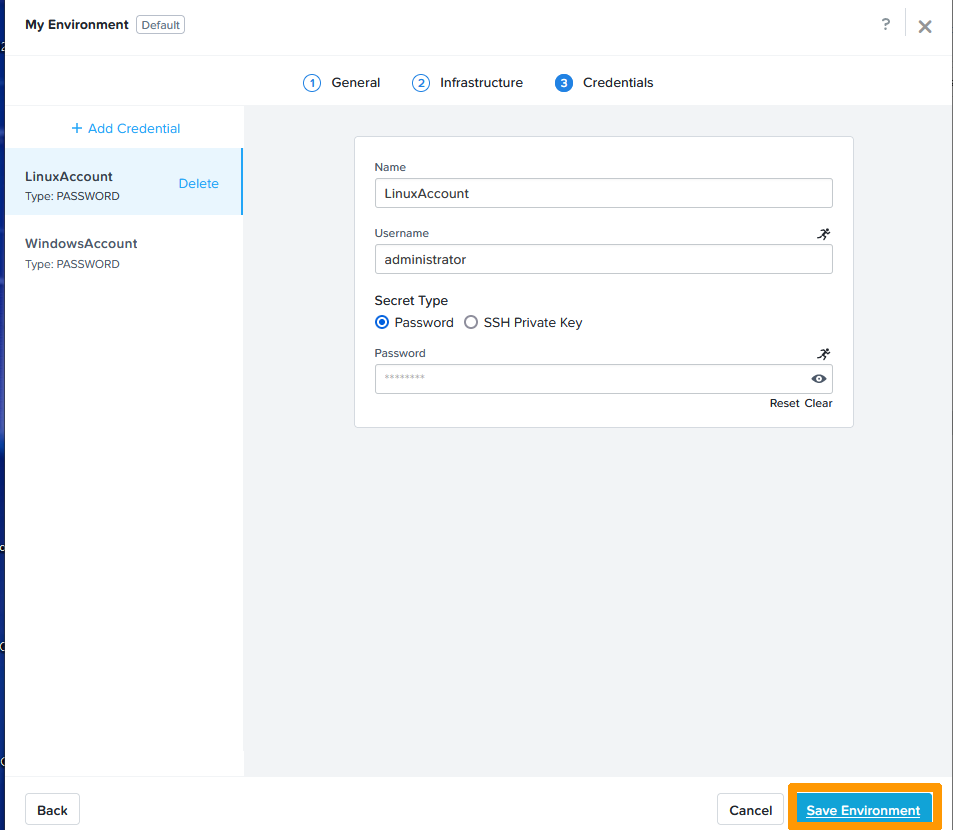{.thumbnail}

Your environment is ready for application creation and distribution.

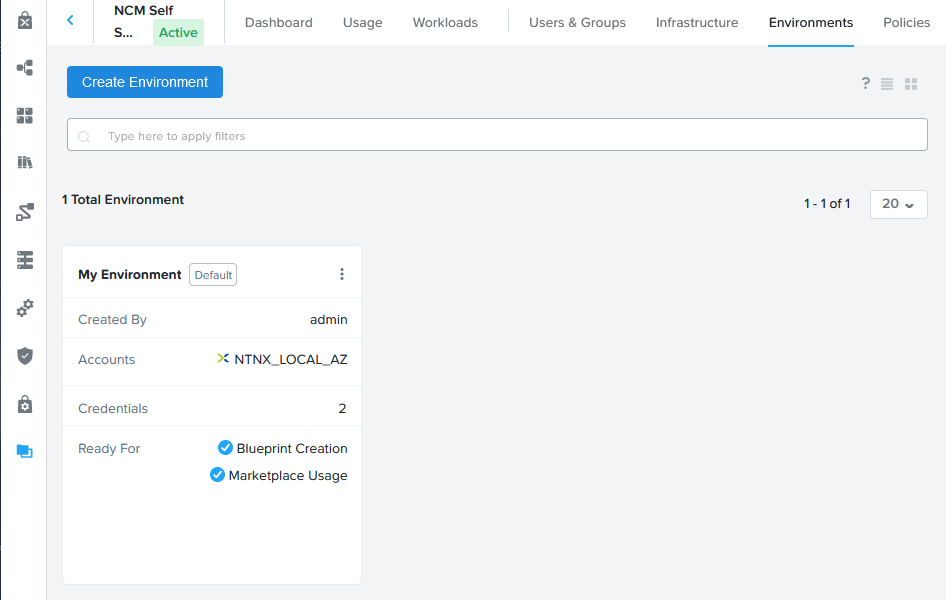{.thumbnail}

### Creating applications

We will create two applications, test how they work, and publish them to the cluster marketplace.

#### Creating IIS Web Application on Windows

In the vertical bar ,choose `Blueprints`{.action}, scroll to the `Create Blueprint`{.action} menu and click on `Multi VM/Pod Blueprint`{.action}.

{.thumbnail}

Choose the `name`{.action} of your blueprint from **Name** and click on `Proceed`{.action}.

{.thumbnail}

Type the `name`{.action} in **Application Profile Name** and click on `Credentials`{.action} at the top.

{.thumbnail}

We will create the Windows account, it will be used inside sysprep as variable, in the configuration of the blueprint installation tasks and for the remote connection test.

Click on the `+`{.action} button next to **Credentials**.

{.thumbnail}

Enter this information:

- **Name**: `WindowsAccount`
- **Username**: `administrator`
- **Password**: `Administrator account password`

And click on `Done`{.action}.

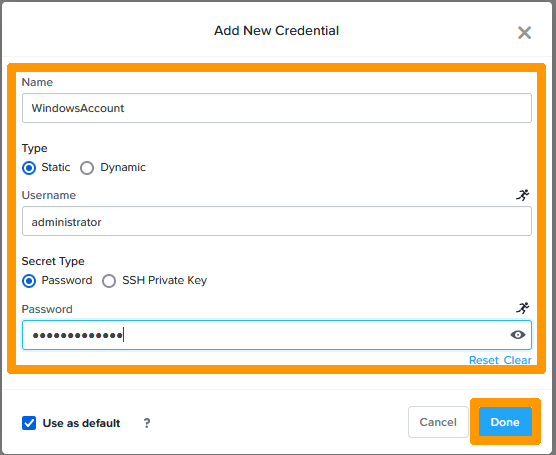{.thumbnail}

Click `Back`{.action}.

{.thumbnail}

Click the `+`{.action} button in the left window next to **Service**.

{.thumbnail}

Enter this information:

- **Name**: `VM IIS`
- **Operation System**: `Windows`

And click on `Clone from environment`{.action}.

{.thumbnail}

Scroll down the window on the right and check the `Guest Customisation`{.action} box. Next, click `Sysprep`{.action} and then copy the contents of the sysprep file below to **Script**:

> [!primary]
> This file is generated from the Windows ADK tools downloadable via this [link](https://learn.microsoft.com/en-us/windows-hardware/get-started/adk-install#download-the-adk-for-windows-11) and has been adapted by adding variables from Nutanix CALM such as '@@{WindowsAccount.secret}@@' that represents the password of the WindowsAccount.
> 

```xml
<?xml version="1.0" encoding="utf-8"?>
<unattend xmlns="urn:schemas-microsoft-com:unattend">
    <settings pass="windowsPE">
        <component name="Microsoft-Windows-International-Core-WinPE" processorArchitecture="amd64" publicKeyToken="31bf3856ad364e35" language="neutral" versionScope="nonSxS" xmlns:wcm="http://schemas.microsoft.com/WMIConfig/2002/State" xmlns:xsi="http://www.w3.org/2001/XMLSchema-instance">
            <SetupUILanguage>
                <UILanguage>en-US</UILanguage>
                <WillShowUI>Never</WillShowUI>
            </SetupUILanguage>
            <InputLocale>0409:00000409</InputLocale>
            <SystemLocale>en-US</SystemLocale>
            <UILanguage>en-US</UILanguage>
            <UserLocale>en-US</UserLocale>
        </component>
        <component name="Microsoft-Windows-Setup" processorArchitecture="amd64" publicKeyToken="31bf3856ad364e35" language="neutral" versionScope="nonSxS" xmlns:wcm="http://schemas.microsoft.com/WMIConfig/2002/State" xmlns:xsi="http://www.w3.org/2001/XMLSchema-instance">
            <UserData>
                <AcceptEula>true</AcceptEula>
                <FullName>Nutanix Doc</FullName>
                <Organization>Nutanix Doc</Organization>
            </UserData>
            <EnableFirewall>true</EnableFirewall>
            <EnableNetwork>true</EnableNetwork>
        </component>
    </settings>
    <settings pass="specialize">
        <component name="Microsoft-Windows-Shell-Setup" processorArchitecture="amd64" publicKeyToken="31bf3856ad364e35" language="neutral" versionScope="nonSxS" xmlns:wcm="http://schemas.microsoft.com/WMIConfig/2002/State" xmlns:xsi="http://www.w3.org/2001/XMLSchema-instance">
            <TimeZone>Central Standard Time</TimeZone>
            <AutoLogon>
                <Password>
                    <Value>@@{WindowsAccount.secret}@@</Value>
                    <PlainText>true</PlainText>
                </Password>
                <Enabled>true</Enabled>
                <Username>administrator</Username>
                <LogonCount>1</LogonCount>
            </AutoLogon>
        </component>
    </settings>
    <settings pass="oobeSystem">
        <component name="Microsoft-Windows-Shell-Setup" processorArchitecture="amd64" publicKeyToken="31bf3856ad364e35" language="neutral" versionScope="nonSxS" xmlns:wcm="http://schemas.microsoft.com/WMIConfig/2002/State" xmlns:xsi="http://www.w3.org/2001/XMLSchema-instance">
            <UserAccounts>
                <AdministratorPassword>
                    <Value>@@{WindowsAccount.secret}@@</Value>
                    <PlainText>true</PlainText>
                </AdministratorPassword>
            </UserAccounts>
            <OOBE>
                <HideEULAPage>true</HideEULAPage>
                <HideOEMRegistrationScreen>true</HideOEMRegistrationScreen>
                <HideOnlineAccountScreens>true</HideOnlineAccountScreens>
                <HideWirelessSetupInOOBE>true</HideWirelessSetupInOOBE>
                <ProtectYourPC>1</ProtectYourPC>
                <HideLocalAccountScreen>true</HideLocalAccountScreen>
            </OOBE>
            <FirstLogonCommands>
                <SynchronousCommand wcm:action="add">
                    <CommandLine>powershell Set-NetConnectionProfile -NetworkCategory Private</CommandLine>
                    <Order>1</Order>
                </SynchronousCommand>
                <SynchronousCommand wcm:action="add">
                    <CommandLine>powershell Set-WSManQuickConfig -Force</CommandLine>
                    <Order>2</Order>
                </SynchronousCommand>
            </FirstLogonCommands>
        </component>
        <component name="Microsoft-Windows-International-Core" processorArchitecture="wow64" publicKeyToken="31bf3856ad364e35" language="neutral" versionScope="nonSxS" xmlns:wcm="http://schemas.microsoft.com/WMIConfig/2002/State" xmlns:xsi="http://www.w3.org/2001/XMLSchema-instance">
            <UILanguage>en-US</UILanguage>
            <UserLocale>en-US</UserLocale>
            <SystemLocale>en-US</SystemLocale>
            <InputLocale>0409:00000409</InputLocale>
        </component>
    </settings>
    <cpi:offlineImage cpi:source="wim:c:/w2022/sources/install.wim#Windows Server 2022 SERVERSTANDARD" xmlns:cpi="urn:schemas-microsoft-com:cpi" />
</unattend>
```

{.thumbnail}

Continue to scroll through the window and check that **Check log-in upon create** is checked and choose `WindowsAccount`{.action} from **Credential**.

{.thumbnail}

We will now create tasks in Powershell that will run after Windows installation and customisation. Each of these tasks runs in sequence.

In the left-hand window, go to `Install`{.action} below the **Package** category and click on `+ Task`{.action}.

{.thumbnail}

Enter this information: 

- **Task Name**: `IIS Installation`
- **Type**: `Execute`
- **Script Type**: `Powershell`
- **Credential**: `WindowsAccount`

Copy this content to **Script**:

```powershell
Install-WindowsFeature -name Web-Server -IncludeManagementTools

if ($?) {
exit 0
}

```

Click `+ Task`{.action}.

{.thumbnail}

Fill in this information:

**Task Name**: `Customize IIS`
**Type**: `Execute`
**Script Type**: `Powershell`
**Credential**: `WindowsAccount`

Copy this content to **Script**:

```powershell
echo "<!DOCTYPE html>" | out-file "C:\inetpub\wwwroot\default.htm"
Add-Content -Path C:\inetpub\wwwroot\default.htm -Value "<html>"
Add-Content -Path C:\inetpub\wwwroot\default.htm -Value "<head>"
Add-Content -Path C:\inetpub\wwwroot\default.htm -Value "<title>IIS on Windows AHV VM</title>"
Add-Content -Path C:\inetpub\wwwroot\default.htm -Value "</head>"
Add-Content -Path C:\inetpub\wwwroot\default.htm -Value "<body>"
Add-Content -Path C:\inetpub\wwwroot\default.htm -Value ""
Add-Content -Path C:\inetpub\wwwroot\default.htm -Value "<h1>IIS on Windows AHV VM</h1>"
Add-Content -Path C:\inetpub\wwwroot\default.htm -Value "<p>Deployed with CALM</p>"
Add-Content -Path C:\inetpub\wwwroot\default.htm -Value ""
Add-Content -Path C:\inetpub\wwwroot\default.htm -Value "</body>"
Add-Content -Path C:\inetpub\wwwroot\default.htm -Value "</html>"
```

Then click `+ Task`{.action}.

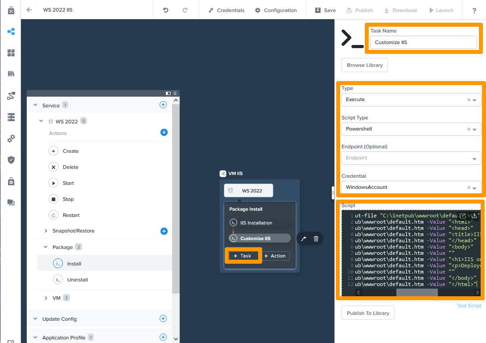{.thumbnail}

Enter this information:

**Task Name**: `reboot VM`
**Type**: `Execute`
**Script Type**: `Powershell`
**Credential**: `WindowsAccount`

Copy this content to **Script**:

```powershell
restart-computer -force
```

Click `Save`{.action} at the top of the window.

{.thumbnail}

The application is created, click `Launch`{.action} to test your application.

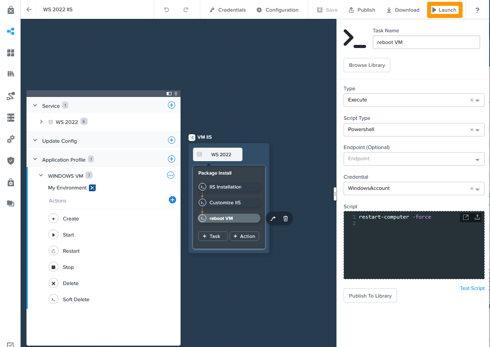{.thumbnail}

Type a `Name`{.action} in **Application Name** and click `Deploy`{.action}.

{.thumbnail}

A new window will appear, click on `Audit`{.action} to see the steps for deploying your application. When the deployment is complete you can see at the top of the window the **RUNNING** indication that the application is deployed and active.

{.thumbnail}

In our case, the IIS server is active and displays a message on the IP address of the virtual machine in HTTP.

{.thumbnail}

#### Creating the Nginx web application on Linux Ubuntu

We will create another application under Linux Ubuntu with Nginx installed as a WEB server.

Go to the `Blueprints`{.action} icon in the CALM vertical menu bar, click on `Multi VM/Pod Blueprint`{.action} from the **Create Blueprint** menu.

{.thumbnail}

Type the `Name`{.action} in **Name** and click `Proceed`{.action}.

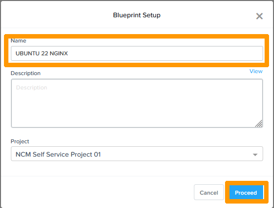{.thumbnail}

Click `Credentials`{.action}.

{.thumbnail}

Click `Credentials +`{.action}.

{.thumbnail}

Enter this information for the Linux administration account:

- **Name**: `LinuxAccount`
- **Username**: `administrator`
- **Password**: `Administrator account password`

Then click `Done`{.action}.

{.thumbnail}

Click on `Credentials +`{.action}.

{.thumbnail}

Enter this information about the Prism Central administration account:

- **Name**: `PC_ADMIN`
- **Username**: `admin`
- **Password**: `Prism Central Password`

> [!primary]
> This password is used if you use EScript (Python Scripts) in your deployment tasks, it will be used when using the Prism Central API. In this example, you will find an EScript that will resize the Ubuntu NGINX virtual machine storage.
>

Then click `Done`{.action}.

{.thumbnail}

Click `Back`{.action}.

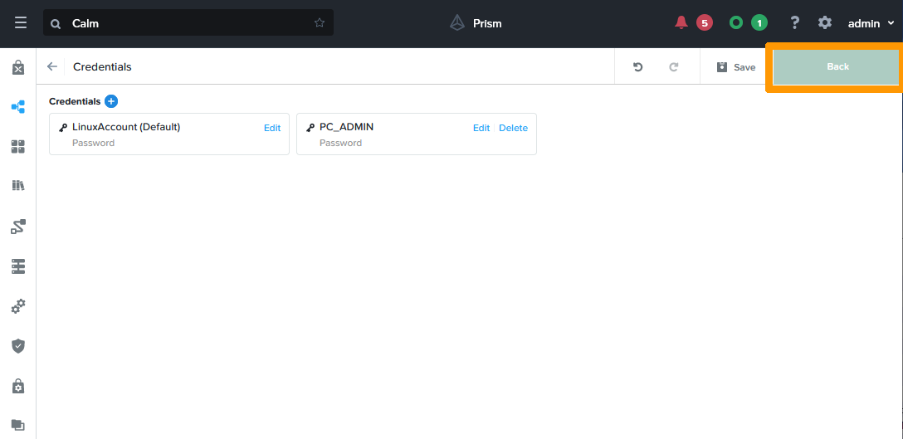{.thumbnail}

Type `Linux Application`{.action} in **Application Profile Name** and click `+`{.action} in the left-to-right window of **Service**.

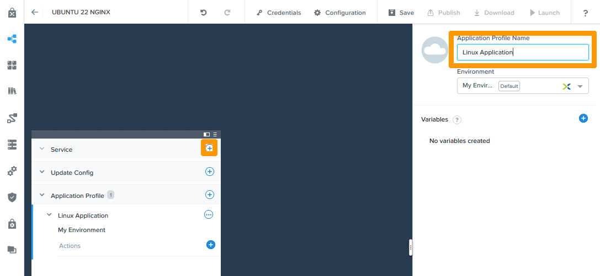{.thumbnail}

Enter this information:

- **Service Name**: `Ubuntu`
- **VM Name**: `Ubuntu NGINX`

Then click on `Clone from environment`{.action} and scroll down the window on the right.

{.thumbnail}

Check `Guest Customization`{.action} and copy the content below in **script**.

```config
#cloud-config
users:
- name: @@{LinuxAccount.username}@@
  groups: sudo
  sudo: ALL=(ALL) NOPASSWD:ALL
  shell: /bin/bash
  lock-passwd: false
chpasswd:
 list: |
   @@{LinuxAccount.username}@@:@@{LinuxAccount.secret}@@
 expire: False
ssh_pwauth: true
```

> [!primary]
> This file is the Linux initialisation file with cloud-init images, it uses the information from the LinuxAccount account that comes from CALM through macro-instructions that have this form: @@{LinuxAccount.username}@@ for the user account and @@{LinuxAccount.secret}@@ for the password.
>

Scroll down the window on the right.

{.thumbnail}

Choose `LinuxAccount`{.action} from **Check log-in upon create**.

{.thumbnail}

In the left window, go to `Install`{.action} below **Package** and click on `+ Task`{.action}.

{.thumbnail}

Enter the information for your virtual machine's disk resize task.

- **Task Name**: `Disk resize`
- **Type**: `Execute`
- **Script Type**: `EScript`

Then copy the content of this script:

> [!primary]
> This script uses the passwords that come from CALM through variables that have this form: @@{PC_ADMIN.username}@@ for the user account and @@{PC_ADMIN.secret}@@ for the password.
>


```python
vmUuid = '@@{id}@@'
diskSize = 50 # GB
pcAddress = '127.0.0.1'
pcUsername = '@@{PC_ADMIN.username}@@'
pcPassword = '@@{PC_ADMIN.secret}@@'

# ============== DO NO CHANGE AFTER THIS ===============

usrPass = '{}:{}'.format(pcUsername,pcPassword)
b64Pass = base64.b64encode(usrPass)

# Get VM
api_url = 'https://{}:9440/api/nutanix/v3/vms/{}'.format(pcAddress,vmUuid)
headers = {'Content-Type': 'application/json', 'Accept': 'application/json', 'Authorization': 'Basic {}'.format(b64Pass)}

r = urlreq(api_url, verb='GET', headers=headers, verify=False)
if r.ok:
    resp = json.loads(r.content)

else:
    print("Post request failed", r.content)
    exit(1)

# Power off VM and extend disk
del resp['status']

disk_size_mib = diskSize * 1024
disk_size_bytes = disk_size_mib * 1024**2

resp['spec']['resources']['disk_list'][0]['disk_size_mib'] = disk_size_mib
resp['spec']['resources']['disk_list'][0]['disk_size_bytes'] = disk_size_bytes
resp['spec']['resources']['power_state'] = 'OFF'

payload = resp

r = urlreq(api_url, verb='PUT', params=json.dumps(payload), headers=headers, verify=False)
if r.ok:
    resp = json.loads(r.content)
    taskUuid = resp['status']['execution_context']['task_uuid']

else:
    print("Post request failed", r.content)
    exit(1)


# Monitor task
state = ""
while state != "SUCCEEDED":
    api_url = 'https://{}:9440/api/nutanix/v3/tasks/{}'.format(pcAddress,taskUuid)

    sleep(2)
    r = urlreq(api_url, verb='GET', headers=headers, verify=False)
    if r.ok:
        resp = json.loads(r.content)
        state = resp['status']
        if state == "FAILED":
            print("Task failed", resp['progress_message'])
            exit(1)

    else:
        print("Post request failed", r.content)
        exit(1)

# Wait for VM to power off
api_url = 'https://{}:9440/api/nutanix/v3/vms/{}'.format(pcAddress,vmUuid)
r = urlreq(api_url, verb='GET', headers=headers, verify=False)
if r.ok:
    resp = json.loads(r.content)
    power_state = resp['status']['resources']['power_state']

else:
    print("Post request failed", r.content)
    exit(1)

state = ""
while state != "OFF":
    api_url = 'https://{}:9440/api/nutanix/v3/vms/{}'.format(pcAddress,vmUuid)

    sleep(2)
    r = urlreq(api_url, verb='GET', headers=headers, verify=False)
    if r.ok:
        resp = json.loads(r.content)
        state = resp['status']['resources']['power_state']
        if state == "FAILED":
            print("Task failed", resp['progress_message'])
            exit(1)

    else:
        print("Post request failed", r.content)
        exit(1)

# Power on VM
del resp['status']

resp['spec']['resources']['power_state'] = 'ON'

api_url = 'https://{}:9440/api/nutanix/v3/vms/{}'.format(pcAddress,vmUuid)
payload = resp

r = urlreq(api_url, verb='PUT', params=json.dumps(payload), headers=headers, verify=False)
if r.ok:
    resp = json.loads(r.content)
    taskUuid = resp['status']['execution_context']['task_uuid']

else:
    print("Post request failed", r.content)
    exit(1)

# Monitor task
state = ""
while state != "SUCCEEDED":
    api_url = 'https://{}:9440/api/nutanix/v3/tasks/{}'.format(pcAddress,taskUuid)

    sleep(2)
    r = urlreq(api_url, verb='GET', headers=headers, verify=False)
    if r.ok:
        resp = json.loads(r.content)
        state = resp['status']
        if state == "FAILED":
            print("Task failed", resp['progress_message'])
            exit(1)

    else:
        print("Post request failed", r.content)
        exit(1)

print("OS disk extended to {} GB".format(diskSize))

# Wait until VM boots
sleep(60) 
```

Click `+ Task`{.action}.

{.thumbnail}

Enter this information about the Linux service verification task:

- **Task Name**: `Service restart`
- **Type**: `Execute`
- **Script Type**: `Shell`
- **Credential**: `LinuxAccount`

Then copy the content below to **Script**:

```bash
sudo sed 's/#$nrconf{restart} = '"'"'i'"'"';/$nrconf{restart} = '"'"'a'"'"';/g' /etc/needrestart/needrestart.conf
```

Click `+ Task`{.action} to add a new task in sequence.

{.thumbnail}

Enter this information about the UBUNTU update task:

- **Task Name**: `Service restart`
- **Type**: `Execute`
- **Script Type**: `Shell`
- **Credential**: `LinuxAccount`

Then copy the content below to **Script**:

```bash
sudo apt update
sudo DEBIAN_FRONTEND=noninteractive apt upgrade -y
```

And click `+ Task`{.action} to add a new task in sequence.

{.thumbnail}

Enter this information about the NGINX and CURL installation task:

- **Task Name**: `Service restart`
- **Type**: `Execute`
- **Script Type**: `Shell`
- **Credential**: `LinuxAccount`

Then copy the content below to **Script**:

```bash
sudo DEBIAN_FRONTEND=noninteractive apt install nginx curl -y
```

Click `+ Task`{.action} to add a new task in sequence.

{.thumbnail}

Enter this information about the last NGINX customisation task:

- **Task Name**: `Service restart`
- **Type**: `Execute`
- **Script Type**: `Shell`
- **Credential**: `LinuxAccount`

Then copy the content below to **Script**:

```bash
sudo ls -l /var/www/html/
sudo rm -rf /var/www/html/index.nginx-debian.html
sudo touch /var/www/html/index.nginx-debian.html
sudo chown $USER:$USER /var/www/html/index.nginx-debian.html
sudo ls -l /var/www/html/
sudo echo '<!DOCTYPE html>' > /var/www/html/index.nginx-debian.html
sudo echo '<html>' >> /var/www/html/index.nginx-debian.html
sudo echo '<head>' >> /var/www/html/index.nginx-debian.html
sudo echo '<title>NGINX on Linux AHV VM</title>' >> /var/www/html/index.nginx-debian.html
sudo echo '</head>' >> /var/www/html/index.nginx-debian.html
sudo echo '<body>' >> /var/www/html/index.nginx-debian.html
sudo echo '' >> /var/www/html/index.nginx-debian.html
sudo echo '<h1>Nginx on Linux AHV VM</h1>' >> /var/www/html/index.nginx-debian.html
sudo echo '<p>Deployed with CALM</p>' >> /var/www/html/index.nginx-debian.html
sudo echo '' >> /var/www/html/index.nginx-debian.html
sudo echo '</body>' >> /var/www/html/index.nginx-debian.html
sudo echo '</html>' >> /var/www/html/index.nginx-debian.html
sudo cat /var/www/html/index.nginx-debian.html
```

Click `+ Save`{.action} to finish creating your blueprint.

{.thumbnail}

Click `Launch`{.action} to test your blueprint.

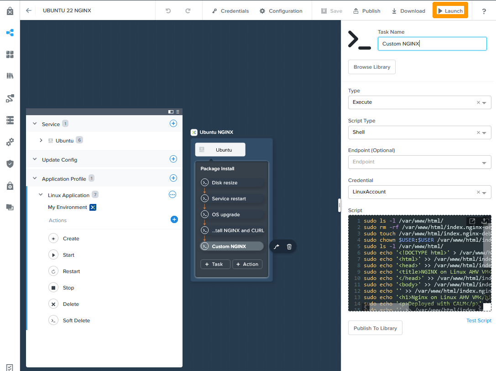{.thumbnail}

Type the `name`{.action} of your test deployment in **Application Name** and click `Deploy`{.action}.

{.thumbnail}

Deployment begins.

{.thumbnail}

Click `Audit`{.action} to view your deployment progress.

{.thumbnail}

Once the deployment is complete, you can access the IP address of your NGINX VM via HTTP to view the welcome message.

{.thumbnail}

#### Publishing applications

Go to the `Blueprints`{.action} icon in the CALM vertical bar on the left and click on the `WS 2022 IIS`{.action} map.

{.thumbnail}

Click `Publish`{.action}.

{.thumbnail}

Apply these values:

- **Name**: `WS 2022 IIS`
- **Publish with secrets**: `enabled`
- **Initial Version**: `1.0.0`

Then click on `Change`{.action} on the left.

{.thumbnail}

Click `Upload from computer`{.action}.

{.thumbnail}

Choose the `image`{.action} on your computer and click `Open`{.action}.

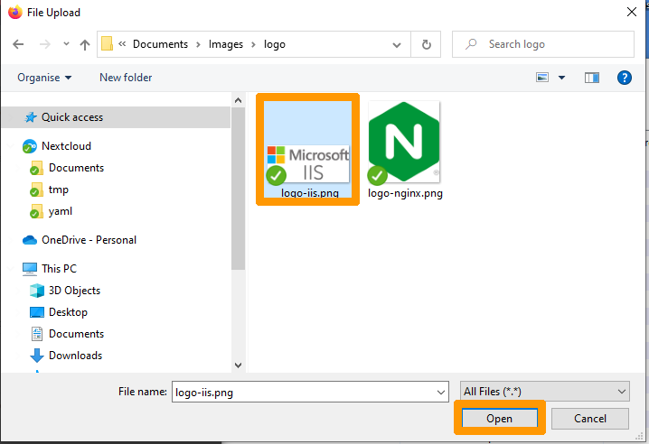{.thumbnail}

Name your Icon `IIS`{.action} and click on the `blue validation`{.action} button.

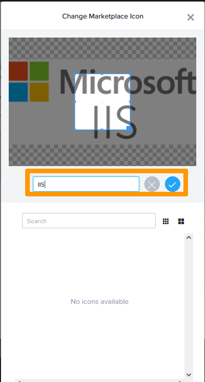{.thumbnail}

Click `Select & continue`{.action}.

{.thumbnail}

Click `Submit for approval`{.action}.

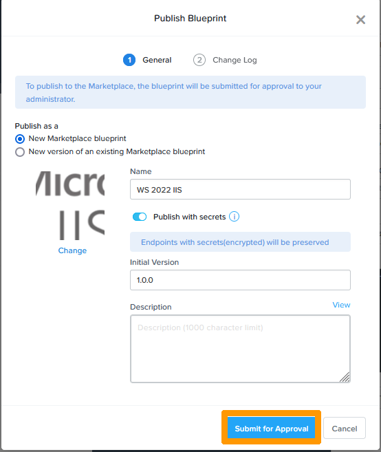{.thumbnail}

The Windows application is in the marketplace awaiting approval.

Click the `UBUNTU 22 NGINX`{.action} blueprint.

{.thumbnail}

Click `Publish`{.action}.

{.thumbnail}

Apply these values:

- **Name**: `UBUNTU 22 NGINX`
- **Publish with secrets**: `enabled`
- **Initial Version**: `1.0.0`

Then click `Change`{.action} on the left.

{.thumbnail}

Click `Upload from computer`{.action}.

{.thumbnail}

Choose the `image`{.action} on your computer and click `Open`{.action}.

{.thumbnail}

Name your icon `NGINX`{.action} and click the `blue validation button`{.action}.

{.thumbnail}

Select your icon and click `Select & continue`{.action}.

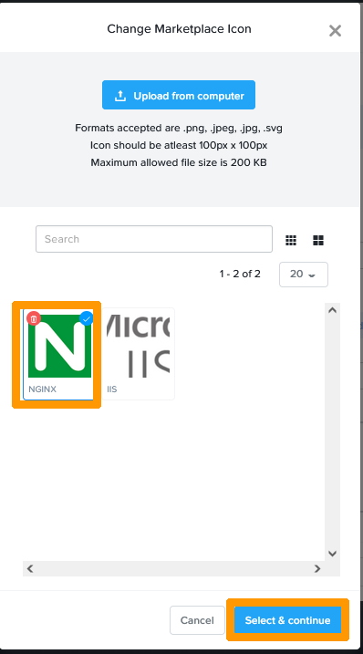{.thumbnail}

Click `Submit for approval`{.action}.

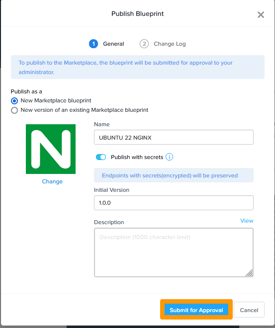{.thumbnail}

The Linux application is in the marketplace awaiting approval.

#### Adding applications published on the CALM portal

Click on the `Marketplace Manager`{.action} icon, go to the `Approval Pending`{.action} tab, check the `UBUNTU 22 NGINX`{.action} application, and click the validation icon on the right.

{.thumbnail}

Check the `WS 2022 IIS`{.action} application and click the validation icon on the right.

{.thumbnail}

Go to the `Approved`{.action} tab, click on the `Source`{.action} column to display the local applications first, check `WS 2022 IIS`{.action}, select `NCM Self Service Project 01`{.action} at the bottom right and click `Apply`{.action}.

{.thumbnail}

Click `Publish`{.action}.

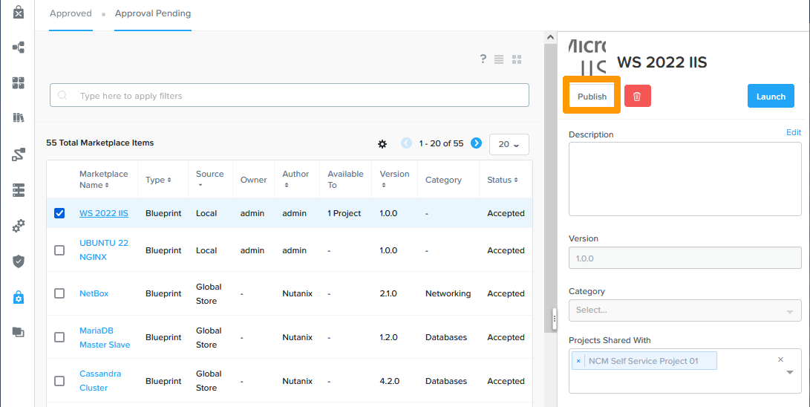{.thumbnail}

The Windows application is published.

{.thumbnail}

Check `Ubuntu 22 NGINX`{.action}, select `NCM Self Service Project 01`{.action} on the right and click `Apply`{.action}.

{.thumbnail}

Click `Publish`{.action}.

{.thumbnail}

The Ubuntu application is published.

{.thumbnail}

Click the `Marketplace`{.action} icon at the top of the vertical menu bar on the left and click `Get`{.action} below the UBUNTU 22 NGINX application.

{.thumbnail}

Click `Launch`{.action}.

{.thumbnail}

Type a `Name`{.action} in **Application Name** and click `Deploy`{.action} to deploy an application.

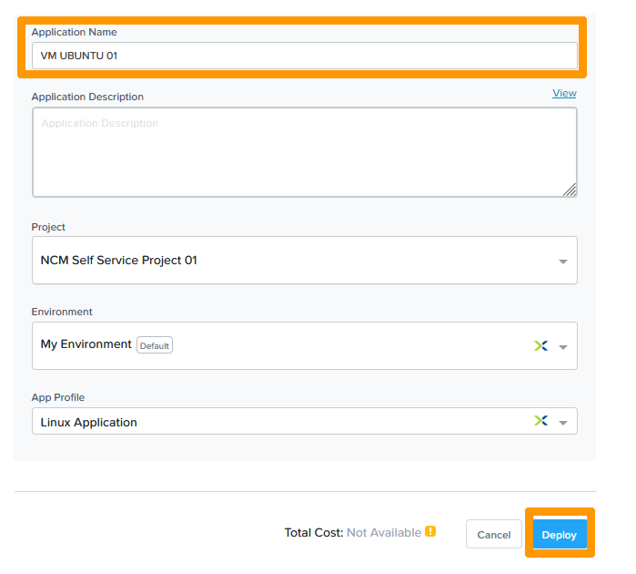{.thumbnail}

#### Deleting a deployed application

Deleting a deployed application is as simple as deploying it.

Click on the `Blueprints`{.action} icons on the left and check a deployed application.

{.thumbnail}

From the **Action** menu, click `Delete`{.action}.

{.thumbnail}

Click `Confirm`{.action}.

{.thumbnail}

You can view the progress of a deletion as you would for a deployment.

{.thumbnail}

The application is completely deleted.

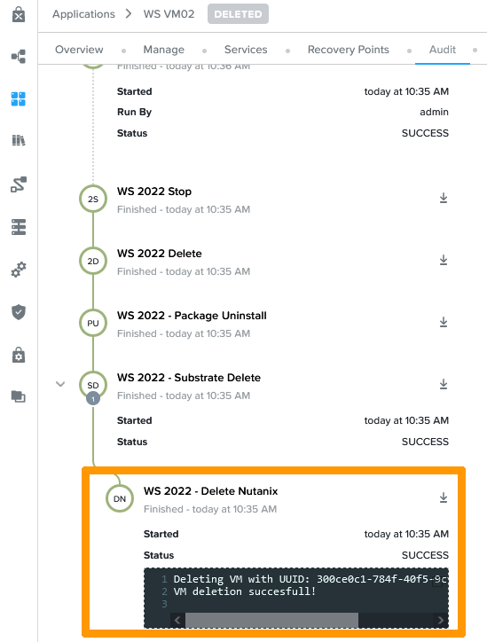{.thumbnail}

## Go further <a name="gofurther"></a>

If you need training or technical assistance to implement our solutions, contact your sales representative or click on [this link](https://www.ovhcloud.com/it/professional-services/) to get a quote and ask our Professional Services experts for assisting you on your specific use case of your project.

Join our community of users on <https://community.ovh.com/en/>.

[Nutanix NCM Self Service (CALM)](https://portal.nutanix.com/page/documents/details?targetId=Nutanix-Calm-Admin-Operations-Guide-v3_6_0:Nutanix-Calm-Admin-Operations-Guide-v3_6_0).
