**Last updated 31st May 2022**

## Objective

Veeam Backup is a backup software available for Nutanix. 

**Find out how to install, configure and use Veeam on a Nutanix cluster**

> [!warning]
> OVHcloud provides services for which you are responsible, with regard to their configuration and management. It is therefore your responsibility to ensure that they work properly.
>
> This guide is designed to assist you as much as possible with common tasks. Nevertheless, we recommend contacting a specialist provider if you experience any difficulties or doubts when it comes to managing, using or setting up a service on a server.
>

## Requirements

- A Nutanix cluster in your OVHcloud account.
- Access to the [OVHcloud Control Panel](https://www.ovh.com/auth/?action=gotomanager&from=https://www.ovh.de/&ovhSubsidiary=de).
- You must be connected to the cluster via **Prism Central**. 
- **Veeam Backup & Replication** installed on a virtual machine in your Nutanix cluster via this procedure: [Setting up Veeam Backup & Replication](/pages/storage_and_backup/backup_and_disaster_recovery_solutions/veeam_veeam_backup_replication).
- Knowing the public IP address used by **Veeam Backup** to access the internet.
- You must have 4 GB of RAM, 60 GB of storage and 4 vCPUs to add an additional virtual machine when configuring extensions for **Veeam Backup & Replication**.
- You must have remote storage outside of the cluster, such as [OVHcloud Enterprise File Storage](https://www.ovhcloud.com/de/storage-solutions/enterprise-file-storage/).

## Instructions

We will customise **Veeam Backup & Replication** for use on a Nutanix cluster, with a remote repository for this cluster at OVHcloud, using the [OVHcloud Enterprise File Storage solution](https://www.ovhcloud.com/de/storage-solutions/enterprise-file-storage/).

### Add a user in Prism Element for Veeam Backup

First, you need to create a specific user in Prism Element to use Veeam Backup.

Through **Prism Central**, connect to **Prism Element** by clicking on the cluster under `Cluster Quick Access`.

{.thumbnail}

Once in the **Prism Element**, go to the settings by clicking on the `gear`{.action} icon in the top right.

{.thumbnail}

Scroll down the menu on the left using the scroll bar.

{.thumbnail}

Click `Local User Management`{.action}.

{.thumbnail}

Click the `New User`{.action} button.

{.thumbnail}

Enter the information:

- **Username**: `svc_veeam`
- **First Name**: `Veeam`
- **Last Name**: `Backup`
- **Email**: `veeam@example.com`
- **Password**: `password`

> [!primary]
> This data is provided as an example. The email address is mandatory but is not used.

Select the `Cluster Admin`{.action} checkbox and click `Save`{.action}

{.thumbnail}

This user account is created and added to the **Prism Element** user list.

{.thumbnail}

### Download and install the extension for a Nutanix cluster under AHV

Log in to the virtual machine where Veeam Backup is located.

From a web browser, download the latest version of the [AHV extension for Veeam](https://www.veeam.com/availability-nutanix-ahv-download.html). You must have a user account on the **Veeam** website, you can create it freely and free of charge.

Start the installation of the extension.

> [!warning]
> Before starting the installation, make sure that the **Veeam Backup & replication** console is closed.
>

Open the "NutanixAHPlugin" installer.

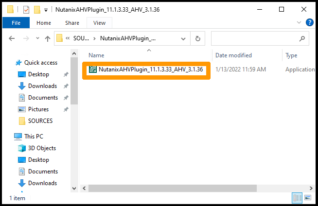{.thumbnail}

Accept the General Terms and Conditions of Use and click `Next`{.action}.

{.thumbnail}

Click `Next`{.action}.

{.thumbnail}

Click `Install`{.action}.

{.thumbnail}

Once the installation is complete, click `Finish`{.action}.

{.thumbnail}

### Integrate Nutanix cluster in **Veeam Backup configuration**

When Configuring Veeam Backup for Nutanix, a new virtual machine is added to the cluster, which serves as the interface between the **Veeam Backup** software and the cluster.

Launch the **Veeam Backup** console and click `Connect`{.action}.

{.thumbnail}

Go to `Backup Infrastructure`{.action} in the menu at the bottom right, choose `Managed Servers`{.action} and click `Add Server`{.action}.

{.thumbnail}

Click `Nutanix AHV`{.action}.

{.thumbnail}

Enter the `private IP address`{.action} of **Prism Element** in `DNS name or IP address` and click `Next`{.action}.

{.thumbnail}

Click `Add`{.action} to add the **Prism Element** user account

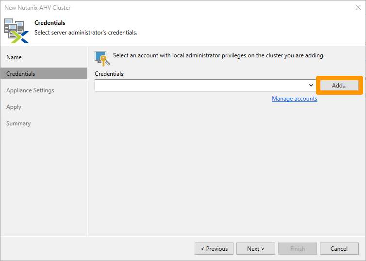{.thumbnail}

Enter the information for the account created earlier in **Prism Element**:

- **Username**: `svc_veeam`
- **Password**: `Password`

Click `OK`{.action}.

{.thumbnail}

Check that the account you have created has been selected in the "Credentials" field, then click `Next`{.action}.

{.thumbnail}

Click `Continue`{.action} to validate the certificate warning message.

{.thumbnail}

Check `Use the following IP address`{.action} and choose an unused private IP address (this address is used when backing up and restoring files), then click `Next`{.action}.

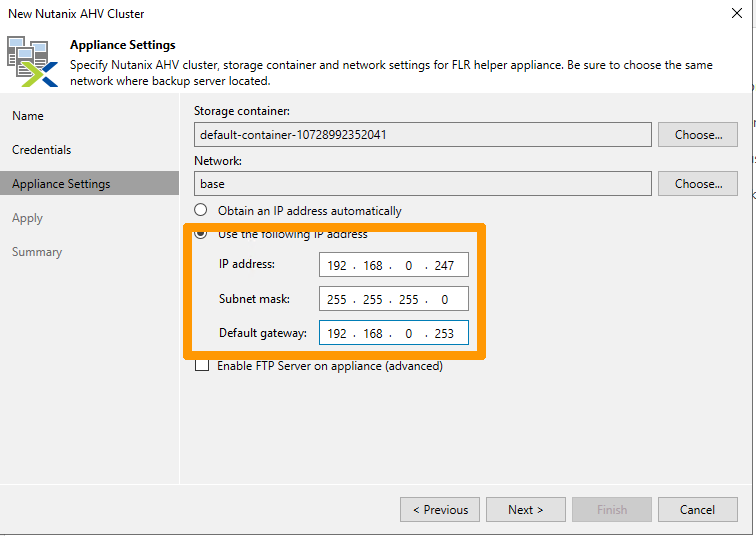{.thumbnail}

Click `Next`{.action}.

{.thumbnail}

Click `Finish`{.action}.

{.thumbnail}

Click `Yes`{.action}.

{.thumbnail}

Select `Deploy a new proxy`{.action} and click `Next`{.action}.

{.thumbnail}

Name the VM in the “Name” field, then click `Next`{.action}. 

{.thumbnail}

Click `Configure`{.action}. 

{.thumbnail}

Choose an unused `IP address`{.action} on the LAN for the virtual machine and click `OK`{.action}. 

{.thumbnail}

Click `Next`{.action}. 

{.thumbnail}

Click on `Add`{.action} to add and create the **NUTANIX-PROXY** VM login account. This VM is added when a Nutanix cluster is added to the **Veeam Backup and replication** console.

> [!warning]
> Take note of the user account and password created. These credentials allow you to connect to the new virtual machine via the web browser, without going through the **Veeam backup** software. The URL will be similar to `https://privateipaddress:8100`.

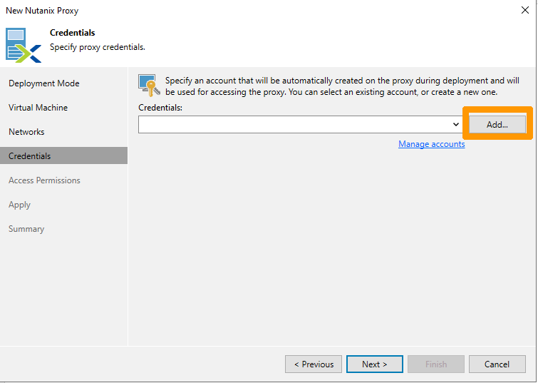{.thumbnail}

Enter the information for the account you created earlier in Prism Element:

- **Username**: `proxy_user`
- **Password**: `password`

Click `OK`{.action}.

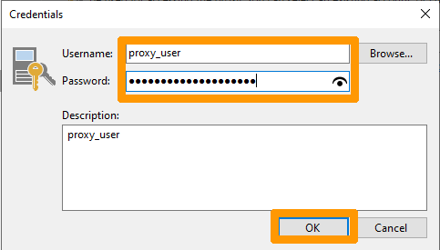{.thumbnail}

Check the user account in the "Credentials" field and click `Next`{.action}.

{.thumbnail}

Check the box `Allow access to all backup repositories`{.action} and click `Next`{.action}.

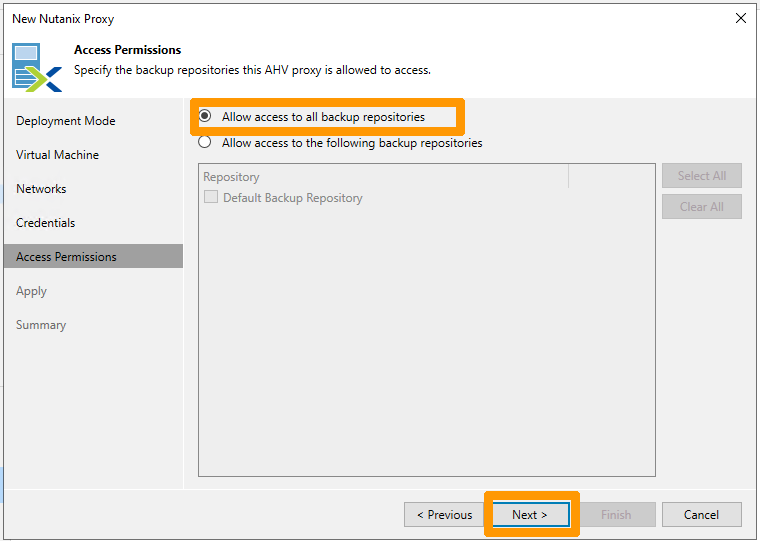{.thumbnail}

Wait a few minutes.

{.thumbnail}

The installation ends with a warning message. Please ignore this, as it is the public DNS server that cannot resolve the Veeam server name.<br>
Click `Next`{.action}.

{.thumbnail}

#### Modifying the interface virtual machine host file

> [!primary]
> 
> This operation is required if you do not use an internal DNS server to resolve VM names.
> Notably the VM that is used for the Veeam Backup software.

Via **Prism Central**, connect to the NUTANIX-PROXY virtual machine. 

Open the main menu at the top left and choose `VMs`{.action}.

{.thumbnail}

Click on the NUTANIX-PROXY virtual machine. 

{.thumbnail}

Click `Launch console`{.action}.

{.thumbnail}

Log in with the user account you created earlier and the password associated with that account.

{.thumbnail}

From the console, edit the `/etc/hosts` file:

```bash
proxy_user@NUTANIX-PROXY~$sudo nano /etc/hosts
[sudo] password for proxy_user:
```

Add this information, which corresponds to the IP address and name of the virtual machine where Veeam Backup is installed:

```bash
192.168.0.245 VEEAM-BACKUP 
```

Save the file and run this command:

```bash
proxy_user@NUTANIX-PROXY~$sudo /etc/init.d/networking restart
[sudo] password for proxy_user:
```

### Creating the Enterprise File Storage volume via the OVHcloud Control Panel

Log in to the [OVHcloud Control Panel](https://www.ovh.com/auth/?action=gotomanager&from=https://www.ovh.de/&ovhSubsidiary=de). In the `Bare Metal Cloud`{.action} tab, go to `Storage and Backup`{.action}. Select `Enterprise File Storage`{.action}, then the service that will be used for the **Veeam Backup**.

{.thumbnail}

In the `Volumes`{.action} tab, click `Create a volume`{.action}.

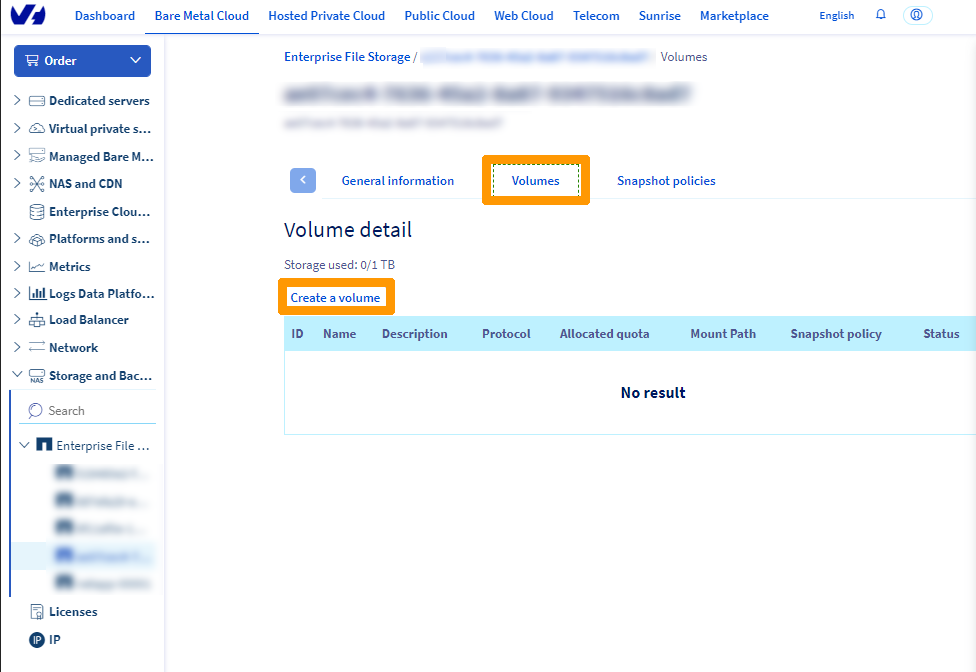{.thumbnail}

Choose these options to create a 500 GB volume.

- **Volume name (optional)**: `BACKUP`
- **Description (optional)**: `BACKUP`
- **Volume size**: `500`

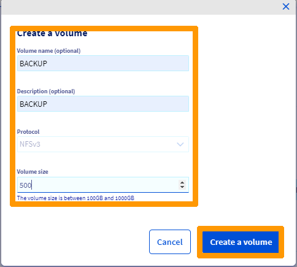{.thumbnail}

Modify the settings of the new volume by clicking on the `...`{.action} button. Choose `Modify Volume`{.action}.

{.thumbnail}

In the `Access Control (ACL)`{.action} tab, click `Add a new access`{.action}.

{.thumbnail}

In the “Access to” field, enter the public IP address used on the VM Veeam Backup that serves as an internet gateway.
In the “Access permissions” field, choose `Read and write`{.action}.

{.thumbnail}

Once validated, a message will appear informing you that the access control has been created.

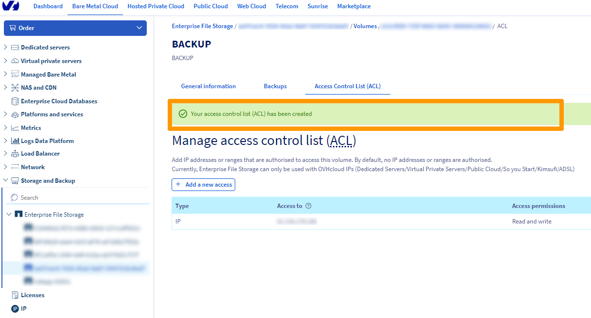{.thumbnail}

In the `General Information`{.action} tab, click the `Copy`{.action} icon to copy the "Mount path".  

> [!primary]
> The copied item is the repository that is used by **Veeam Backup**.
> The syntax should be similar to: **ipaddress://share_name**.
>

{.thumbnail}

### Add Enterprise File Storage repository in Veeam Backup

Via the **Veeam Backup** console, click on `Backup Infrastructure`{.action} at the bottom right, choose `Backup Repositories`{.action} and click on `Add repository`{.action}. 

{.thumbnail}

Choisissez `Network attached storage`{.action}. 

{.thumbnail}

Click on `NFS share`{.action}.

{.thumbnail}

Name the repository and click `Next`{.action}.

{.thumbnail}

In the “Shared folder” field, type or paste the name of the shared volume and click `Next`{.action}.

> [!primary]
> Enter the "Mount path" copied from the OVHcloud Control Panel.
>

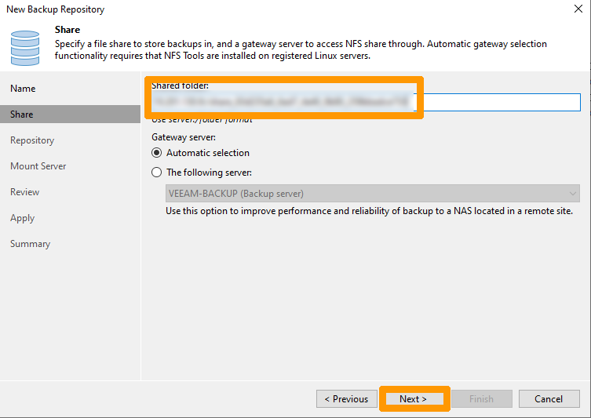{.thumbnail}

Click `Next`{.action}.

{.thumbnail}

Click `Next`{.action}.

{.thumbnail}

Click `Apply`{.action}.

{.thumbnail}

Click `Next`{.action}.

{.thumbnail}

Click `Finish`{.action}.

{.thumbnail}

### Setting up an automated backup

In **Veeam backup**, open the `Home`{.action} menu (bottom left), then the `Backup Job`{.action} menu and choose `Nutanix AHV`{.action}.

{.thumbnail}

The **AHV Proxy** web interface opens.

Name the task you want to create, tick the `Backup job`{.action} option, and click `Next`{.action}.

{.thumbnail}

Click `Add`{.action}.

{.thumbnail}

Select the virtual machines you want to back up and click `Add`{.action}.

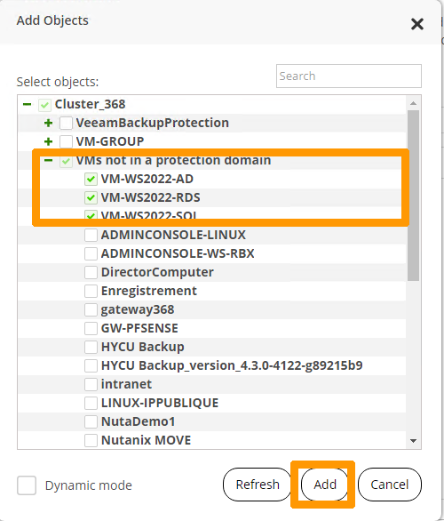{.thumbnail}

Click `Next`{.action}.

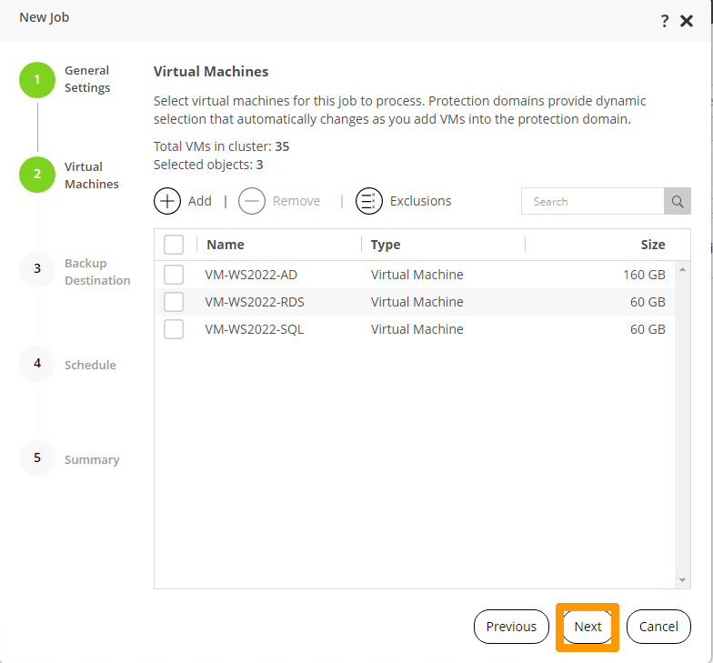{.thumbnail}

Select the repository in `Backup repository`{.action} and click `Next`{.action}.

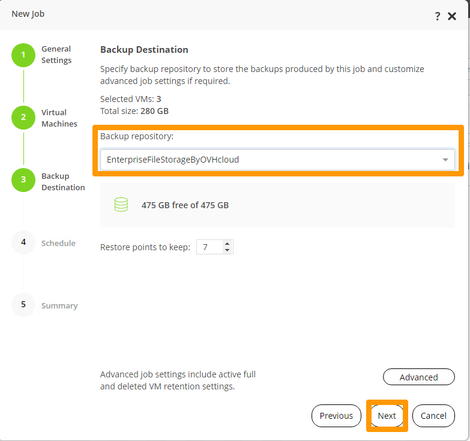{.thumbnail}

Select the `Run the job automatically`{.action} check box, set the frequency, and click `Next`{.action}.

{.thumbnail}

Click `Finish`{.action} to save the backup job.

{.thumbnail}

The backup is visible through the **AHV Proxy** web interface.

{.thumbnail}

Return to the **Veeam Backup** console via the `Home`{.action} menu (at the bottom left). Click `Jobs`{.action} to view the backup job you created.

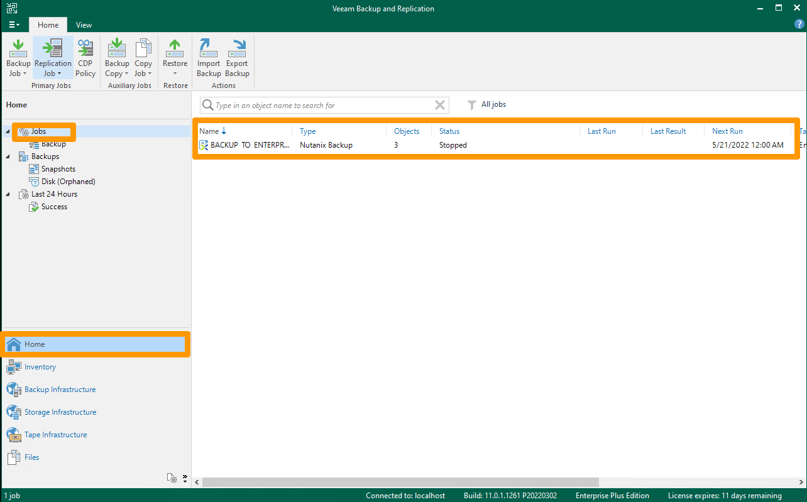{.thumbnail}

### Restoring a Virtual Machine

To test that backups are working properly, we will run a recovery task.

Click on `Home`{.action} in the bottom left. In the `Restore`{.action} option, select `Nutanix AHV`{.action}.

{.thumbnail}

Click `Restore from AHV backup`{.action}.

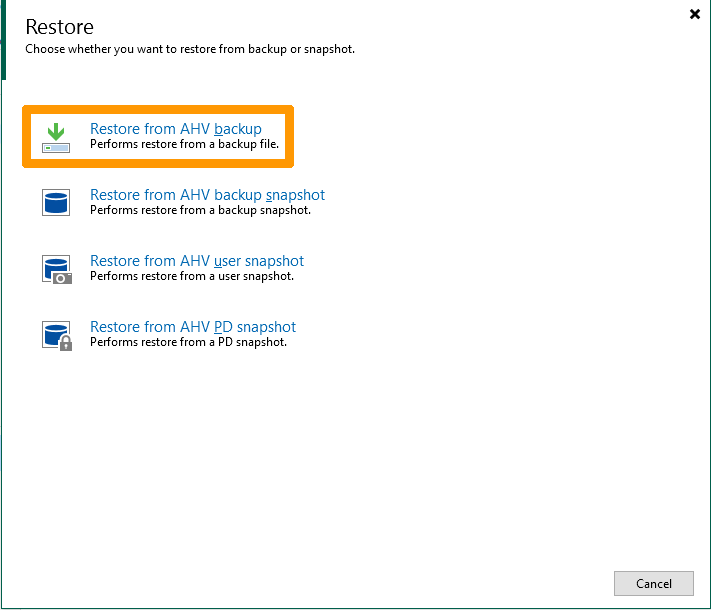{.thumbnail}

Click `Entire VM restore`{.action}.

{.thumbnail}

Click `Add`{.action}.

{.thumbnail}

Select a virtual machine and click `Add`{.action}.

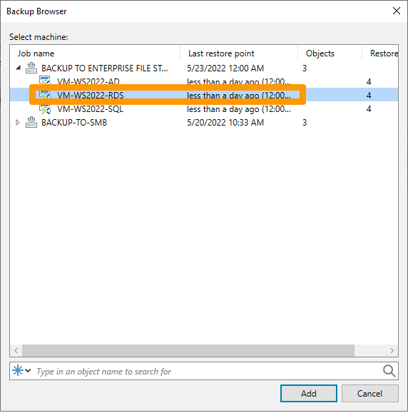{.thumbnail}

Click `Next`{.action}.

{.thumbnail}

Choose `Restore to a new location, or with different settings`{.action} and click `Next`{.action}.

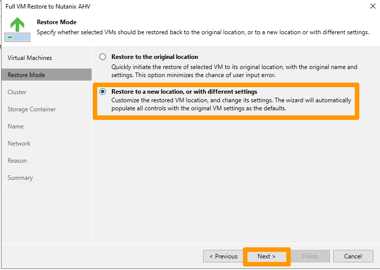{.thumbnail}

Click `Next`{.action}.

{.thumbnail}

Click `Next`{.action}.

{.thumbnail}

Rename the VM in `New name`{.action} and click `Next`{.action}.

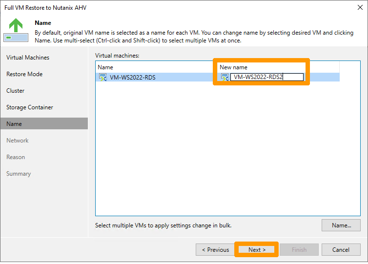{.thumbnail}

Click `Disconnect`{.action} to isolate the restored VM from the network.

{.thumbnail}

Click `Next`{.action}.

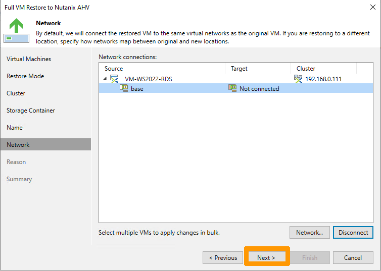{.thumbnail}

Click `Next`{.action}.

{.thumbnail}

Click `Finish`{.action}.

{.thumbnail}

A preview of the status of the restoration is launched, it takes some time depending on the size of the virtual machine.

{.thumbnail}

## Go further <a name="gofurther"></a>

[VEEAM documentation on installing VEEAM Backup for Nutanix AHV](https://helpcenter.veeam.com/docs/van/userguide/installing.html?ver=30)

[OVHcloud storage solutions](/products/storage-backup)

If you need training or technical assistance to implement our solutions, contact your sales representative or click on [this link](https://www.ovhcloud.com/de/professional-services/) to get a quote and ask our Professional Services experts for assisting you on your specific use case of your project.

Join our community of users on <https://community.ovh.com/en/>.
