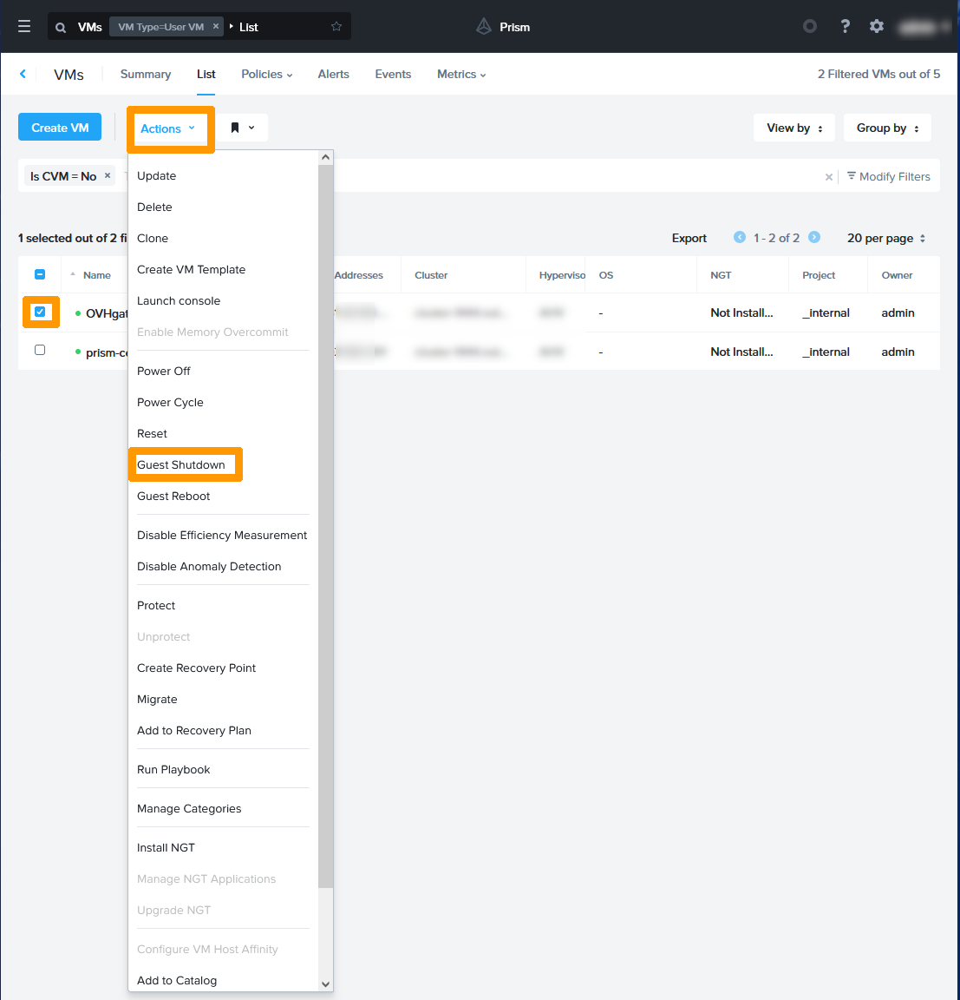
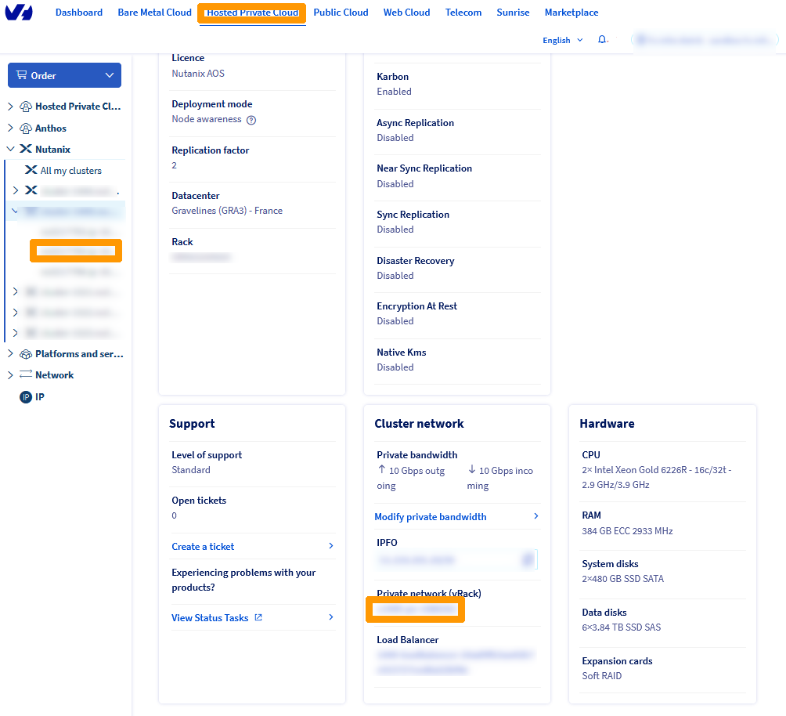
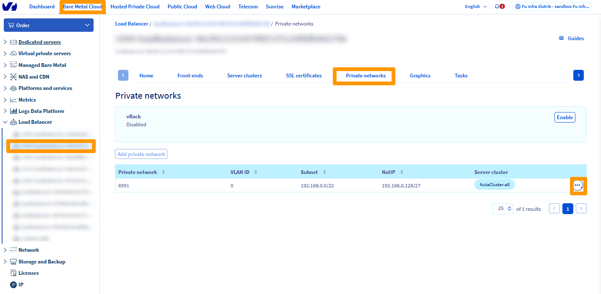
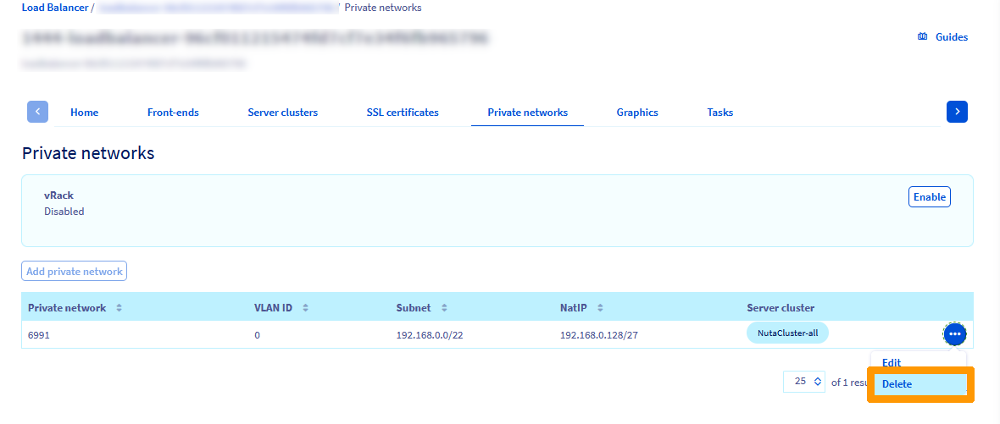
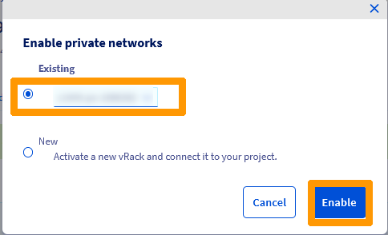
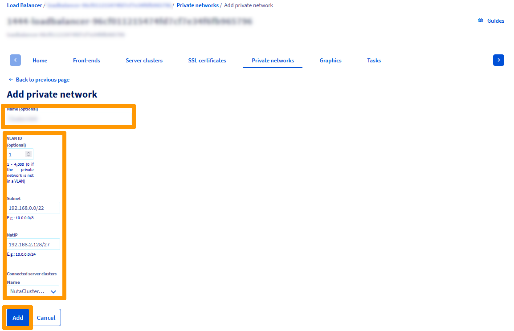
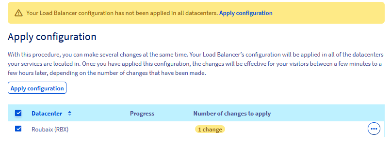
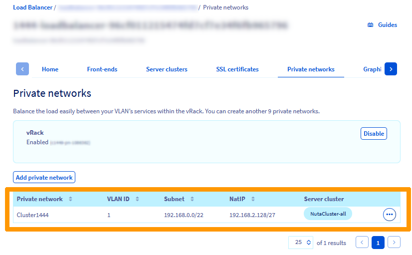

## Objective

**This guide will show you how to interconnect two Nutanix clusters Provided by OVHcloud across the same vRack in two remote OVHcloud sites. In this guide, the connection is made between the Gravelines and Roubaix datacentres.** 

> [!warning]
> OVHcloud provides services for which you are responsible, with regard to their configuration and management. It is therefore your responsibility to ensure that they work properly.
>
> This guide is designed to assist you as much as possible with common tasks. Nevertheless, we recommend contacting a specialist provider if you experience any difficulties or doubts when it comes to managing, using or setting up a service on a server.
>

## Requirements

- You must be logged in to your [OVHcloud Control Panel](https://www.ovh.com/auth/?action=gotomanager&from=https://www.ovh.es/&ovhSubsidiary=es).
- You must be connected to your clusters via Prism Central.

## Instructions

We are going to interconnect two remote Nutanix clusters, one in Gravelines and the other in Roubaix through the same vRack. 
See our [vRack overview](https://www.ovh.es/soluciones/vrack/) to learn more about the OVHcloud vRack solution.

### Preparing both clusters before interconnection

Before connecting the two clusters, ensure that they use different IP addresses (except for the gateway) on the same IP address range. 
In our guide, we will use the address range `192.168.0.0/22`.

 The Gravelines cluster uses these addresses:

- Server 1: **CVM** VM address `192.168.2.1`, **AHV** hypervisor IP address `192.168.2.21`.
- Server 2: **CVM** VM address `192.168.2.2`, **AHV** hypervisor IP address `192.168.2.22`.
- Server 3: **CVM** VM address '192.168.2.3', **AHV** hypervisor IP address `192.168.2.23`.
- Virtual address of **Prism Element**: `192.168.2.100`.
- **Prism Central** IP address:`192.168.2.101`.
- Gateway: `192.168.2.254`.
- Cluster version: `6.1`.

The Roubaix cluster uses these addresses:

- Server 1: **CVM** VM address `192.168.1.1`, **AHV** hypervisor IP address `192.168.1.21`.
- Server 2: **CVM** VM address `192.168.1.2`, **AHV** hypervisor IP address `192.168.1.22`.
- Server 3: **CVM** VM address `192.168.1.3`, **AHV** hypervisor IP address `192.168.1.23`.
- Virtual address of **Prism Element**: `192.168.1.100`.
- **Prism Central** IP address:`192.168.1.101`.
- Gateway: `192.168.2.254`.
- Cluster version: `6.1`.

Use our guide on [customised redeployment of your Cluster](/pages/hosted_private_cloud/nutanix_on_ovhcloud/00-cluster-custom-redeployment).

> [!primary]
> The guide mentioned above will help you redeploy both clusters. However, you can only redeploy one, the most important thing is not to have the same identical IP addresses across the network, except for the OVHgateway.
>

### Shutting down the OVHgateway virtual machine.

The outgoing internet connection is provided by OVHgateway virtual machines with the same private IP address on both sites. We will stop the OVHcloud Virtual Machine Gateway in Roubaix. This virtual machine will no longer be needed.

The outgoing internet connection will be restored when the connection through the **vRack** is made.

Log in to the cluster **Prism Central** interface located in Roubaix. 

Go to the virtual machine management section, select `OVHgateway` from the `Actions`{.action} menu and click `Guest Shutdown`{.action}.

{.thumbnail}

Access to Prism Central is maintained using the Load Balancer.

### Configuring vRacks

This operation involves deleting the vRack assignment in Roubaix and then extending the vRack from Gravelines to Roubaix. You can modify the vRack via the OVHcloud Control Panel. 

Log in to your [OVHcloud Control Panel](https://www.ovh.com/auth/?action=gotomanager&from=https://www.ovh.es/&ovhSubsidiary=es). 

#### Deleting Roubaix vRack elements.

From the `Hosted Private Cloud`{.action} menu, select the Roubaix cluster on the left in the `Nutanix` category and note the name of the vRack which is under `Private network (vRack)`.

{.thumbnail}

Go to the `Bare Metal Cloud` menu, click on the `vRack`{.action} concerned below the `vRack`{.action} option (in the `Network`{.action} submenu).

{.thumbnail}

Select all the elements that are in your vRack:

 - Dedicated servers
 - IPs
 - the Load Balancer

 Write them down and click `Remove`{.action}

> [!warning]
> 
> This operation may take a few minutes, please wait during this period.
> 

{.thumbnail}

### Adding deleted items from the Roubaix vRack into the Gravelines vRack

Go back to the `Hosted Private Cloud`{.action} menu, choose the Gravelines cluster from the `Nutanix` category and note the name of the vRack under `Private network (vRack)`.

{.thumbnail}

Go to the `Bare Metal Cloud` menu, select the `vRack`{.action} from Gravelines below the `vRack`{.action} option (from the `Network`{.action} submenu).

{.thumbnail}

Select these elements from the Roubaix cluster: 

- Physical servers 
- the public IP.

Then click `Add`{.action}.

> [!warning]
> 
> This operation may take a few minutes, please wait during this period. 
> 

> [!primary]
> 
> Adding the public address is not mandatory but it will make it available for future needs.
> 

{.thumbnail}

The **vRack** that was only used by the servers in the Gravelines cluster is now used on both sites and contains:

- The physical servers of the two clusters.
- The public IP addresses of the two clusters.
- The Gravelines Load Balancer, used for Prism Central.

Outgoing internet access on the Roubaix website is again available through the vRack and the OVHgateway virtual machine in Gravelines. Access to Prism Central for the Roubaix cluster is currently inaccessible.

### Modifying the Roubaix Load Balancer

We will reconfigure the Roubaix Load Balancer to work with the vRack shared by both sites, so that it can access Prism Central for the Roubaix cluster.

In the `Bare Metal Cloud` menu, select the Roubaix Load Balancer from the `Load Balancer`{.action} submenu.

Go to `Private networks`{.action}, click on the `...`{.action} to the right of the existing **private network**.

{.thumbnail}

Click `Delete`{.action}.

{.thumbnail}

Click `Delete`{.action} again at the confirmation request.

{.thumbnail}

Click `Enable`{.action} to the right of **vRack**.

{.thumbnail}

Select `Existing`, select the vRack that is common to both sites, and click on `Enable`{.action}.

{.thumbnail}

Click `Add Private Network`{.action}.

{.thumbnail}

Choose these values:

- **Name (optional)**: Private network name.
- **VLAN ID**: Nutanix management network VLAN, normally 1.
- **Subnet**: Private network LAN 192.168.0.0/22.
- **NatIP**: Address range used by the Load Balancer 192.168.2.128/27.
- **Name**: NutaCluster-all.

> [!warning]
> 
> The range chosen by **NatIp** should not be used by other elements of the private network, particularly the range taken by the Gravelines Load Balancer.
> 

Then click `Add`{.action}.

{.thumbnail}

A yellow banner appears, indicating that the configuration has not been applied. Click `Apply Configuration`{.action}.

{.thumbnail}

Select the `Roubaix(RBX)`{.action} datacentre and click on `Apply configuration`{.action}.

{.thumbnail}

The Load Balancer is connected to the vRack shared by both sites, and access to Prism Central for the Roubaix cluster is then available.

{.thumbnail}

## Go further

[Disaster Recovery Plan on Nutanix](/pages/hosted_private_cloud/nutanix_on_ovhcloud/43-disaster-recovery-plan-overview)

[Asynchronous or NearSync replication through Prism Element](/pages/hosted_private_cloud/nutanix_on_ovhcloud/46-prism-element-replication)

[Advanced replication with Leap](/pages/hosted_private_cloud/nutanix_on_ovhcloud/47-nutanix-leap)

[Introduction to vRacks](https://www.ovh.es/soluciones/vrack/)

If you need training or technical assistance to implement our solutions, contact your sales representative or click on [this link](https://www.ovhcloud.com/es-es/professional-services/) to get a quote and ask our Professional Services experts for assisting you on your specific use case of your project.

Join our community of users on <https://community.ovh.com/en/>.
