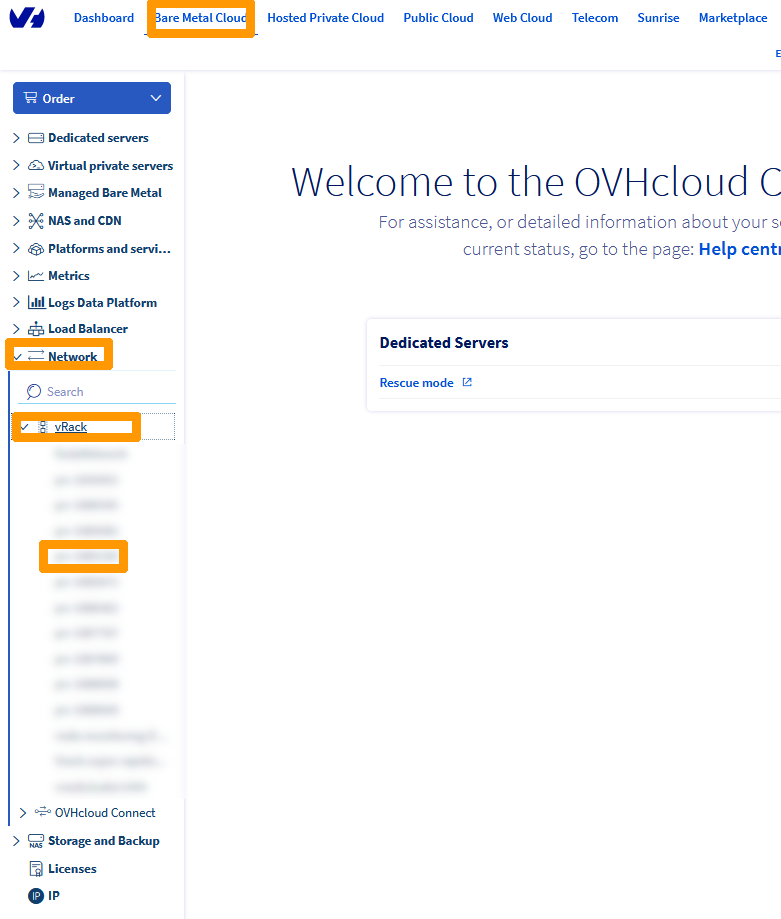
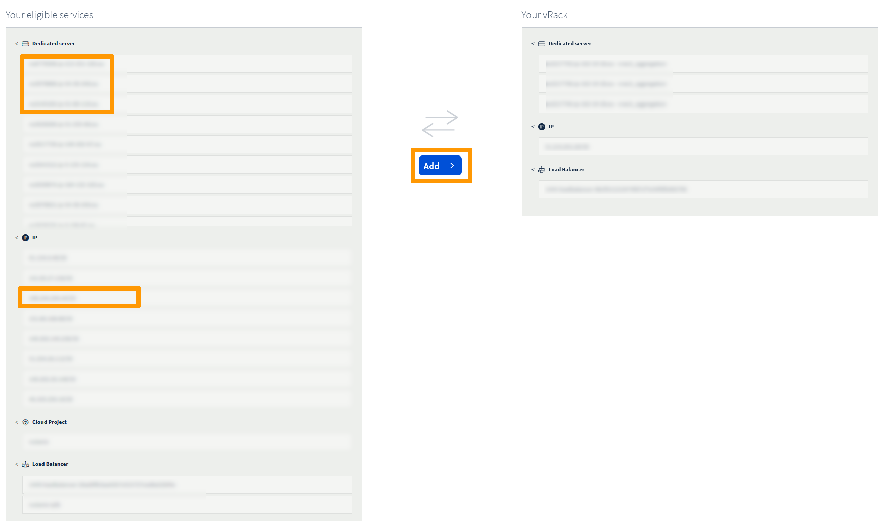

## Objectif

**Ce guide vous présente comment interconnecter deux clusters Nutanix Fournis par OVHcloud au travers d'un même vRack sur deux sites OVHcloud distants. Dans ce guide l'interconnexion est effectuée entre les datacenters de Gravelines et de Roubaix.** 

> [!warning]
> OVHcloud vous met à disposition des services dont la configuration, la gestion et la responsabilité vous incombent. Il vous appartient donc de ce fait d’en assurer le bon fonctionnement.
>
> Ce guide a pour but de vous accompagner au mieux sur des tâches courantes. Néanmoins, nous vous recommandons de faire appel à un prestataire spécialisé si vous éprouvez des difficultés ou des doutes concernant l’administration, l’utilisation ou la mise en place d’un service sur un serveur.
>

## Prérequis

- Être connecté à votre [espace client OVHcloud](https://www.ovh.com/auth/?action=gotomanager&from=https://www.ovh.com/fr/&ovhSubsidiary=fr).
- Être connecté sur vos clusters via Prism Central.

## En pratique

Nous allons interconnecter deux clusters Nutanix distants, l'un à Gravelines et l'autre à Roubaix au travers du même vRack. 
Consultez notre [présentation du vRack](https://www.ovh.com/fr/solutions/vrack/) pour en savoir plus sur la solution vRack OVHcloud.

### Préparation des deux clusters avant l'interconnexion

Avant d'interconnecter les deux clusters il faut s'assurer qu'ils utilisent des adresses IP différentes (sauf pour la passerelle) sur une même plage d'adresses IP. 
Dans notre guide, nous allons utiliser la plage d'adresses `192.168.0.0/22`.

 Le cluster de Gravelines utilise ces adresses :

- Serveur 1 : adresse VM **CVM** `192.168.2.1`, adresse IP hyperviseur **AHV** `192.168.2.21`.
- Serveur 2 : adresse VM **CVM** `192.168.2.2`, adresse IP hyperviseur **AHV** `192.168.2.22`.
- Serveur 3 : adresse VM **CVM** `192.168.2.3`, adresse IP hyperviseur **AHV** `192.168.2.23`.
- Adresse virtuelle de **Prism Element** : `192.168.2.100`.
- Adresse IP **Prism Central** :`192.168.2.101`.
- Passerelle : `192.168.2.254`.
- Version du cluster : `6.1`.

Le cluster de Roubaix utilise ces adresses :

- Serveur 1 : adresse VM **CVM** `192.168.1.1`, adresse IP hyperviseur **AHV** `192.168.1.21`.
- Serveur 2 : adresse VM **CVM** `192.168.1.2`, adresse IP hyperviseur **AHV** `192.168.1.22`.
- Serveur 3 : adresse VM **CVM** `192.168.1.3`, adresse IP hyperviseur **AHV** `192.168.1.23`.
- Adresse virtuelle de **Prism Element** : `192.168.1.100`.
- Adresse IP **Prism Central** :`192.168.1.101`.
- Passerelle : `192.168.2.254`.
- Version du cluster : `6.1`.

Aidez-vous de notre guide dédié au [redéploiement personnalisé de votre Cluster](/pages/hosted_private_cloud/nutanix_on_ovhcloud/00-cluster-custom-redeployment).

> [!primary]
> Le guide mentionné ci-dessus vous propose de redéployer les deux clusters. Néanmoins, vous pouvez n'en redéployer qu'un, le plus important est de ne pas avoir les mêmes adresses IP identiques sur l'ensemble du réseau, sauf pour la passerelle OVHGateway.
>

### Arrêt de la machine virtuelle OVHgateway.

La connexion Internet sortante est fournie par les machines virtuelles OVHgateway avec la même adresse IP privée sur les deux sites. Nous allons arrêter la machine virtuelle OVHGateway de Roubaix. Cette machine virtuelle ne sera plus nécessaire.

La connexion Internet sortante sera rétablie quand l'interconnexion au travers du **vRack** sera faite.

Connectez-vous à l'interface **Prism Central** du cluster situé à Roubaix. 

Rendez-vous dans la gestion des machines virtuelles, sélectionnez `OVHgateway` au travers du menu `Actions`{.action} et cliquez sur `Guest Shutdown`{.action}.

{.thumbnail}

L'accès à Prism Central est maintenu à l'aide du Load Balancer.

#### Paramétrage des vRack

Cette opération consiste à supprimer l'affectation du vRack à Roubaix et ensuite à étendre le vRack de Gravelines avec Roubaix. Les modifications du vRack se font au travers de l'espace client OVHcloud. 

Connectez-vous à votre [espace client OVHcloud](https://www.ovh.com/auth/?action=gotomanager&from=https://www.ovh.com/fr/&ovhSubsidiary=fr). 

#### Suppression des éléments du vRack de Roubaix.

A partir du menu `Hosted Private Cloud`{.action}, choisissez le cluster de Roubaix à gauche dans la catégorie `Nutanix` et notez le nom du vRack qui se trouve en dessous de « Réseau privé(vRack) ».

{.thumbnail}

Rendez-vous dans le menu `Bare Metal Cloud`, cliquez sur le `vRack`{.action} concerné en dessous de l'option `vRack`{.action} (dans le sous-menu `Network`{.action}).

{.thumbnail}

Sélectionnez tous les éléments qui se trouvent dans votre vRack :

 - Les serveurs dédiés ;
 - les IP ;
 - le Load Balancer.

 Notez-les et cliquez sur `Retirer`{.action}

> [!warning]
> 
> Cette opération peut durer quelques minutes, veuillez patienter pendant cette période.
> 

{.thumbnail}

#### Ajout d'éléments supprimés du vRack de Roubaix dans le vRack de Gravelines

Revenez dans le menu `Hosted Private Cloud`{.action}, choisissez le cluster de Gravelines dans la catégorie `Nutanix` et notez le nom du vRack en dessous de « Réseau privé (vRack) ».

{.thumbnail}

Rendez-vous dans le menu `Bare Metal Cloud`, sélectionnez le `vRack`{.action} de Gravelines en dessous de l'option `vRack`{.action} (dans le sous-menu `Network`{.action}).

{.thumbnail}

Sélectionnez ces éléments du cluster de Roubaix : 

- Les serveurs physiques ; 
- l'IP publique.

Cliquez ensuite sur `Ajouter`{.action} .

> [!warning]
> 
> Cette opération peut durer quelques minutes, veuillez patienter pendant cette période. 
> 

> [!primary]
> 
> L'ajout de l'adresse publique n'est pas obligatoire mais elle pourra être disponible pour de futurs besoins.
> 

{.thumbnail}

Le **vRack** qui était uniquement utilisé par les serveurs du cluster de Gravelines est maintenant utilisé sur les deux sites et contient :

- Les serveurs physiques des deux clusters.
- Les adresses IP publiques des deux clusters.
- Le Load Balancer de Gravelines qui sert pour Prism Central.

L'accès Internet sur le site de Roubaix en sortie est à nouveau disponible au travers du vRack et de la machine virtuelle OVHgateway de Gravelines. L'accès à Prism Central du cluster de Roubaix est pour l'instant inaccessible.

### Modification du Load Balancer de Roubaix

Nous allons reconfigurer le Load Balancer de Roubaix pour qu'il fonctionne avec le vRack commun aux deux sites, afin de pouvoir accéder à Prism Central pour le cluster de Roubaix.

Toujours dans le menu `Bare Metal Cloud`, sélectionnez le Load Balancer de Roubaix dans le sous-menu `Load Balancer`{.action}.

Positionnez-vous sur `Réseaux privés`{.action}, cliquez sur le bouton `...`{.action} à droite du **réseau privé** existant.

{.thumbnail}

Cliquez sur `Supprimer`{.action}.

{.thumbnail}

Cliquez à nouveau sur `Supprimer`{.action} à la demande de confirmation.

{.thumbnail}

Cliquez sur `Activer`{.action} à droite de **vRack**.

{.thumbnail}

Choisissez `Existant`, sélectionnez le vRack commun aux deux sites et cliquez sur `Activer`{.action}.

{.thumbnail}

Cliquez sur `Ajouter un réseau privé`{.action}.

{.thumbnail}

Choisissez ces valeurs :

- **Nom (facultatif)** : Nom du réseau privé.
- **VLAN ID** : VLAN du réseau d'administration de Nutanix, normalement le 1.
- **Subnet** : LAN du réseau privé 192.168.0.0/22.
- **NatIP** : Plage d'adresses utilisée par le Load Balancer 192.168.2.128/27.
- **Nom** : NutaCluster-all.

> [!warning]
> 
> La plage choisie par **NatIp** ne doit pas être utilisée par d'autres éléments du réseau privé, notamment la plage prise par le Load Balancer de Gravelines.
> 

Cliquez ensuite sur `Ajouter`{.action}.

{.thumbnail}

Un bandeau jaune apparait, vous indiquant que la configuration n'est pas appliquée. Cliquez sur `Appliquer la configuration`{.action}.

{.thumbnail}

Sélectionnez le Datacenter `Roubaix(RBX)`{.action} et cliquez sur `Appliquer la configuration`{.action}.

{.thumbnail}

Le Load Balancer est relié au vRack commun aux deux sites et l'accès à Prism Central pour le cluster de Roubaix est à nouveau disponible.

{.thumbnail}

## Aller plus loin

[Plan de reprise d'activité sous Nutanix](/pages/hosted_private_cloud/nutanix_on_ovhcloud/43-disaster-recovery-plan-overview)

[Réplication asynchrone ou NearSync au travers de Prism Element](/pages/hosted_private_cloud/nutanix_on_ovhcloud/46-prism-element-replication)

[Réplication avancée avec Leap](/pages/hosted_private_cloud/nutanix_on_ovhcloud/47-nutanix-leap)

[Présentation des vRack](https://www.ovh.com/fr/solutions/vrack/)

Si vous avez besoin d'une formation ou d'une assistance technique pour la mise en oeuvre de nos solutions, contactez votre commercial ou cliquez sur [ce lien](https://www.ovhcloud.com/fr/professional-services/) pour obtenir un devis et demander une analyse personnalisée de votre projet à nos experts de l’équipe Professional Services.

Échangez avec notre communauté d'utilisateurs sur <https://community.ovh.com/>.

