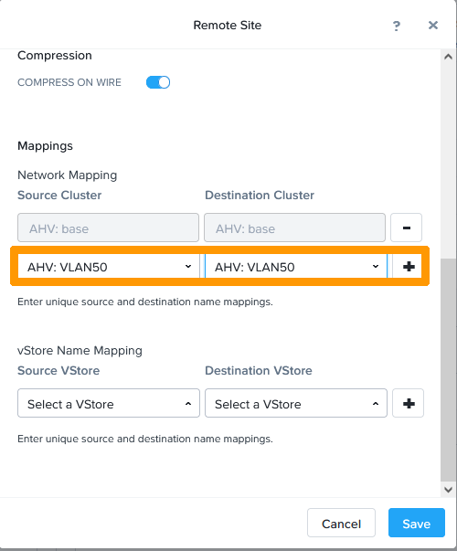
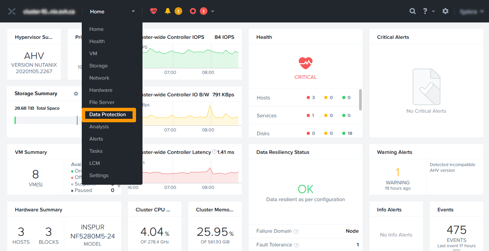
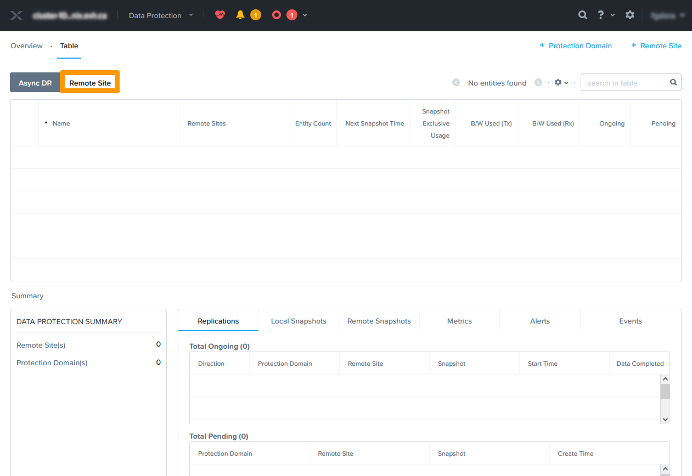
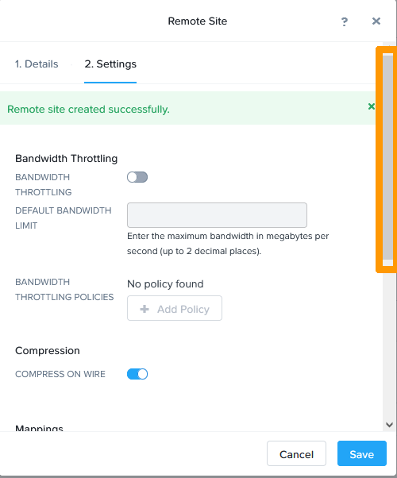
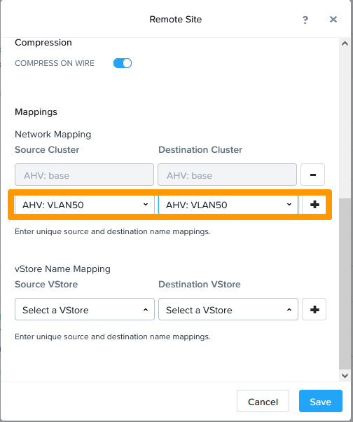
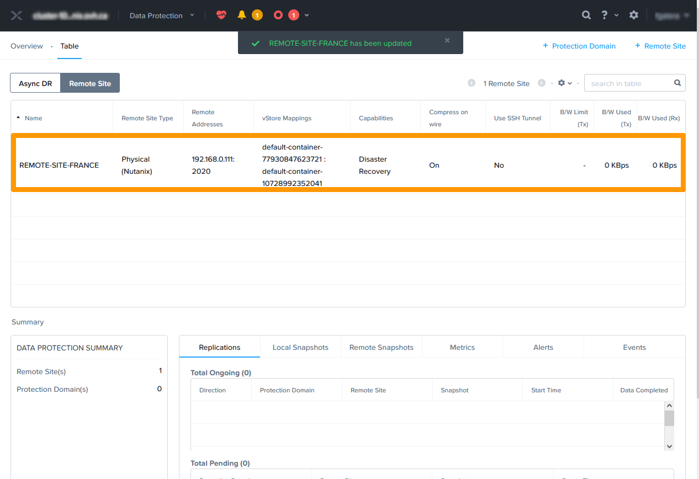
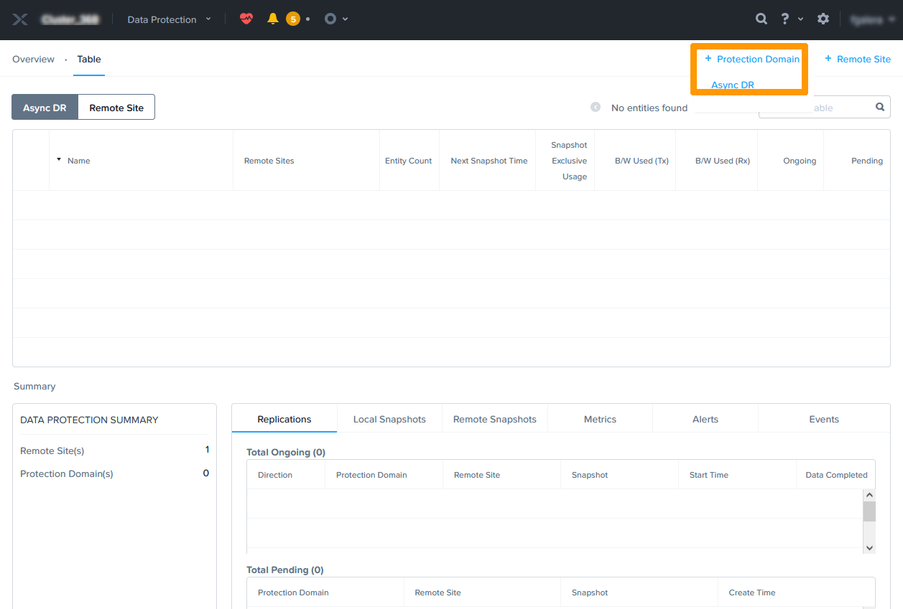
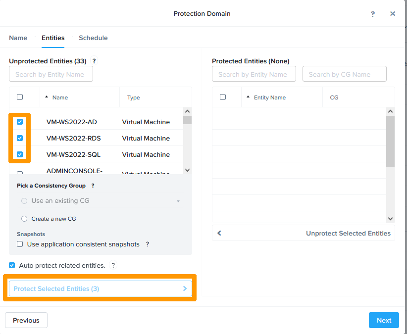
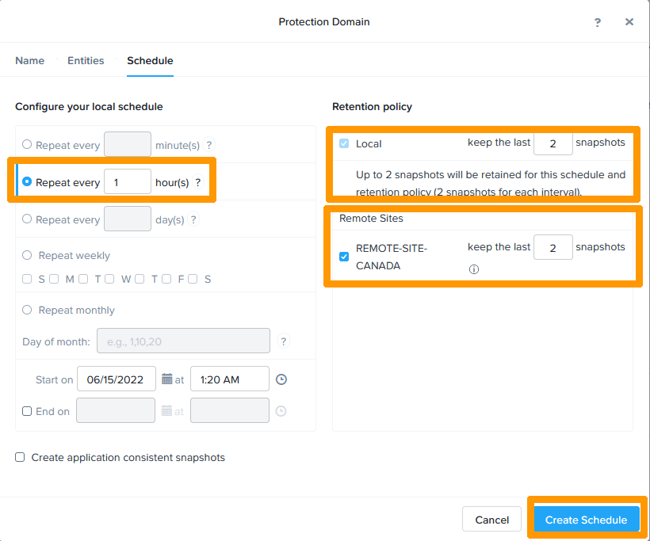
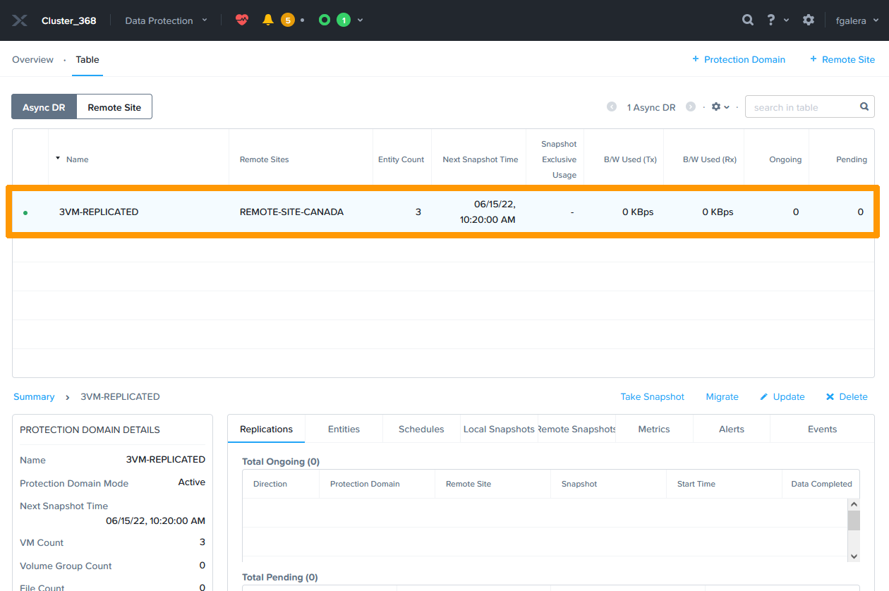

**Dernière mise à jour le 29/06/2022**

## Objectif

Ce guide vous détaille comment mettre en place une réplication entre clusters au travers de Prism Element.

> [!warning]
> OVHcloud vous met à disposition des services dont la configuration, la gestion et la responsabilité vous incombent. Il vous appartient donc de ce fait d’en assurer le bon fonctionnement.
>
> Ce guide a pour but de vous accompagner au mieux sur des tâches courantes. Néanmoins, nous vous recommandons de faire appel à un prestataire spécialisé si vous éprouvez des difficultés ou des doutes concernant l’administration, l’utilisation ou la mise en place d’un service sur un serveur.
>

## Présentation

Via **Prism Element**, il est possible :

- d'ajouter des liaisons vers des clusters distants;
- de créer des domaines de protection pour rajouter des réplications vers des sites distants.

> [!warning]
> 
> Le pack **Nutanix Standard** OVHcloud vous permet d'utiliser des réplications asynchrones **toutes les heures**. 
>
> Pour obtenir un délai de réplication plus court compris entre 1 et 15 minutes, il vous faut configurer des réplications *NearSync*. Cette option n'est disponible qu'avec le pack **Nutanix Advanced** OVHcloud.
> 

## Prérequis

- Disposer de deux clusters Nutanix dans votre compte OVHcloud.
- Être connecté à votre [espace client OVHcloud](https://www.ovh.com/auth/?action=gotomanager&from=https://www.ovh.com/fr/&ovhSubsidiary=fr).
- Être connecté à vos clusters via **Prism Central**.
- Avoir mis en place une interconnexion entre deux clusters, par exemple via un VPN IPsec.

## En pratique

Nous allons utiliser deux clusters Nutanix se trouvant dans les datacenters OVHcloud, l'un au Canada et l'autre en France, connectés via un VPN IPsec, sur deux plans d'adressages IP différents qui sont :

- **192.168.0.0/24** pour le cluster se trouvant dans un datacenter en France.
- **192.168.10.0/24** pour le cluster se trouvant dans un datacenter au Canada.

Si vous souhaitez de l'aide concernant la mise en place d'un VPN IPsec, consulter notre guide sur l'[interconnexion de deux clusters Nutanix au travers d'un VPN IPsec](/pages/hosted_private_cloud/nutanix_on_ovhcloud/44-ipsec-interconnection).

Connectez-vous via **Prism Element** au cluster en France à partir de **Prism Central**, comme indiqué dans cette documentation : [Hyper-convergence Nutanix](/pages/hosted_private_cloud/nutanix_on_ovhcloud/03-nutanix-hci).

Cliquez sur `Data Protection`{.action} depuis le menu `Home`{.action}.

{.thumbnail} 

Cliquez sur `Remote Site`{.action} à gauche de l'écran.

{.thumbnail}

Cliquez sur `+ Remote Site`{.action} à droite de l'écran et choisissez `Physical Cluster`{.action} pour rajouter un site distant.

{.thumbnail}

Nommez le site distant dans le champ `REMOTE SITE NAME`, saisissez l'adresse IP de **Prism Element** du site distant en France dans le champ `CLUSTER VIRTUAL IP` et cliquez sur `Add Site`{.action}.

{.thumbnail}

Faites défiler la fenêtre à l'aide de La `barre de défilement`{.action}.

{.thumbnail}

Dans la rubrique **Network Mapping**, sélectionnez `AHV: base` dans les menus déroulants **Source Cluster** et **Destination Cluster** puis cliquez sur le bouton `+`{.action}.

{.thumbnail}

Si vous avez un autre VLAN, répétez la même opération avec le nom du VLAN `AHV: VLAN50`. Cliquez sur le bouton `+`{.action} pour valider l'association des réseaux sources et destinations.

{.thumbnail}

Choisissez `default-container...` dans les menus déroulants **Source VStore** et **Destination VStore**. Cliquez ensuite sur le bouton `+`{.action} pour relier le stockage source et destination.

{.thumbnail}

Cliquez sur `Save`{.action}.

{.thumbnail}

Le site distant apparait alors dans la liste.

{.thumbnail}

Nous allons maintenant nous connecter sur l'interface **Prism Element** du site distant au Canada et effectuer la même opération.

Via le menu `Home`{.action}, cliquez sur `Data Protection`{.action}.

{.thumbnail} 

Cliquez sur `Remote Site`{.action} à gauche de l'écran.

{.thumbnail}

Cliquez sur `+ Remote Site`{.action} à droite de l'écran et choisissez `Physical Cluster`{.action} pour rajouter un site distant.

{.thumbnail}

Nommez le site distant dans le champ `REMOTE SITE NAME`, saisissez l'adresse IP de **Prism Element** du site distant au Canada dans le champ `CLUSTER VIRTUAL IP` et cliquez sur `Add Site`{.action}.

{.thumbnail}

Faites défiler la fenêtre à l'aide de La `barre de défilement`{.action}.

{.thumbnail}

Dans **Network Mapping**, sélectionnez `AHV: base` dans les menus déroulants **Source Cluster** et **Destination Cluster**. Cliquez ensuite sur le bouton `+`{.action}.

{.thumbnail}

Si vous avez un autre VLAN, répétez la même opération avec le nom du VLAN `AHV: VLAN50`. Cliquez sur le bouton `+`{.action} pour valider l'association du réseau source et destination.

{.thumbnail}

Choisissez `default-container...` dans les menus déroulants **Source VStore** et **Destination VStore** puis cliquez sur le bouton `+`{.action} pour valider la connexion  du stockage source et destination. 

{.thumbnail}

Cliquez sur `Save`{.action}.

{.thumbnail}

Le site distant apparait alors dans la liste. 

{.thumbnail}

### Mise en place de la réplication entre site

Maintenant que les deux sites sont reliés, nous allons créer un domaine de protection avec une réplication asynchrone contenant trois machines virtuelles se trouvant sur le cluster en France vers le site distant au Canada.

Revenez sur l'interface **Prism Element** du cluster se trouvant en France.

Choisissez `Data Protection`{.action} dans le menu principal `Home`{.action}.

{.thumbnail}

Depuis le tableau de bord **Data Protection**, cliquez en haut à droite sur `+ Protection Domain`{.action} puis sur `Async DR`{.action}.

{.thumbnail}

Nommez le domaine de protection et cliquez sur `Create`{.action}.

{.thumbnail}

Sélectionnez trois machines virtuelles et cliquez sur `Protect Selected Entities`{.action}.

{.thumbnail}

Cliquez sur `Next`{.action}.

{.thumbnail}

Cliquez sur `New Schedule`{.action} pour configurer la planification.

{.thumbnail}

Modifiez cette option pour **Configure your local schedule** :

- Saisissez **Repeat every** `1 hour`. 

Saisissez ensuite les règles de rétention dans **Retention policy** :

- Choisissez en local et à distance **keep the last** `2` **snapshots** pour garder deux snapshots en local et à distance. 

Cliquez sur `Create Schedule`{.action} pour valider la planification.

{.thumbnail}

La tâche de réplication est créée pour fonctionner toutes les heures. Il s'agira d'une réplication asynchrone utilisable avec le pack **Nutanix Standard** OVHcloud. 

Cliquez sur `Close`{.action} pour fermer la fenêtre.

> [!primary]
> 
> Vous pouvez modifier la planification pour réduire le risque de perte de données en cas de désastre mais la réplication va basculer du mode asynchrone au mode *NearSync* et il vous faudra alors faire évoluer votre licence vers le pack **Nutanix Advanced** OVHcloud.

{.thumbnail}

Le domaine de protection est créé et apparait dans la liste.

{.thumbnail}

### Migration des machines virtuelles

La migration des machines virtuelles est une opération de bascule des machines virtuelles membres d'un domaine de protection vers le site distant sans perte de données. Il faut que les deux clusters soient en ligne et communiquent correctement entre eux. 

Les étapes de la migration sont les suivantes :

1. Arrêt des machines virtuelles sur le cluster source (si elles sont allumées).
2. Réplication des données manquantes vers le cluster de destination.
3. Suppression des machines virtuelles sur le cluster source.
4. Désactivation de la planification.
5. Activation des machines virtuelles sur le cluster de destination.
6. La réplication est inversée, la destination devient la source.

Rendez-vous dans l'interface **Prism Element** où se trouvent les machines virtuelles répliquées.

Dans le tableau de bord **Data Protection**, cliquez sur `Migrate`{.action}. 

{.thumbnail}

Sélectionnez le site distant, saisissez `MIGRATE` et cliquez sur `Migrate`{.action}.

{.thumbnail}

La migration est alors lancée. Elle sera terminée quand les machines virtuelles apparaîtront sur le site distant et ne seront plus visibles sur le site d'origine. 

Les machines virtuelles migrées étant éteintes, vous devez les démarrer manuellement.

{.thumbnail}

### Basculement des machines virtuelles en cas de sinistre

Si le site d'origine est hors service, vous pouvez activer les machines virtuelles membres d'un domaine de protection sur le site de destination. 

> [!warning]
> L'activation des machines virtuelles sur le site distant se fera avec les dernières données répliquées. Dans le cas d'une réplication asynchrone, le risque de perte de données maximal est d'une heure.

Connectez-vous sur le site fonctionnel avec **Prism Element**.

Allez sur le tableau de bord **Data Protection**.

Sélectionnez le site à activer et cliquez sur `Activate`{.action}. 

{.thumbnail}

Cliquez sur `Yes`{.action}. 

{.thumbnail}

Les machines virtuelles apparaîtront dans la console de **Prism Element** dans l'état de la dernière réplication. Les données modifiées après la dernière réplication valide seront perdues.

## Aller plus loin

[Plan de reprise d'activité sur Nutanix](/pages/hosted_private_cloud/nutanix_on_ovhcloud/43-disaster-recovery-plan-overview)

[Connexion IPsec](/pages/hosted_private_cloud/nutanix_on_ovhcloud/44-ipsec-interconnection)

[Documentation Nutanix sur Data Protection and Disaster Recovery](https://portal.nutanix.com/page/documents/solutions/details?targetId=BP-2005-Data-Protection:top-backup-and-disaster-recovery-on-remote-sites.html)

Si vous avez besoin d'une formation ou d'une assistance technique pour la mise en oeuvre de nos solutions, contactez votre commercial ou cliquez sur [ce lien](https://www.ovhcloud.com/fr/professional-services/) pour obtenir un devis et demander une analyse personnalisée de votre projet à nos experts de l’équipe Professional Services.

Échangez avec notre communauté d'utilisateurs sur <https://community.ovh.com/>.
