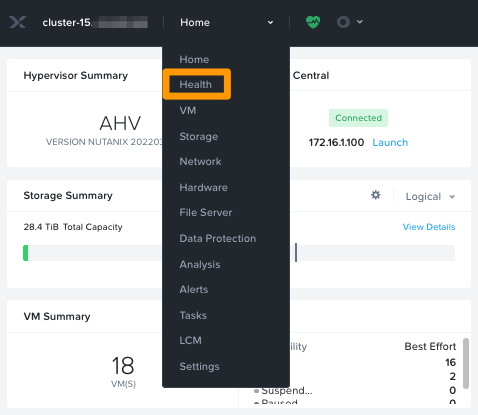
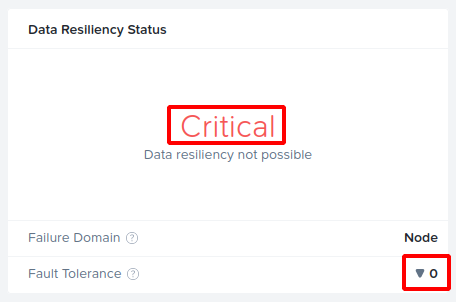

## Objective

This article provides you with the steps to update Nutanix cluster's firmwares by putting each node into maintenance, before rebooting one node at a time in rescue mode.

Our services will take over to apply updates and firmwares and will restart the node thereafter.

> [!warning]
> Before following the steps below, log in to your [OVHcloud Control Panel](https://www.ovh.com/auth/?action=gotomanager&from=https://www.ovh.it/&ovhSubsidiary=it) and create a support ticket, requesting a firmware update. Make sure to provide the OVHcloud support teams with all technical information regarding your cluster.

**This guide explains how to update your Nutanix cluster firmware.**

## Requirements

- A Nutanix cluster in your OVHcloud account
- Access to the [OVHcloud Control Panel](https://www.ovh.com/auth/?action=gotomanager&from=https://www.ovh.it/&ovhSubsidiary=it)
- Consulting the guide [First steps to use the OVHcloud API](/pages/manage_and_operate/api/first-steps) (to familiarise yourself with the OVHcloud API)

## Instructions

Before any other action, log in to your Prism Element interface and perform the following tasks:

- Check that the cluster's "**Data Resiliency Status**" is `OK`.

This can be verified on the main dashboard of your Prism Element interface:

{.thumbnail}

- Run an NCC check.

In the Prism Element interface, click `Health`{.action} from the main menu.

{.thumbnail}

Then click `Actions`{.action} to the right and click `Run NCC Checks`{.action}.

{.thumbnail}

Select `All checks`{.action} and click `Run`{.action}.

{.thumbnail}

A log file called `/home/nutanix/data/logs/ncc-output-latest.log` will be generated at the end of the checks.

Please analyse it carefully. If you find errors or fails about the cluster or service state, do not continue and contact the OVHcloud support.

> [!primary]
> It is possible to run NCC checks on the CVM by typing the following command from a terminal.

```bash
ncc health_checks run_all
```

### Enabling maintenance mode

Nodes will be updated one by one, the Nutanix cluster will continue to work properly.

To log in to CVM, you can launch IPMI from your OVHcloud Control Panel or use a terminal.

> [!primary]
> Before putting the host into maintenance, ensure that remaining hosts have enough resources to host migrated VMs from it (CPU, memory, storage).

#### Connect to CVM

At the login prompt, log in with root credentials to access the host terminal.<br>
Then open an SSH connection to any CVM with Nutanix credentials to access the CVM terminal.

{.thumbnail}

#### Check nodes state

Once logged in, check that:

- `Node state` status is set to `AcropolisNormal`.
- `Schedulable` column is set to `True` for all nodes.

Then run the following command to check:

```bash
acli host.list
```

{.thumbnail}

If all checks are OK, you need to check that the current host state can be changed to `Maintenance`. To do so, use the following command:

```bash
acli host.enter_maintenance_mode_check <Hypervisor_IP>
```

{.thumbnail}

#### Put a node in maintenance mode

> [!primary]
> VMs with specific policies (like affinity, CPU passthrough, etc.) should be stopped manually before running maintenance as they will not migrate.

If all hosts are eligible to enter maintenance mode, put a first host into maintenance mode with the following command:

```bash
acli host.enter_maintenance_mode 192.168.0.1 wait=true
```

{.thumbnail}

> [!warning]
> When hosts enter maintenance mode, all hosted VMs will be migrated on other hosts without any interruption.

#### Shut down the CVM

Once the host is in maintenance mode, CVM can be shut down with the following command:

```bash
cvm_shutdown -P now
```

{.thumbnail}

With root credentials, open a terminal on the node that hosts the CVM and confirm that the CVM is stopped:

```bash
virsh list --all
```

{.thumbnail}

On the main dashboard, the "**Data Resiliency Status**" will become `Critical`, the cluster is now running with 2 nodes.

{.thumbnail}

The CVM is now shut down.

### Reboot to rescue mode

Log in to the [OVHcloud Control Panel](https://www.ovh.com/auth/?action=gotomanager&from=https://www.ovh.it/&ovhSubsidiary=it), go to the `Hosted Private Cloud`{.action}, choose the `Nutanix`{.action} solution and select your cluster.

{.thumbnail}

Identify the node to boot in rescue mode by using the following OVHcloud API call:

> [!api]
>
> @api {GET} /nutanix/{serviceName}
>

- `serviceName`: Enter the cluster name.

You can then identify your node name:

{.thumbnail}

Once you have retrieved the name of the node to reboot in rescue mode, select this node in your OVHcloud Control Panel.

In the `Boot` section, click the `...`{.action} button then click `Edit`{.action}.

{.thumbnail}

Change the netboot by choosing `Boot in rescue mode`{.action}, choose the `rescue-customer`{.action} version and click `Next`{.action}.

{.thumbnail}

Confirm your choice.

{.thumbnail}

Once confirmed, a green message will confirm that the netboot has been updated.

Click again the `...`{.action} button and click `Restart`{.action}.

{.thumbnail}

The server will reboot. Optionally, you can open an IPMI session to follow the reboot process of your node.

When the node is booted into `rescue-customer`, update the your support ticket with this information to notify the OVHcloud support teams that they can proceed with the firmware update.

Our support teams will finish the necessary updates, meaning they will:

- Restart the node on the local disk, which will start the Nutanix system and the CVM automatically.
- Update the ticket to let you know when the node can exit from maintenance mode.

At this time, the node will be up and running. Follow the next step to exit maintenance mode.

### Exit from maintenance mode

After updating the node, our services will reboot the node from its local disk. The Nutanix software will load AOS and the CVM will automatically start.

Once the system is up and running, log in to the CVM and run the following command:

```bash
acli host.list
```

As you can see in the output example below, the first node is still in maintenance mode.

{.thumbnail}

To remove the node from maintenance mode, run the following command:

```bash
host.exit_maintenance_mode 192.168.0.1
```

The host exits the `Maintenance` state and goes back to the `Normal` state.

{.thumbnail}

Migrated VMs from this node automatically move from other nodes to it.

On the main dashboard, the "**Data Resiliency Status**" will revert to `OK`. The cluster also returns to its normal state.

{.thumbnail}

Proceed with the remaining nodes one at a time with the same steps.

Please do not open a new ticket, just add comments on the same ticket for each node, specifying the name of the server (example: `ns123456.ip-169-254-10.eu`).

## Go further <a name="gofurther"></a>

If you need training or technical assistance to implement our solutions, contact your sales representative or click on [this link](https://www.ovhcloud.com/it/professional-services/) to get a quote and ask our Professional Services experts for assisting you on your specific use case of your project.

Join our community of users on <https://community.ovh.com/en/>.
