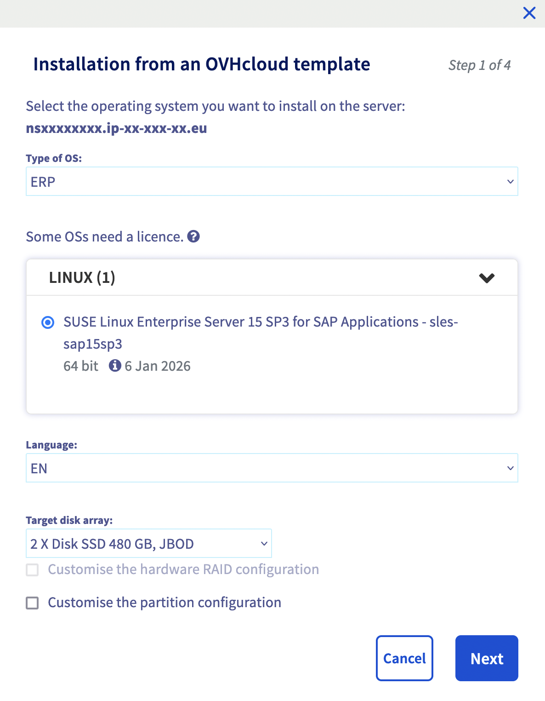
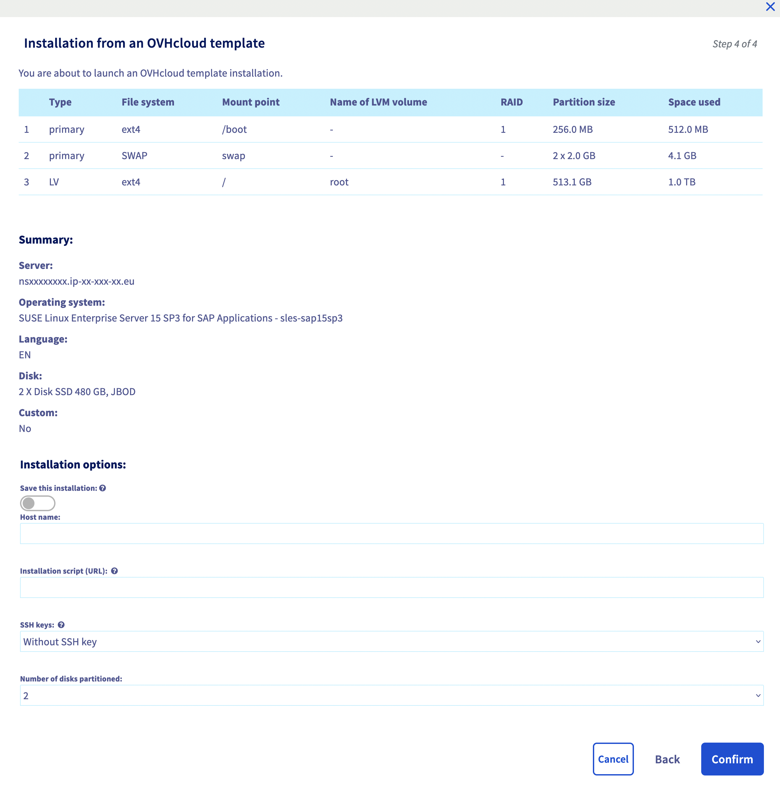

## Objectif

Ce guide fournit des instructions pour le déploiement de l'image SUSE Linux Enterprise Server 15 for SAP (SLES for SAP 15) sur un serveur dédié OVHcloud et la préparation de SLES 15 for SAP pour héberger une base de données SAP HANA.

## Prérequis

- Un accès à l’[espace client OVHcloud](https://www.ovh.com/auth/?action=gotomanager&from=https://www.ovh.com/fr/&ovhSubsidiary=fr)
- Un [serveur dédié HGR-SAP Bare Metal](https://www.ovhcloud.com/fr/lp/sap/)

## En pratique

### Déploiement de l'image SLES 15 for SAP

Depuis l'espace client OVHcloud, vous pouvez lancer le déploiement de l'image SLES 15 for SAP que OVHcloud met à disposition en cliquant sur le bouton `Installer`{.action}.

{.thumbnail}

Sélectionnez l'option `Installer à partir d'un template OVHcloud`{.action}.

{.thumbnail width=592 height=420}

La première étape consiste à renseigner des informations sur le système d'exploitation que vous souhaitez installer.<br>
&ensp;&thinsp;a. Dans le menu déroulant `Type de système d'exploitation`{.action}, sélectionnez `ERP`{.action}.<br>
&ensp;&thinsp;b. Dans le menu `LINUX`{.action}, sélectionnez `SUSE Linux Enterprise Server 15 SP3 for SAP Applications - sles-sap15sp3`{.action}.

Nous vous recommandons de réaliser l'installation du système d'exploitation sur la grappe de disque cible `2 X Disk SSD 480 GB, JBOD`{.action}.

Si vous le désirez, vous avez la possibilité de personnaliser la configuration des partitions.

> [!primary]
> Par défaut, les partitions `/boot` et `/` sont en RAID 1.

{.thumbnail width=593 height=762}

Si vous ne personnalisez pas la configuration des partitions, vous accéderez directement à la dernière étape.

Vous pouvez indiquer un nom de serveur qui sera visible via la commande `hostname`. Vous avez également la possibilité d'[ajouter votre clé SSH](/pages/cloud/dedicated/getting-started-with-dedicated-server#ajout-dune-cle-ssh-facultatif).

> [!primary]
> Par défaut, une partition swap de 4 GB est créée et respecte les recommandations SAP qui sont indiquées dans la [SAP Note 1999997 - FAQ: SAP HANA Memory](https://launchpad.support.sap.com/#/notes/1999997).

{.thumbnail}

Une fois ces derniers paramètres configurés, cliquez sur `Valider`{.action} pour lancer l'installation.

> [!warning]
> L'image SLES 15 for SAP que OVHcloud met à votre disposition est une image sans licence incluse. Suite au déploiement, vous devrez installer votre licence SLES 15 for SAP via la commande suivante : 
>
> `SUSEConnect -r <licence>`

Une fois l'installation de l'image SLES 15 for SAP réalisée, vous pouvez [vous connecter à votre serveur dédié](/pages/cloud/dedicated/getting-started-with-dedicated-server#connexion-a-votre-serveur).

### Préparation des systèmes de fichiers

Nous allons utiliser le concept de *Logical Volume* offrant de nombreux avantages dans la configuration des partitions.

1. Récupérez le nom du disque sur lequel vous installerez votre base de données SAP HANA. Le nom du disque devrait être `sda`.

Pour le vérifier, vous pouvez lancer la commande ci-dessous et vous obtiendrez ce résultat :

```bash
$ lsblk

NAME          MAJ:MIN RM   SIZE RO TYPE  MOUNTPOINT
sda             8:0    0  10.5T  0 disk 
sdb             8:16   0 447.1G  0 disk
├─sdb1          8:17   0   511M  0 part
├─sdb2          8:18   0   256M  0 part
│ └─md2         9:2    0   255M  0 raid1 /boot
├─sdb3          8:19   0     2G  0 part  [SWAP]
├─sdb4          8:20   0 444.4G  0 part
│ └─md4         9:4    0 444.3G  0 raid1
│   └─vg-root 254:0    0 444.3G  0 lvm   /
└─sdb5          8:21   0     2M  0 part
sdc             8:32   0 447.1G  0 disk
├─sdc1          8:33   0   511M  0 part  /boot/efi
├─sdc2          8:34   0   256M  0 part
│ └─md2         9:2    0   255M  0 raid1 /boot
├─sdc3          8:35   0     2G  0 part  [SWAP]
└─sdc4          8:36   0 444.4G  0 part
  └─md4         9:4    0 444.3G  0 raid1
    └─vg-root 254:0    0 444.3G  0 lvm   /
```

<ol start="2">
  <li>Créez un volume physique qui se base sur le RAID des disques de données avec la commande suivante :</li>
</ol>

```bash
pvcreate /dev/sda
```

<ol start="3">
  <li>Créez un groupe virtuel nommé <code>vg_hana</code> qui s'appuie sur le volume physique précédemment créé.</li>
</ol>

```bash
vgcreate vg_hana /dev/sda
```

<ol start="4">
  <li>Créez les volumes logiques qui représenteront les partitions pour le système d'exploitation.</li>
</ol>

Chaque volume logique représentera un répertoire pour l'installation de votre base de données SAP HANA. 

Nous vous recommandons de suivre ce tableau pour dimensionner vos volumes logiques.

| Volume logique  |                        Taille                         |
|-----------------|-------------------------------------------------------|
| usrsap          |  MIN(32 GB)                                           |
| hanadata        |  1 x RAM                                              |
| hanalog         | [RAM ≤ 512 GB ] = 1/2 x RAM<br>[RAM > 512 GB ] = 512GB|
| hanashared      |  MIN(1 x RAM; 1 TB)                                   |
| hanabackup      |  hanadata + hanalog                                   |

Veuillez remplacer dans chaque ligne les caractères `<X>` par la taille souhaitée en gigaoctet de vos volumes logiques, par exemple 32.

```bash
lvcreate -L<X>G -n lv_usrsap vg_hana
lvcreate -L<X>G -n lv_hanadata vg_hana
lvcreate -L<X>G -n lv_hanalog vg_hana
lvcreate -L<X>G -n lv_hanashared vg_hana
lvcreate -L<X>G -n lv_hanabackup vg_hana
```

<ol start="5">
  <li>Une fois les volumes logiques créés, il est nécessaire de les formater dans un format de système de fichiers supporté pour SAP HANA.</li>
</ol>

Dans ce guide, nous utilisons le format de système de fichiers XFS. Nous vous recommandons de prendre connaissance de la [SAP Note 2972496 - SAP HANA Filesystem Types](https://launchpad.support.sap.com/#/notes/2972496) afin de découvrir les formats supportés pour SAP HANA.

```bash
mkfs.xfs /dev/vg_hana/lv_usrsap
mkfs.xfs /dev/vg_hana/lv_hanadata
mkfs.xfs /dev/vg_hana/lv_hanalog
mkfs.xfs /dev/vg_hana/lv_hanashared
mkfs.xfs /dev/vg_hana/lv_hanabackup
```

<ol start="6">
  <li>Créez les répertoires sur lesquels vont s'appuyer ces volumes logiques.</li>
</ol>

```bash
mkdir -p /hana/data /hana/log /hana/shared /usr/sap /hanabackup
```

<ol start="7">
  <li>Afin de monter ces systèmes de fichiers sur le système d'exploitation, vous devez récupérer leur UUID afin de remplir le fichier <code>/etc/fstab</code>.</li>
</ol>

Pour récupérer chaque UUID des volumes logiques, vous pouvez utiliser ces commandes :

```bash
blkid /dev/vg_hana/lv_usrsap | awk '{print $2}'
blkid /dev/vg_hana/lv_hanadata | awk '{print $2}'
blkid /dev/vg_hana/lv_hanalog | awk '{print $2}'
blkid /dev/vg_hana/lv_hanashared | awk '{print $2}'
blkid /dev/vg_hana/lv_hanabackup | awk '{print $2}'
```

<ol start="8">
  <li>Ajoutez ce contenu dans le fichier <code>/etc/fstab</code>, en remplaçant par les valeurs précédemment obtenues.</li>
</ol>

```bash
UUID=<UUID>       /usr/sap        xfs     noatime,nodiratime,logbsize=256k 0 0
UUID=<UUID>       /hana/data      xfs     noatime,nodiratime,logbsize=256k 0 0
UUID=<UUID>       /hana/log       xfs     noatime,nodiratime,logbsize=256k 0 0
UUID=<UUID>       /hana/shared    xfs     noatime,nodiratime,logbsize=256k 0 0
UUID=<UUID>       /hanabackup     xfs     noatime,nodiratime,logbsize=256k 0 0
```

<ol start="9">
  <li>Vous pouvez maintenant exécuter la commande <code>mount -a</code> qui aura pour effet de monter les volumes logiques sur votre système d'exploitation. Ces derniers doivent être visibles dans la sortie de la commande <code>df -h</code> avec les tailles précédemment configurées.</li>
</ol>

### Application des paramètres avec SAPtune

SAPtune est un package disponible sur le système d'exploitation SUSE et qui permet d'appliquer les paramètres systèmes en fonction du rôle SAP hébergé sur ce serveur. Pour en découvrir d'avantage sur ce package, nous vous invitons à vous rendre sur la [page de SUSE](https://documentation.suse.com/sles-sap/15-SP2/html/SLES-SAP-guide/cha-tune.html).

> [!primary]
> Pour rappel, vous devez avoir activé votre licence SLES 15 for SAP sur votre serveur dédié avant de procéder à ces étapes.
>
> Nous vous conseillons également de procéder à une mise à jour de votre système d'exploitation avec la commande `zypper update -y`.

1. Installez le package saptune.

```bash
zypper install -y saptune
```

<ol start="2">
  <li>En fonction de votre futur système SAP, deux possibilités s'offrent à vous.</li>
</ol>
&ensp;&thinsp;a. Le premier choix est `HANA` qui correspond à une installation SAP HANA qui hébergera un système SAP NetWeaver.<br>
&ensp;&thinsp;b. Le second choix est `S4HANA-DBSERVER` qui correspond à une installation SAP HANA qui hébergera un système SAP S/4HANA.

Pour lancer l'application des paramètres en fonction de votre futur système, lancez la commande suivante :

```bash
saptune solution apply <HANA|S4HANA-DBSERVER>
```

<ol start="3">
  <li>Nous recommandons d'activer le service SAPtune au démarrage, l'application des paramètres systèmes recommandés sera ainsi réalisée à chaque démarrage de votre système d'exploitation.</li>
</ol>

```bash
saptune service enablestart
```

<ol start="4">
  <li>Vous pouvez vérifier la bonne application des paramètres avec la commande suivante :</li>
</ol>

```bash
saptune solution verify <HANA|S4HANA-DBSERVER>
```

> [!primary]
> Si vous souhaitez aller plus loin dans l'étude des paramètres pour SLES 15 et SAP HANA, nous vous recommandons ces deux SAP Notes.
>
> - [2578899 - SUSE Linux Enterprise Server 15: Installation Note](https://launchpad.support.sap.com/#/notes/2578899)
> - [1275776 - Linux: Preparing SLES for SAP environments](https://launchpad.support.sap.com/#/notes/1275776)

Votre serveur dédié est à présent prêt à accueillir une base de données SAP HANA.

Vous pouvez procéder à l'installation SAP HANA. Pour cela, nous vous recommandons de suivre le [guide officiel SAP](https://help.sap.com/docs/SAP_HANA_PLATFORM/2c1988d620e04368aa4103bf26f17727/88e3e9a612bc484cac335725ad0978d3.html).

## Aller plus loin

[Comment configurer votre NIC pour l’agrégation de liens OVHcloud dans SLES 15](/pages/bare_metal_cloud/dedicated_servers/ola-enable-sles15)

Si vous avez besoin d'une formation ou d'une assistance technique pour la mise en oeuvre de nos solutions, contactez votre commercial ou cliquez sur [ce lien](https://www.ovhcloud.com/fr/professional-services/) pour obtenir un devis et demander une analyse personnalisée de votre projet à nos experts de l’équipe Professional Services.

Échangez avec notre communauté d'utilisateurs sur <https://community.ovh.com>.
