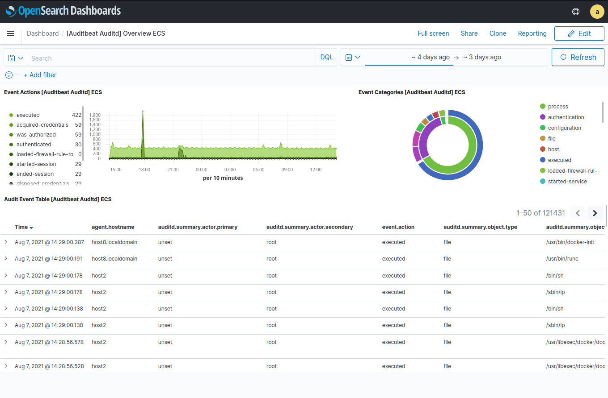
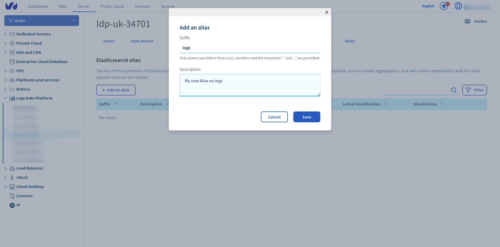
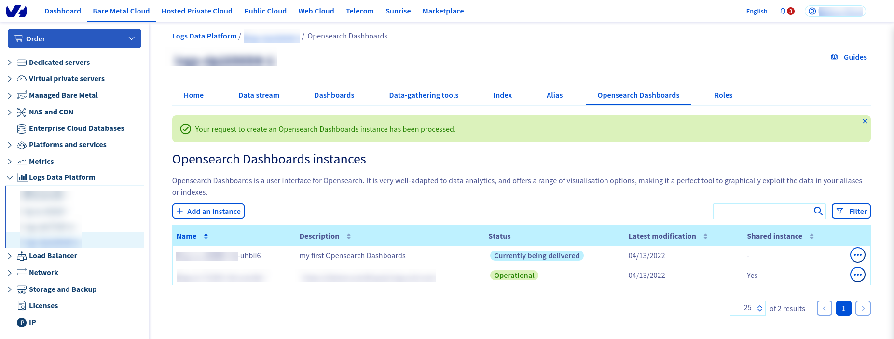
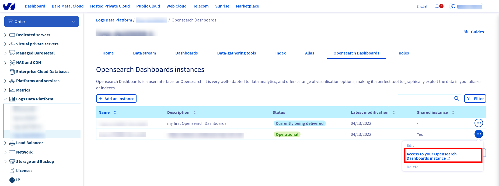
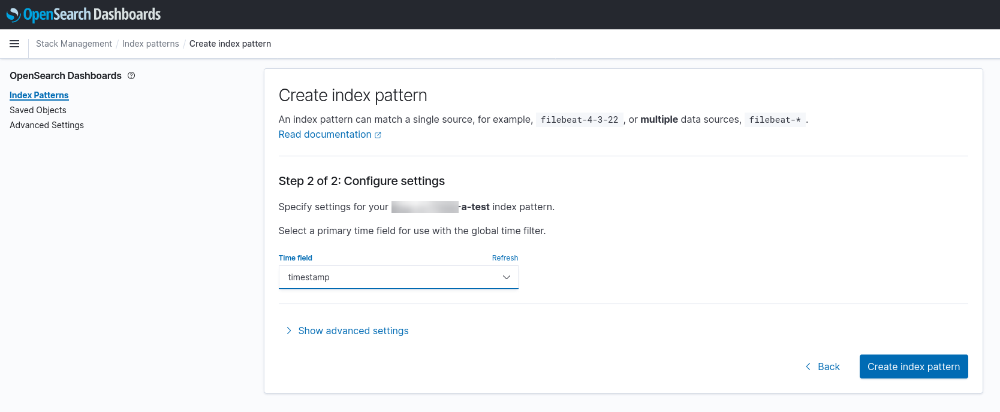

## Objective

This guide will help you unleash the full power of [OpenSearch Dashboards](https://opensearch.org/docs/latest/dashboards/index/){.external} and craft some beautiful Dashboards from your logs.

## Requirements

This is what you need to know to get you started:

- You are already sending logs on a stream you own: [see the quick start tutorial](/pages/manage_and_operate/observability/logs_data_platform/getting_started_quick_start)
- There is nothing else

After some training you will be able to do this kind of Dashboard:

## Instructions

### Create your Stream Alias

To access your logs from OpenSearch Dashboards, you will need to setup an OpenSearch Alias and link them to your Graylog streams, so here we go:

1. Log in to the [OVHcloud Control Panel](https://ca.ovh.com/auth/?action=gotomanager&from=https://www.ovh.com/sg/&ovhSubsidiary=sg).
2. In the Alias panel, click on the `Add an alias`{.action} button
3. Choose a name and define a description for your alias
4. Save the entry by clicking the `Save`{.action} button
5. Once the alias has been created, use the **...** menu to the right and select `Attach content to the alias`{.action} option.
6. Define there the graylog streams you want to associate to your alias
7. That's it.

{.thumbnail}

So now Logs Data Platform knows which stream you want to browse. Now let's configure OpenSearch Dashboards and see if it works!

### Access your OpenSearch Dashboards instance

To create your OpenSearch Dashboards instance, click on OpenSearch Dashboards tab, Click on `Add a instance`{.action}, put a description and click on **Order** to launch the creation of your instance. Your instance will be created and delivered in approximatively 20 minutes.

{.thumbnail}

Use the **...** menu to the right and select `Access to your OpenSearch Dashboards instance`{.action} option to be redirected.

{.thumbnail}

Once there, use your LDP credentials to sign in and set on the first page. Click on the `Add data`{.action} button to add sample data you can play with. However if you want to use your own data, you must configure **Index Patterns** in the stack management page. This page is accessible by clicking on the `Manage`{.action} button next to the "Add data" button. You can also use the "Stack Management" option in the left side menu, displayable by using the top left the sandwich button.

In this configuration page, you can configure as the Index name, the full name of your alias **logs-XXXXX-a-XXXXX**, but you can also use wildcards. Choose **timestamp** for the time field name then click on Discover tab to read your log entries.

{.thumbnail}

You can also explore any [OpenSearch index](/pages/manage_and_operate/observability/logs_data_platform/opensearch_index) you created on the platform. One OpenSearch Dashboards instance allows you to explore all the data you delivered on Logs Data Platform.

To know what you can do with OpenSearch Dashboards, read the [OpenSearch Dashboards documentation](https://opensearch.org/docs/latest/dashboards/index/){.external}

## Go further

- Getting Started: [Quick Start](/pages/manage_and_operate/observability/logs_data_platform/getting_started_quick_start)
- Documentation: [Guides](/products/public-cloud-data-platforms-logs-data-platform)
- Community hub: [https://community.ovh.com](https://community.ovh.com/en/c/Platform/data-platforms){.external}
- Create an account: [Try it!](https://www.ovh.com/fr/order/express/#/express/review?products=~(~(planCode~'logs-account~productId~'logs))){.external}
