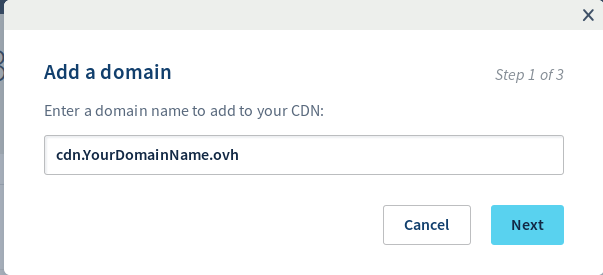
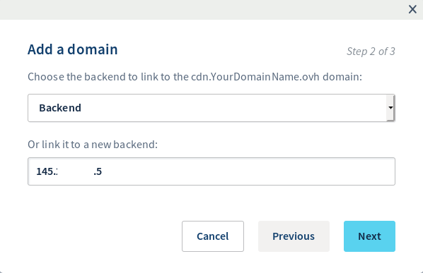
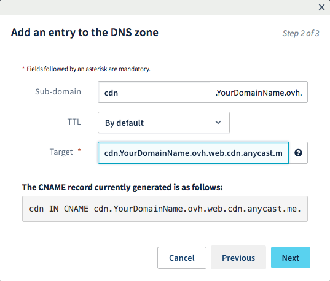

**Last updated 21st February 2018**


## Objective

When you configure the Content Delivery Network (CDN) for the first time, you need to declare your domains via the OVH Control Panel and configure the network in a way that is optimal for your usage.

**This guide will explain how do this via the OVH Control Panel, and provide instructions on how to use the OVH CDN properly.**


## Requirements

- an [OVH Content Delivery Network (CDN)](https://www.ovh.co.uk/cdn/){.external} solution
- access to the [OVH Control Panel](https://www.ovh.com/auth/?action=gotomanager&from=https://www.ovh.co.uk/&ovhSubsidiary=GB){.external}
- the permissions needed to manage your domain’s DNS zone
 
 

## Instructions

### Add a domain name on the CDN.

The first step of this configuration involves adding your subdomain to the CDN, so that it accepts HTTP(S) requests.

To do this, go to the [OVH Control Panel](https://www.ovh.com/auth/?action=gotomanager&from=https://www.ovh.co.uk/&ovhSubsidiary=GB){.external}, click on the `Dedicated`{.action} tab, then go to `NAS and CDN`{.action}.

Next, click `Add a domain to the CDN`{.action}.

{.thumbnail}

In the first step, you can choose the subdomain you want to add to the CDN.

{.thumbnail}

In *backend*, you can select an existing backend if this is not your first time adding an IP. Otherwise, you can add your choice of IP address.

{.thumbnail}


After a few moments, your domain name will be available in the OVH Control Panel, and you can start configuring it.

To ensure that your requests go through our CDN infrastructure, you will need to modify your subdomain’s DNS zone by pointing a CNAME record to **cdn.*yourdomain.ovh*.web.cdn.anycast.me** (replacing the generic ‘yourdomain’ text with your own domain).


> [!warning]
>
> It is important to use the CNAME record for this, as it makes the `Bypass` function work correctly. If you use an A record instead, the CDN will work, but the *bypass* function will not.
>


If you configure your domain’s DNS zone from the OVH Control Panel, you can add the following record (adapting the subdomain to fit your desired configuration):

{.thumbnail}

 

### Check that a file has been stored in the cache.

You can check that a file has been stored in the cache by performing a request:

```sh
curl -I http://sub.domain/
```

The result it returns will be something like this:

```bash
HTTP/1.1 200 OK
Date: Tue, 09 Jan 2018 10:30:57 GMT
Content-Type: text/plain
Last-Modified: Fri, 29 Dec 2017 13:30:42 GMT
ETag: W/"(5a464382-4ddf"
Expires: Wed, 09 Jan 2019 10:30:58 GMT
X-IPLB-Instance: 5905
Vary: Accept-Encoding
X-CDN-Pop: rbx1
X-CDN-Pop-IP: 51.254.41.128/26
X-Cacheable: Matched cache
Accept-Ranges: bytes
Connection: keep-alive
```

If your file has been properly called from the cache, you will receive the `Matched cache` result.

You will also see the point of presence (PoP) your file has been called from (*rbx1* in our example).

You can also access this information from your web browser, via the `Network` tab in the development tools (keyboard shortcut: F12). By clicking on the file you want to check, you will see the HTTP response and its headers.


### Set a preference for using a subdomain specific to the CDN over the primary domain.

You cannot add a CNAME record to a primary domain. This is the result of a limitation related to RFC standards, and cannot be avoided on a DNS zone level.

By attributing a specific domain name to the files that you would like to cache, you can manage them more easily.

- **For files:** Only the files called on this subdomain will be cached. This way, you can keep the name of your dynamic files, as well as the files you do not want to cache on your primary domain. This will also help you determine the origin of any display issues on your website.
- **For billing:** Since all of the traffic (cached or uncached) that passes through the CDN is billed, you can limit the number of redundant requests made via the CDN to optimise your quota usage.


### Keep in mind the consequences of adding a new subdomain.

If you would like to configure a new subdomain to use our CDN, you will probably need to modify some of your website’s configurations.

Before you proceed, check that your web service responds correctly to the subdomain. To do this, you will need to configure a *vhost* for this domain, either with its own destination folder, or under the alias of another domain name.

If the domain responds correctly to your web service, you simply need to modify your HTML code so that it changes the sources of files that pass through the CDN, and ensure that they are named correctly on your subdomain.

 
## Go further

Join our community of users on <https://community.ovh.com/en/>.