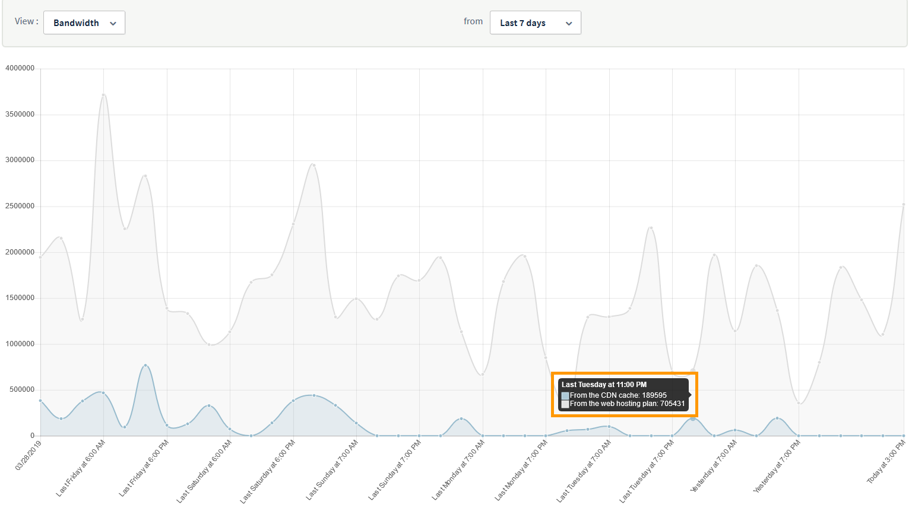

## Objetivo

La solución Content Delivery Network (CDN) de OVH permite optimizar los tiempos de respuesta de un sitio web para todos sus usuarios. 

Cada conexión al sitio web genera un flujo de datos. Cuando estos datos circulan hacia o desde la CDN, consumen tráfico, que se deduce del límite de tráfico disponible en la solución.

**Esta guía explica todo lo relativo a los límites de tráfico de la solución CDN de OVH.**

## Requisitos

- Tener acceso al [área de cliente](https://www.ovh.com/auth/?action=gotomanager&from=https://www.ovh.es/&ovhSubsidiary=es){.external}.

## Procedimiento

### Adquirir tráfico

Al contratar la solución CDN, puede disfrutar de **1 TB** de tráfico incluido de forma gratuita. Este volumen de tráfico no se renueva cada mes junto con la solución, sino que, una vez consumido (independientemente del plazo), deberá contratar tráfico adicional.

Es posible adquirir tráfico adicional directamente desde el [área de cliente de OVH](https://www.ovh.com/auth/?action=gotomanager&from=https://www.ovh.es/&ovhSubsidiary=es){.external}.

{.thumbnail}

Puede consultar el precio de los paquetes de tráfico disponibles en la página de la solución [CDN de OVH](https://www.ovh.es/cdn/infrastructure/){.external}.

Cuando el tráfico disponible sea inferior a **100 GB**, recibirá una notificación informándole de la necesidad de ampliar el límite de tráfico. Si ha consumido todo el tráfico disponible, la función *bypass* se activará automáticamente hasta que adquiera más tráfico.

### Facturación del tráfico en la solución CDN

> [!primary]
>
> Se factura todo el tráfico saliente de la CDN.  
>

Analicemos el siguiente ejemplo:

{.thumbnail}

- Los 21,74 MB representan archivos que ya estaban en caché. Por lo tanto, la CDN ha podido responder directamente a las peticiones relativas a esos archivos.

- Los 72,96 MB representan archivos cuya petición se envía al backend situado tras la CDN. Las reglas de caché configuradas en el dominio son las que determinan si los archivos se guardan en caché o, por el contrario, la petición deberá enviarse al backend.

En ambos casos, tanto si los archivos se recuperan de la caché como si proceden del backend pasando por la CDN, **se consume tráfico de la solución**. Por ese motivo, le recomendamos que cree un subdominio específico que reciba las peticiones de los archivos que deban guardarse en caché y utilice los dominios que apunten hacia el backend para el resto de archivos.

## Más información

Interactúe con nuestra comunidad de usuarios en <https://community.ovh.com/en/>.