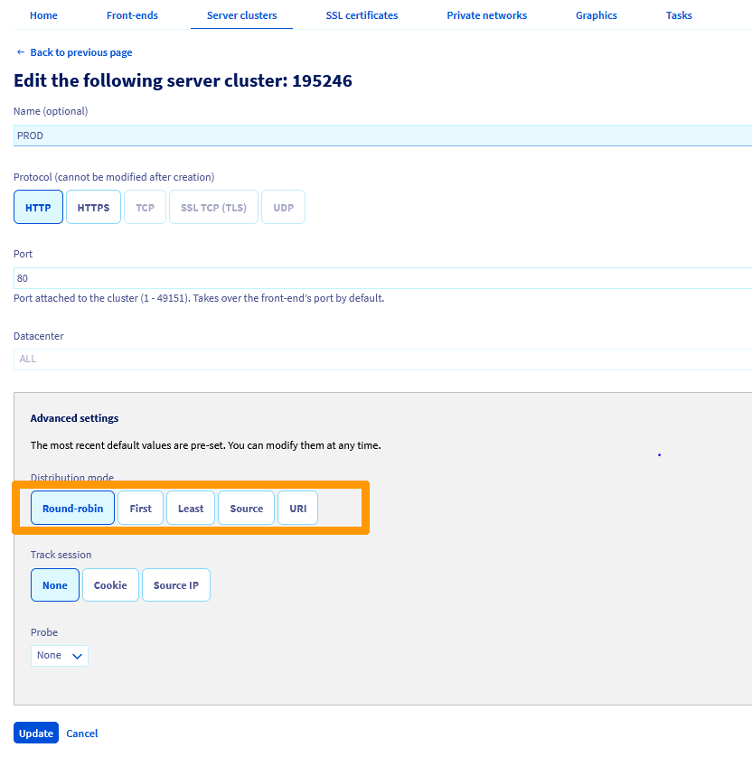

**Ostatnia aktualizacja dnia 2018-03-07**

## Wprowadzenie

Nowa usługa Load Balancer oferuje różne typy równoważenia obciążenia (load balancingu) dla Twoich usług. Opisany proces określa sposób, w jaki Load Balancer będzie rozdzielał zapytania kierowane do Twoich serwerów.

**Niniejszy przewodnik przedstawia różne typy równoważenia obciążenia i wyjaśnia, jak je modyfikować.**

## Wymagania początkowe

- Dostęp do [Panelu klienta OVH](https://www.ovh.com/auth/?action=gotomanager&from=https://www.ovh.pl/&ovhSubsidiary=pl){.external}
- Aktywna usługa Load Balancer
- Utworzona farma serwerów

## W praktyce

### Różne typy równoważenia obciążenia

Równoważenie obciążenia realizowane jest w farmach serwerów. Poniżej podane są parametry, które określają sposób, w jaki zapytania są rozdzielane między serwery danej farmy.

Poznaj podstawowe części składowe usługi w [przewodniku prezentującym Load Balancer](/pages/network/load_balancer/use_presentation){.external}.

|Algorytm|Funkcje|
|---|---|
|First|Pierwszy dostępny serwer otrzymuje połączenie. Serwer jest wybierany według jego ID, od najniższego numeru do najwyższego. |
|LeastConn|Wybierz serwer, który ma najmniej aktywnych połączeń. Jest to parametr zalecany w przypadku długich sesji i niewielkiego ruchu. Algorytm*RoundRobin* stosowany jest w grupach serwerów mających tę samą liczbę aktywnych połączeń.|
|RoundRobin|Połączenia są przekazywane, kolejno do każdego serwera, **to algorytm domyślny.**|
|Source|Algorytm wykonuje funkcję *hash* na źródłowym adresie IP, następnie dzieli wynik przez liczbę serwerów aktywnych w danym momencie. Ten sam źródłowy adres IP będzie zawsze przekierowywany do tego samego serwera, dopóki pozostaje on aktywny.|
|URI|Algorytm wykonuję funkcję *hash* na części lub całości URI, następnie dzieli wynik przez liczbę serwerów aktywnych w danym momencie. Ten sam URI będzie zawsze przekierowywany do tego samego serwera, dopóki pozostaje on aktywny.|

### Modyfikacja sposobu równoważenia obciążenia farmy w Panelu klienta

- Sprawdź utworzone farmy w sekcji `Farmy serwerów`{.action} (1). Edytuj wybraną farmę, klikając trzy kropki, oznaczające rozwijane menu, po prawej stronie (2), a następnie kliknij `Modyfikuj`{.action} :

{.thumbnail}

 `Sposób równoważenia obciążenia`{.action} możesz zmienić w `Ustawieniach zaawansowanych`{.action}:

{.thumbnail}

Po wybraniu sposobu równoważenia obciążenia kliknij `Aktualizacja`{.action}, a następnie `Zastosuj konfigurację`{.action} na żółtym pasku, który się pojawi:

{.thumbnail}

### Modyfikacja sposobu równoważenia obciążenia farmy przez API

Modyfikacja ustawień sposobu równoważenia obciążenia następuje po zmianie ustawień farmy serwerów.

- Zobacz szczegóły dotyczące farmy.

Komenda ta pozwala wyświetlić szczegóły dotyczące farmy serwerów po wpisaniu jej identyfikatora. Operacja została przedstawiona poniżej na przykładzie farmy HTTP. 

> [!api]
>
> @api {GET} /ipLoadbalancing/{serviceName}/http/farm/{farmId}
> 

|Parametr|Opis|
|---|---|
|ServiceName*|Identyfikator Twojej usługi Load Balancer|
|farmId*|Identyfikator numeryczny farmy|

|Odpowiedź (BackendHttp)|Opis|
|---|---|
|farmId|Identyfikator numeryczny farmy|
|balance|Typ równoważenia obciążenia obecnie skonfigurowany dla farmy|
|zone|Nazwa strefy, w której skonfigurowana jest farma|
|port|port używany do łączenia się z serwerami skonfigurowanymi w farmie|
|probe|Typ sondy skonfigurowanej w farmie|
|displayName|Nazwa nadana tej farmie|
|stickiness|Sposób połączenia skonfigurowany w farmie|

- Zmodyfikuj sposób równoważenia obciążenia farmy.

Komenda ta pozwala zmodyfikować konfigurację farmy po wpisaniu jej identyfikatora. Operacja została przedstawiona poniżej na przykładzie farmy HTTP: Aby zmodyfikować sposób równoważenia obciążenia, zaktualizuj pole `BackendHttp.balance`, wpisując dostępny sposób równoważenia:

> [!api]
>
> @api {PUT} /ipLoadbalancing/{serviceName}/http/farm/{id}
> 

|Parametr|Opis|
|---|---|
|ServiceName*|Identyfikator Twojej usługi Load Balancer|
|farmId*|Identyfikator numeryczny farmy|
|BackendHttp.balance|Typ równoważenia wybrany dla tej farmy|

- Zastosuj modyfikacje.

> [!api]
>
> @api {POST} /ipLoadbalancing/{serviceName}/refresh
> 

|Parametr|Opis|
|---|---|
|ServiceName*|Identyfikator Twojej usługi Load Balancer|
|zone*|Nazwa strefy do konfiguracji|

## Sprawdź również

Przyłącz się do społeczności naszych użytkowników na stronie <https://community.ovh.com/en/>.
