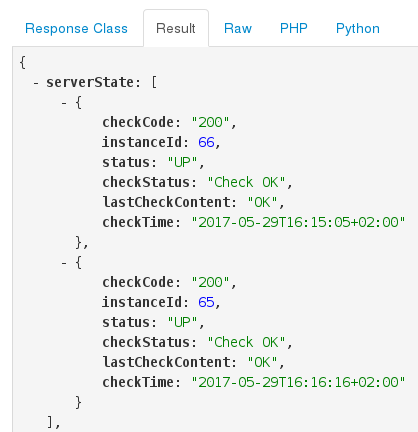

## Presentation
Le service OVH Load Balancer agit par défault comme un mandataire ou "Proxy". C'est à dire qu'il répartit la charge (les requêtes) qu'il reçoit entre tous les serveurs de la ferme voulue.

Chaque serveur peut être configuré pour que le répartiteur de charge vérifie son état fréquemment.

Une fois qu'un serveur est détecté comme "malade", le répartiteur de charge ne lui envoie plus aucune donnée et répartit la charge entre les serveurs restants.

Cela peut être pratique dans le cas de la maintenance d'un serveur : on "sort" le serveur de la ferme, on opère la maintenance puis on le réintègre dans la ferme.

Cependant, quand un serveur est "sorti" de la ferme par le répartiteur de charge indépendamment de notre volonté, il peut être intéressant de le savoir et d'en connaître la raison.

Ce tutoriel explique comment connaître l'état de santé de chaque serveurs pour chaque instance de votre OVH Load Balancer.

## Recuperer l'etat de sante des serveurs

### Via l'API
Dans l'API, l'état de santé des serveurs sont disponibles dans le tableau serverState :

> [!api]
>
> @api {GET} /ipLoadbalancing/{serviceName}/http/farm/{farmId}/server/{serverId}
> 

> [!api]
>
> @api {GET} /ipLoadbalancing/{serviceName}/tcp/farm/{farmId}/server/{serverId}
> 

#### Resultat

{.thumbnail}

Sur l'image ci-dessus, nous avons le résultat de la commande dans l'API.

### Via le Manager
Dans la section "Fermes", après avoir sélectionné l'une d'entre elles, l'état de chacun de ses serveurs est affiché dans la ligne correspondant à celui-ci.

#### Resultat

{.thumbnail}

Afin d'obtenir les détails sur l'état de santé d'un serveur, il suffit de cliquer sur le pictogramme dans la colonne "Status".

{.thumbnail}

### Explication du detail
Comme expliqué précédemment, nous avons bien récupéré l'état de santé du serveur pour chaque instance de votre OVH Load Balancer.

Pour chaque instance, nous avons plusieurs informations :

|Champ|Description|
|---|---|
|Status|État du serveur|
|Check code|Code de retour de la sonde|
|Check status|État de la sonde|
|Last check content|Contenu du retour de la sonde|
|Check time|Date d'exécution de la sonde|

## Annexe

### Recuperer la liste des instances de votre OVH Load Balancer

> [!api]
>
> @api {GET} /ipLoadbalancing/{serviceName}/instancesState
> 
