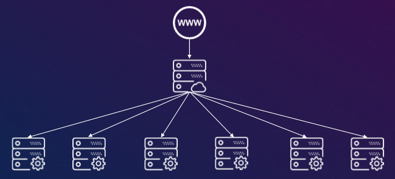
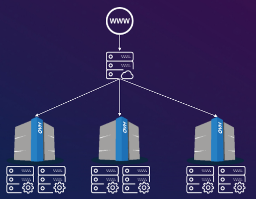
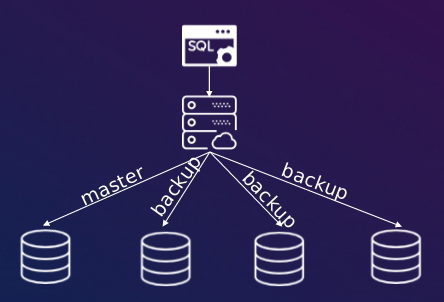

## Obiettivo

Il nuovo [OVH Load Balancer](https://www.ovh.it/soluzioni/load-balancer/){.external} è un ripartitore di carico che combina flessibilità e affidabilità. Non dovrai fare altro che configurare i tuoi prodotti con OVH Load Balancer e noi ci occuperemo di tutto il resto!

**Scopri subito il nuovo OVH Load Balancer**

## Prerequisiti

- Nessun prerequisito specifico

## Procedura

 
Questo servizio si basa su tecnologie open source: HAProxy per il traffico TCP e Nginx per il traffico UDP.

Senza restrizioni! La nuova soluzione di [OVH Load Balancer](https://www.ovh.it/soluzioni/load-balancer/){.external} è stata ideata per funzionare con diversi protocolli:

|Tipo|Descrizione|Vantaggi|Tecnologia|
|---|---|---|---|
|HTTP|Per tutti i tipi di servizi Web HTTP/HTTPS|Ottimizzato per l’elaborazione Layer 7 (livello applicativo)|HAProxy|
|TCP|Per tutti i tipi di servizi di rete che non siano HTTP|Può supportare tutte le applicazioni TCP|HAProxy|
|UDP|Per tutti i tipi di protocolli UDP|Può supportare tutte le applicazioni UDP|Nginx|

Di seguito le funzionalità di OVH Load Balancer:

 - protezione Anti-DDoS OVH
 - supporto multi-zona (Anycast)
 - supporto avanzato HTTP/HTTPS (reindirizzamenti, header, ACL, ecc...)
 - servizio compatibile con un Additional IP
 - supporto della vRack
 - ridondanza: OVH Load Balancer funziona su istanze separate che lavorano a loro volta su dispositivi separati e ridondanti

### Componenti base

- Il nuovo OVH Load Balancer è composto da tre parti essenziali:

{.thumbnail}

|Componenti base|Funzione|
|---|---|
|Front-end|Definisce il tipo di protocollo (HTTP/TCP/UDP) di OVH Load Balancer ed espone la porta di ascolto del servizio|
|Farm|Riceve il traffico proveniente dal front-end ed è il componente che si occupa di effettuare la ripartizione del carico|
|Server|Ricevono il traffico finale e rispondono tramite l'applicazione|

Grazie a questi tre componenti alla base del Load Balancer, è possibile configurare praticamente tutte le tipologie di *load balacing* esistenti.

### Perché scegliere OVH Load Balancer?

#### Ripartizione del carico

Questa è la funzione di base di qualsiasi ripartitore di carico, ma OVH Load Balancer fa molto di più: ottimizza la distribuzione delle richieste sulle tue macchine, distribuendole ai server meno carichi, garantendo scalabilità dell'infrastruttura in caso di traffico elevato.

{.thumbnail}

#### Niente più downtime

Il servizio OVH Load Balancer è in grado di rilevare automaticamente l’assenza di risposte da parte di un server, reindirizzando il traffico verso un altro server (se possibile). Ciò consente di risolvere il problema senza danneggiare la produzione.

{.thumbnail}

#### Un’evoluzione dell’infrastruttura senza vincoli

È possibile aggiungere o rimuovere una farm, un front-end o un server da OVH Load Balancer senza alcuna interruzione del servizio.

{.thumbnail}

#### Semplicità delle manutenzioni

In caso di una manutenzione prevista sulla tua infrastruttura, adesso è possibile impostare facilmente una farm in downtime affinché non riceva più traffico e, una volta completata la manutenzione, sarà altrettanto semplice intervenire e aggiungere nuovamente il server.

{.thumbnail}

#### Varietà dei servizi

Ora è possibile combinare diversi servizi OVH grazie al Load Balancer, per esempio:

- le istanze Public Cloud con l’Additional IP
- i VPS con l’Additional IP
- i server dedicati con l’Additional IP
- le vRack

{.thumbnail}

#### Anycast

Puoi distribuire il carico su diverse aree geografiche.

{.thumbnail}

#### Ripartizione di tutti i tipi di traffico

OVH Load Balancer non è più limitato al traffico HTTP! Adesso puoi utilizzarlo con tutti i tipi di traffico TCP o UDP.

#### Server email

Distribuisci il carico tra i tuoi server di posta.

{.thumbnail}

#### Database

Distribuzione e ridondanza dei tuoi database.

{.thumbnail}

## Per saperne di più

[Load balancing](https://it.wikipedia.org/wiki/Load_balancing){.external}.

[Haproxy](https://en.wikipedia.org/wiki/HAProxy){.external}.

[Nginx](https://it.wikipedia.org/wiki/Nginx){.external}.

Contatta la nostra Community di utenti all’indirizzo <https://community.ovh.com/en/>.