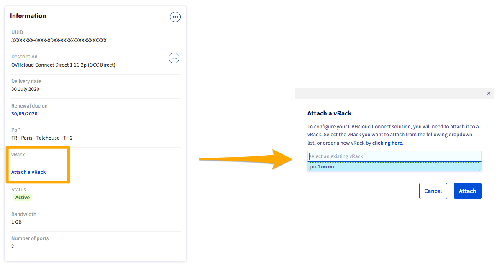
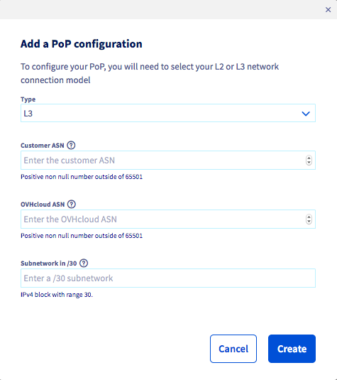
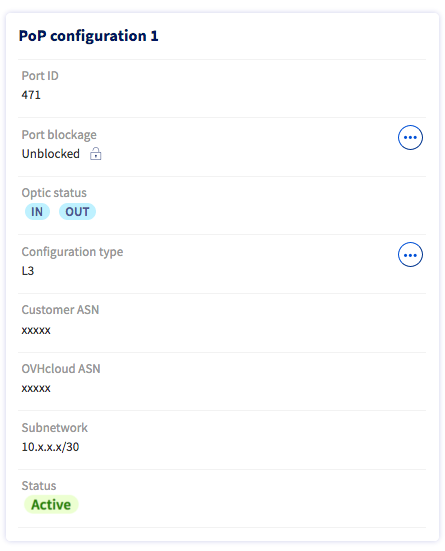
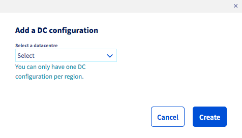
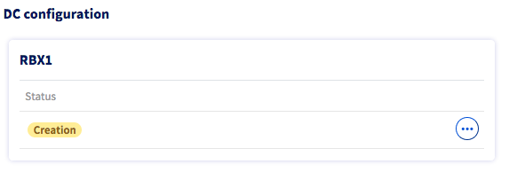
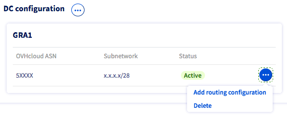

## Objective

With OVHcloud Connect, you can link your company network to your private OVHcloud vRack network, without creating a VPN tunnel through the internet. This will give you a quicker, more stable connection with guaranteed bandwidth. 

**This guide will show you how to set up the OVHcloud Connect Direct solution via the OVHcloud Control Panel.**

## Requirements

> [!warning]
> To ensure correct operation of this service, you must be aware of the [technical capabilities and limitations of the OVHcloud Connect solution](/pages/network/ovhcloud_connect/occ-limits) and configure your network devices accordingly.
>

- An [OVHcloud Connect Direct solution](https://www.ovhcloud.com/es-es/network-security/ovhcloud-connect/)
- An OVHcloud [vRack](https://www.ovh.co.uk/solutions/vrack/)
- Access to the [OVHcloud Control Panel](https://www.ovh.com/auth/?action=gotomanager&from=https://www.ovh.es/&ovhSubsidiary=es)

## Instructions

Log in to the [OVHcloud Control Panel](https://www.ovh.com/auth/?action=gotomanager&from=https://www.ovh.es/&ovhSubsidiary=es), go to the `Bare Metal Cloud`{.action} section and click on `Network`{.action}. Next, open `OVHcloud Connect`{.action} and click on your solution.

{.thumbnail}

### Step 1: Associating a vRack

You will need to link a vRack to your solution first. Click the `Attach a vRack`{.action} button and select an existing vRack from the drop-down menu. 

{.thumbnail}

A message will confirm the vRack association.

{.thumbnail}

### Step 2: Adding a PoP configuration

> [!warning]
> Changing the PoP configuration from L2 to L3, or vice versa, would require deleting the entire configuration. We advise you to think carefully about your configuration choice before going any further.
>

> [!primary]
> For more details on the differences between levels L2 and L3, see our [FAQ](/pages/network/ovhcloud_connect/occdedicated-faq).
>

#### Configuration 

Once you have linked your vRack, two `PoP configuration` menus will appear. Click the `Add a PoP configuration`{.action} button in the first menu, select L2 from the drop-down menu, then confirm. 

{.thumbnail}

The L2 configuration will then be enabled in the two `PoP configuration` menus.

{.thumbnail}

#### Configuration L3 

Once you have connected your vRack, click `Add a PoP configuration`{.action} and select the L3 configuration from the drop-down menu.

{.thumbnail}

You will then need to enter the following:

| Information    | Description |
|:-------:|:------:|
| Customer ASN    | Your AS BGP number, which is configured on your router located in the PoP |
| OVHcloud ASN    | The OVHcloud AS number that will be configured on the OVHcloud Connect routers located in the PoP |
| Subnetwork in /30    | A size /30 IPv4 block, used for the link between your router and the OVHcloud Connect router located in the PoP |

{.thumbnail}

The `PoP configuration` menu will then appear.

{.thumbnail}

You can also add a second PoP L3 configuration via the second `PoP configuration` menu.

### Step 3: Adding a data centre configuration

#### Configuration 

When your PoP configuration is active, click `Add a configuration`{.action} under the `DC configuration` menu. Select a data centre from the drop-down menu and confirm.

{.thumbnail}

{.thumbnail}

The DC configuration will then begin.

{.thumbnail}

#### Configuration L3 

When your PoP configuration has been set, click `Add a configuration`{.action} under the `DC configuration` menu. 

{.thumbnail}

Select a data centre from the drop-down menu, then enter the information required. 

| Information    | Description |
|:-------:|:------:|
| OVHcloud ASN    | The OVHcloud AS number that will be configured on the OVHcloud Connect routers located in the DC. This number may be different from the ASN chosen for the PoP |
| A /28 subnetwork  |  A private subnetwork configured in your vRack in the selected DC. This can be an IPv4 block of size /28 or higher |

{.thumbnail}

You can add additional data centre configurations by clicking on the `...`{.action} button, then `Add a configuration`{.action}.

{.thumbnail}

You must also add a routing configuration.

##### **Adding a routing configuration**

Click on the `(...)`{.action} button on the desired data centre then on `Add routing configuration`{.action} .

{.thumbnail}

Then choose the routing type between Static and BGP. 

{.thumbnail}

If you choose the type BGP, then enter the required information.

| Information    | Description |
|:-------:|:------:|
| Customer ASN    | Your AS BGP number, which is configured on your router located in the DC |
| IP Neighbour    | IP address of the BGP neighbour of your router in the DC. This address must be part of the subnetwork specified in the `DC Configuration` section |

{.thumbnail}

If you choose the Static type, enter the required information:

| Information    | Description |
|:-------:|:------:|
| Network Focus    | A prefix using CIDR notation |
| Next hop    | An IP address acting as gateway in the subnetwork range |

{.thumbnail}

You can add multiple routing configurations within the same data centre. The configuration type (BGP or Static) chosen for your first routing configuration will then apply to the next configuration on the same data centre.

{.thumbnail}

### Deletion of vCenter resources

Each resource (PoP or DC) can be deleted individually, but deleting a parent resource such as DC or PoP will automatically delete all the subresources.

Recursive removal is slower than sequential removal of each resource.

> [!primary]
> If a DC configuration is shared between two or more OVHcloud Connect services, removing the PoP configuration from a single OVHcloud Connect service will not affect the DC resource.
>

#### Deleting a routing Configuration

To delete a routing configuration, click the `...`{.action} button on the routing configuration to delete, then click `Delete`{.action}.

{.thumbnail}

#### Deleting a DC configuration

To delete a DC configuration, click the `...`{.action} button on the DC configuration to delete, then click `Delete`{.action}.

{.thumbnail}

> [!primary]
> Deleting a DC configuration will delete the related routing configurations.
>

#### Deleting a PoP configuration

To delete a PoP configuration, click the `...`{.action} button on the PoP configuration to delete, then click `Delete configuration`{.action}.

{.thumbnail}

> [!primary]
> Deleting a PoP configuration will delete the related DC and routing configurations.
>

## Go further

If you need training or technical assistance to implement our solutions, contact your sales representative or click on [this link](https://www.ovhcloud.com/es-es/professional-services/) to get a quote and ask our Professional Services experts for assisting you on your specific use case of your project.

Join our community of users on <https://community.ovh.com/en/>.
