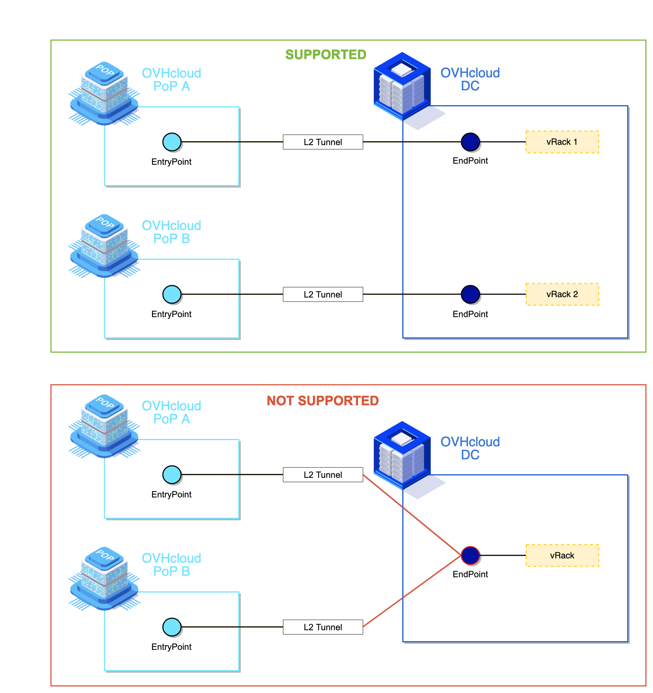
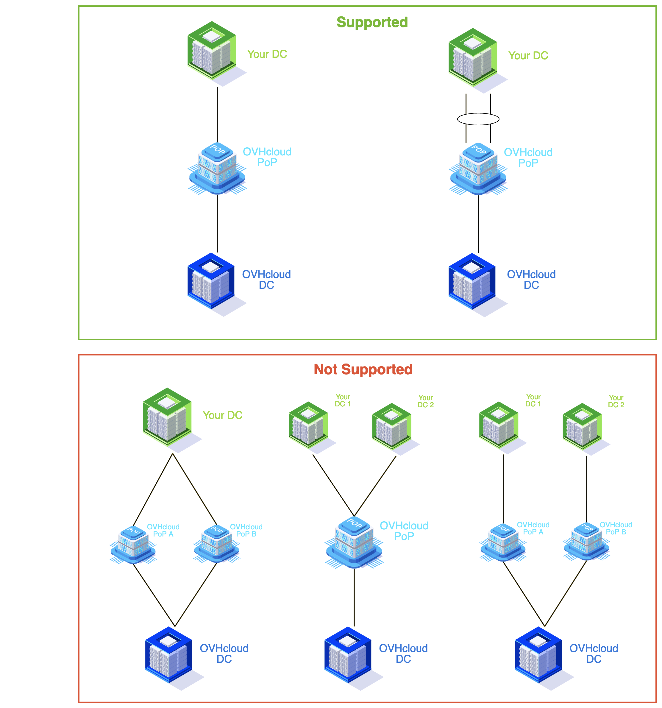

**Dernière mise à jour le 07/09/2020**

## Objectif

**Découvrez les détails sur l'implémentation et le mode de connexion du mode Layer 2 (L2) pour l'offre OVHcloud Connect.**

## En pratique

### Implémentation du mode L2

{.thumbnail}

Le tunnel L2 est directement transféré vers/depuis le vRack afin que tout le trafic L2 soit transféré vers/depuis l'interconnexion client.

Par trafic L2, on entend les trames Ethernet, avec un en-tête 802.1q, le cas échéant:

* Le broadcast Ethernet est transféré.
* L'unicast inconnu Ethernet est transféré.
* Le multicast est transféré (il est considéré comme broadcast et limité à 20 pps).
* Les trames Ethernet point-to-point spécifiques (telles que LLDP ou LACP) ne sont pas transférées.

Un seul OVHcloud Connect L2 est pris en charge par vRack: un PoP/EntryPoint ne peut être associé qu'à un seul DC/EndPoint.

{.thumbnail}

Avec le mode L2, la redondance ne peut pas être exploitée entre deux PoP/EntryPoint. La seule solution consiste à utiliser un LAG sur un PoP/EntryPoint.

### Détails du mode de connexion

Le mode L2 signifie un fonctionnement au niveau Ethernet. Le vRack du client est étendu « en l’état » à partir de OVHcloud et transféré au lien du client. Ce mode est transparent pour les VLAN et constitue le meilleur moyen d'interconnecter le réseau existant du client avec le vRack OVHcloud.

{.thumbnail}

Le mode L2 est limité à la topologie point-to-point: la liaison de backup via un second PoP n'est pas prise en charge.

{.thumbnail}

LACP est obligatoire pour l'agrégation lorsque 2 liens sont configurés avec PoP.

Les trames Jumbo (Jumbo frames) jusqu'à 9000 octets sont prises en charge.

La connexion entre un PoP et un Datacentre bénéficie du backbone OVHcloud, de sorte qu'une défaillance de liaison interne est prise en charge et n'affectera pas le trafic client.

## Aller plus loin

Si vous avez besoin d'une formation ou d'une assistance technique pour la mise en oeuvre de nos solutions, contactez votre commercial ou cliquez sur [ce lien](https://www.ovhcloud.com/fr-ca/professional-services/) pour obtenir un devis et demander une analyse personnalisée de votre projet à nos experts de l’équipe Professional Services.

Échangez avec notre communauté d'utilisateurs sur <https://community.ovh.com/>.
