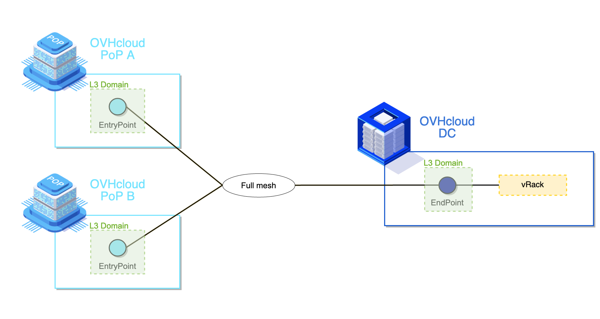
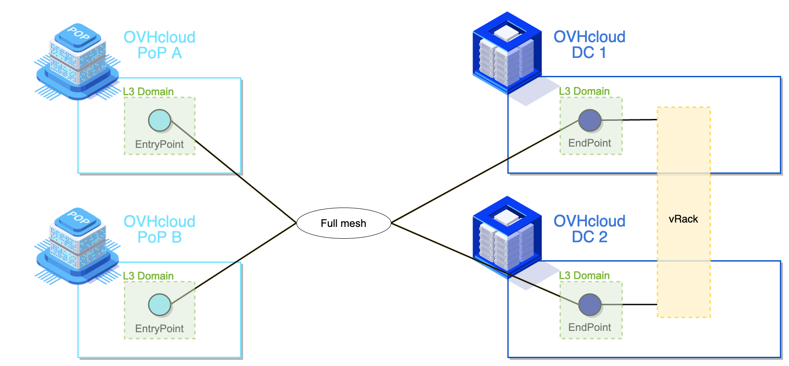
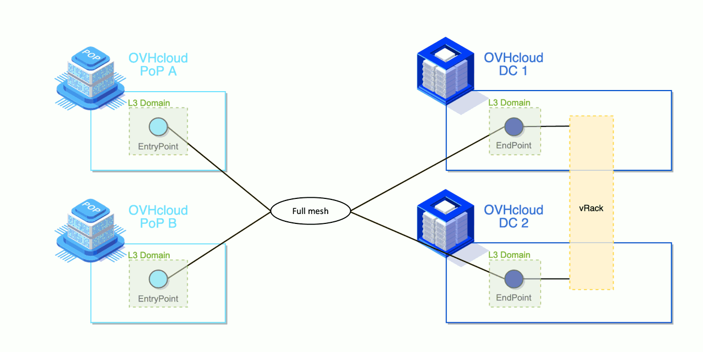
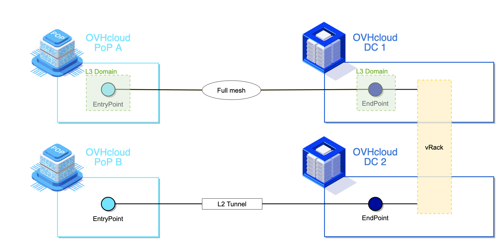
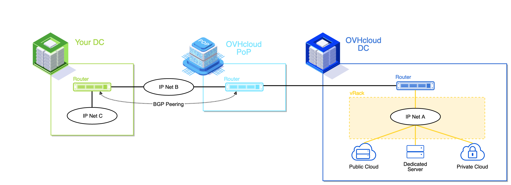
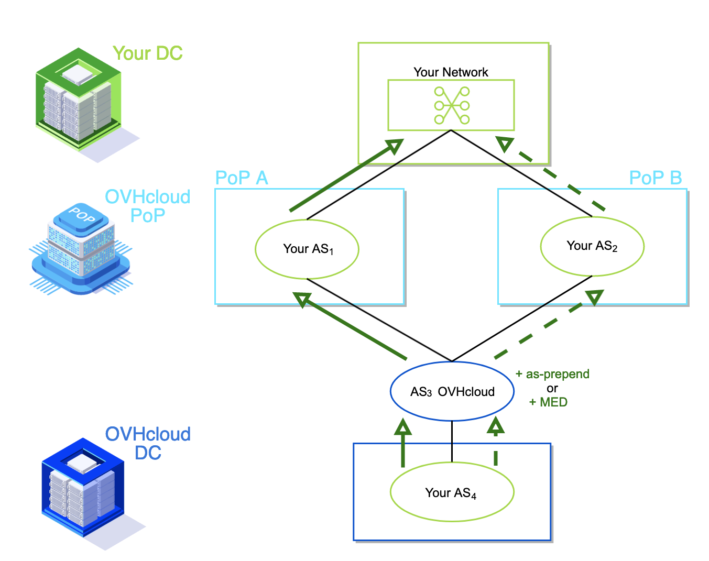

## Objective

**Learn more about Layer 3 implementation and connection for the OVHcloud Connect solution.**

## Instructions

### Layer 3 implementation

OVHcloud Connect configured in Layer 3 differs from Layer 2 as you have to configure the L3 domain on each PoP/EntryPoint and DC/EndPoint.

{.thumbnail}

A Layer 3 domain is composed of:

- A subnet
- A BGP ASN

The L3 domain is an IP routing instance provided by OVHcloud. Traffic is forwarded between PoP/EntryPoint and DC/Endpoint, not between two PoPs/EntryPoints. There is no need for internal IP addressing between PoP/EntryPoint and DC/EndPoint. In the data centre, the routing instance inside the L3 domain is composed of two devices, labelled ‘A’ and ‘B’.

Based on this principle it is possible to manage several OVHcloud Connect services. 

{.thumbnail}

As a result, L3 makes it compatible with a multi-DC configuration.

{.thumbnail}

The two examples above illustrate the configuration of two OVHcloud Connect services, as one OVHcloud Connect equals one PoP/EntryPoint.

**Rules:**

- You can have as many OVHcloud Connect L3 as you want in the same vRack.
- You can associate several PoPs/EntryPoints with one DC/EndPoint.
- You can associate several DCs/EndPoints with one PoP/EntryPoint.
- You cannot associate two PoPs/EntryPoints (i.e. you cannot forward traffic between them).
- One L3 domain can only be associated with one DC/EndPoint.
- One L3 domain (i.e. subnet) cannot be stretched between two DCs or two PoPs.
- An OVHcloud Connect L2 can be mixed with several OVHcloud Connect L3 in the same vRack.

{.thumbnail}

The following schema shows the mix of L2 and L3. They can end in the same OVHcloud data centre or not.

{.thumbnail}

### Connection mode details

{.thumbnail}

On such an architecture, two L3 domains are needed: PoP/EntryPoint and DC/EndPoint.

"IP Net A" is part of the L3 Domain in the DC. The following rules apply:

- IP addressing plan (subnet and netmask) with a minimum netmask of /29.
- The first IP address is reserved for the virtual gateway (if running VRRP).
- The two following IP addresses are reserved for the OVHcloud routing instance.
- All other IP addresses are available to the customer.

| IP address | Role |
|:-----:|:-----:|
| A.B.C.0 | Subnet |
| A.B.C.1 | OVHcloud virtual router address (if enabled) |
| A.B.C.2 | OVHcloud router A |
| A.B.C.3 | OVHcloud router B |

"IP Net B" is part of the L3 Domain in the PoP. The following rules apply:

- Supported netmask: /30 (CIDR notation).
- The first IP address is reserved for the OVHcloud routing instance.
- The second IP address is used for customer equipment.

| IP address | Role |
|:-----:|:-----:|
| A.B.C.0 | Subnet |
| A.B.C.1 | OVHcloud router |
| A.B.C.2 | Customer router |
| A.B.C.3 | Subnet broadcast |

#### VRRP configuration in the DC/EndPoint

VRRP allows router redundancy on OVHcloud devices.

- Each DC/EndPoint supports only one VRRP instance.
- The VRRP VRID value is provided by OVHcloud.
- By default, VRRP is master on ‘A’ device.
- Static routes can be configured. 

#### BGP configuration

BGP is mandatory in a PoP/EntryPoint and optional in a DC/EndPoint. Enabling BGP in a DC/EndPoint disables VRRP configuration.

- Each PoP/EntryPoint and DC/EndPoint needs an AS. This AS must be independent from the customer BGP AS to form an eBGP relation. The recommended value is in the range 64512-65534.
- Each PoP/EntryPoint supports only one BGP session (no eBGP Multihop).
- With two or more PoPs/EntryPoints, ECMP is automatically enabled. MED and/or AS-PATH must be tuned to have path selection.
- Each DC/EndPoint supports up to 4 BGP peers.
- Up to 100 prefixes can be announced per BGP session.
- For each DC/EndPoint you must establish a BGP session with ‘A’ device and ‘B’ device.
- By default, BFD is activated on all BGP sessions. This protocol is higly recommended on the DC side as well to have a faster convergence.

For example, IP network 'B' will be announced to the OVHcloud router through BGP session.

{.thumbnail}

At a more global level, BGP topology will look like this:

{.thumbnail}

#### BGP path selection

By default, all available paths are enabled using ECMP, with up to 4 paths supported. To have an active/passive topology with two PoPs/EntryPoints, you can use AS path prepending or MED.

If AS path prepending is configured on the customer's devices in PoP2, the topology will look like this:

{.thumbnail}

Note: AS path prepending is not configurable on OVHcloud devices.

Using MED is an alternative to achieve the same topology.

## Go further

If you need training or technical assistance to implement our solutions, contact your sales representative or click on [this link](https://www.ovhcloud.com/pt/professional-services/) to get a quote and ask our Professional Services experts for assisting you on your specific use case of your project.

Join our community of users on <https://community.ovh.com/en/>.
