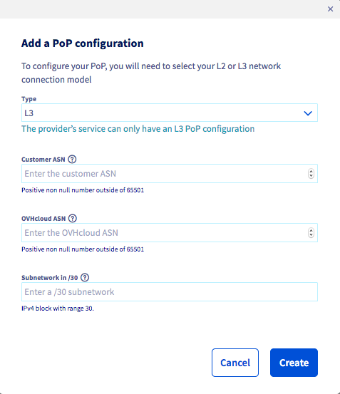
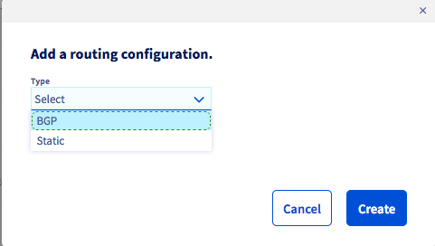
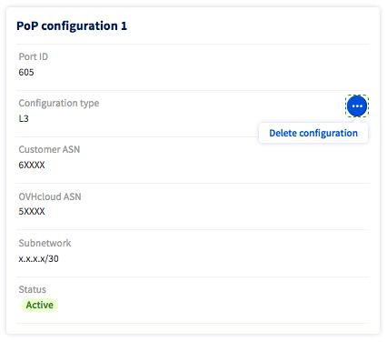

**Dernière mise à jour le 28/09/2020**

## Objectif

OVHcloud Connect permet d’étendre votre réseau d’entreprise avec votre réseau privé OVHcloud vRack sans passer par la création d’un tunnel VPN à travers Internet. Cette connexion sera ainsi plus rapide, plus fiable et avec une bande passante garantie. 

**Ce guide vous présente la mise en service de l'offre OVHcloud Connect Provider depuis l'espace client OVHcloud**

## Prérequis

> [!warning]
> Pour assurer un fonctionnement correct de ce service, vous devez prendre connaissance des [capacités et limites techniques de l'offre OVHcloud Connect](/pages/network/ovhcloud_connect/occ-limits) et configurer vos équipements réseau en accord avec celles-ci.
>

- Avoir commandé une [offre OVHcloud Connect Provider](https://www.ovhcloud.com/fr/network-security/ovhcloud-connect/)
- Disposer d'un [vRack OVHcloud](https://www.ovh.com/fr/solutions/vrack/)
- Être connecté à votre [espace client OVHcloud](https://www.ovh.com/auth/?action=gotomanager&from=https://www.ovh.com/fr/&ovhSubsidiary=fr)

## En pratique

### Étape 1 : commande de votre offre

Une fois votre offre OVHcloud Connect Provider commandée, vous recevrez une confirmation de commande par e-mail ainsi qu'une clé de service (ServiceKey).

Selon le fournisseur que vous avez choisi, rendez-vous ensuite sur le portail de celui-ci pour vous identifier, le lien étant fourni dans l'e-mail de confirmation de commande. 
Renseignez alors votre clé de service et validez la commande qui vous sera présentée.

Vérifiez par la suite dans votre  [espace client OVHcloud](https://www.ovh.com/auth/?action=gotomanager&from=https://www.ovh.com/fr/&ovhSubsidiary=fr){.external} le statut d'activation de votre offre. Pour cela, cliquez sur `Bare Metal Cloud`{.action} puis sélectionnez l'onglet `Network`{.action}. Ensuite, cliquez sur `OVHcloud Connect`{.action} puis sur votre offre. Le statut de votre offre passera à « Actif ».

### Étape 2 : associer un vRack

Connectez-vous à [l’espace client OVHcloud](https://www.ovh.com/auth/?action=gotomanager&from=https://www.ovh.com/fr/&ovhSubsidiary=fr){.external}, cliquez sur `Bare Metal Cloud`{.action} en haut à gauche puis sélectionnez l'onglet `Network`{.action}. Cliquez alors sur `OVHcloud Connect`{.action} puis sur votre offre.

{.thumbnail}

Vous devez commencer par associer un vRack à votre offre. Cliquez sur le bouton  `Associer un vRack`{.action} et sélectionnez un vRack existant dans le menu déroulant. 

{.thumbnail}

Un message vous confirmera l'association du vRack.

{.thumbnail}

### Étape 3 : ajouter une configuration PoP

> [!warning]
> L'offre OVHcloud Connect Provider nécessite une configuration de niveau L3.
>

Une fois votre vRack associé, cliquez sur `Ajouter une configuration PoP`{.action} et sélectionnez la configuration L3 dans le menu déroulant.

{.thumbnail}

Vous devrez alors saisir les éléments suivants :

| Information    | Description |
|:-------:|:------:|
| ASN client    | Votre numéro d'AS BGP, qui est configuré sur votre routeur situé dans le PoP |
| ASN OVHcloud    | Le numéro d'AS OVHcloud qui sera configuré sur les routeurs de OVHcloud Connect situés dans le PoP |
| Sous-réseau en /30    | Un bloc IPv4 de taille /30, utilisé pour le lien entre votre routeur et le routeur OVHcloud Connect situé dans le PoP |

{.thumbnail}

Le menu `Configuration PoP` apparaîtra alors.

{.thumbnail}

### Étape 4 : ajout d'une configuration Datacentre 

Lorsque votre configuration PoP a été définie, cliquez sur `Ajouter une configuration`{.action} sous le menu `Configuration Datacentre`.

{.thumbnail}

Sélectionnez un datacentre dans le menu déroulant puis renseignez les informations requises. 

| Information    | Description |
|:-------:|:------:|
| ASN OVHcloud    | Le numéro d'AS OVHcloud qui sera configuré sur les routeurs OVHcloud Connect situés dans le DC. Ce numéro peut être différent de l'ASN choisi pour le PoP |
| Sous-réseau en /28    |  Un sous-réseau privé configuré dans votre vRack dans le DC sélectionné. Cela peut être un bloc IPv4 de taille /28 ou supérieur |

{.thumbnail}

Vous pouvez ajouter des configurations Datacentre supplémentaires en cliquant sur le bouton `...`{.action} puis sur `Ajouter une configuration`{.action}.

{.thumbnail}

Vous devez également ajouter une configuration de routage.

##### **Ajout d'une configuration de routage**

Cliquez sur le bouton `(...)`{.action} sur le datacentre voulu puis sur `Ajouter configuration de routage`{.action}.

{.thumbnail}

Choisissez alors le type de routage entre « Static » et « BGP ».

{.thumbnail}

Si vous choisissez le type « BGP », saisissez alors les informations requises :

| Information    | Description |
|:-------:|:------:|
| ASN client    | Votre numéro d'AS BGP, qui est configuré sur votre routeur situé dans le DC |
| IP Neighbor    | Adresse IP du neighbor BGP de votre routeur dans le DC. Cette adresse doit faire partie du sous-réseau renseigné dans la `Configuration DC` |

{.thumbnail}

Si vous choisissez le type « Static », saisissez les informations requises :

| Information    | Description |
|:-------:|:------:|
| Sous-réseau    | Un préfixe utilisant la notation CIDR |
| Nexthop    | Adresse IP agissant comme passerelle dans la plage de sous-réseau |

{.thumbnail}

Vous pouvez ajouter plusieurs configurations de routage au sein d'un même datacentre. Le type de configuration (BGP ou Static) choisi sur votre première configuration s'appliquera alors aux suivantes sur le même Datacentre.

{.thumbnail}

### Suppression des ressources

Chaque ressource (PoP ou DC) peut être supprimée individuellement, mais la suppression d’une ressource parente telle que DC ou POP supprimera automatiquement toutes les sous-ressources.

La suppression récursive est plus lente que la suppression séquentielle de chaque ressource.

> [!primary]
> Si une configuration DC est partagée entre au moins deux services OVHcloud Connect, la suppression de la configuration PoP d’un seul service OVHcloud Connect n’affectera pas la ressource DC.
>

#### Suppression d'une configuration de routage

Pour supprimer une configuration de routage, cliquez sur le bouton `(...)`{.action} sur la configuration de routage à supprimer puis sur `Supprimer`{.action}.

{.thumbnail}

#### Suppression d'une configuration DC

Pour supprimer une configuration DC, cliquez sur le bouton `(...)`{.action} sur la configuration DC à supprimer puis sur `Supprimer`{.action}.

{.thumbnail}

> [!primary]
> La suppression d'une configuration DC entraînera la suppression des configurations de routage liées.
>

#### Suppression de la configuration PoP

Pour supprimer une configuration PoP, cliquez sur le bouton `(...)`{.action} sur la configuration PoP puis sur `Supprimer la configuration`{.action}.

{.thumbnail}

> [!primary]
> La suppression d'une configuration PoP entraînera la suppression des configurations DC et de routage.
>

## Aller plus loin

Si vous avez besoin d'une formation ou d'une assistance technique pour la mise en oeuvre de nos solutions, contactez votre commercial ou cliquez sur [ce lien](https://www.ovhcloud.com/fr/professional-services/) pour obtenir un devis et demander une analyse personnalisée de votre projet à nos experts de l’équipe Professional Services.

Échangez avec notre communauté d'utilisateurs sur <https://community.ovh.com/>.
