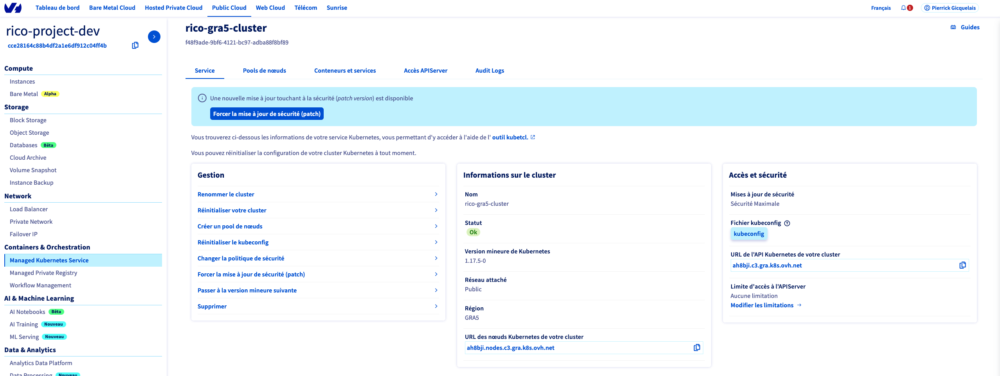

**Last updated 1<sup>st</sup> July, 2019.**


## Objective

The OVHcloud Managed Kubernetes service provides you with access to Kubernetes clusters, without the hassle of installing or operating them. 

This guide will cover how to recover the `kubetcl` configuration file to interact with an OVHcloud Managed Kubernetes cluster.


## Requirements

- You must have an OVHcloud Managed Kubernetes cluster.
- You must have the [`kubectl`](https://kubernetes.io/docs/reference/kubectl/overview/){.external} command-line tool installed.

You can find the detailed installation instructions for `kubetcl` in Kubernetes' [official documentation](https://kubernetes.io/docs/home/){.external}.


## Instructions


### Step 1 - Configure the default settings for kubectl

First, log in to the OVH Control Panel, open the 'Cloud' tab, and click on the 'Platforms and Services' menu:

{.thumbnail}

Then, download the `kubectl` configuration file:

{.thumbnail}

If you want to use this configuration file by default in `kubectl`, you can save it with the filename `kube-config` in the `$HOME/.kube` directory. Alternatively, you can place it in your working directory, with either the `KUBECONFIG` environment variable or the `--kubeconfig` flag. 

In this example, we are using the environment variable method.

#### For MacOS or Linux:

Type the following command into your terminal:

```
export KUBECONFIG=./kube-config
```

#### For Windows : 

1. From the Desktop, right-click the bottom-left corner of the screen to get the Power User Tasks Menu.
2. In this menu, click *System*.

In Windows 10, you may need to scroll down to the *Related settings* section and click the *System info* link. In the System window that opens, click the *Advanced system settings* link in the left-hand column.

1. In the System Properties window, click on the *Advanced* tab, then click the *Environment Variables* button near the bottom.
2. In the window that opens (pictured below), add a new variable, `KUBECONFIG`, with the path to the `kube-config` file as its value.


 {.thumbnail}


You can also add the variable for the current shell process with this command :

```
set KUBECONFIG=kube-config
```


### Step 2 - Verify that *kubectl* can connect to the cluster


You can verify that `kubectl` is able to interact with the cluster by using it to send a `cluster-info` command:

```
kubectl cluster-info
```

The cluster should return a response with some key information about itself:

```
kubectl cluster-info
Kubernetes master is running at https://******.c1.gra.k8s.ovh.net
KubeDNS is running at https://******.c1.gra.k8s.ovh.net/api/v1/namespaces/kube-system/services/kube-dns:dns/proxy
```

To further debug and diagnose cluster problems, use: 

```
kubectl cluster-info dump
```

## Go further

To deploy your first application on your Kubernetes cluster, we suggest you refer to our guide to [Deploying an application](../deploying-an-application/).

Join our community of users on [https://community.ovh.com/en/](https://community.ovh.com/en/).
