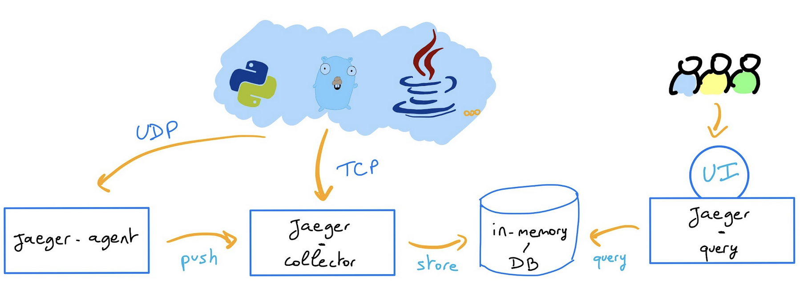
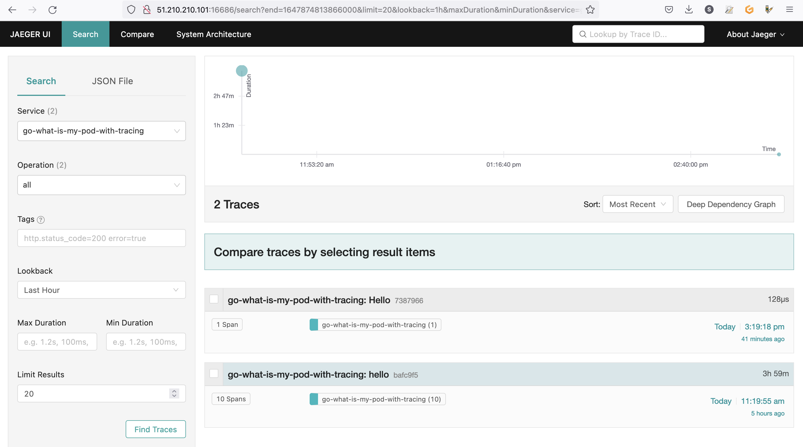

<style>
 pre {
     font-size: 14px;
 }
 pre.console {
   background-color: #300A24; 
   color: #ccc;
   font-family: monospace;
   padding: 5px;
   margin-bottom: 5px;
 }
 pre.console code {
   border: solid 0px transparent;
   font-family: monospace !important;
   font-size: 0.75em;
   color: #ccc;
 }
 .small {
     font-size: 0.75em;
 }
</style>

**Last updated 22nd March 2022**

## Objective

[Jaeger](https://www.jaegertracing.io/) is an open-source distributed tracing platform.


It can be used for monitoring microservices-based distributed systems:

- Distributed context propagation
- Distributed transaction monitoring
- Root cause analysis
- Service dependency analysis
- Performance / latency optimization

Jaeger contains several components:



Read more about [Jaeger architecture and components](https://www.jaegertracing.io/docs/1.32/architecture/).

In this guide you will:

- Install Jaeger Operator
- Deploy Jaeger components
- Access to the UI
- Deploy your instrumented application
- Visualize traces

You can use the *Reset cluster* function in the Public Cloud section of the [OVHcloud Control Panel](https://www.ovh.com/auth/?action=gotomanager&from=https://www.ovh.de/&ovhSubsidiary=de){.external} to reinitialize your cluster before following this tutorial.

## Requirements

This tutorial presupposes that you already have a working OVHcloud Managed Kubernetes cluster, and some basic knowledge of how to operate it. If you want to know more on those topics, please look at the [OVHcloud Managed Kubernetes Service Quickstart](../deploying-hello-world/).

You also need to have [Helm](https://docs.helm.sh/){.external} installed on your workstation and your cluster. Please refer to the [How to install Helm on OVHcloud Managed Kubernetes Service](../installing-helm/) tutorial.

## Instructions

In this guide we will show you how to deploy Jaeger as distributed tracing platform backend and then how to deploy your instrumented application that will send their traces to Jaeger.

### Installing Jaeger

For this tutorial we are using the [Jaeger Helm chart](https://github.com/jaegertracing/helm-charts).

Add the Jaeger Helm repository:

```bash
helm repo add jaegertracing https://jaegertracing.github.io/helm-charts
helm repo update
```

These commands will add the Jaeger Helm repository to your local Helm chart repository and update the installed chart repositories:

<pre class="console"><code>$ helm repo add jaegertracing https://jaegertracing.github.io/helm-charts
helm repo update
"jaegertracing" has been added to your repositories
Hang tight while we grab the latest from your chart repositories...
...Successfully got an update from the "sealed-secrets" chart repository
...
...Successfully got an update from the "prometheus-community" chart repository
Update Complete. ⎈Happy Helming!⎈
</code></pre>

The Jaeger repository provides two charts: `jaeger` and `jaeger-operator`. For the guide, you will deploy the jaeger-operator chart, which makes it easy to configure a minimal installation. 

To learn more about the Jaeger Operator for Kubernetes, consult the [official documentation](https://www.jaegertracing.io/docs/latest/operator/).

Install the latest version of Jaeger with `helm install` command:

```bash
helm install jaeger-operator jaegertracing/jaeger-operator --namespace observability --create-namespace --set rbac.clusterRole=true
```

This command will install the latest version of Jaeger operator and `observability` namespace:

<pre class="console"><code>$ helm install jaeger-operator jaegertracing/jaeger-operator --namespace observability --create-namespace --set rbac.clusterRole=true
manifest_sorter.go:192: info: skipping unknown hook: "crd-install"
NAME: jaeger-operator
LAST DEPLOYED: Thu Mar 17 12:06:49 2022
NAMESPACE: observability
STATUS: deployed
REVISION: 1
TEST SUITE: None
NOTES:
jaeger-operator is installed.


Check the jaeger-operator logs
  export POD=$(kubectl get pods -l app.kubernetes.io/instance=jaeger-operator -lapp.kubernetes.io/name=jaeger-operator --namespace observability --output name)
  kubectl logs $POD --namespace=observability
</code></pre>

Thanks to the variable overriding `rbac.clusterRole=true`, you ask the operator to watch all namespaces.

Check the Jaeger Operator is running:

```bash
kubectl get pod -n observability
```

<pre class="console"><code>$ kubectl get pod -n observability
NAME                               READY   STATUS    RESTARTS   AGE
jaeger-operator-67f8dd68c9-5qj26   1/1     Running   0          3m5s
</code></pre>

The simplest possible way to create a Jaeger instance is by creating a YAML file that will install the default AllInOne image. This “all-in-one” image includes: agent, collector, query, ingester and Jaeger UI in a single pod, using in-memory storage by default.

For this guide you will deploy Jaeger components through this simple way, which can be used for development, testing and demo purposes but for [production strategy](https://www.jaegertracing.io/docs/1.32/operator/#deployment-strategies) you can read the official documentation.

Once the `jaeger-operator` pod in the namespace `observability` is ready, create a `jaeger.yaml` file with the following content:

```yaml
apiVersion: jaegertracing.io/v1
kind: Jaeger
metadata:
  name: jaeger
spec:
  query:
    serviceType: LoadBalancer
```

> [!primary]
>
> In this YAML manifest file we specify that you want to access the Jaeger UI (`jaeger-query`) through a Load Balancer.

And apply it:

```bash
kubectl apply -f jaeger.yaml
```

These commands will create a new CRD `Jaeger` and an instance named `jaeger`:

<pre class="console"><code>$ kubectl apply -f jaeger.yaml
jaeger.jaegertracing.io/jaeger created
</code></pre>

You can now check if the Jaeger instance is running with the following commands:

```bash
kubectl get jaeger
kubectl get pods -l app.kubernetes.io/instance=jaeger
```

Theses commands will check if the instances were created, list the Jaeger objects and list the pods that are running:

<pre class="console"><code>$ kubectl get jaeger
NAME       STATUS    VERSION   STRATEGY   STORAGE   AGE
jaeger   Running   1.30.0    allinone   memory    4s

$ kubectl get pods -l app.kubernetes.io/instance=jaeger
NAME                        READY   STATUS    RESTARTS   AGE
jaeger-59ccc99bcc-zpscb   1/1     Running   0          80s
</code></pre>

You can also check that all Jaeger services have been correctly deployed:

<pre class="console"><code>$ kubectl get svc -l app=jaeger
NAME                          TYPE           CLUSTER-IP     EXTERNAL-IP      PORT(S)                                  AGE
jaeger-agent                ClusterIP      None           <none>           5775/UDP,5778/TCP,6831/UDP,6832/UDP      3d21h
jaeger-collector            ClusterIP      10.3.197.39    <none>           9411/TCP,14250/TCP,14267/TCP,14268/TCP   3d21h
jaeger-collector-headless   ClusterIP      None           <none>           9411/TCP,14250/TCP,14267/TCP,14268/TCP   3d21h
jaeger-query                LoadBalancer   10.3.114.168   51.210.210.101   16686:30598/TCP,16685:30835/TCP          3d21h
</code></pre>

### Access to Jaeger UI

Now you can retrieve Jaeger UI URL with the following command:

```bash
export JAEGER_URL=$(kubectl get svc jaeger-query -o jsonpath='{.status.loadBalancer.ingress[].ip}')
echo Jaeger URL: http://$JAEGER_URL:16686
```

You should obtain the following result:

<pre class="console"><code>$ export JAEGER_URL=$(kubectl get svc jaeger-query -o jsonpath='{.status.loadBalancer.ingress[].ip}')

$ echo Jaeger URL: http://$JAEGER_URL:16686
Jaeger URL: http://51.210.210.101:16686
</code></pre>

Open your browser and go to the Jaeger interface.


### Deploy your instrumented application

In order to link your application to the Jaeger backend you need to use a tool like OpenTelemetry.


[OpenTelemetry](https://opentelemetry.io/) is a collection of tools, APIs, and SDKs. Useful to instrument, generate, collect, and export telemetry data (metrics, logs, and traces) to help you analyze your software’s performance and behavior.

OpenTelemetry integrates with popular libraries and frameworks such as Spring, Express, Quarkus, and with a lot of languages. Go to the documentation to see [how to integrate your application](https://opentelemetry.io/docs/instrumentation/).

For this guide you will deploy a Golang application, instrumented with OpenTelemetry, that will send traces to a provider: your Jaeger collector.

Our `main.go` file contains:

- the import of the OpenTelemetry dependencies,
- a `tracerProvider` method that initiates a connection to a Jaeger provider 
- a `main()` method that connects to the Jaeger collector you previously deployed and creates and sends a span each time the `/` HTTP route will be called

```go
package main

import (
	"context"
	"fmt"
	"log"
	"net/http"
	"os"
	"time"

	"go.opentelemetry.io/contrib/instrumentation/net/http/otelhttp"
	"go.opentelemetry.io/otel"
	"go.opentelemetry.io/otel/attribute"
	"go.opentelemetry.io/otel/exporters/jaeger"
	"go.opentelemetry.io/otel/sdk/resource"
	tracesdk "go.opentelemetry.io/otel/sdk/trace"
	semconv "go.opentelemetry.io/otel/semconv/v1.7.0"
)

const (
	service     = "go-what-is-my-pod-with-tracing"
	environment = "development"
	id          = 1
)

func tracerProvider(url string) (*tracesdk.TracerProvider, error) {
	// Create the Jaeger exporter
	exp, err := jaeger.New(jaeger.WithCollectorEndpoint(jaeger.WithEndpoint(url)))
	if err != nil {
		return nil, err
	}
	tp := tracesdk.NewTracerProvider(
		// Always be sure to batch in production.
		tracesdk.WithBatcher(exp),
		// Record information about this application in a Resource.
		tracesdk.WithResource(resource.NewWithAttributes(
			semconv.SchemaURL,
			semconv.ServiceNameKey.String(service),
			attribute.String("environment", environment),
			attribute.Int64("ID", id),
		)),
	)
	return tp, nil
}

func main() {

	// Tracer
	tp, err := tracerProvider("http://jaeger-collector-headless.default.svc.cluster.local:14268/api/traces")
	if err != nil {
		log.Fatal(err)
	}

	// Register our TracerProvider as the global so any imported
	// instrumentation in the future will default to using it.
	otel.SetTracerProvider(tp)

	ctx, cancel := context.WithCancel(context.Background())
	defer cancel()

	// Cleanly shutdown and flush telemetry when the application exits.
	defer func(ctx context.Context) {
		// Do not make the application hang when it is shutdown.
		ctx, cancel = context.WithTimeout(ctx, time.Second*5)
		defer cancel()
		if err := tp.Shutdown(ctx); err != nil {
			log.Fatal(err)
		}
	}(ctx)

	tr := tp.Tracer("component-main")

	ctx, span := tr.Start(ctx, "hello")
	defer span.End()

	// HTTP Handlers
	helloHandler := func(w http.ResponseWriter, r *http.Request) {
		// Use the global TracerProvider
		tr := otel.Tracer("hello-handler")
		_, span := tr.Start(ctx, "hello")
		span.SetAttributes(attribute.Key("mykey").String("value"))
		defer span.End()

		podName := os.Getenv("MY_POD_NAME")
		fmt.Fprintf(w, "Hello %q!", podName)
	}

	otelHandler := otelhttp.NewHandler(http.HandlerFunc(helloHandler), "Hello")

	http.Handle("/", otelHandler)

	log.Println("Listening on localhost:8080")

	log.Fatal(http.ListenAndServe(":8080", nil))
}
```

> [!primary]
>
> The code source of the application [is available on GitHub](https://github.com/ovhcloud-devrel/go-what-is-my-pod-with-tracing).

We already packaged a Golang application into a Docker image and pushed it in [our ovhplatform Docker Hub repository](https://hub.docker.com/r/ovhplatform/what-is-my-pod-with-tracing) so you can use it directly.

In order to deploy the application on your OVHcloud managed Kubernetes Service, create a `deployment.yaml` file with the following content:

```yaml
apiVersion: apps/v1
kind: Deployment
metadata:
  name: what-is-my-pod-with-tracing-deployment
  labels:
    app: what-is-my-pod-with-tracing
spec:
  replicas: 3
  selector:
    matchLabels:
      app: what-is-my-pod-with-tracing
  template:
    metadata:
      labels:
        app: what-is-my-pod-with-tracing
    spec:
      containers:
      - name: what-is-my-pod-with-tracing
        image: ovhplatform/what-is-my-pod-with-tracing:1.0.2
        ports:
        - containerPort: 8080
        env:
          - name: MY_POD_NAME
            valueFrom:
              fieldRef:
                fieldPath: metadata.name
```

This YAML deployment manifest file defines that our application, based on `ovhplatform/what-is-my-pod-with-tracing:1.0.2` image will be deployed with 3 replicas (3 pods). We pass the pod name on environment variable in order to display it in our what-is-my-pod-with-tracing application.

Then, create a `svc.yaml` file with the following content to define our service (a service exposes a deployment):

```yaml
apiVersion: v1
kind: Service
metadata:
  labels:
    app: what-is-my-pod-with-tracing
  name: what-is-my-pod-with-tracing
spec:
  ports:
  - port: 8080
  selector:
    app: what-is-my-pod-with-tracing
  type: LoadBalancer
```

Apply the deployment and service manifest files to your cluster with the following commands:

```bash
kubectl apply -f deployment.yaml
kubectl apply -f svc.yaml
```

Output should be like this:

<pre class="console"><code>$ kubectl apply -f deployment.yml
deployment.apps/what-is-my-pod-with-tracing-deployment created

$ kubectl apply -f svc.yml
service/what-is-my-pod-with-tracing created
</code></pre>

You can verify if your application is running and service is created by running the following commands:

```bash
kubectl get pod -l app=what-is-my-pod-with-tracing
kubectl get svc -l app=what-is-my-pod-with-tracing
```

Output should be like this:

<pre class="console"><code>$ kubectl get pod -l app=what-is-my-pod-with-tracing
NAME                                                      READY   STATUS    RESTARTS   AGE
what-is-my-pod-with-tracing-deployment-84b56684d8-6kw6z   1/1     Running   0          3m
what-is-my-pod-with-tracing-deployment-84b56684d8-bcsxh   1/1     Running   0          3m
what-is-my-pod-with-tracing-deployment-84b56684d8-wbjmz   1/1     Running   0          3m

$ kubectl get svc -l app=what-is-my-pod-with-tracing
NAME                          TYPE           CLUSTER-IP    EXTERNAL-IP      PORT(S)          AGE
what-is-my-pod-with-tracing   LoadBalancer   10.3.118.87   135.125.84.198   8080:32365/TCP   3m
</code></pre>

In order to generate traffic you need to get the external IP of your service:

```bash
export APP_URL=$(kubectl get svc what-is-my-pod-with-tracing -o jsonpath='{.status.loadBalancer.ingress[].ip}')
echo Application URL: http://$APP_URL:8080/
```

And then generate traffic with curl command:

```bash
curl http://$APP_URL:8080/
```

You should obtain the following result:

<pre class="console"><code>$ export APP_URL=$(kubectl get svc what-is-my-pod-with-tracing -o jsonpath='{.status.loadBalancer.ingress[].ip}')

$ echo $APP_URL
135.125.84.198

$ curl http://$APP_URL:8080/
Hello "what-is-my-pod-with-tracing-deployment-84b56684d8-6kw6z"!%

$ curl http://$APP_URL:8080/
Hello "what-is-my-pod-with-tracing-deployment-84b56684d8-6kw6z"!%

$ curl http://$APP_URL:8080/
Hello "what-is-my-pod-with-tracing-deployment-84b56684d8-wbjmz"!%
</code></pre>

### Visualize traces

Open your browser and go back to the Jaeger interface (http://$JAEGER_URL:16686).


You should now see two available services:

- go-what-is-my-pod-with-tracing
- jaeger-query

Select `go-what-is-my-pod-with-tracing` service and click on `Find Traces`{.action} button.



You can now click in a trace and visualize useful information.


## Cleanup

Delete Jaeger components (created by the operator):

```bash
kubectl delete -f jaeger.yaml
```

Wait until the components are deleted and then you can uninstall the operator.

To uninstall Jaeger Operator, as you installed it through Helm, you can use `helm uninstall` command in order to delete the Jaeger Helm installed chart:

```bash
helm uninstall jaeger-operator -n observability
```

Delete the `observability` namespace:

```bash
kubectl delete ns observability
```

And delete the deployed application:

```bash
kubectl delete -f deployment.yaml
kubectl delete -f svc.yaml
```

## Go further

Join our community of users on <https://community.ovh.com/en/>.
