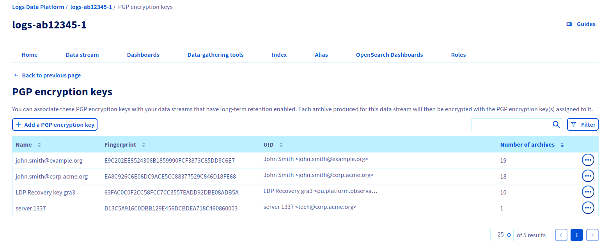
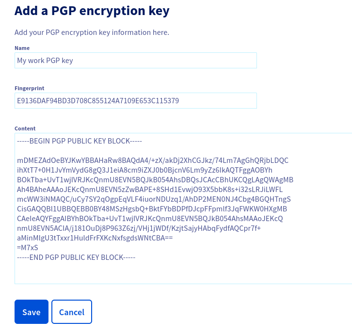
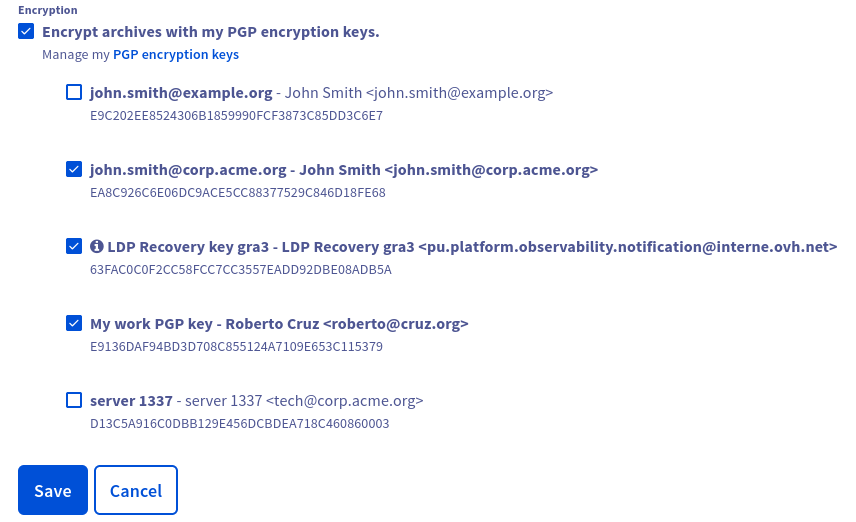

**Last updated 10th March, 2023**

## Objective

With the [Cold Storage feature](/pages/platform/logs-data-platform/archive_cold_storage) you can generate daily archives for your log streams.

On top of that, you can secure these archives by encrypting them with one or more of your PGP public keys. Only the owner of the private keys will be able to decrypt and see the archives content.

## Requirements

This is what you need to get started:

- A stream with cold storage enabled. You can follow this [Cold Storage tutorial](/pages/platform/logs-data-platform/archive_cold_storage) to set it up.
- An existing PGP keypair, or a machine with the `gpg` binary to generate a new PGP keypair.

## Instructions

### Get a PGP public key

First of all, you need a PGP keypair. You can use an existing keypair or create a new one. Both cases are documented below.
The only restrictions we impose regarding this keypair are:

- using RSA 4096 or ECC with Curve 25519 as public key algorithms
- the key must not have any expiration date

> [!warning]
>
> Only your **public** key needs to be shared with OVHcloud.
> You should never share your **private** key,
> and no one at OVHcloud should never ask you for your private key.
>

#### Get an existing PGP public key

If you already have some PGP keypairs, you can list them with the following command:

```shell-session
$ gpg --list-secret-keys
-----------------------
sec   ed25519 2023-03-07 [SC]
      448940C5335D1D278788F4AF67336C97696A1BE0
uid           [ultimate] John Smith <john@smith.org>
ssb   cv25519 2023-03-07 [E]

sec   rsa3072 2023-03-07 [SC] [expires: 2025-03-06]
      A742F6D3566178F008066E252BE29904DDDA4BA1
uid           [ultimate] Robert Dupont <robert@dupont.org>
ssb   rsa3072 2023-03-07 [E] [expires: 2025-03-06]
```

We have two keypairs here:

- One for `John Smith <john@smith.org>`, which fingerprint is `448940C5335D1D278788F4AF67336C97696A1BE0`, which is an EdDSA/ECDH key (`ed25519`/`cv25519`), and which doesn't have any expiration date
    - **This key is usable for Cold Storage Encryption**
- One for `Robert Dupont <robert@dupont.org>`, which fingerprint is `A742F6D3566178F008066E252BE29904DDDA4BA1`, which is an RSA 3072 key, and which expires on `2025-03-06`
    - **This key is NOT usable for Cold Storage Encryption**, as it uses RSA < 4096 and has an expiration date

Once you identified a key which matches our restrictions, you can export the **public** key in an ASCII armored format with the following command, using its fingerprint:

```shell-session
# Replace the fingerprint below with the one of your key
$ gpg --armor --export 448940C5335D1D278788F4AF67336C97696A1BE0
-----BEGIN PGP PUBLIC KEY BLOCK-----

mDMEZAcgExYJKwYBBAHaRw8BAQdA+ACpD0sj4ya5/7IopmIX4HrI1sJ39fdocVUk
eVNb31q0F0pvaG4gRG9lIDxqb2huQGRvZS5vcmc+iJAEExYIADgWIQREiUDFM10d
J4eI9K9nM2yXaWob4AUCZAcgEwIbAwULCQgHAgYVCgkICwIEFgIDAQIeAQIXgAAK
CRBnM2yXaWob4GRdAP98V0ZmBjnbOeCQRyKH38sfIsKA0ZBGW8XCmIkDKyZncgEA
nLlK6SE9hB4IwH7Lye6AsVVln1PzATxvOlaGvSVsZAC4OARkByATEgorBgEEAZdV
AQUBAQdALW8glISzpnR23SCIjHbD40BlXzscOMDAT5tDOVdX7nADAQgHiHgEGBYI
ACAWIQREiUDFM10dJ4eI9K9nM2yXaWob4AUCZAcgEwIbDAAKCRBnM2yXaWob4E7O
APsEXA/I3iRWPw5qgH5Kpj72LTtrQn4l6ALt1JFxlMpbPwEAoEJAVPD+Cwa+3BJT
JX2+PZIPN0uhQdsvvF52tQFhags=
=htfS
-----END PGP PUBLIC KEY BLOCK-----
```

If none of your existing keypairs are compatible, simply generate a new one as explained below.

#### Generate a new PGP public key

Ensure you have GnuPG/`gpg` >= 2.1.x installed:

```shell-session
$ gpg --version
gpg (GnuPG) 2.2.27
```

Now, let's generate your new keypair. An EdDSA/ECDH with Curve 25519 in this example:

```shell-session hl_lines="18 29 37 40 44 45 46 50"
$ gpg --expert --full-gen-key
gpg (GnuPG) 2.2.27; Copyright (C) 2021 Free Software Foundation, Inc.
This is free software: you are free to change and redistribute it.
There is NO WARRANTY, to the extent permitted by law.

Please select what kind of key you want:
   (1) RSA and RSA (default)
   (2) DSA and Elgamal
   (3) DSA (sign only)
   (4) RSA (sign only)
   (7) DSA (set your own capabilities)
   (8) RSA (set your own capabilities)
   (9) ECC and ECC
  (10) ECC (sign only)
  (11) ECC (set your own capabilities)
  (13) Existing key
  (14) Existing key from card
Your selection? 9

Please select which elliptic curve you want:
   (1) Curve 25519
   (3) NIST P-256
   (4) NIST P-384
   (5) NIST P-521
   (6) Brainpool P-256
   (7) Brainpool P-384
   (8) Brainpool P-512
   (9) secp256k1
Your selection? 1

Please specify how long the key should be valid.
         0 = key does not expire
      <n>  = key expires in n days
      <n>w = key expires in n weeks
      <n>m = key expires in n months
      <n>y = key expires in n years
Key is valid for? (0) 0
Key does not expire at all

Is this correct? (y/N) y

GnuPG needs to construct a user ID to identify your key.

Real name: Roberto Cruz
Email address: roberto@cruz.org
Comment: 
You selected this USER-ID:
    "Roberto Cruz <roberto@cruz.org>"

Change (N)ame, (C)omment, (E)mail or (O)kay/(Q)uit? O

We need to generate a lot of random bytes. It is a good idea to perform
some other action (type on the keyboard, move the mouse, utilize the
disks) during the prime generation; this gives the random number
generator a better chance to gain enough entropy.

gpg: /root/.gnupg/trustdb.gpg: trustdb created
gpg: key A7109E653C115379 marked as ultimately trusted
gpg: directory '/root/.gnupg/openpgp-revocs.d' created
gpg: revocation certificate stored as '/root/.gnupg/openpgp-revocs.d/E9136DAF94BD3D708C855124A7109E653C115379.rev'
public and secret key created and signed.

pub   ed25519 2023-03-07 [SC]
      E9136DAF94BD3D708C855124A7109E653C115379
uid                      Roberto Cruz <roberto@cruz.org>
sub   cv25519 2023-03-07 [E]
```

> [!primary]
>
> When you are prompted to choose a passphrase, it's up to you to pick one or to leave it empty for no passphrase.
> If you choose to use a passphrase, be sure to store it in a password manager, it will be needed to decrypt your archives.
>

Congratulations, your key is now generated. You can now export the **public** key in an ASCII armored format with the following command:

```shell-session
# Replace the fingerprint below with the one from the output at the end of your key generation
$ gpg --armor --export E9136DAF94BD3D708C855124A7109E653C115379
-----BEGIN PGP PUBLIC KEY BLOCK-----

mDMEZAdOeBYJKwYBBAHaRw8BAQdA4/+zX/akDj2XhCGJkz/74Lm7AgGhQRjbLDQC
ihXtT7+0H1JvYmVydG8gQ3J1eiA8cm9iZXJ0b0BjcnV6Lm9yZz6IkAQTFggAOBYh
BOkTba+UvT1wjIVRJKcQnmU8EVN5BQJkB054AhsDBQsJCAcCBhUKCQgLAgQWAgMB
Ah4BAheAAAoJEKcQnmU8EVN5zZwBAPE+8SHd1EvwjO93X5bbK8s+i32sLRJiLWFL
mcWW3iNMAQC/uCy7SY2qOgpEqVLF4iuorNDUzq1/AhDP2MEN0NJ4Cbg4BGQHTngS
CisGAQQBl1UBBQEBB0BY48MSzHgsbQ+BktFYbBDPfDJcpFFpmlf3JqFWKW0HXgMB
CAeIeAQYFggAIBYhBOkTba+UvT1wjIVRJKcQnmU8EVN5BQJkB054AhsMAAoJEKcQ
nmU8EVN5ACIA/j181OuDj8P963Z6zj/VHj1jWDf/KzjtSajyHAbqFydfAQCpr7f+
aMinMlgU3tTxxr1HuldFrFXKcNxfsgdsWNtCBA==
=M7xS
-----END PGP PUBLIC KEY BLOCK-----
```

### Register your PGP public key in your Logs Data Platform account

In the home page of your Logs Data Platform service, in the bottom left you will find a `Configuration` panel. In this panel, in the `PGP encryption keys` line, click the `...`{.action} button and then `Edit`{.action}:

{.thumbnail}

You will land on the `PGP encryption keys` page, where you can manage your keys.
It is from this page that you can add, delete, or view the details of your PGP encryption keys. You can also view there how many archives have been encrypted with a given key.

You will possibly view some keys named `LDP Recovery key <cluster name>`, that you did not add yourself. We will mention these LDP Recovery keys later in this documentation.

{.thumbnail}

To register your PGP public key into your Logs Data Platform account, click on the `Add a PGP encryption key`{.action} button.
You will land on a form in which you have three fields to fill in:

- **Name**: it is the display name of this PGP public key inside OVHcloud systems. It can be the same as your PGP key UID (usually `First name Last name <email>`), but it can also be something totally different. As it's only a display name, enter whatever is relevant for you.
- **Fingerprint**: your PGP key fingerprint, in its 40 characters hexadecimal version. In the example above in which we generated a new key, it is `E9136DAF94BD3D708C855124A7109E653C115379`.
- **Content**: the ASCII armored content of your PGP **public** key. Copy paste here the full block beginning with `-----BEGIN PGP PUBLIC KEY BLOCK-----` and ending by `-----END PGP PUBLIC KEY BLOCK-----`.

Even if the fingerprint can be deducted from the PGP public key content, we want you to specify both so that we are 100% sure you are adding the correct key.

{.thumbnail}

Then click `Save`{.action}.

If anything is wrong with your public key (unsupported algorithm, mismatch between fingerprint & key content, etc.) an explicit error message will be printed.

### Update your stream Cold Storage configuration to use encryption

Now that you added your PGP public key to your Logs Data Platform account, you can use it in your streams cold storage configurations.

For this, go to the `Data Stream` tab, pick the stream for which you want cold storage encryption, click the `...`{.action} button and then click`Edit`{.action}.

- Ensure the `Enable long-term storage` option is checked. You can refer to the [Cold Storage feature](/pages/platform/logs-data-platform/archive_cold_storage) documentation to know about each of its fields.
- Check the `Encrypt archives with my PGP encryption keys` option
- Select each PGP encryption key you want your archive to be encrypted with
- Click on `Save`{.action}

{.thumbnail}

That's it: now each archive produced by this stream will be encrypted with the selected keys (don't forget that archives are produced 2 days after logs are sent).

> [!primary]
>
> For a given stream, you can select up to five of your encryption keys (the LDP Recovery Keys are not included in this five keys).
> A given encryption key can be used in several cold storage configurations.
>

### Know which key was used to encrypt which archive

In the `Data Stream` tab, you can see how many archives exist for each stream. On a stream on which you have some archives, click the`...`{.action} button and then click `Archives`{.action}.

{.thumbnail}

In this archives list, you can see a `PGP encryption keys` column.

- if some key names are present here, it means this archive is encrypted with these keys
- if no key names are present, it means this archive is not encrypted at all

#### Download and decrypt your archives

Once your encrypted archives are available, you can retrieve them [following this tutorial](/pages/platform/logs-data-platform/archive_cold_storage#retrieving-the-archives).
To decrypt a given archive, you can use `gpg` on a machine on which your private key is present:

```shell-session
$ ls
2022-11-15.zst.pgp

$ gpg --output 2022-11-15.zst --decrypt 2022-11-15.zst.pgp 
gpg: encrypted with 4096-bit RSA key, ID 97B70793B8270D80, created 2022-05-10
      "John Smith <john.smith@corp.acme.org>"

$ ls
2022-11-15.zst  2022-11-15.zst.pgp
```

### The LDP Recovery Key

Now your stream's archives are encrypted with your PGP public keys, and only the owner of the related private keys can decrypt the archives.

But what if you lose access to your private keys or to your passphrase ? In such a case, you won't be able to decrypt your archives anymore, and won't be able to see the archives content.

To avoid such a situation, we provide the `LDP Recovery Keys`. These are also PGP public keys you can use in your cold storage configuration, but which private keys are owned by OVHcloud. Thus if you chose to use `LDP Recovery Keys` in addition to your own keys, and you lose access to your private keys, OVHcloud teams will still be able to decrypt your archives, re-encrypt it with your new keys and send you these re-encrypted archives.

Note that this feature is opt-in: you have to explicitly select the `LDP Recovery Key` in your stream's cold storage configuration to benefit from this feature.

#### Ask OVHcloud to recover your encrypted archive

If the situation described above happens (you lost your private key, but your archive is also encrypted with the `LDP Recovery Key`), you will have to [contact OVHcloud support](https://www.ovhcloud.com/en/contact/). Open a ticket and describe precisely the name of your Logs Data Platform service, the name of the stream and the name of the archive. You will also have to provide a new PGP encryption key (a key you already added to your Logs Data Platform account).

The Logs Data Platform team will then take care of your request.

## Go further

- Getting Started: [Quick Start](/pages/platform/logs-data-platform/getting_started_quick_start)
- Documentation: [Guides](/products/public-cloud-data-platforms-logs-data-platform)
- Community hub: [https://community.ovh.com](https://community.ovh.com/en/c/Platform/data-platforms){.external}
- Create an account: [Try it!](https://www.ovh.com/en/order/express/#/express/review?products=~(~(planCode~'logs-account~productId~'logs)){.external}
