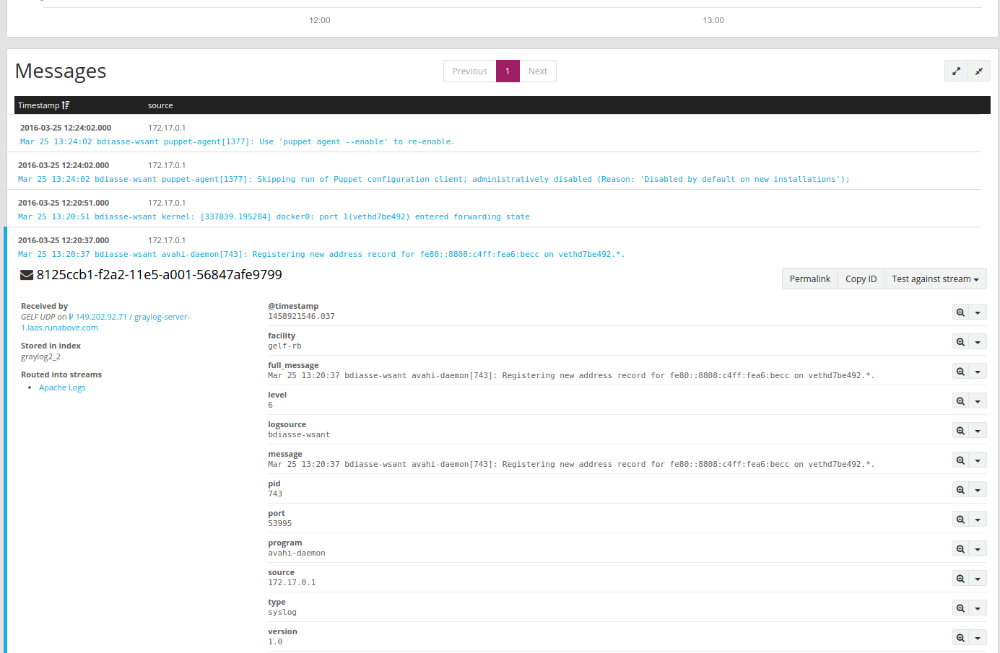
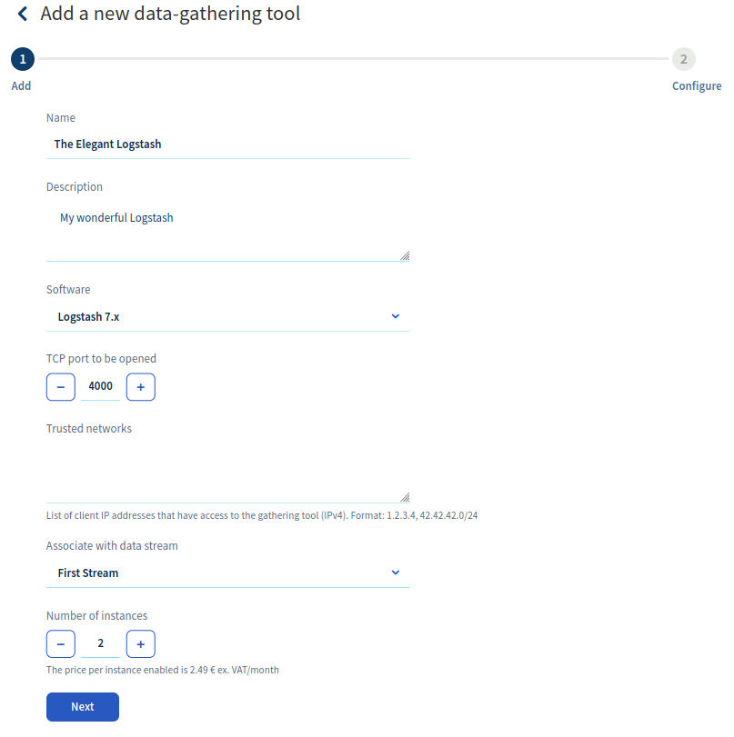
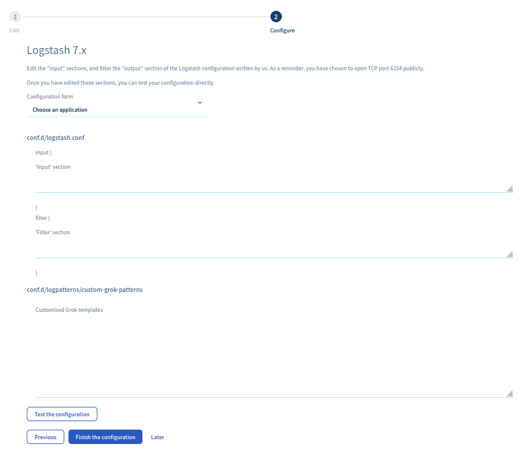
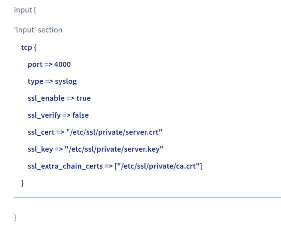
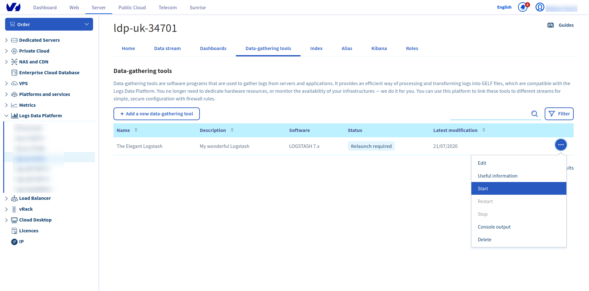
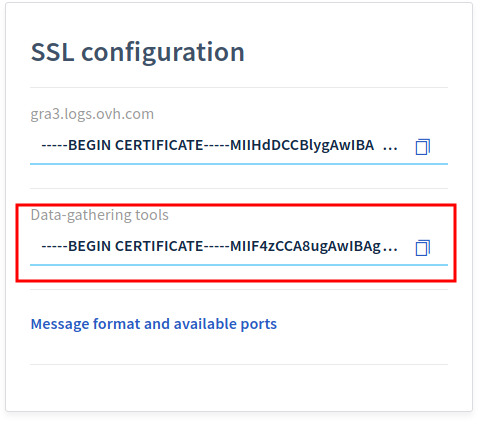
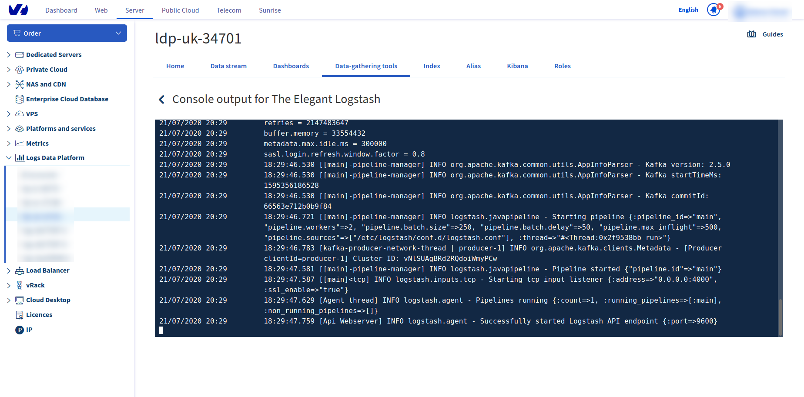

**Last updated 30th July, 2021**

## Objective

[Logstash](https://github.com/elastic/logstash){.external} is an open source software developed by Elastic. Based on its features, its possible to send messages from several inputs to different types of output using a variety of codecs, while processing them and transforming them in the process. You can learn a lot more about it on [the official website](https://www.elastic.co/products/logstash){.external}.

This guide will demonstrate how to deploy a personalized Logstash having a specific configuration, and send logs from any source to your stream directly on the Logs Data Platform.

## Requirements

If you are new to Logs Data Platform, completion of the [Quick Start Tutorial](/pages/platform/logs-data-platform/getting_started_quick_start){.ref} is highly recommended.

The following links can help you get a headstart on Logstash in order to get started with the basics:

- [What is Logstash?](#what-is-logstash){.external}
- [How do I configure Logstash Collector on Logs Data Platform?](#host-a-logstash-collector-on-logs-data-platform){.external}
- [What is special about our hosted Logstash? Available plugins, SSL Certificates and more.](#additional-information_1){.external}

This is "All you need to know about the Logstash Collector on the Logs Data Platform"!

## Instructions

### What is Logstash

Logstash is a data processing pipeline that allows you to receive information from several sources, transforming them if necessary before sending to a variety of softwares. In the configuration file there are three main parts to configure:

- The Input part: details where your logs come from. For instance, some inputs may wait for logs and in some cases inputs are able to fetch them from a database.
- The Filter part: details how Logstash should parse and transform your logs messages.
- The Output part: specifies the format and their destination.

Following is a small configuration file for familiarizing yourself with the idea :

```ruby
 #input
 #The input part just launch tcp server that will listen on port 5000
 #Each incoming line of log will be tagged as a syslog type.
 input {
     tcp {
         port => 5000
         type => syslog
     }
 }

 #Filter
 #The filter part applies a grok filter that will parse the message
 #It will also create new fields with information contained in the message.
 filter {
     grok {
         match => { "message" => "%{SYSLOGBASE}" }
     }
     date {
         match => [ "timestamp", "MMM dd HH:mm:ss" ]
         target => "timestamp"
         timezone => "Europe/Paris"
     }
 }

 #Output
 #The output part will then encode everything in a gelf format and send it to Logs Data Platform on the TCP GELF endpoint
 #Note that you need to change the token to use the one of your stream.
 output {
     gelf {
         host => "<your_cluster>.logs.ovh.com"
         protocol => "TCP"
         port => 2202
         custom_fields => ['X-OVH-TOKEN', 'da819874-5562-4a5f-b34e-fa8e708e8f16']
     }
 }
```

This is one example of configuration among others you can use in your own Logstash to send syslog type logs to the Logs Data Platform. There are a lot of filters and plugins available in Logstash, and the list is growing! For example, by sending these kinds of lines into this Logstash:

```text
 Mar 25 13:20:36 bdiasse-wsant docker[7406]: time="2016-03-25T13:20:36.038884464+01:00" level=info msg="IPv6 enabled; Adding default IPv6 external servers : [nameserver 2001:4860:4860::8888 nameserver 2001:4860:4860::8844]"
 Mar 25 13:20:36 bdiasse-wsant systemd[1]: Started docker container 5164ae90f489bc4479081c788b69b533a1e7a0be7e456f123cb05bb0542fc71b.
 Mar 25 13:20:36 bdiasse-wsant systemd[1]: Starting docker container 5164ae90f489bc4479081c788b69b533a1e7a0be7e456f123cb05bb0542fc71b.
 Mar 25 13:20:36 bdiasse-wsant avahi-daemon[743]: Withdrawing workstation service for veth4c25f95.
 Mar 25 13:20:36 bdiasse-wsant systemd[1]: Stopping ifup for veth4c25f95...
 Mar 25 13:20:36 bdiasse-wsant kernel: [337824.157113] eth0: renamed from veth4c25f95
 Mar 25 13:20:36 bdiasse-wsant ifdown[2091]: /sbin/ifdown: interface veth4c25f95 not configured
 Mar 25 13:20:36 bdiasse-wsant systemd[1]: Stopped ifup for veth4c25f95.
 Mar 25 13:20:36 bdiasse-wsant NetworkManager[777]: <info> devices removed (path: /sys/devices/virtual/net/veth4c25f95, iface: veth4c25f95)
 Mar 25 13:20:36 bdiasse-wsant kernel: [337824.172875] IPv6: ADDRCONF(NETDEV_CHANGE): vethd7be492: link becomes ready
 Mar 25 13:20:36 bdiasse-wsant kernel: [337824.172973] docker0: port 1(vethd7be492) entered forwarding state
 Mar 25 13:20:36 bdiasse-wsant kernel: [337824.172992] docker0: port 1(vethd7be492) entered forwarding state
 Mar 25 13:20:36 bdiasse-wsant NetworkManager[777]: <warn> (vethd7be492): enslaved to unknown device 3 docker0
 Mar 25 13:20:36 bdiasse-wsant NetworkManager[777]: <info> (vethd7be492): link connected
 Mar 25 13:20:36 bdiasse-wsant docker[7406]: time="2016-03-25T13:20:36.478880100+01:00" level=info msg="POST /v1.21/containers/5164ae90f489bc4479081c788b69b533a1e7a0be7e456f123cb05bb0542fc71b/resize?h=57&w=207"
 Mar 25 13:20:37 bdiasse-wsant avahi-daemon[743]: Joining mDNS multicast group on interface vethd7be492.IPv6 with address fe80::8808:c4ff:fea6:becc.
 Mar 25 13:20:37 bdiasse-wsant avahi-daemon[743]: New relevant interface vethd7be492.IPv6 for mDNS.
 Mar 25 13:20:37 bdiasse-wsant avahi-daemon[743]: Registering new address record for fe80::8808:c4ff:fea6:becc on vethd7be492.*.
 Mar 25 13:20:51 bdiasse-wsant kernel: [337839.195284] docker0: port 1(vethd7be492) entered forwarding state
 Mar 25 13:24:02 bdiasse-wsant puppet-agent[1377]: Skipping run of Puppet configuration client; administratively disabled (Reason: 'Disabled by default on new installations');
 Mar 25 13:24:02 bdiasse-wsant puppet-agent[1377]: Use 'puppet agent --enable' to re-enable.
```

You will have the following result in your stream in Graylog :

{.thumbnail}

So, let's suppose you have a lot of hosts and you want to send all your syslog outputs to Logstash. One way to do it is to put one Logstash on one of your machines and send all the logs to this hosts. This will work but what happens if your hosts go down? Or is not fast enough? Or if it isn't compatible with Java? Don't worry, the best thing about the Logs Data Platform is that we can host your Logstash for you. We also allow you to configure the input and the filter as you wish and you can even define custom Groks. The next section will tell you how to do it!

### Host a Logstash collector on Logs Data Platform

The Logstash Collector comes with many advantages :

- The output part of the Logstash is automatically configured by us.
- You have your own certificate to enable SSL. This certificate can be used for example to trust only the TCP Inputs of your Logstash. This certificate and its associated key can be found at the following paths : **/etc/ssl/private/server.crt** for the cert and **/etc/ssl/private/server.key** for the key. The CA used to create these inputs is at the following location **/etc/ssl/private/ca.crt**. You will find this SSL CA for reference at the end of this document. For the http input with ssl enabled, a keystore with the key+cert+CA in PKCS12 format is present at the following location **/etc/ssl/private/keystore.jks** with keystore password "changeit".
- And finally, we ensure that your collector is always up and running 24/7.

To host this collector in the Logs Data Platform, you will need to configure it in the Logs Data Platform manager:

- Check the **Data-gathering tools** tab and click on the button `Add a new data-gathering tool`{.action}.
- The Manager will then ask you to put a elegant name and a wonderful description.
- Select your Software : Select **Logstash 7.x**.
- Fill the main port of your input. We need to know which port you will use in your input configuration. We will put **4000** for now. This is also a setting you can change later.
- If you want to restrict the Logstash to specific IP Adresses, you can use the **Trusted Networks** field to firewall your instances. Add every IP Adress or subnet you want to allow, separated by comma. Leave it empty to allow any IP to contact it. Your collector will have a public IP Adress, you can use this feature to prevent people to send you false information in it.
- Select one of the stream you have to attach this collector to the stream you have. That means that every message that goes out of this collector is automatically routed to the stream.
- Finally, select the number of instances you would need to handle your load. We recommend to have at least two instances to ensure the high availabilty of your Logstash. However some uses cases need you to limit the number of instance at 1 (like the [Twitter use case](/pages/platform/logs-data-platform/usecase_twitter){.ref}).

{.thumbnail}

The Engine won't allow you to start it if you do not configure it properly. So let's do it!


#### Logstash Collector configuration

Click on `Next`{.action} button to display the Logstash Configuration Page as follows :

{.thumbnail}

There is 3 sections in this page :

- The Input section where you put the Input part of your configuration file.
- The Filter section where you put the filter part.
- The grok patterns sections where you can create your own grok patterns.

Note that unlike a classic config file, here you don't have to enclose the input grammar configuration.

```ruby
input {

}
```
We will do it automatically for you.

If we take the configuration example above and if we enable the SSL encryption, we have the following configuration for the Input Section :

```ruby
 tcp {
     port => 4000
     type => syslog
     ssl_enable => true
     ssl_verify => false
     ssl_cert => "/etc/ssl/private/server.crt"
     ssl_key => "/etc/ssl/private/server.key"
     ssl_extra_chain_certs => ["/etc/ssl/private/ca.crt"]
 }
```

{.thumbnail}

As you can see, this is roughly the same configuration that before. The SSL configuration needs 5 extra parameters :

- **ssl_enable**: that allows to enable SSL. Must be set to `true`.
- **ssl_verify**: this deactivates the client certificate verification process that needs a trusted certificate on client side.
- **ssl_cert**: the location of the auto-generated server certificate.
- **ssl_key**: the location of the associated key.
- **ssl_extra_chain_certs**: the array contains the path to the CA certificate.

All the inputs have preconfigured SSL certificates at the fixed locations used in the configuration above. And for the filter part, you just have to copy and paste the previous configuration.

{.thumbnail}

The last section of the configuration is dedicated to custom Grok Filters. If you know about Grok, you can use this text area to create your own grok that you can use in the filter section above. It is an advanced usage of Logstash. Head to the end of the document to get some reference links that can help you use this functionality.

To validate the settings, you will have to click on `Test the configuration`{.action} button. After some fancy calculations you should see on the screen a green confirmation.

{.thumbnail}

You can then click on `Finish the configuration`{.action} button to save your configuration!

#### Starting the input

Starting the input is done by using the `Start`{.action} Button in the **...** menu at the right of your input. Click on it to deploy your collector on Logs Data Platform.

{.thumbnail}

#### Collector useful information

Once your collector is started, you can copy several informations into your clipboard.

- The hostname
- The public IP
- The SSL Certificate

The hostname is in the following form:

`<your_cluster>-XXXXXXXXXXXXXXXXXXXXXXX.<your_cluster>.logs.ovh.com`

This is an address of your collector for the cluster on Logs Data Platform. Send your logs to your address to have them processed by your collector. Use for example the previous syslog Lines to test your collectors. If you head to Graylog, you will find your Logs in the attached Stream just as before.

{.thumbnail}

### Additional information

#### Logstash Version

The version hosted by Logs Data Platform is the Latest Logstash 7 version (7.8 as of July 2020). Of course we will update to the new versions as soon as they become available.

#### Logstash Plugins
For your information, here is the list of Logstash plugins we support. Of course we will welcome any suggestion on additional plugins. Don't hesitate to contact us on the [community hub](https://community.ovh.com/en/c/Platform/data-platforms){.external}.

##### Inputs plugins

```
 logstash-input-azure_event_hubs
 logstash-input-beats
 logstash-input-couchdb_changes
 logstash-input-dead_letter_queue
 logstash-input-elasticsearch
 logstash-input-ganglia
 logstash-input-gelf
 logstash-input-generator
 logstash-input-graphite
 logstash-input-heartbeat
 logstash-input-http
 logstash-input-http_poller
 logstash-input-imap
 logstash-input-jdbc
 logstash-input-jms
 logstash-input-rabbitmq
 logstash-input-redis
 logstash-input-s3
 logstash-input-snmp
 logstash-input-snmptrap
 logstash-input-sqs
 logstash-input-stdin
 logstash-input-syslog
 logstash-input-tcp
 logstash-input-twitter
```

##### Input gelf plugin

We patched the gelf input to support TCP+TLS. Example of Input section :

```ruby
 tcp {
     port => 12202
     type => gelf
     ssl_enable => true
     ssl_verify => false
     ssl_cert => "/etc/ssl/private/server.crt"
     ssl_key => "/etc/ssl/private/server.key"
     ssl_extra_chain_certs => ["/etc/ssl/private/ca.crt"]
     codec => gelf { delimiter => "\x00" }
 }
```

#### filter plugins

```
 logstash-filter-aggregate
 logstash-filter-anonymize
 logstash-filter-cidr
 logstash-filter-clone
 logstash-filter-csv
 logstash-filter-date
 logstash-filter-de_dot
 logstash-filter-dissect
 logstash-filter-dns
 logstash-filter-drop
 logstash-filter-elasticsearch
 logstash-filter-fingerprint
 logstash-filter-geoip
 logstash-filter-grok
 logstash-filter-hex
 logstash-filter-http
 logstash-filter-jdbc_static
 logstash-filter-jdbc_streaming
 logstash-filter-json
 logstash-filter-kv
 logstash-filter-math
 logstash-filter-memcached
 logstash-filter-metrics
 logstash-filter-mutate
 logstash-filter-prune
 logstash-filter-sleep
 logstash-filter-split
 logstash-filter-syslog_pri
 logstash-filter-throttle
 logstash-filter-translate
 logstash-filter-truncate
 logstash-filter-urldecode
 logstash-filter-useragent
 logstash-filter-uuid
 logstash-filter-xml
```

#### codec plugins

```
 logstash-codec-avro
 logstash-codec-cef
 logstash-codec-collectd
 logstash-codec-dots
 logstash-codec-edn
 logstash-codec-edn_lines
 logstash-codec-es_bulk
 logstash-codec-fluent
 logstash-codec-gelf
 logstash-codec-graphite
 logstash-codec-json
 logstash-codec-json_lines
 logstash-codec-line
 logstash-codec-msgpack
 logstash-codec-multiline
 logstash-codec-netflow
 logstash-codec-plain
 logstash-codec-rubydebug
```

The following plugins are disabled for security reasons :

```
 logstash-input-exec
 logstash-input-file
 logstash-input-kafka
 logstash-input-pipe
 logstash-input-unix
 logstash-filter-ruby
```

##### SSL CA certificate

The CA certificate you can use to verify the authority presented by our hosted collectors can be copied from the homepage of the Logs Data Platform manager.

{.thumbnail}


##### Console output

Last but not least, if you have concerns about the way your logstash is handling your logs, you may be interested to follow the messages coming from your collector.
To do this, please go to the dedicated page by clicking on the `Console output`{.action} button.

{.thumbnail}


#### Useful Resources

Here are some links to help you go further with Logstash

- [Logstash official documentation](https://www.elastic.co/guide/en/logstash/current/index.html){.external}
- [Grok filters documentation](https://www.elastic.co/guide/en/logstash/current/plugins-filters-grok.html){.external}
- [Logstash + Groks + Filebeat = Awesome](../filebeat-logs){.ref}
- [Grok Constructor](http://grokconstructor.appspot.com/do/match){.external}
- [A Ruby regular expression editor](https://rubular.com/){.external}

That's all you need to know about the Logstash Collector on Logs Data Platform.

## Go further

- Getting Started: [Quick Start](/pages/platform/logs-data-platform/getting_started_quick_start){.ref}
- Documentation: [Guides](/pages/platform/logs-data-platform){.ref}
- Community hub: [https://community.ovh.com](https://community.ovh.com/en/c/Platform/data-platforms){.external}
- Create an account: [Try it!](https://www.ovh.com/fr/order/express/#/express/review?products=~(~(planCode~'logs-account~productId~'logs)){.external}
