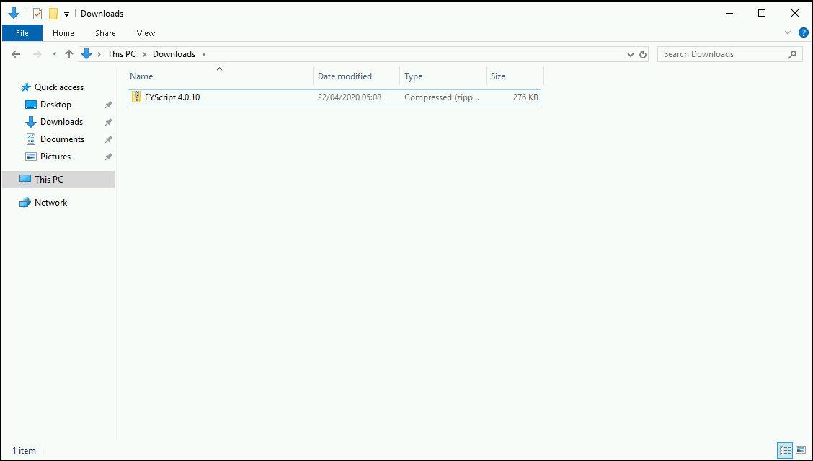
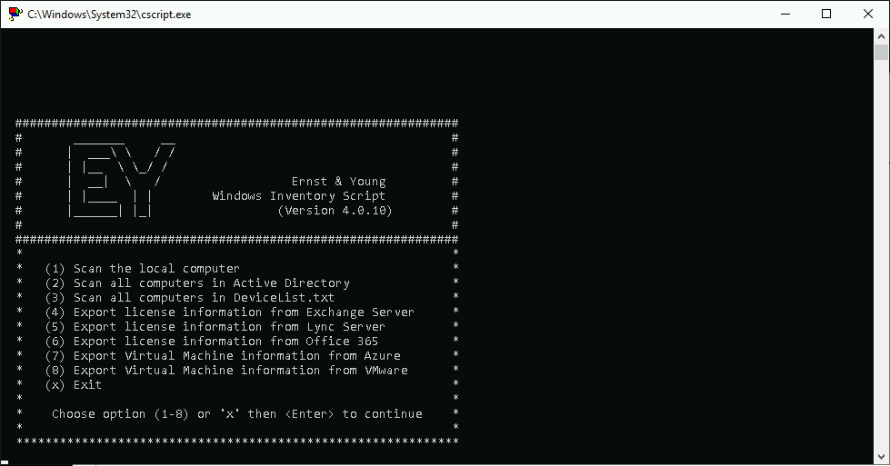
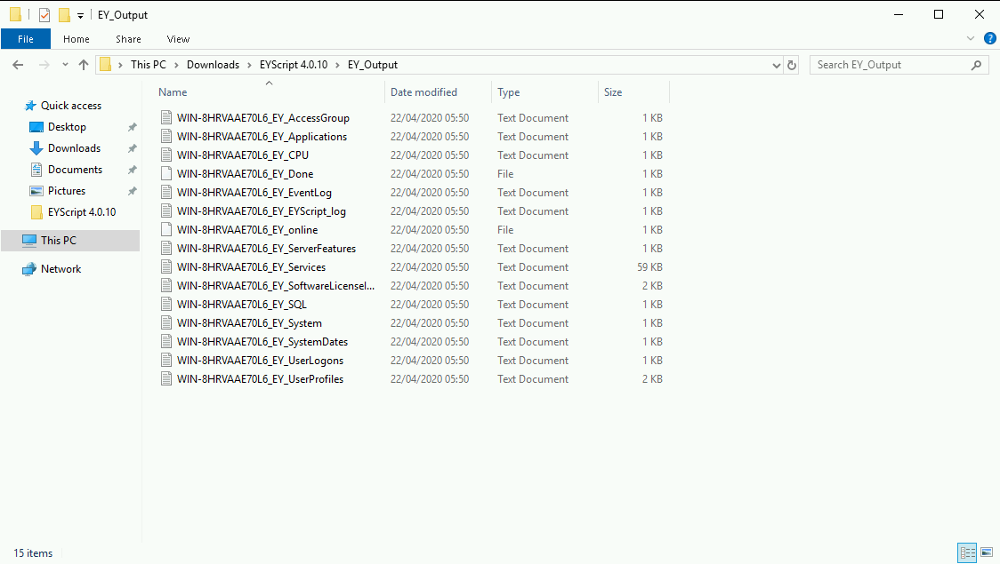
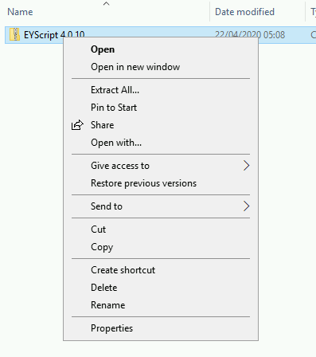
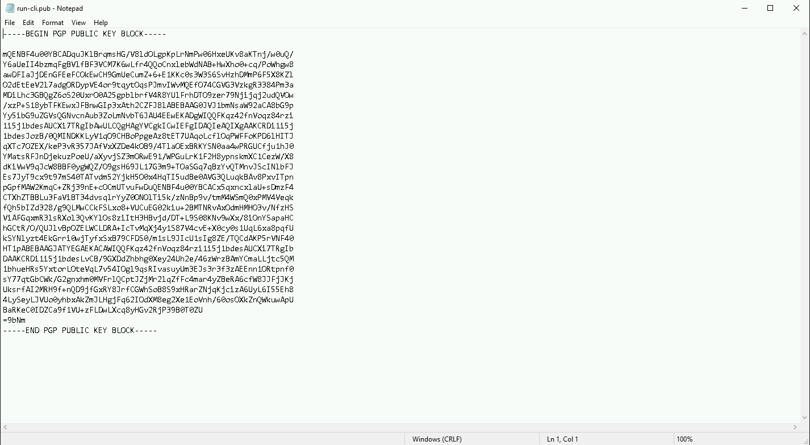
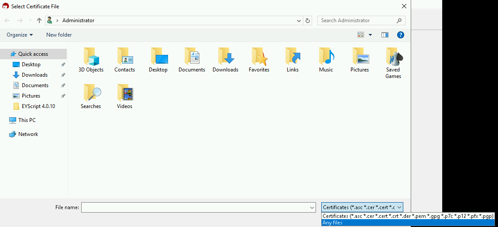
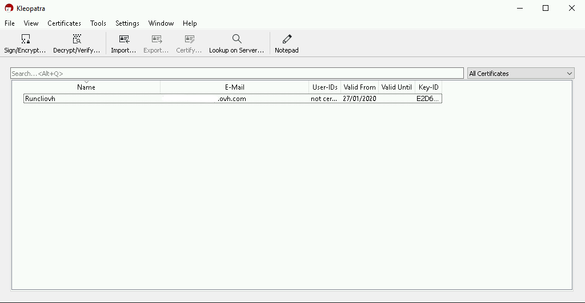
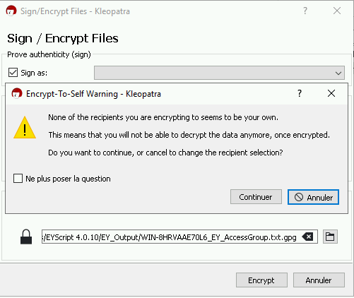
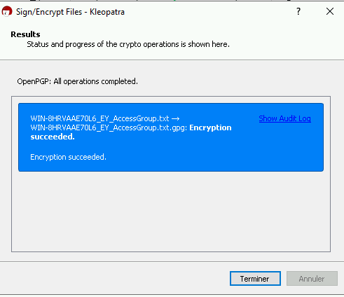

**Last updated 29th April 2020**

## Objective

As part of the Microsoft audit, conducted by the consulting firm Ernst & Young, OVHcloud sent you a letter to request you to declare your uses.

By subscribing to the Public Cloud offer, you have obtained the right to use third-party software and you have agreed to use this software in accordance with their conditions of use. The owners of third-party software, such as Microsoft, have the right to check the compliance of your use of their software. 

To do so, you can choose from the 3 following options:

* Option 1: [Run the script provided by Ernst & Young yourself](./#option-1-run-the-script-provided-by-ernst-young-yourself)
* Option 2: [Give OVHcloud access to your servers for running the script provided by Ernst & Young](./#option-2-give-ovhcloud-access-to-your-servers-for-running-the-script-provided-by-ernst-young)
* Option 3: [Run it and send the screenshots and any other details necessary to OVHcloud](./#option-3-run-it-and-send-the-screenshots-and-any-other-details-necessary-to-ovhcloud)

> [!primary]
> 
> You will find at [this address](https://github.com/ovh/docs/tree/develop/pages/platform/public-cloud/Microsoft-audit/files) the email sent by Microsoft and the necessary mandate if you choose [option 2](./#option-2-give-ovhcloud-access-to-your-servers-for-running-the-script-provided-by-ernst-young).
> 

## Instructions

### Option 1: Run the script provided by Ernst & Young yourself

If you want to run the script provided by Ernst & Young yourself, please use the following procedure.

**Step 1**: Log in to your VPS or Public Cloud instance.

**Step 2**: Using your usual browser, download the script provided by Ernst & Young which is available and hosted by OVHcloud at [this address](https://onedrive.live.com/?authkey=%21AKjh-46_qHwVuCQ&id=80ADB8E634F8B2A%21146&cid=080ADB8E634F8B2A){.external}.

**Step 3**: Unzip the downloaded zip file.



**Step 4**: Double click on the "EYInventoryScript" file to run the script.


**Step 5**: Enter 1 to scan the local server, in this case your VPS or Public Cloud instance.



**Step 6**: Wait a few seconds to see the first results from the script appear.


**Step 7**: Once you've finished, the script returns to the start menu.

**Step 8**: An "EY_Output" folder has now been created in the folder where the "EYInventoryScript" executable is located. This folder contains all of the script output files. These are the files that must be sent to us.



**Step 9**: Zip and name the folder "EY_Output" as follows: EY_Output_ipv4 address of your Public Cloud instance, followed by .zip (for example: EY_Output_10.10.10.10.zip).




**Step 10**: Open your usual mailbox or email software.

**Step 11**: Send us the zipped results file (here EY_Output_10.10.10.10.zip), before 26 May, 2020 at the following address: auditmicrosoft@ovhcloud.com

### Option 2: Give OVHcloud access to your servers for running the script provided by Ernst & Young

If you want to give OVHcloud access to your servers to run the script provided by Ernst & Young, please use the following procedure.

OVHcloud support will ask you for your login details to access your server's operating system.

We will explain how you can send this information to us securely using gpg encryption.


What you need:

* the file to encrypt
* the [Gpg4win](https://gpg4win.org/download.html){.external} software
* the OVHcloud encryption key: 


```
-----BEGIN PGP PUBLIC KEY BLOCK-----

mQENBF4u00YBCADquJKlBrqmsHG/V8ldOLgpKpLrNmPw06HxeUKv8aKTnj/w0uQ/ Y6aUeII4bzmqFgBVlfBF3VCM7K6wLfr4QQoCnxlebWdNAB+HwXho0+cq/PoWhgw8 awDFIaJjDEnGFEeFCOkEwCH9GmUeCumZ+6+E1KKc0s3W3S6SvHzhDMmP6F5X8KZl O2dEtEeV2l7adgORDypVE4or9tqytOqsPJmvIWvMQEfO74CGVG3VzkgR3384Pm3a MDiLhc3GBQgZ6oS20UxrO0A25gpblbrfV4R8YUlFrhDTO9zer79Njijqj2udQVOw /xzP+S18ybTFKEwxJFBnwGIp3xAth2CZFJ8lABEBAAG0JVJ1bmNsaW92aCA8bG9p Yy5ibG9uZGVsQGNvcnAub3ZoLmNvbT6JAU4EEwEKADgWIQQFKqz42fnVoqz84rzi 1i5j1bdesAUCXi7TRgIbAwULCQgHAgYVCgkICwIEFgIDAQIeAQIXgAAKCRDi1i5j 1bdesJozB/0QMINDKKLyV1qO9CHBoPpgeAz8tET7UAqoLcflOqPWFFoKPD6lHITJ qXTc7OZEX/keP3vR357JAfVxXZDe4kOB9/4TlaOExBRKYSN0aa4wPRGUCfju1hJ0 YMatsRFJnDjekuzPoeU/aXyvjSZ3mORwE91/WPGuLrK1F2H8ypnskmXC1CezW/X8 dKiVwV9qJcW8BBF0ygWQZ/O9gsH69JL17G3m9+TOaSGq7qBzYvQTMnvJScINlbFJ Es7JyT9cx9t97mS40TATvdm52YjkH5O0x4HqTI5udBe0AVG3QLuqkBAv8PxvITpn pGpfMAW2KmqC+ZRj39nE+cOCmUTvuFwDuQENBF4u00YBCACx5qxncxlaU+sDmzF4 CTXhZTBBLu3FaViBT34dvsqlrYyZ0ONOlTi5k/zNnBp9v/tmM4WSmQ0xPMV4Veqk fQh5bIZd328/g9QLMwCCkFSLxo8+VUCuEG02kiu+2BMTNRvAxOdmHMHO3v/NfzHS ViAFGqxmR3lsRXol3QvKYlOs8ziItH3HBvjd/DT+L9S08KNv9wXx/8iOnYSapaHC hGCtR/O/QUJlvBpOZELWCLDRA+IcTvMqXj4y1S87V4cvE+X0cy0s1UqL6xa8pqfU kSYNlyzt4EkGrri0wjTyfxSxB79CFDS0/m1sL9JIcU1sIg8ZE/TQCdAKP5rVNF40 HT1pABEBAAGJATYEGAEKACAWIQQFKqz42fnVoqz84rzi1i5j1bdesAUCXi7TRgIb DAAKCRDi1i5j1bdesLvCB/9GXDdZhbhg0Xey24Uh2e/46zWrzBAmYCmaLLjtc5QM 1bhueHRs5YxtorLOteVqL7v54IOgl9qsRIvasuyUm3EJs3r3f3zAEEnn1ORtpnf0 sY77qtGbCWk/G2gnxhm0MVFrlQCptJZjMr2lqZfFc4mar4yZBeRA6cfW8JJFjJKj UksrfAI2MRH9f+nQD9jfGxRY8JrfCGWhSoB8S9xHRarZNjqKjcizA6UyL6I55Eh8 4LySeyLJVUo0yhbxAkZmJLHgjFq62IOdXM8eg2Xe1EoVnh/60osOXkZnQWkuwApU BaRKeC0IDZCa9f1VU+zFLDwLXcq8yHGv2RjP39B0T0ZU =9bNm

-----END PGP PUBLIC KEY BLOCK-----
```


**Step 1**: Download and install the [Gpg4win](https://gpg4win.org/download.html){.external} software available at this address: [https://gpg4win.org/index.html](https://gpg4win.org/index.html){.external}

**Step 2**: Once installed, launch Kleopatra (graphical interface for using gpg4win) on your system.


**Step 3**: Copy the OVHcloud public key to a text file.



**Step 4**: Click on `Import`{.action} and find the key you just saved.



**Step 5**: Answer "No" following the request to create a certificate.




**Step 6**: To encrypt a file, click on: `Sign/Encrypt`{.action}.

**Step 7**: Select your file.


**Step 8**: In the "Encrypt for others:" field, enter the name of the key (here "Runcliovh") that you have chosen. It will appear in the field.

**Step 9**: Click on `Encrypt`{.action}.


**Step 10**: Click on `Continue`{.action}. 





**Step 11**: The encrypted file is created in the same directory as the source file.

**Step 12**: Send us this encrypted file as well as the following terms available at [this address](https://github.com/ovh/docs/tree/develop/pages/platform/public-cloud/Microsoft-audit/files) (must be completed and signed by you), before 26 May, 2020, using the following address: auditmicrosoft@ovhcloud.com

### Option 3: Run it and send the screenshots and any other details necessary to OVHcloud

If you cannot apply one of the two procedures mentioned previously, please apply the following procedure.

OVHcloud support will ask you to send them details of your "hardware" and "software" information securely. In addition to these details, you will also need to explain the reasons that prevent you from following the first two options.

**Step 1**: Run the "systeminfo" command from the command line. You can access the command line by typing "cmd" in the Windows run dialogue. After running the command, please scroll down to the top of the command prompt window - there is no need to include the patch details in the screenshot.

**Step 2**: Open the "Add/Remove Programs" or "Programs and Features" dialogue from the control panel and place it side by side with the command line (as shown in the first screenshot below).
    
> [!primary]
> 
> Please be aware that if there are too many programs to show them in a single screenshot, you will need to take several screenshots. For second and subsequent screenshots, please ensure that the last program in the previous screenshot is the first program in the following screenshot. (see images below).
> 

Check that all of the following elements are visible in all screenshots: 

* Server name (host name)
* Date of initial installation
* Processor(s)
* Application installation date


    

#### SQL version and edition

**Step 3**: If Microsoft SQL Server is deployed on the device, take a screenshot showing the SQL version and edition.

The easiest method to get this proof is to log in to the SQL server using the SQL Server Management Studio and bring up the server properties panel (see image below) by right-clicking on the name of the SQL server in the object explorer panel.


**Step 4**: Send this information by email to the following address: auditmicrosoft@ovhcloud.com, before 26 May, 2020.

This proof will then be sent to Ernst & Young for compliance analysis.