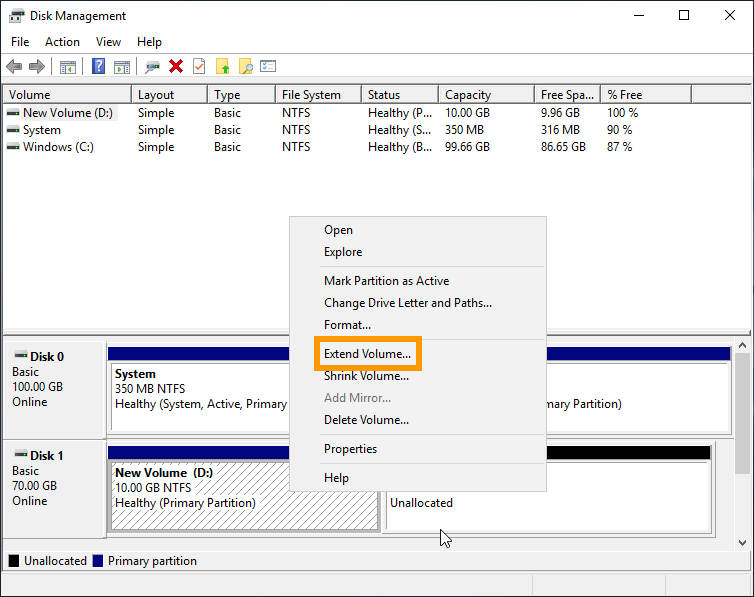

> [!primary]
> Esta traducción ha sido generada de forma automática por nuestro partner SYSTRAN. En algunos casos puede contener términos imprecisos, como en las etiquetas de los botones o los detalles técnicos. En caso de duda, le recomendamos que consulte la versión inglesa o francesa de la guía. Si quiere ayudarnos a mejorar esta traducción, por favor, utilice el botón «Contribuir» de esta página.
> 

**Última actualización: 29/03/2022**

## Objetivo

Si ha alcanzado la capacidad máxima de su disco adicional, puede añadir almacenamiento aumentando su tamaño. 

**Esta guía explica cómo aumentar el tamaño de un disco adicional y cómo ampliar la partición principal en consecuencia.**

## Requisitos

- Tener una [instancia Public Cloud](https://www.ovhcloud.com/es-es/public-cloud/) en su proyecto de Public Cloud.
- Tener un [disco adicional](../crear_y_configurar_un_disco_adicional_en_una_instancia/) creado en su proyecto.
- Tienes acceso a tu [Panel de configuración de OVHcloud](https://www.ovh.com/auth/?action=gotomanager&from=https://www.ovh.es/&ovhSubsidiary=es).
- Tener acceso administrativo (root) a su instancia a través de SSH (Linux) o RDP (Windows).

## Procedimiento

Los siguientes pasos suponen que ya ha configurado un disco adicional según las instrucciones de [nuestra guía](../crear_y_configurar_un_disco_adicional_en_una_instancia/).

### Cambiar el tamaño del disco

Conéctese al [Panel de configuración de OVHcloud](https://www.ovh.com/auth/?action=gotomanager&from=https://www.ovh.es/&ovhSubsidiary=es) y abra su proyecto de `Public Cloud`{.action}. A continuación, haga clic en `Block Storage`{.action} en el menú de la izquierda.

Si el volumen está asociado a una **instancia Windows**, haga clic en el botón `...`{.action} a la derecha del volumen correspondiente y seleccione `Desvincular de la instancia`{.action}.

Haga clic en el botón `...`{.action} a la derecha del volumen correspondiente y seleccione `Editar`{.action}.

{.thumbnail}

En la nueva ventana, introduzca el nuevo tamaño del volumen y haga clic en `Editar volumen`{.action}.

{.thumbnail}

Asegúrese de que el volumen está asociado a su instancia antes de continuar. En caso contrario, haga clic en `...`{.action} en la línea de volumen y seleccione `Asociar a la instancia`{.action}.

### Ampliar la partición (instancia Linux)

Conéctese por SSH a su instancia para ajustar la partición al disco redimensionado.

Desmonte el disco utilizando este comando:

```bash
admin@server:~$ sudo umount /mnt/disk
```

Recargue la partición:

```bash
admin@server:~$ sudo fdisk /dev/vdb
```
```console
Welcome to fdisk (util-linux 2.25.2).
Changes will remain in memory only, until you decide to write them.
Be careful before using the write command
```
```console
Command (m for help): d

Selected partition 1
Partition 1 has been deleted.
```
```console
Command (m for help): n

Partition type
p primary (0 primary, 0 extended, 4 free)
e extended (container for logical partitions)
Select (default p):
Using default response p.
Partition number (1-4, default 1):
First sector (2048-146800639, default 2048):
Last sector, +sectors or +size{K,M,G,T,P} (2048-146800639, default 146800639):

Created a new partition 1 of type 'Linux' and of size 70 GiB.
```
```console
Command (m for help): w

The partition table has been altered.
Calling ioctl() to re-read partition table.
Syncing disks.
```

Compruebe la partición:

```bash
admin@server:~$ sudo e2fsck -f /dev/vdb1

e2fsck 1.42.12 (29-Aug-2014)
Pass 1: Checking inodes, blocks, and sizes
Pass 2: Checking directory structure
Pass 3: Checking directory connectivity
Pass 4: Checking reference counts
Pass 5: Checking group summary information
/dev/vdb: 12/3276800 files (0.0% non-contiguous), 251700/13107200 blocks
```

```bash
admin@server:~$ sudo resize2fs /dev/vdb1

resize2fs 1.42.12 (29-Aug-2014)
Resizing the filesystem on /dev/vdb to 18350080 (4k) blocks.
The filesystem on /dev/vdb is now 18350080 (4k) blocks long.
```

Por último, remonte y verifique el disco:

```bash
admin@server:~$ sudo mount /dev/vdb1 /mnt/disk/
```

```bash
admin@server:~$ df -h
Filesystem Size Used Avail Use% Mounted on
/dev/vda1 9.8G 840M 8.6G 9% /
udev 10M 0 10M 0% /dev
tmpfs 393M 5.2M 388M 2% /run
tmpfs 982M 0 982M 0% /dev/shm
tmpfs 5.0M 0 5.0M 0% /run/lock
tmpfs 982M 0 982M 0% /sys/fs/cgroup
/dev/vdb1 69G 52M 66G 1% /mnt/disk
```

### Ampliar la partición (instancia Windows)

Establezca una conexión RDP (Remote Desktop) en su instancia Windows.

Una vez que se haya conectado, haga clic derecho en el botón `Iniciar`{.action} y abra la `Gestión de discos`{.action}.

{.thumbnail}

El disco ampliado muestra ahora la capacidad adicional en forma de espacio no asignado.

{.thumbnail}

Haga clic derecho en el volumen y seleccione `Ampliar el volumen`{.action} en el menú contextual.

{.thumbnail}

En el Asistente para la extensión de volumen, haga clic en `Siguiente`{.action} para continuar.

Si desea añadir una capacidad inferior a la de la partición en su totalidad, puede modificar el espacio en disco.

Haga clic en `Siguiente`{.action}.

{.thumbnail}

Haga clic en `Finalizar`{.action} para finalizar el proceso.

El volumen redimensionado incluye ahora el espacio en disco adicional.

{.thumbnail}

## Más información

[Crear y configurar un disco adicional en una instancia](../crear_y_configurar_un_disco_adicional_en_una_instancia/)

Interactúe con nuestra comunidad de usuarios en <https://community.ovh.com/en/>.