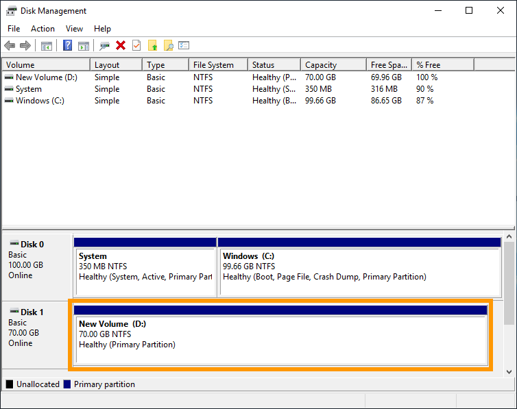

> [!primary]
> Questa traduzione è stata generata automaticamente dal nostro partner SYSTRAN. I contenuti potrebbero presentare imprecisioni, ad esempio la nomenclatura dei pulsanti o alcuni dettagli tecnici. In caso di dubbi consigliamo di fare riferimento alla versione inglese o francese della guida. Per aiutarci a migliorare questa traduzione, utilizza il pulsante "Modifica" di questa pagina.
>

**Ultimo aggiornamento: 29/03/2022**

## Obiettivo

Se hai raggiunto la capacità massima del tuo disco aggiuntivo, aggiungi spazio di storage aumentandone la dimensione.  

**Questa guida ti mostra come aumentare la dimensione di un disco aggiuntivo e come estendere di conseguenza la partizione principale.**

## Prerequisiti

- Aver creato un’istanza [Public Cloud](https://www.ovhcloud.com/it/public-cloud/) nel tuo progetto Public Cloud.
- Disporre di un [disco aggiuntivo](../crea_e_configura_un_disco_aggiuntivo_sulla_tua_istanza/) creato nel tuo progetto.
- Avere accesso allo [Spazio Cliente OVHcloud](https://www.ovh.com/auth/?action=gotomanager&from=https://www.ovh.it/&ovhSubsidiary=it).
- Avere accesso amministrativo (root) alla tua istanza via SSH (Linux) o RDP (Windows).

## Procedura

Per gli step successivi, è necessario aver già configurato un disco aggiuntivo in base alle intrusioni della [nostra guida](../crea_e_configura_un_disco_aggiuntivo_sulla_tua_istanza/).

### Modifica la dimensione del disco

Accedi allo [Spazio Cliente OVHcloud](https://www.ovh.com/auth/?action=gotomanager&from=https://www.ovh.it/&ovhSubsidiary=it) e apri il tuo progetto `Public Cloud`{.action}. Clicca su `Block Storage`{.action} nel menu a sinistra.

Se il volume è associato a un'**istanza Windows**, clicca sul pulsante `...`{.action} a destra del volume corrispondente e seleziona `Scollega dall'istanza`{.action}.

Clicca sui tre puntini `...`{.action} in corrispondenza del volume interessato e seleziona `Modifica`{.action}.

{.thumbnail}

Nella nuova finestra, indica la nuova dimensione del volume e clicca su `Modifica il volume`{.action}.

{.thumbnail}

Prima di continuare, assicurati che il volume sia associato all'istanza. In caso contrario, clicca sui tre puntini `...`{.action} nella riga del volume e seleziona `Associa all'istanza`{.action}.

### Estendi la partizione (istanza Linux)

Apri una connessione SSH alla tua istanza per adattare la partizione al disco ridimensionato.

Per prima cosa, esegui il mount del disco utilizzando questo comando:

```bash
admin@server:~$ sudo umount /mnt/disk
```

Ricrea la partizione:

```bash
admin@server:~$ sudo fdisk /dev/vdb
```
```console
Welcome to fdisk (util-linux 2.25.2).
Changes will remain in memory only, until you decide to write them.
Be careful before using the write command
```
```console
Command (m for help): d

Selected partition 1
Partition 1 has been deleted.
```
```console
Command (m for help): n

Partition type
p primary (0 primary, 0 extended, 4 free)
e extended (container for logical partitions)
Select (default p):
Using default response p.
Partition number (1-4, default 1):
First sector (2048-146800639, default 2048):
Last sector, +sectors or +size{K,M,G,T,P} (2048-146800639, default 146800639):

Created a new partition 1 of type 'Linux' and of size 70 GiB.
```
```console
Command (m for help): w

The partition table has been altered.
Calling ioctl() to re-read partition table.
Syncing disks.
```

Verifica la partizione:

```bash
admin@server:~$ sudo e2fsck -f /dev/vdb1

e2fsck 1.42.12 (29-Aug-2014)
Pass 1: Checking inodes, blocks, and sizes
Pass 2: Checking directory structure
Pass 3: Checking directory connectivity
Pass 4: Checking reference counts
Pass 5: Checking group summary information
/dev/vdb: 12/3276800 files (0.0% non-contiguous), 251700/13107200 blocks
```

```bash
admin@server:~$ sudo resize2fs /dev/vdb1

resize2fs 1.42.12 (29-Aug-2014)
Resizing the filesystem on /dev/vdb to 18350080 (4k) blocks.
The filesystem on /dev/vdb is now 18350080 (4k) blocks long.
```

Salva e verifica il disco:

```bash
admin@server:~$ sudo mount /dev/vdb1 /mnt/disk/
```

```bash
admin@server:~$ df -h
Filesystem Size Used Avail Use% Mounted on
/dev/vda1 9.8G 840M 8.6G 9% /
udev 10M 0 10M 0% /dev
tmpfs 393M 5.2M 388M 2% /run
tmpfs 982M 0 982M 0% /dev/shm
tmpfs 5.0M 0 5.0M 0% /run/lock
tmpfs 982M 0 982M 0% /sys/fs/cgroup
/dev/vdb1 69G 52M 66G 1% /mnt/disk
```

### Estendi la partizione (istanza Windows)

Installa una connessione RDP (Remote Desktop) sulla tua istanza Windows.

Una volta connesso, clicca con il tasto destro sul pulsante `Inizia`{.action} e apri la `Gestione dei dischi`{.action}.

{.thumbnail}

Il disco esteso mostra la capacità aggiuntiva sotto forma di spazio non allocato.

{.thumbnail}

Clicca con il tasto destro sul volume e seleziona `Estendi il volume`{.action} nel menu contestuale.

{.thumbnail}

Nell'assistente all'estensione del volume, clicca su `Avanti`{.action} per continuare.

È possibile modificare lo spazio disco in questo step per aggiungere una capacità inferiore alla totalità della partizione.

Clicca su `Avanti`{.action}.

{.thumbnail}

Clicca su `Terminare`{.action} per completare il processo.

Il volume ridimensionato include lo spazio disco aggiuntivo.

{.thumbnail}

## Per saperne di più

[Crea e configura un disco aggiuntivo sulla tua istanza](../crea_e_configura_un_disco_aggiuntivo_sulla_tua_istanza/)

Contatta la nostra Community di utenti all’indirizzo <https://community.ovh.com/en/>.