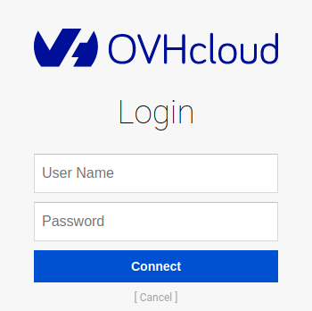

## Objective

This guide covers the installation of the **ovhai** CLI. The CLI is the recommended means of interaction with **AI Training, AI Notebooks or AI Deploy** services.

## Requirements

-   a [Public Cloud project](https://www.ovhcloud.com/fr/public-cloud/) in your OVHcloud account
-   **AI Training activated** for your account, see [how to submit a job Step 2](/pages/public_cloud/ai_machine_learning/training_guide_02_howto_submit_job)
-   a user for AI Tools, see [how to create a user](/pages/public_cloud/ai_machine_learning/gi_01_manage_users)

## Instructions

### Step 1: Installing the CLI

You can choose the cluster location for the **ovhai** CLI:

- Gravelines (`GRA`) in France
- Beauharnois (`BHS`) in Canada

> [!primary]
>
> Here by default we will use the region `gra` in each of the commands. You are free to replace it with `bhs` if you want.
>

You can then choose between two methods to install the `ovhai` CLI.

#### Install ovhai CLI with a curl command

You can install the `ovhai` CLI with a single command line.

For bash:

``` {.console}
curl https://cli.gra.ai.cloud.ovh.net/install.sh | bash
```

For zsh:

``` {.console}
curl https://cli.gra.ai.cloud.ovh.net/install.sh | zsh
```

Once done, go to **Step 2**.

If you encounter any issue with the automated installation you can also install manually.

#### Install ovhai CLI thanks to a zip file

You can also install the cli by following the link below:

``` {.console}
https://cli.gra.ai.cloud.ovh.net
```

After downloading the right zip for your platform, unzip it and add it to your `PATH`:

``` {.console}
unzip ovhai-<platform>.zip
mkdir -p $HOME/bin
mv ovhai $HOME/bin/ovhai
export PATH=$PATH:$HOME/bin/
```

### Step 2: Authenticating

Once the **ovhai** CLI is installed, you need to authenticate with the **AI Training** service.

``` {.console}
ovhai login
```

You have the choice between two methods to log in:

-   terminal: you can authenticate yourself from within the terminal.
-   browser: you will reach an authentication page similar to this:

{.thumbnail}

Use the credentials of your **AI Training** user to log in.

### Step 3: Using the command line CLI

You can use the command `ovhai --help` to list available actions and `ovhai <action> --help` for more information about a specific action.

The documentation of the CLI is available at [CLI documentation](/pages/public_cloud/ai_machine_learning/cli_15_commands_reference).

In addition, when performing any action in the **AI Training, AI Notebooks or AI Deploy** sections of the OVHcloud Control Panel you are provided with the equivalent command to get you started with the **ovhai CLI**.

## Feedback

Please send us your questions, feedback and suggestions to improve the service:

- On the OVHcloud [Discord server](https://discord.com/invite/vXVurFfwe9)

If you need training or technical assistance to implement our solutions, contact your sales representative or click on [this link](https://www.ovhcloud.com/fr/professional-services/) to get a quote and ask our Professional Services experts for a custom analysis of your project.
