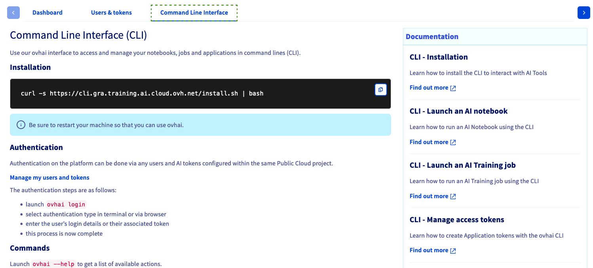

**Last updated 15th March, 2023.**

## Objective

OVHcloud provides a set of managed AI tools designed for building your machine learning projects.

This guide explains how to get started with the OVHcloud AI Dashboard, a consolidated view of your usages of the OVHcloud AI tools.

## Requirements

- Access to the [OVHcloud Control Panel](https://www.ovh.com/auth/?action=gotomanager&from=https://www.ovh.it/&ovhSubsidiary=it)
- A [Public Cloud project](https://www.ovhcloud.com/it/public-cloud/) in your OVHcloud account

## Instructions

AI Dashboard is accessible via the main menu `AI & Machine Learning` in the `Public Cloud` section of your OVHcloud Control Panel.

> [!primary]
>
> **AI Dashboard** is not a product but an overview of the AI Tools you use as well as an interface where you will find all transversal items such as security access, CLI and billing information, or even guides (such as this one).
>

{.thumbnail}

The following chapters will help you to discover each section of the `AI Dashboard`.

### Dashboard tab

{.thumbnail}

In this section, you will find information related to your use of the AI Tools with easy access to [AI Notebooks](/pages/public_cloud/ai_machine_learning/notebook_guide_introduction_definition), [AI Training](/pages/public_cloud/ai_machine_learning/training_guide_02_howto_submit_job) and [AI Deploy](/pages/public_cloud/ai_machine_learning/deploy_guide_02_getting_started).  
Listed instances are the ones that are in `RUNNING` and `STOPPED` status.

You can also easily access to your [Object Storage](/products/storage-object-storage).

You can find more details on the prices of the AI tools [here](https://www.ovhcloud.com/it/public-cloud/prices/#ai-&-machine-learning).

You can also see security information with the number of users and tokens created to use your AI Tools.

### Users & tokens

{.thumbnail}

In this section, you will find all information about your AI users and tokens.

You can easily create new Public Cloud users with dedicated AI Tools roles (`AI Platform - Operator` or `AI Platform - Read-Only`) and access all your Public Cloud users.

You can also manage tokens (create, update and delete) that you can then use with your notebooks, jobs or apps.

To know how to manage your users and token, please read the following guide: [Manage AI users and roles](/pages/public_cloud/ai_machine_learning/gi_01_manage_users).

### Command Line Interface 

{.thumbnail}

In this section, you will find all information about how to install, authenticate and use our CLI.
You will also find a list of all useful guides on the CLI.

### Documentation

{.thumbnail}

In this section, you will find a list of our guides about AI products. The list is on shuffle, you can refresh it to get other tutorials by clicking on the round arrow.

## Go further

Please send us your questions, feedback and suggestions to improve the service:

- On the OVHcloud [Discord server](https://discord.com/invite/vXVurFfwe9)

If you need training or technical assistance to implement our solutions, contact your sales representative or click on [this link](https://www.ovhcloud.com/it/professional-services/) to get a quote and ask our Professional Services experts for a custom analysis of your project.
