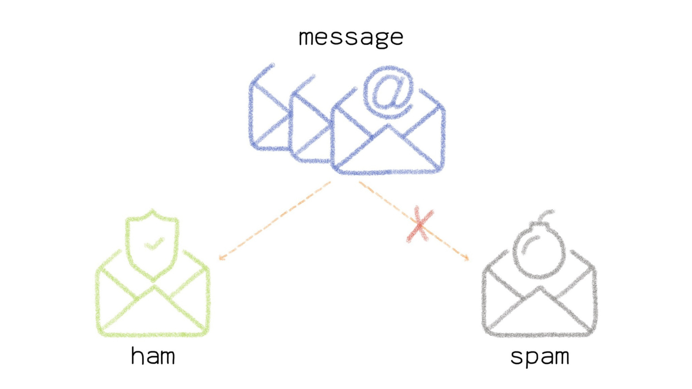

**Last updated 22nd November, 2022.**

## Objective

This tutorial will show you how to build a simple spam classifier with **OVHcloud AI Notebooks**. You will be able to learn the concepts of logistic regression, dimension reduction, stop words, quantiles and much more. A very simple Machine Learning model will be used: the **logistic regression**.

At the end of this tutorial, you will have learnt the principal methods to build your own **spam classifier**.

{.thumbnail}

> [!primary]
>
> We will be able to create this model with the dataset named **SMSSPamCollection**. Find it on the SMS Spam Collection Dataset [link](https://archive.ics.uci.edu/ml/datasets/SMS+Spam+Collection).
>

## Requirements

- Access to the [OVHcloud Control Panel](https://www.ovh.com/auth/?action=gotomanager&from=https://www.ovh.com/fr/&ovhSubsidiary=fr)
- An AI Notebooks project created inside a [Public Cloud project](https://www.ovhcloud.com/fr/public-cloud/) in your OVHcloud account
- A user for AI Notebooks

## Instructions

You can launch your notebook from the [OVHcloud Control Panel](https://www.ovh.com/auth/?action=gotomanager&from=https://www.ovh.com/fr/&ovhSubsidiary=fr) or via the ovhai [CLI](/pages/public_cloud/ai_machine_learning/cli_11_howto_run_notebook_cli).

### Launching a Jupyter notebook with "Miniconda" via UI

To launch your notebook from the [OVHcloud Control Panel](https://www.ovh.com/auth/?action=gotomanager&from=https://www.ovh.com/fr/&ovhSubsidiary=fr), refer to the following steps.

#### Code editor

Choose the `Jupyterlab` code editor.

#### Framework

In this tutorial, the `Miniconda` framework is used.

> [!warning]
>
> With **Miniconda**, you will be able to set up your environment by installing the Python libraries you need.
>

You can choose the `conda` version you want.

> [!primary]
>
> The default version of `conda` is functional for this tutorial.
>

#### Resources

You can choose the number of CPUs or GPUs you want.

> [!primary]
>
> Here, using `4 CPU` is sufficient.
>

### Launching a Jupyter notebook with "Miniconda" via CLI

If you want to launch it with the CLI, choose the `jupyterlab` editor and the `conda` framework.

To access the different versions of `conda` available, run the following command.

```console
ovhai capabilities framework list -o yaml
```

> [!primary]
>
> If you do not specify a version, your notebook starts with the default version of `conda`.
>

Choose the number of CPUs (`<nb-cpus>`) to use in your notebook and use the following command.

```console
ovhai notebook run conda jupyterlab \
	--name <notebook-name> \
	--framework-version <conda-version> \
  --cpu <nb-cpus>
```

You can then reach your notebook’s URL once the notebook is running.

### Accessing the notebook

Once the repository has been cloned, find your notebook by following this path: `ai-training-examples` > `notebooks` > `natural-language-processing` > `text-classification` > `miniconda` > `spam-classifier` > `notebook-spam-classifier.ipynb`.

A preview of this notebook can be found on GitHub [here](https://github.com/ovh/ai-training-examples/blob/main/notebooks/natural-language-processing/text-classification/miniconda/spam-classifier/notebook-spam-classifier.ipynb).

## Go further

- If you are interested in **NLP** (Natural Language Processing), familiarise yourself with speech to text by following this [tutorial](/pages/public_cloud/ai_machine_learning/notebook_tuto_08_speech_to_text).

If you need training or technical assistance to implement our solutions, contact your sales representative or click on [this link](https://www.ovhcloud.com/fr/professional-services/) to get a quote and ask our Professional Services experts for a custom analysis of your project.

## Feedback

Please send us your questions, feedback and suggestions to improve the service:

- On the OVHcloud [Discord server](https://discord.com/invite/vXVurFfwe9)
