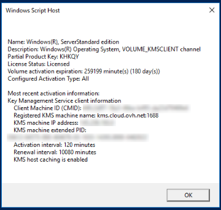

## Objective

Unlike Windows instances created in the public network, Windows instances created with private network mode (vRack) do not have their Windows licences automatically enabled.
In this case, you must activate the licence manually to access all Windows services.

**This guide is designed to help you configure the public interface for your Public Cloud instances within your vRack.**

## Requirements

- A [Public Cloud project](/pages/public_cloud/compute/create_a_public_cloud_project) in your OVHcloud account
- Access to the [OVHcloud Control Panel](https://www.ovh.com/auth/?action=gotomanager&from=https://www.ovh.ie/&ovhSubsidiary=ie)
- An [OpenStack user account](/pages/public_cloud/compute/create_and_delete_a_user)

We recommend that you read our guide on [Accessing the Horizon interface](/pages/public_cloud/compute/introducing_horizon) to familiarise yourself with Horizon.

## Instructions

### Attach an "Ext-Net" public port to an instance

#### Via Horizon 

Log in to the [Horizon](https://horizon.cloud.ovh.net/auth/login/) interface using the method listed in the [first part of this guide](/pages/platform/network-services/getting-started-07-creating-vrack#horizon).

Choose the proper work zone.

{.thumbnail}

Select `Compute`{.action} and then `Instances`{.action} from the menu.

{.thumbnail}

To add an interface, click on the arrow in the “Actions” column to access the possible actions on the instance. Select `Attach Interface`{.action}:

{.thumbnail}

Select your interface and confirm.

{.thumbnail}

#### Via the OpenStack API

Before continuing, we recommend reading these guides:

- [Preparing an environment for using the OpenStack API](/pages/public_cloud/compute/prepare_the_environment_for_using_the_openstack_api). 
- [Setting OpenStack environment variables](/pages/public_cloud/compute/loading_openstack_environment_variables).

First, retrieve all the necessary information:

- **ID of your instances**

```bash
openstack server list
+--------------------------------------+-------------------+--------+---------------------------------------------------------------------+----------------------------------------+----------+
| ID                                   | Name              | Status | Networks                                                            | Image                                  | Flavor   |
+--------------------------------------+-------------------+--------+---------------------------------------------------------------------+----------------------------------------+----------+
| f095ad19-5c0a-4ef5-8e01-b3590bc9c6f1 | MyInstance        | ACTIVE |                                                                     | Windows Server 2016 Standard (Desktop) | win-b2-7 |
+--------------------------------------+-------------------+--------+---------------------------------------------------------------------+----------------------------------------+----------+
```

- **ID of public and private networks**

```bash
openstack network list
-----------------------------------------------------------------------------------------+
| ID                                   | Name              | Subnets                                                                                                                                                                                                                                                                  |
+--------------------------------------+-------------------+--------------------------------------------------------------------------------------------------------------------------------------------------------------------------------------------------------------------------------------------------------------------------+
| 1ca87837-7860-47a3-8916-c9c516841bf2 | Ext-Net-Baremetal | 1db089a7-1bd9-449f-8e3b-4ea61e666320, 4a614403-b8aa-4291-bd59-0cb2c81c4deb                                                                                                                                                                                               |
| 7394fc68-0f77-40d7-a274-388e7e75d82c | vlan 0            | f3fb67dc-7419-49da-b26c-7f64c480eb63                                                                                                                                                                                                                                     |
| 7a0e67da-70f3-48ed-a6e7-5ec265916211 | private-net       | 57d9faac-f01c-43a2-8866-d9b1dd02cb9e, 5cb270a9-3795-4286-96fe-f3bfa3a328e5                                                                                                                                                                                               |
| b2c02fdc-ffdf-40f6-9722-533bd7058c06 | Ext-Net           | 0f11270c-1113-4d4f-98de-eba83445d962, 1a6c6b72-88e9-4e94-ac8b-61e6dbc4792c, 22e2d853-1b86-48f3-8596-9d12c7693dc7, 4aa6cac1-d5cd-4e25-b14b-7573aeabcab1, 7d6352a6-dbed-4628-a029-fcc3986ae7d6, 9f989c4b-c441-4678-b395-e082c300356e, b072b17b-ef1d-4881-98c7-e0d6a1c3dcea|
+--------------------------------------+-------------------+--------------------------------------------------------------------------------------------------------------------------------------------------------------------------------------------------------------------------------------------------------------------------+
```

With the previously retrieved items, you can create a public port named "Ext-Net" on the subnet "Ext-Net" and attach it to the instance:

```bash
openstack port create --network b2c02fdc-ffdf-40f6-9722-533bd7058c06 Ext-Net
+-------------------------+----------------------------------------------------------------------------------------+
| Field                   | Value                                                                                  |
+-------------------------+----------------------------------------------------------------------------------------+
| admin_state_up          | UP                                                                                     |
| allowed_address_pairs   |                                                                                        |
| binding_host_id         | None                                                                                   |
| binding_profile         | None                                                                                   |
| binding_vif_details     | None                                                                                   |
| binding_vif_type        | None                                                                                   |
| binding_vnic_type       | normal                                                                                 |
| created_at              | 2023-01-20T10:12:17Z                                                                   |
| data_plane_status       | None                                                                                   |
| description             |                                                                                        |
| device_id               |                                                                                        |
| device_owner            |                                                                                        |
| device_profile          | None                                                                                   |
| dns_assignment          | None                                                                                   |
| dns_domain              | None                                                                                   |
| dns_name                | None                                                                                   |
| extra_dhcp_opts         |                                                                                        |
| fixed_ips               | ip_address='2001:41d0:304:400::128f', subnet_id='4aa6cac1-d5cd-4e25-b14b-7573aeabcab1' |
|                         | ip_address='57.128.42.227', subnet_id='22e2d853-1b86-48f3-8596-9d12c7693dc7'           |
| id                      | ed34add5-aa76-4aab-97af-815724d76e2c                                                   |
| ip_allocation           | immediate                                                                              |
| mac_address             | fa:16:3e:68:35:9c                                                                      |
| name                    | Ext-Net                                                                                |
| network_id              | b2c02fdc-ffdf-40f6-9722-533bd7058c06                                                   |
| numa_affinity_policy    | None                                                                                   |
| port_security_enabled   | True                                                                                   |
| project_id              | 2098640de5e547289e3740b09e725ecc                                                       |
| propagate_uplink_status | None                                                                                   |
| qos_network_policy_id   | None                                                                                   |
| qos_policy_id           | None                                                                                   |
| resource_request        | None                                                                                   |
| revision_number         | 2                                                                                      |
| security_group_ids      | 9f60804a-0ecf-4738-a4d8-30a6bb0d20c2                                                   |
| status                  | DOWN                                                                                   |
| tags                    |                                                                                        |
| tenant_id               | 2098640de5e547289e3740b09e725ecc                                                       |
| trunk_details           | None                                                                                   |
| updated_at              | 2023-01-20T10:12:18Z                                                                   |
+-------------------------+----------------------------------------------------------------------------------------+
```

Retrieve the UUID of the "Ext-Net" port:

```bash
openstack port list --name Ext-Net
+--------------------------------------+---------+-------------------+---------------------------------------------------------------------------------------+--------+
| ID                                   | Name    | MAC Address       | Fixed IP Addresses                                                                    | Status |
+--------------------------------------+---------+-------------------+---------------------------------------------------------------------------------------+--------+
| ed34add5-aa76-4aab-97af-815724d76e2c | Ext-Net | fa:16:3e:68:35:9c | ip_address='2001:41d0:304:400::128f', subnet_id='4aa6cac1-d5cd-4e25-b14b-7573aeabcab1'| DOWN   |
|                                      |         |                   | ip_address='57.128.42.227', subnet_id='22e2d853-1b86-48f3-8596-9d12c7693dc7'          |        |
+--------------------------------------+---------+-------------------+---------------------------------------------------------------------------------------+--------+
```

Attach the port to the instance:

```bash
openstack server add port <server_id> <port_id>
```

#### Activate your Windows licence

To activate Windows, you must go through Powershell.

Once you have logged in to your Windows instance, right click on the `Start`{.action} menu and select `Windows PowerShell`{.action}.

Enter the following command:

```bash
slmgr.vbs -ato
```

{.thumbnail}

The Windows licence will be activated for 180 days.

You will need to repeat this operation every 180 days.

> [!primary]
>
> In the meantime, if you want to isolate your instance from the public network, you can disable the public port you have created via Horizon or the OpenStack API.
> You can also disable the network port directly via Windows.
>

To check the licence status and expiration date, use the following command:

```bash
slmgr.vbs -dli
```

{.thumbnail}

## Go further

[Find out how to change the activation key of your Windows Server](/pages/bare_metal_cloud/dedicated_servers/windows_key).

If you need training or technical assistance to implement our solutions, contact your sales representative or click on [this link](https://www.ovhcloud.com/en-ie/professional-services/) to get a quote and ask our Professional Services experts for assisting you on your specific use case of your project.

Join our community of users on <https://community.ovh.com/en/>.