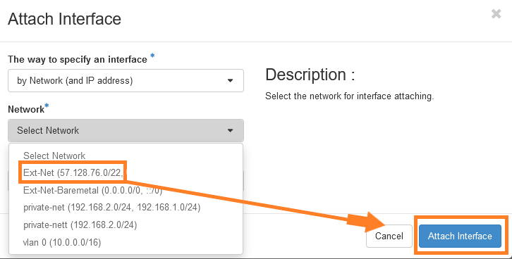

## Objectif

Contrairement aux instances Windows créées dans le réseau public, les instances Windows créées avec le mode réseau privé (vRack) n'ont pas leurs licences Windows automatiquement activées.
Dans ce cas, vous devez activer la licence manuellement afin d'avoir accès à tous les services Windows.

**Ce guide a pour objectif de vous accompagner dans la configuration de l’interface publique de vos instances Public Cloud au sein de votre vRack.**

## Prérequis

- Posséder un [projet Public Cloud](/pages/public_cloud/compute/create_a_public_cloud_project) dans votre compte OVHcloud
- Être connecté à votre [espace client OVHcloud](https://ca.ovh.com/auth/?action=gotomanager&from=https://www.ovh.com/ca/fr/&ovhSubsidiary=qc)
- [Avoir créé un utilisateur OpenStack](/pages/public_cloud/compute/create_and_delete_a_user)

Nous vous recommandons de consulter le guide « [Accéder à l’interface Horizon](/pages/public_cloud/compute/introducing_horizon) » pour vous familiariser à Horizon.

## En pratique

### Attacher un port public « Ext-Net » à une instance

#### Depuis l'interface Horizon

Connectez-vous à l’interface [Horizon](https://horizon.cloud.ovh.net/auth/login/) en suivant la méthode indiquée dans la [première partie de ce guide](/pages/public_cloud/public_cloud_network_services/getting-started-07-creating-vrack#interface-horizon).

Connectez-vous bien sur votre zone de travail :

{.thumbnail}

Dirigez-vous ensuite dans `Compute`{.action}, puis `Instances`{.action} :

{.thumbnail}

Pour ajouter une interface, dans la colonne « Actions », cliquez sur la flèche permettant d’accéder aux actions possible sur l’instance. Cliquez alors sur `Attach Interface`{.action} :

{.thumbnail}

Sélectionnez votre interface et validez :

{.thumbnail}

#### Depuis l'API OpenStack

Avant de poursuivre, il est recommandé de consulter ces guides :

- [Préparer l’environnement pour utiliser l’API OpenStack](/pages/public_cloud/compute/prepare_the_environment_for_using_the_openstack_api).
- [Charger les variables d’environnement OpenStack](/pages/public_cloud/compute/loading_openstack_environment_variables).

Rassemblez tout d'abord toutes les informations nécessaires :

- **Identification de vos instances**

```bash
openstack server list
+--------------------------------------+-------------------+--------+---------------------------------------------------------------------+----------------------------------------+----------+
| ID                                   | Name              | Status | Networks                                                            | Image                                  | Flavor   |
+--------------------------------------+-------------------+--------+---------------------------------------------------------------------+----------------------------------------+----------+
| f095ad19-5c0a-4ef5-8e01-b3590bc9c6f1 | MyInstance        | ACTIVE |                                                                     | Windows Server 2016 Standard (Desktop) | win-b2-7 |
+--------------------------------------+-------------------+--------+---------------------------------------------------------------------+----------------------------------------+----------+
```


- **Identification des réseaux publics et privés**

```bash
openstack network list
-----------------------------------------------------------------------------------------+
| ID                                   | Name              | Subnets                                                                                                                                                                                                                                                                  |
+--------------------------------------+-------------------+--------------------------------------------------------------------------------------------------------------------------------------------------------------------------------------------------------------------------------------------------------------------------+
| 1ca87837-7860-47a3-8916-c9c516841bf2 | Ext-Net-Baremetal | 1db089a7-1bd9-449f-8e3b-4ea61e666320, 4a614403-b8aa-4291-bd59-0cb2c81c4deb                                                                                                                                                                                               |
| 7394fc68-0f77-40d7-a274-388e7e75d82c | vlan 0            | f3fb67dc-7419-49da-b26c-7f64c480eb63                                                                                                                                                                                                                                     |
| 7a0e67da-70f3-48ed-a6e7-5ec265916211 | private-net       | 57d9faac-f01c-43a2-8866-d9b1dd02cb9e, 5cb270a9-3795-4286-96fe-f3bfa3a328e5                                                                                                                                                                                               |
| b2c02fdc-ffdf-40f6-9722-533bd7058c06 | Ext-Net           | 0f11270c-1113-4d4f-98de-eba83445d962, 1a6c6b72-88e9-4e94-ac8b-61e6dbc4792c, 22e2d853-1b86-48f3-8596-9d12c7693dc7, 4aa6cac1-d5cd-4e25-b14b-7573aeabcab1, 7d6352a6-dbed-4628-a029-fcc3986ae7d6, 9f989c4b-c441-4678-b395-e082c300356e, b072b17b-ef1d-4881-98c7-e0d6a1c3dcea|
+--------------------------------------+-------------------+--------------------------------------------------------------------------------------------------------------------------------------------------------------------------------------------------------------------------------------------------------------------------+
```

Avec les éléments récupérés précédemment, vous pouvez créer un port public nommé « Ext-Net » sur le subnet « Ext-Net » et l'attacher à l'instance :

```bash
openstack port create --network b2c02fdc-ffdf-40f6-9722-533bd7058c06 Ext-Net
+-------------------------+----------------------------------------------------------------------------------------+
| Field                   | Value                                                                                  |
+-------------------------+----------------------------------------------------------------------------------------+
| admin_state_up          | UP                                                                                     |
| allowed_address_pairs   |                                                                                        |
| binding_host_id         | None                                                                                   |
| binding_profile         | None                                                                                   |
| binding_vif_details     | None                                                                                   |
| binding_vif_type        | None                                                                                   |
| binding_vnic_type       | normal                                                                                 |
| created_at              | 2023-01-20T10:12:17Z                                                                   |
| data_plane_status       | None                                                                                   |
| description             |                                                                                        |
| device_id               |                                                                                        |
| device_owner            |                                                                                        |
| device_profile          | None                                                                                   |
| dns_assignment          | None                                                                                   |
| dns_domain              | None                                                                                   |
| dns_name                | None                                                                                   |
| extra_dhcp_opts         |                                                                                        |
| fixed_ips               | ip_address='2001:41d0:304:400::128f', subnet_id='4aa6cac1-d5cd-4e25-b14b-7573aeabcab1' |
|                         | ip_address='57.128.42.227', subnet_id='22e2d853-1b86-48f3-8596-9d12c7693dc7'           |
| id                      | ed34add5-aa76-4aab-97af-815724d76e2c                                                   |
| ip_allocation           | immediate                                                                              |
| mac_address             | fa:16:3e:68:35:9c                                                                      |
| name                    | Ext-Net                                                                                |
| network_id              | b2c02fdc-ffdf-40f6-9722-533bd7058c06                                                   |
| numa_affinity_policy    | None                                                                                   |
| port_security_enabled   | True                                                                                   |
| project_id              | 2098640de5e547289e3740b09e725ecc                                                       |
| propagate_uplink_status | None                                                                                   |
| qos_network_policy_id   | None                                                                                   |
| qos_policy_id           | None                                                                                   |
| resource_request        | None                                                                                   |
| revision_number         | 2                                                                                      |
| security_group_ids      | 9f60804a-0ecf-4738-a4d8-30a6bb0d20c2                                                   |
| status                  | DOWN                                                                                   |
| tags                    |                                                                                        |
| tenant_id               | 2098640de5e547289e3740b09e725ecc                                                       |
| trunk_details           | None                                                                                   |
| updated_at              | 2023-01-20T10:12:18Z                                                                   |
+-------------------------+----------------------------------------------------------------------------------------+
```

Récupérez l'UUID du port « Ext-Net » :

```bash
openstack port list --name Ext-Net
+--------------------------------------+---------+-------------------+---------------------------------------------------------------------------------------+--------+
| ID                                   | Name    | MAC Address       | Fixed IP Addresses                                                                    | Status |
+--------------------------------------+---------+-------------------+---------------------------------------------------------------------------------------+--------+
| ed34add5-aa76-4aab-97af-815724d76e2c | Ext-Net | fa:16:3e:68:35:9c | ip_address='2001:41d0:304:400::128f', subnet_id='4aa6cac1-d5cd-4e25-b14b-7573aeabcab1'| DOWN   |
|                                      |         |                   | ip_address='57.128.42.227', subnet_id='22e2d853-1b86-48f3-8596-9d12c7693dc7'          |        |
+--------------------------------------+---------+-------------------+---------------------------------------------------------------------------------------+--------+
```

Attachez le port à l'instance :

```bash
openstack server add port <server_id> <port_id>
```

#### Activer votre système Windows

Pour pourvoir activer votre système Windows, vous devez passer par Powershell.

Une fois connecté à votre instance Windows, faites un clic droit sur le menu `Démarrer`{.action} et sélectionnez `Windows Powershell`{.action}.

Renseignez la commande suivante :

```bash
slmgr.vbs -ato
```

{.thumbnail}

La licence Windows sera activée pour 180 jours.

Il sera nécessaire de répéter cette opération tous les 180 jours.

> [!primary]
>
> Dans l'intervalle, si vous voulez isoler votre instance du réseau public, vous pouvez désactiver, via Horizon ou l'API OpenStack, le port public créé. 
> Vous pouvez également directement désactiver le port réseau via Windows.
>

Pour vérifier le statut de la licence et sa date d'expiration, utilisez la commande suivante :

```bash
slmgr.vbs -dli
```

{.thumbnail}

## Aller plus loin

[Découvrez comment corriger la clé d’activation de votre Windows Server](/pages/bare_metal_cloud/dedicated_servers/windows_key).

Si vous avez besoin d'une formation ou d'une assistance technique pour la mise en oeuvre de nos solutions, contactez votre commercial ou cliquez sur [ce lien](https://www.ovhcloud.com/fr-ca/professional-services/) pour obtenir un devis et demander une analyse personnalisée de votre projet à nos experts de l’équipe Professional Services.

Échangez avec notre communauté d'utilisateurs sur <https://community.ovh.com>.