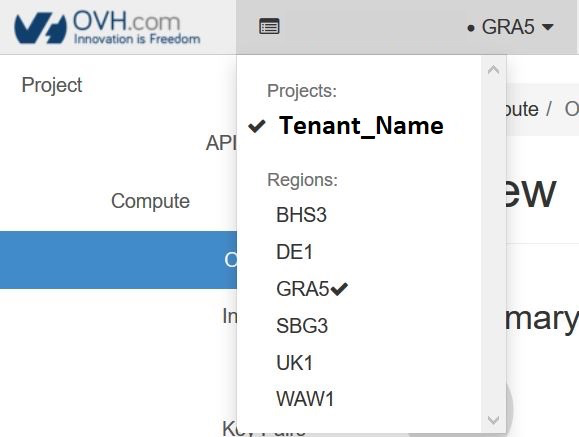
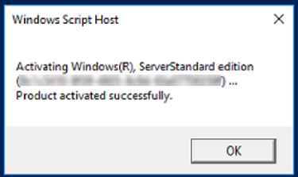

> [!primary]
> Questa traduzione è stata generata automaticamente dal nostro partner SYSTRAN. I contenuti potrebbero presentare imprecisioni, ad esempio la nomenclatura dei pulsanti o alcuni dettagli tecnici. In caso di dubbi consigliamo di fare riferimento alla versione inglese o francese della guida. Per aiutarci a migliorare questa traduzione, utilizza il pulsante "Contribuisci" di questa pagina.
>

## Obiettivo

A differenza delle istanze Windows create nella rete pubblica, le istanze Windows create con la modalità rete privata (vRack) non hanno automaticamente attivato le licenze Windows.
In questo caso, è necessario attivare manualmente la licenza per avere accesso a tutti i servizi Windows.

**Questa guida ti mostra come configurare l'interfaccia pubblica delle tue istanze Public Cloud all'interno della tua vRack.**

## Prerequisiti

- Disporre di un [progetto Public Cloud OVHcloud](/pages/public_cloud/compute/create_a_public_cloud_project)
- Avere accesso allo [Spazio Cliente OVHcloud](https://www.ovh.com/auth/?action=gotomanager&from=https://www.ovh.it/&ovhSubsidiary=it)
- [Aver creato un utente OpenStack](/pages/public_cloud/compute/create_and_delete_a_user)

Per familiarizzare con Horizon, consulta la guida [Accedere all'interfaccia Horizon](/pages/public_cloud/compute/introducing_horizon).

## Procedura

### Associa uno porto pubblico "Ext-Net" a un'istanza

#### Dall'interfaccia Horizon

Accedi all'interfaccia [Horizon](https://horizon.cloud.ovh.net/auth/login/) utilizzando il metodo indicato nella [prima parte di questa guida](/pages/platform/network-services/getting-started-07-creating-vrack#interfaccia-horizon).

Accedi alla tua zona di lavoro:

{.thumbnail}

Clicca su `Compute`{.action} e poi su `Instances`{.action}:

{.thumbnail}

Per aggiungere un'interfaccia, nella colonna "Actions",  clicca sulla freccia che permette di accedere alle azioni sull'istanza. Clicca su `Attach Interface`{.action}:

{.thumbnail}

Seleziona la tua interfaccia e conferma:

{.thumbnail}

#### Dall'API OpenStack

Prima di proseguire, ti consigliamo di consultare queste guide:

- [Preparare l’ambiente per utilizzare l’API OpenStack](/pages/public_cloud/compute/prepare_the_environment_for_using_the_openstack_api).
- [Impostare le variabili d’ambiente OpenStack](/pages/public_cloud/compute/loading_openstack_environment_variables).

Per prima cosa, inserisci tutte le informazioni necessarie:

- **Identificazione delle tue istanze**

```bash
openstack server list
+--------------------------------------+-------------------+--------+---------------------------------------------------------------------+----------------------------------------+----------+
| ID                                   | Name              | Status | Networks                                                            | Image                                  | Flavor   |
+--------------------------------------+-------------------+--------+---------------------------------------------------------------------+----------------------------------------+----------+
| f095ad19-5c0a-4ef5-8e01-b3590bc9c6f1 | MyInstance        | ACTIVE |                                                                     | Windows Server 2016 Standard (Desktop) | win-b2-7 |
+--------------------------------------+-------------------+--------+---------------------------------------------------------------------+----------------------------------------+----------+
```

- **Identificazione delle reti pubbliche e private**

```bash
openstack network list
-----------------------------------------------------------------------------------------+
| ID                                   | Name              | Subnets                                                                                                                                                                                                                                                                  |
+--------------------------------------+-------------------+--------------------------------------------------------------------------------------------------------------------------------------------------------------------------------------------------------------------------------------------------------------------------+
| 1ca87837-7860-47a3-8916-c9c516841bf2 | Ext-Net-Baremetal | 1db089a7-1bd9-449f-8e3b-4ea61e666320, 4a614403-b8aa-4291-bd59-0cb2c81c4deb                                                                                                                                                                                               |
| 7394fc68-0f77-40d7-a274-388e7e75d82c | vlan 0            | f3fb67dc-7419-49da-b26c-7f64c480eb63                                                                                                                                                                                                                                     |
| 7a0e67da-70f3-48ed-a6e7-5ec265916211 | private-net       | 57d9faac-f01c-43a2-8866-d9b1dd02cb9e, 5cb270a9-3795-4286-96fe-f3bfa3a328e5                                                                                                                                                                                               |
| b2c02fdc-ffdf-40f6-9722-533bd7058c06 | Ext-Net           | 0f11270c-1113-4d4f-98de-eba83445d962, 1a6c6b72-88e9-4e94-ac8b-61e6dbc4792c, 22e2d853-1b86-48f3-8596-9d12c7693dc7, 4aa6cac1-d5cd-4e25-b14b-7573aeabcab1, 7d6352a6-dbed-4628-a029-fcc3986ae7d6, 9f989c4b-c441-4678-b395-e082c300356e, b072b17b-ef1d-4881-98c7-e0d6a1c3dcea|
+--------------------------------------+-------------------+--------------------------------------------------------------------------------------------------------------------------------------------------------------------------------------------------------------------------------------------------------------------------+
```

Con gli elementi recuperati precedentemente, potete creare una porta pubblica chiamata "Ext-Net" sulla subnet "Ext-Net" e associarla all'istanza:

```bash
openstack port create --network b2c02fdc-ffdf-40f6-9722-533bd7058c06 Ext-Net
+-------------------------+----------------------------------------------------------------------------------------+
| Field                   | Value                                                                                  |
+-------------------------+----------------------------------------------------------------------------------------+
| admin_state_up          | UP                                                                                     |
| allowed_address_pairs   |                                                                                        |
| binding_host_id         | None                                                                                   |
| binding_profile         | None                                                                                   |
| binding_vif_details     | None                                                                                   |
| binding_vif_type        | None                                                                                   |
| binding_vnic_type       | normal                                                                                 |
| created_at              | 2023-01-20T10:12:17Z                                                                   |
| data_plane_status       | None                                                                                   |
| description             |                                                                                        |
| device_id               |                                                                                        |
| device_owner            |                                                                                        |
| device_profile          | None                                                                                   |
| dns_assignment          | None                                                                                   |
| dns_domain              | None                                                                                   |
| dns_name                | None                                                                                   |
| extra_dhcp_opts         |                                                                                        |
| fixed_ips               | ip_address='2001:41d0:304:400::128f', subnet_id='4aa6cac1-d5cd-4e25-b14b-7573aeabcab1' |
|                         | ip_address='57.128.42.227', subnet_id='22e2d853-1b86-48f3-8596-9d12c7693dc7'           |
| id                      | ed34add5-aa76-4aab-97af-815724d76e2c                                                   |
| ip_allocation           | immediate                                                                              |
| mac_address             | fa:16:3e:68:35:9c                                                                      |
| name                    | Ext-Net                                                                                |
| network_id              | b2c02fdc-ffdf-40f6-9722-533bd7058c06                                                   |
| numa_affinity_policy    | None                                                                                   |
| port_security_enabled   | True                                                                                   |
| project_id              | 2098640de5e547289e3740b09e725ecc                                                       |
| propagate_uplink_status | None                                                                                   |
| qos_network_policy_id   | None                                                                                   |
| qos_policy_id           | None                                                                                   |
| resource_request        | None                                                                                   |
| revision_number         | 2                                                                                      |
| security_group_ids      | 9f60804a-0ecf-4738-a4d8-30a6bb0d20c2                                                   |
| status                  | DOWN                                                                                   |
| tags                    |                                                                                        |
| tenant_id               | 2098640de5e547289e3740b09e725ecc                                                       |
| trunk_details           | None                                                                                   |
| updated_at              | 2023-01-20T10:12:18Z                                                                   |
+-------------------------+----------------------------------------------------------------------------------------+
```

Recupera l'UUID della porta "Ext-Net":

```bash
openstack port list --name Ext-Net
+--------------------------------------+---------+-------------------+---------------------------------------------------------------------------------------+--------+
| ID                                   | Name    | MAC Address       | Fixed IP Addresses                                                                    | Status |
+--------------------------------------+---------+-------------------+---------------------------------------------------------------------------------------+--------+
| ed34add5-aa76-4aab-97af-815724d76e2c | Ext-Net | fa:16:3e:68:35:9c | ip_address='2001:41d0:304:400::128f', subnet_id='4aa6cac1-d5cd-4e25-b14b-7573aeabcab1'| DOWN   |
|                                      |         |                   | ip_address='57.128.42.227', subnet_id='22e2d853-1b86-48f3-8596-9d12c7693dc7'          |        |
+--------------------------------------+---------+-------------------+---------------------------------------------------------------------------------------+--------+
```

Collega la porta all'istanza:

```bash
openstack server add port <server_id> <port_id>
```

#### Attiva il tuo sistema Windows

Per attivare il tuo sistema Windows, devi passare per Powershell.

Una volta connesso alla tua istanza Windows, clicca sul menu `Avviare`{.action} e poi sull'icona del `Windows PowerShell`{.action}.

Inserisci questo comando:

```bash
slmgr.vbs -ato
```

{.thumbnail}

La licenza Windows verrà attivata per 180 giorni.

Questa operazione dovrà essere ripetuta ogni 180 giorni.

> [!primary]
>
> Nel frattempo, per isolare la tua istanza dalla rete pubblica, puoi disattivare la porta pubblica creata tramite Horizon o l'API OpenStack.
> Puoi anche disattivare direttamente la porta di rete via Windows.
>

Per verificare lo stato della licenza e la data di scadenza, utilizza questo comando:

```bash
slmgr.vbs -dli
```

{.thumbnail}

## Per saperne di più

[Scoprite come correggere la Product Key di Windows Server](/pages/bare_metal_cloud/dedicated_servers/windows_key).

Se avete bisogno di formazione o di assistenza tecnica per implementare le nostre soluzioni, contattate il vostro rappresentante o cliccate su [questo link](https://www.ovhcloud.com/it/professional-services/) per ottenere un preventivo e richiedere un'analisi personalizzata del vostro progetto da parte dei nostri esperti del team Professional Services.

Contatta la nostra Community di utenti all’indirizzo <https://community.ovh.com/en/>.